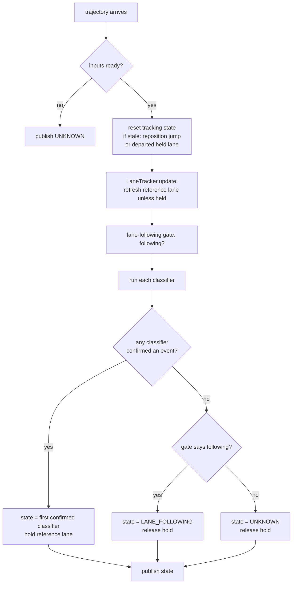

# autoware_lane_event_classifier

Classifies lane events — lane change, intentional lane crossing — for event logging.

---

## What this node does

Every cycle the node looks at the ego vehicle and publishes **one** state: what the ego is doing
with respect to its lane right now.

The state is published on `/planning/driving_factor` as a `DrivingState`. A downstream event recorder
stores every frame, so the log can later show _when_ and _for how long_ the vehicle changed lanes,
aborted, or drifted.

The node does not control the vehicle. It only observes and labels.

---

## Key words

These words have one fixed meaning in this package.

| Word                       | Meaning                                                                                                                                                                                                                                                                                                                                                                                                                                                                                                                                                                                                                                                                   |
| -------------------------- | ------------------------------------------------------------------------------------------------------------------------------------------------------------------------------------------------------------------------------------------------------------------------------------------------------------------------------------------------------------------------------------------------------------------------------------------------------------------------------------------------------------------------------------------------------------------------------------------------------------------------------------------------------------------------- |
| **Reference lane**         | One lanelet id that the node stores as "the lane the ego is driving in". Every check compares the ego to _this_ lane: the gate asks "is the ego still inside this lane?", and the lane-change classifier asks "is the ego leaving this lane?". See "The reference lane".                                                                                                                                                                                                                                                                                                                                                                                                  |
| **Hold**                   | A flag on the reference lane. While it is set, the node stops updating the stored reference lane id, so it stays on the lane where the event began. The node sets it when a lane change (or crossing) is confirmed and clears it when the event ends. See "Hold".                                                                                                                                                                                                                                                                                                                                                                                                         |
| **Route**                  | The mission the ego was given. It lists a **preferred primitive** lane for each step.                                                                                                                                                                                                                                                                                                                                                                                                                                                                                                                                                                                     |
| **Route primitive**        | A lane the route prefers. Being "on route" means being inside a route primitive.                                                                                                                                                                                                                                                                                                                                                                                                                                                                                                                                                                                          |
| **Footprint**              | The rectangle of the ego body on the map, built from the vehicle dimensions. Used to confirm where the body actually is.                                                                                                                                                                                                                                                                                                                                                                                                                                                                                                                                                  |
| **Straight lane sequence** | The reference lane plus every lane reachable from it by going _straight_ — forward and backward — within a fore/aft distance; sideways neighbours are excluded. It is built in two places, with the same construction but a different reach and a separate helper: the lane-following gate uses `connected_sequence_length_m` (200 m) and calls it the _connected lane sequence_ (matching `LaneFollowingReason::inside_connected_sequence`); the lane-change scan uses `crossing_look_ahead_m` (30 m). See "Inside the connected sequence" ([`docs/lane_following.md`](docs/lane_following.md)) and "Finding a crossing" ([`docs/lane_change.md`](docs/lane_change.md)). |
| **Lane-following gate**    | A stateless check: is the ego still inside (or within tolerance of) the reference lane's connected sequence? It answers only "following / not following".                                                                                                                                                                                                                                                                                                                                                                                                                                                                                                                 |
| **Classifier**             | A stateful module that recognises one specific event (lane change, intentional crossing) and reports its own state.                                                                                                                                                                                                                                                                                                                                                                                                                                                                                                                                                       |

---

## Inputs and output

**Trigger.** The node runs once per planned trajectory message. `/planning/trajectory` is the clock.

### Subscriptions

| Topic                      | Type                   | Role                                                                                                   |
| -------------------------- | ---------------------- | ------------------------------------------------------------------------------------------------------ |
| `/planning/trajectory`     | `Trajectory`           | Per-cycle trigger; also the predictive signal for lane change.                                         |
| `/map/vector_map`          | `LaneletMapBin`        | The lanelet map (latched, taken once).                                                                 |
| _(polled)_ odometry        | `Odometry`             | Ego pose; its stamp drives all timers (determinism).                                                   |
| _(polled)_ route           | `LaneletRoute`         | The mission and its preferred primitives.                                                              |
| _(polled)_ objects         | `PredictedObjects`     | Perceived objects (used by crossing logic).                                                            |
| _(polled)_ turn indicators | `TurnIndicatorsReport` | Optional hint for the lane-change confidence booster. Never a gate — if missing, the cycle still runs. |

### Publication

| Topic                      | Type                                         |
| -------------------------- | -------------------------------------------- |
| `/planning/driving_factor` | `DrivingFactor` (carries one `DrivingState`) |

### Output states (`DrivingState`)

| State                                | Value | Meaning                                                                                   |
| ------------------------------------ | ----- | ----------------------------------------------------------------------------------------- |
| `UNKNOWN`                            | 0     | Inputs not ready, **or** the ego left its lane but no classifier claimed the event.       |
| `LANE_FOLLOWING`                     | 1     | The gate says the ego is still in its lane and no event is active.                        |
| `LANE_CHANGING`                      | 2     | The lane-change classifier confirmed a change in progress.                                |
| `ABORTING_LANE_CHANGE`               | 3     | A committed lane change is reversing back to the reference lane.                          |
| `INTENTIONAL_LANE_CROSSING`          | 4     | The intentional-crossing classifier confirmed a crossing. _(classifier is a stub today.)_ |
| `ABORTING_INTENTIONAL_LANE_CROSSING` | 5     | A committed intentional crossing is reversing. _(stub.)_                                  |

---

## The reference lane

The **reference lane** is the lane the node currently treats as the ego's own lane, and every other
judgment is measured against it, for example

- "is the ego still in this lane?" (the gate), and
- "is the ego leaving this lane?" (the lane-change classifier).

If this value is wrong, every judgment built on it is wrong, so how it is chosen and when it changes matters.

- **How it is chosen.** When no event is active, `LaneTracker` re-picks it each cycle from the ego
  position: the route primitive the ego sits in, else an off-route lane the ego sits in, else the
  nearest route primitive.
- **When it changes.** The stored id only moves on **forward progress** — when the ego enters a lane
  that is a routing _successor_ (the lane straight ahead) of the current reference lane. A purely
  **sideways** move does _not_ change it.

!!! note "Why the sideways rule matters"

    Suppose the ego starts drifting left into the next lane. If the stored reference lane moved left
    with the ego, then from the node's point of view the ego would always be "in its lane", and a
    lane change could never be seen. By keeping the stored id on the original lane during a sideways
    move, the node can measure how far the ego has left that lane — which is exactly what the
    lane-change classifier needs.

---

## Hold — holding the reference lane still during an event

"Event" here means a lane change or an intentional crossing — the moments when the ego is
deliberately leaving its lane. The hold exists to stop the reference lane from updating during exactly
those moments.

"The reference lane" said a _sideways_ move does not change the reference lane. But a lane change does not stay
sideways: it ends with the ego fully inside the **new** lane, and the new lane is a normal lane the
ego is now driving in. Without the hold, the tracker would re-pick that new lane as the reference part
way through — and the classifier would lose the original lane it was measuring against. The hold
prevents this.

- When **any** classifier confirms an event, the node sets the hold. While it is set,
  `LaneTracker::update` does not re-pick the reference lane at all; the stored id stays on the lane
  where the event began.
- When **no** classifier is active, the node clears the hold. On the next cycle the tracker is free to
  re-pick the reference lane from the ego position again.

So the sequence for a completed lane change is: event confirmed → hold set → reference lane held on
the old lane for the whole change → event ends → hold cleared → next cycle re-picks the reference
lane, which is now the new lane the ego settled in. The stored id "follows" the vehicle from lane to
lane, but only between events, never during one.

(Two conditions reset the tracking state independently of the classifiers — see
`is_tracking_state_stale` / `reset_tracking_state`: (1) a **reposition jump** — a per-cycle ego step
larger than the reported speed can explain (`speed · dt + reposition_jump_margin_m`), which
catches jumps at any speed, including a small backward nudge at a standstill; (2) the ego
straying farther than `lane_departure_reset_distance_m` from a **held** reference lane, the
countermeasure for a manual takeover that drives away from the route. Either resets the classifiers
to lane following and clears the hold, so the reference lane re-picks cleanly instead of tracking a
teleport or keeping the reference lane held forever.)

---

## How the node decides the state (per cycle)

The order of resolution:

1. **Every classifier runs every cycle.** Onset is _predictive_ (see the lane-change doc), so a
   classifier can confirm an event even while the gate still reads "following". The classifiers are
   not gated by the following result.
2. **First confirmed classifier wins.** Classifiers are checked in a fixed priority order
   (lane change, then intentional crossing). A classifier reporting `LANE_FOLLOWING` or `UNKNOWN`
   counts as "no event".
3. **No event → fall back to the gate.** If the gate says following, the state is `LANE_FOLLOWING`.
   If the gate says the ego departed but no classifier explained it, the state is `UNKNOWN` (a
   tracked, unexplained departure — it does **not** hold the reference lane).

---

## Architecture (who owns what)

| Component                                       | Responsibility                                                                                                                                            |
| ----------------------------------------------- | --------------------------------------------------------------------------------------------------------------------------------------------------------- |
| `LaneEventClassifierNode`                       | Owns the subscriptions/publisher, runs the per-cycle sequence above, arbitrates the winning state, and holds/releases the reference lane.                 |
| `LaneTracker`                                   | Owns the map, routing graph, and the reference lane. A generic map/geometry library — it answers lane queries and knows nothing about any specific event. |
| `LaneFollowingChecker`                          | The stateless lane-following gate. Node-owned, separate from the classifiers.                                                                             |
| `LaneChangeClassifier` (+ `LaneChangeGeometry`) | The stateful lane-change state machine and its per-cycle geometry. See [`docs/lane_change.md`](docs/lane_change.md).                                      |
| `IntentionalCrossingClassifier`                 | Intentional-crossing state machine. **Stub today** — always reports no event.                                                                             |

---

## Parameters

Full schema: [`schema/lane_event_classifier.schema.yaml`](schema/lane_event_classifier.schema.yaml).
Defaults: [`param/lane_event_classifier.param.yaml`](param/lane_event_classifier.param.yaml).

Top level:

| Name                              | Meaning                                                                                                                                                                     |
| --------------------------------- | --------------------------------------------------------------------------------------------------------------------------------------------------------------------------- |
| `reposition_jump_margin_m`        | Localization-noise margin added to the speed-explained step (`speed · dt`); a per-cycle ego step beyond that is treated as a reposition jump and resets the tracking state. |
| `lane_departure_reset_distance_m` | While the reference lane is held, distance from the ego to that lane above which the tracking state is reset (countermeasure for a manual takeover).                        |

Each sub-classifier has an `enable_classifier` flag. The lane-change parameters (look-ahead,
persistence, confidence booster, settle window) are documented in
[`docs/lane_change.md`](docs/lane_change.md#parameters).

---

## Design notes

- **Determinism.** All timers use the message timestamp (`odometry.header.stamp`), never wall-clock
  time. Replaying the same rosbag gives the same output.
- **The gate and the classifiers are independent.** The gate is a stateless "am I in my lane?" check.
  The classifiers are stateful event recognisers. The node combines them; neither drives the other.
- **Predictive detection.** Lane change is decided from the _planned trajectory_, so it can confirm
  before the body crosses the line. The full explanation is in [`docs/lane_change.md`](docs/lane_change.md).
  </content>

</invoke>
