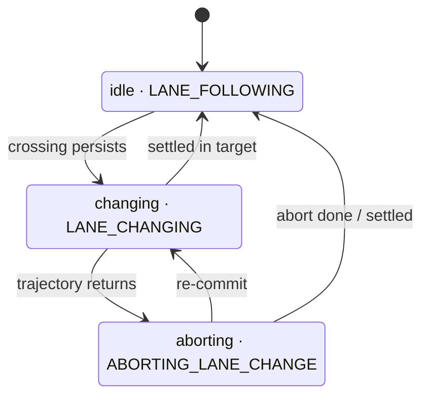

# Lane Change Classifier

## What this does

Every cycle, the module looks at the ego vehicle and decides one thing:

> Is the ego changing lanes right now, and if so, has the change started, is it being aborted, or
> has it finished?

The answer is published as a single state on `/planning/driving_factor`. A downstream event recorder
stores every frame.

The key idea: **detection is predictive.** The module does not wait for the car body to cross the
lane line. It looks ahead along the _planned trajectory_. If the trajectory is about to leave the
current lane toward another route lane, the module can declare a lane change **before** the body
moves. This is possible because the planner is generative (diffusion-based) and publishes no intent,
so the trajectory shape is the earliest signal we have.

---

## Key words

Shared terms are defined in the [package README](../README.md#key-words)

| Word                       | Meaning                                                                                                                                                                                                                                                                                                                                                                                                                                             |
| -------------------------- | --------------------------------------------------------------------------------------------------------------------------------------------------------------------------------------------------------------------------------------------------------------------------------------------------------------------------------------------------------------------------------------------------------------------------------------------------- |
| **Straight lane sequence** | Every lane you can reach from the reference lane by going straight (forward and backward) within the look-ahead distance `crossing_look_ahead_m` (30 m); the reference lane itself is included. Going straight = staying in this sequence. The lane-following gate builds the _same_ construction with a longer reach (`connected_sequence_length_m`, 200 m) and calls it the _connected lane sequence_ — see the [README](../README.md#key-words). |
| **Crossing**               | The first point where the planned trajectory leaves the straight lane sequence sideways and enters another lane.                                                                                                                                                                                                                                                                                                                                    |
| **Settle**                 | The footprint is fully inside a target route primitive. This is how a lane change finishes.                                                                                                                                                                                                                                                                                                                                                         |

**Trajectory vs footprint.** The trajectory (a prediction) is used to _start_ a lane change early.
The footprint (the real body) is used to _confirm_ that a change finished or that an abort finished.

---

## Inputs and output

**Inputs:** map, [route](../README.md#key-words), planned trajectory, ego odometry, vehicle dimensions (for the [footprint](../README.md#key-words)), and
optionally the turn signal (a hint only, never a gate).

**Output states** (`DrivingState`):

| State                  | Meaning here                                                                                     |
| ---------------------- | ------------------------------------------------------------------------------------------------ |
| `LANE_FOLLOWING`       | No lane-change event. (Reported by the node's lane-following gate when this classifier is idle.) |
| `LANE_CHANGING`        | A lane change is confirmed and in progress.                                                      |
| `ABORTING_LANE_CHANGE` | A committed lane change is reversing back toward the reference lane.                             |

Completion is an **edge**, not a state. A finished lane change is the transition
`LANE_CHANGING → LANE_FOLLOWING`. There is no separate "ended" state.

---

## The three phases

Internally the classifier is a small state machine with three phases.

The label on each edge is the short trigger; the exact conditions are in the onset, finishing, and
aborting sections below. Each phase and
the state it reports:

- **idle** → reported as `LANE_FOLLOWING`.
- **changing** → reported as `LANE_CHANGING`.
- **aborting** → reported as `ABORTING_LANE_CHANGE`.

When a phase returns to idle, the [reference lane](../README.md#key-words) is released and re-anchored to the lane the ego is
now in. So the "new" lane becomes the next reference lane.

---

## Onset — starting a lane change (idle → changing)

Onset has two parts: **find a valid crossing**, then **make sure it persists**.

### Finding a crossing

The module builds the forward trajectory: the trajectory points from the one nearest the ego,
forward, until the look-ahead distance (`crossing_look_ahead_m`, default 30 m) is reached.

Then, in order:

1. **Straight-on-route check (skip case).** If the reference lane is a [route primitive](../README.md#key-words) _and_ going
   straight also stays on a route primitive, then a sideways move would be _leaving_ the route, not a
   route lane change. No onset.
2. **Walk the trajectory.** For each forward point, find which lanes contain it. The first point that
   lands in a lane _outside_ the straight lane sequence marks the crossing. That lane is the
   **target lane**, and the point is the **crossing point**. The side (left or right) comes from the
   sign of the lateral offset from the reference centerline.
3. **Necessity check.** The crossing is only valid if the trajectory actually reaches a **route
   primitive** sideways. A drift into a random off-route lane is not a lane change.

### Exemptions (things that are never a lane change)

A found crossing is dropped if any of these hold:

- The reference lane is a **turn or intersection** lane (turning is not a lane change).
- The **target lane is a road shoulder**.
- The **crossed boundary is virtual** (not a real lane marking).

### Persistence and confidence

A single-frame crossing is not trusted. The same crossing must persist:

- **Same target lane**, and
- **Same crossing point**, stable within `crossing_position_tolerance_m` (default 2 m),
- for at least `crossing_persist_duration_s` (default 0.3 s).

If the crossing jumps to a different lane or a far-apart point, the timer restarts.

**Confidence signal (booster).** The wait is _shortened_ — never skipped — when there is extra
evidence:

- the whole footprint has already left the route-primitive lanes, **or**
- the turn blinker points toward the target side.

When present, the persistence window is multiplied by `confidence_factor` (default 0.3). So with a
booster, onset can confirm in about 0.09 s instead of 0.3 s.

When the crossing persists long enough → **LANE_CHANGING**.

---

## Finishing or aborting (changing)

While in `LANE_CHANGING`, two things are watched at once.

**Completion (settle).** The footprint is fully inside a target route primitive (any route lane other
than the reference lane) for `settle_confirm_duration_s` (default 0.7 s) → the change is complete →
back to idle. The node then reports `LANE_FOLLOWING` and the new lane becomes the reference lane.

- A settle, then a later settle in yet another lane, counts as **two separate lane changes** (a
  double lane change), not one.

**Abort.** The trajectory heads back into the reference lane (no forward crossing, and the far
look-ahead point is back inside the reference lane), persisted for `crossing_persist_duration_s`
→ **ABORTING_LANE_CHANGE**.

---

## Aborting

While in `ABORTING_LANE_CHANGE`, three things are watched.

- **Abort complete.** The footprint is fully back inside the reference lane → back to idle
  (`LANE_FOLLOWING`). This is geometric, with no extra dwell.
- **Settle still counts.** If instead the footprint ends up fully inside a target route primitive for
  the settle window, the change is treated as **completed after all** → idle. (A give-up can still
  end in the target lane.)
- **Re-commit.** If the trajectory swings back toward the target and a valid crossing persists again,
  the module returns to **LANE_CHANGING**.

There is no timed exit from aborting. It leaves only by one of the three edges above. (A localization
jump — or the ego straying far from the held reference lane — is handled separately by the node's
tracking-state reset, which resets everything.)

---

## Parameters

| Name                            | Default | Meaning                                                                                                                       |
| ------------------------------- | ------- | ----------------------------------------------------------------------------------------------------------------------------- |
| `enable_classifier`             | `true`  | Turn the lane-change classifier on or off.                                                                                    |
| `crossing_look_ahead_m`         | `30.0`  | How far ahead along the trajectory to scan for a crossing.                                                                    |
| `crossing_persist_duration_s`   | `0.3`   | How long a valid crossing (and an abort return) must persist before it is confirmed.                                          |
| `crossing_position_tolerance_m` | `2.0`   | How much the crossing point may move and still count as "the same" crossing.                                                  |
| `confidence_factor`             | `0.3`   | Fraction the persistence window shrinks to when a confidence signal is present (0 < factor < 1; shortens but never bypasses). |
| `settle_confirm_duration_s`     | `0.7`   | How long the footprint must stay fully inside the target route primitive to confirm a completed change.                       |

---

## Design notes

- **Determinism.** All timers use the message timestamp (`odometry.header.stamp`), never wall-clock
  time. Replaying the same rosbag gives the same output.
- **Reference lane is frozen during an event.** The tracker only re-anchors the reference lane on
  forward progress into a next lane, never on a sideways move. So a lane change is not mistaken for
  forward progress, and the reference stays put during the predictive onset window.
- **Separation of concerns.** `LaneTracker` is a generic map/geometry library and knows nothing about
  lane changes. `LaneChangeGeometry` turns its generic queries into the per-cycle lane-change
  observation. `LaneChangeClassifier` is a pure state machine over that observation. This document
  describes the combined behavior.
