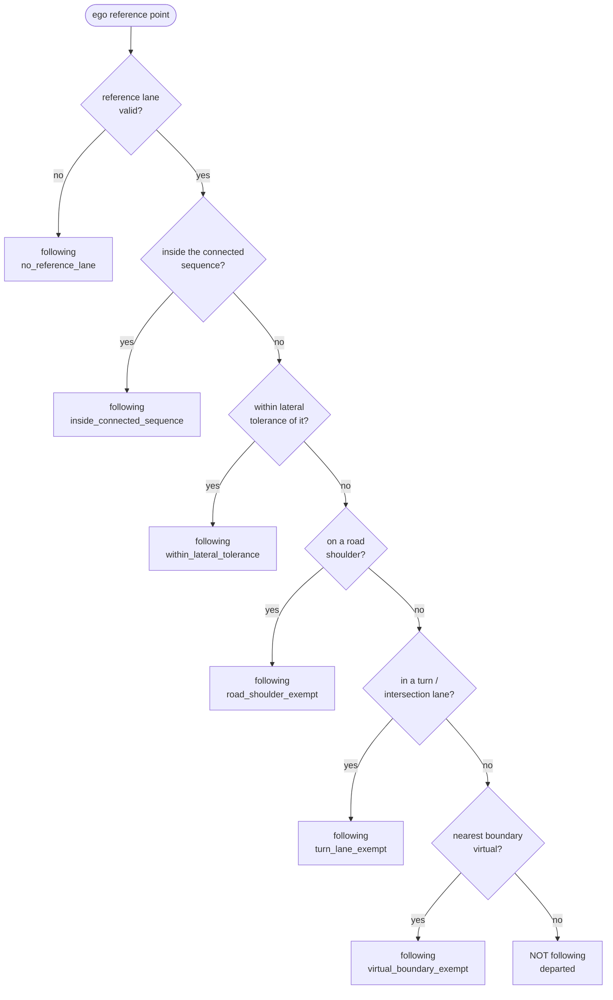

# Lane Following Classifier

## What this does

Every cycle, the module looks at the ego vehicle and decides one thing:

> Is the ego still travelling along its own lane corridor, or has it made a real lateral departure?

This is the **shared gate** that every lane event sits on top of. A lane event (a lane change or a
lane crossing) is only reported when the ego is **not** lane following. So this check does not
produce an event of its own — it decides whether the node is allowed to fall back to
`LANE_FOLLOWING`, or must report `UNKNOWN` when the ego has departed but no classifier has claimed
the departure.

The key idea: **a departure is judged from the ego reference point, never from the vehicle body.**
Decisions use `base_link` (the ego reference point), not the footprint corners. A long or wide bus
routinely leaves its painted lane on curves, sits across short lanelets, and overlaps crossing
lanelets at junctions — using the reference point instead of the footprint stops those from reading
as false departures.

---

## Key words

Shared terms are defined in the [package README](../README.md#key-words)

| Word                        | Meaning                                                                                                                                                                                                                                                                                                                                                                                                                                                                                   |
| --------------------------- | ----------------------------------------------------------------------------------------------------------------------------------------------------------------------------------------------------------------------------------------------------------------------------------------------------------------------------------------------------------------------------------------------------------------------------------------------------------------------------------------- |
| **Reference point**         | The ego `base_link` point on the map. All gate decisions use this single point.                                                                                                                                                                                                                                                                                                                                                                                                           |
| **Connected lane sequence** | The reference lane plus every lane reachable from it _going straight_ — forward and backward — within `connected_sequence_length_m` (default 200 m). This is the corridor the ego is allowed to travel along, and the name matches `LaneFollowingReason::inside_connected_sequence`. The lane-change classifier builds the _same_ construction with a shorter reach (`crossing_look_ahead_m`, 30 m) and calls it the _straight lane sequence_ — see the [README](../README.md#key-words). |
| **Virtual boundary**        | A lane boundary linestring tagged `virtual` — a routing construct, not a painted lane marking.                                                                                                                                                                                                                                                                                                                                                                                            |
| **Road shoulder**           | A shoulder lanelet. Shoulders are excluded from the routing graph, so they are checked separately.                                                                                                                                                                                                                                                                                                                                                                                        |

---

## Inputs and output

**Inputs:** the lanelet map, the routing graph, the current [reference lane](../README.md#key-words) id (all from
`LaneTracker`), and the ego reference point (from odometry).

**Output** — a `LaneFollowingResult`:

| Field          | Meaning                                                                            |
| -------------- | ---------------------------------------------------------------------------------- |
| `is_following` | `true` when the ego is still on its corridor, `false` on a real lateral departure. |
| `reason`       | Which rule decided the outcome (`LaneFollowingReason`), for tracing / logging.     |

How the node uses it (see `on_trajectory`):

- If a classifier reports a confirmed event, that event wins.
- Otherwise, if `is_following` is `true` → `LANE_FOLLOWING`.
- Otherwise (departed, no classifier claimed it) → `UNKNOWN` (tracked, does not hold the reference
  lane).

---

## The rules

The gate is a short ordered list of rules. They are checked in order and the **first match wins**;
its `LaneFollowingReason` is the one reported. The road-shoulder, turn-lane, and virtual-boundary
exemptions can be turned off individually by parameter.

### No reference lane

If there is no valid reference lane yet (map not ready, id invalid), the ego is treated as
**following**. The gate never fabricates a departure from missing data.

### Inside the connected sequence

Build the connected lane sequence: the reference lane, plus the forward and backward straight
sequences reachable within `connected_sequence_length_m` (default 200 m). If the reference point is
geometrically inside any lane of that sequence → **following**. This is the normal case, and it is
why travelling two hops down the corridor still counts as following even though the ego is far from
the reference lane itself.

The sequence is **memoized**: it is only rebuilt when the reference lane id or the routing graph
changes, so the graph traversal does not run every cycle.

### Within lateral tolerance

If the reference point is not strictly inside but within `lateral_tolerance_m` (default 0.3 m) of a
sequence lane → **following**. This covers a long ego drifting on a curve and lanes narrower than
the vehicle.

### Road-shoulder exemption

If the reference point overlaps a road shoulder lanelet → **following**. Shoulders are outside the
routing graph, so they are never part of the connected sequence and must be checked on their own.
Toggle: `enable_road_shoulder_exemption`.

### Turn / intersection-lane exemption

If the reference lane is an intersection lanelet, or the reference point sits in a sequence lane
that is an intersection lanelet → **following**. Being out of lane while turning through a junction
is not a departure. Toggle: `enable_turn_lane_exemption`. _(Known trade-off: a genuine event
performed inside a turn lane is reported as following for the first pass.)_

### Virtual-boundary exemption

If the nearest sequence-lane boundary to the reference point is a **virtual** linestring →
**following**. Crossing a virtual boundary is a routing artifact, not a real lateral move — and by
design it is never a lane change or a lane crossing either (a shared rule the events inherit).
The nearest boundary is an approximation of "the boundary the ego is crossing". Toggle:
`enable_virtual_boundary_exemption`.

### Otherwise — Departed

No rule matched: this is a real lateral departure. `is_following = false`, reason `departed`. The
node now needs a classifier to explain the departure, or it reports `UNKNOWN`.

---

## Parameters

| Name                                | Default | Meaning                                                                                      |
| ----------------------------------- | ------- | -------------------------------------------------------------------------------------------- |
| `connected_sequence_length_m`       | `200.0` | Fore/aft distance walked from the reference lane to build the connected sequence.            |
| `lateral_tolerance_m`               | `0.3`   | Lateral margin around the connected sequence still treated as following.                     |
| `enable_road_shoulder_exemption`    | `true`  | Toggle the road-shoulder exemption (treat the ego overlapping a road shoulder as following). |
| `enable_turn_lane_exemption`        | `true`  | Toggle the turn / intersection-lane exemption (out-of-lane while turning is following).      |
| `enable_virtual_boundary_exemption` | `true`  | Toggle the virtual-boundary exemption (crossing a virtual boundary is following).            |

---

## Design notes

- **Pure evaluator.** `LaneFollowingChecker` owns no state beyond its config and a memoization
  cache. It takes the map, graph, reference lane id, and ego point in, and returns a verdict — no
  side effects, no lane selection, no freezing. Lane search and reference-lane freezing stay in
  `LaneTracker`; the following _logic_ lives entirely here.
- **Separation from the tracker.** The gate deliberately does **not** live inside `LaneTracker`.
  The node runs and times it separately, right after `lane_tracker_.update()`, so the tracker stays
  a generic map/geometry library that knows nothing about "following".
- **Reference point, not footprint.** Every rule is evaluated at `base_link`. This is the single
  most important choice for avoiding false departures on a large vehicle.
- **Traceable.** Every verdict carries a `LaneFollowingReason`. The node logs it, so a bag replay
  shows exactly which rule kept the ego following (or that it departed) through junctions and turn
  lanes.
- **Graph-based, not route-based.** The corridor comes from the routing graph, so the gate works
  off-route too; the [route](../README.md#key-words) only marks which lanes are on-route for downstream logic.
