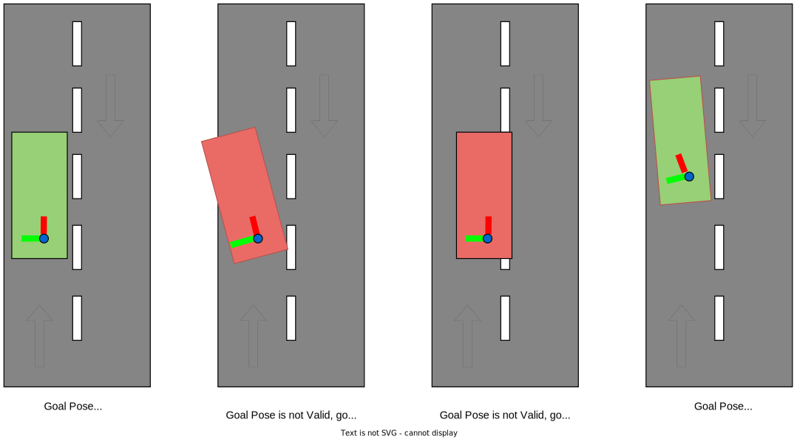

# ミッションプランナー

## 目的

`Mission Planner` は、指定されたチェックポイントに従って現在の自車位置からゴール位置に移動する経路を計算します。経路は静的マップ上の連続したレーンのシーケンスから作成されます。経路計画時に、歩行者や他の車両などの動的オブジェクト、道路工事に伴う一部のレーンのブロックなどの動的マップ情報は考慮されません。したがって、新しいゴール位置またはチェックポイントが与えられるまで、出力トピックはゴール位置またはチェックポイントが与えられた場合にのみパブリッシュされ、ラッチされます。

コア実装はマップ形式に依存しません。プラグインモジュールとして任意の計画アルゴリズムを追加できます。現在の Autoware.universe では、Lanelet2 マップ形式のプラグインのみがサポートされています。

このパッケージは MRM のルートも管理します。`route_selector` ノードは `mission_planner` インターフェースを複製し、それぞれ通常時と MRM 用に提供します。現在の MRM 動作状態に応じて、ルート要求と計画結果を配信します。

## インターフェース

### パラメータ

| 名称                               | 型    | 説明                                                                                                                                   |
| ---------------------------------- | ------ | ---------------------------------------------------------------------------------------------------------------------------------- |
| `map_frame`                          | 文字列 | 地図のフレーム名                                                                                                                   |
| `arrival_check_angle_deg`            | 数値   | ゴール判定の角度閾値                                                                                                           |
| `arrival_check_distance`             | 数値   | ゴール判定の距離閾値                                                                                                           |
| `arrival_check_duration`             | 数値   | ゴール判定の期間閾値                                                                                                           |
| `goal_angle_threshold`               | 数値   | ゴール承認のためのゴール姿勢の最大角度                                                                                                 |
| `enable_correct_goal_pose`           | ブール | 最も近いレーンレットの方向に従ってゴール姿勢を補正するための有効化                                                                |
| `reroute_time_threshold`             | 数値   | 現在速度で迂回ポイントまでの時間がこの閾値を超えた場合、迂回が可能となる                                                          |
| `minimum_reroute_length`             | 数値   | 新しい経路をパブリッシュするための最小長                                                                                             |
| `consider_no_drivable_lanes`         | ブール | 計画で `no_drivable_lanes` を考慮するかどうかフラグ                                                                    |
| `allow_reroute_in_autonomous_mode` | ブール | 自律運転モードでの迂回の許可を表すフラグ。False の場合、迂回は失敗します。True の場合、安全な迂回のみが許可されます |

### サービス

| 名前                                                                     | タイプ                                     | 説明                                                         |
| ------------------------------------------------------------------------- | ---------------------------------------- | ------------------------------------------------------------ |
| `/planning/mission_planning/mission_planner/clear_route`                    | tier4_planning_msgs/srv/ClearRoute       | Routeのクリアを要求                                        |
| `/planning/mission_planning/mission_planner/set_waypoint_route`            | tier4_planning_msgs/srv/SetWaypointRoute | Lanelet waypointを使用したRouteを要求                       |
| `/planning/mission_planning/mission_planner/set_lanelet_route`             | tier4_planning_msgs/srv/SetLaneletRoute  | pose waypointを使用したRouteを要求                         |
| `/planning/mission_planning/route_selector/main/clear_route`                 | tier4_planning_msgs/srv/ClearRoute       | main Routeのクリアを要求                                     |
| `/planning/mission_planning/route_selector/main/set_waypoint_route`         | tier4_planning_msgs/srv/SetWaypointRoute | Lanelet waypointを使用したmain Routeを要求                 |
| `/planning/mission_planning/route_selector/main/set_lanelet_route`          | tier4_planning_msgs/srv/SetLaneletRoute  | pose waypointを使用したmain Routeを要求                   |
| `/planning/mission_planning/route_selector/mrm/clear_route`                  | tier4_planning_msgs/srv/ClearRoute       | MRM Routeのクリアを要求                                     |
| `/planning/mission_planning/route_selector/mrm/set_waypoint_route`           | tier4_planning_msgs/srv/SetWaypointRoute | Lanelet waypointを使用したMRM Routeを要求                 |
| `/planning/mission_planning/route_selector/mrm/set_lanelet_route`            | tier4_planning_msgs/srv/SetLaneletRoute  | pose waypointを使用したMRM Routeを要求                   |

### サブスクリプション

| 名前                         | タイプ                                      | 説明            |
| ---------------------------- | ----------------------------------------- | ---------------------- |
| `input/vector_map`           | autoware_map_msgs/msg/LaneletMapBin       | Lanelet2 のベクターマップ |
| `input/modified_goal`        | geometry_msgs/PoseWithUuidStamped         | 変更された目標の姿勢     |
| `input/operation_mode_state` | autoware_adapi_v1_msgs/OperationModeState | 操作モードの状態   |

### 資料

| 名称                                                     | タイプ                                   | 説明                                     |
| ------------------------------------------------------- | -------------------------------------- | ---------------------------------------- |
| `/planning/mission_planning/state`                        | tier4_planning_msgs/msg/RouteState        | ルートステート                            |
| `/planning/mission_planning/route`                       | autoware_planning_msgs/LaneletRoute      | ルート                                    |
| `/planning/mission_planning/route_selector/main/state`  | tier4_planning_msgs/msg/RouteState        | メインルートステート                      |
| `/planning/mission_planning/route_selector/main/route`  | autoware_planning_msgs/LaneletRoute      | メインルート                              |
| `/planning/mission_planning/route_selector/mrm/state`   | tier4_planning_msgs/msg/RouteState        | MRMルートステート                        |
| `/planning/mission_planning/route_selector/mrm/route`   | autoware_planning_msgs/LaneletRoute      | MRMルート                                |
| `~/debug/route_marker`                                    | visualization_msgs/msg/MarkerArray       | ルートマーカー（デバッグ用）              |
| `~/debug/goal_footprint`                                   | visualization_msgs/msg/MarkerArray       | ゴールフットプリント（デバッグ用）     |

## ルートセクション

ルートセクションは `autoware_planning_msgs/LaneletSegment` 型であり、レーン変更可能なレーンを束ねた道路の「区切り」です。
ルートの最小単位は `autoware_planning_msgs/LaneletPrimitive` であることに注意してください。これは、ベクトルマップとタイプのレーンの一意の ID を持っています。
したがって、ルートメッセージにはレーンに関する幾何情報が含まれていません。これは、計画モジュールのメッセージにマップデータ構造への依存関係を持たせたくないと考えたからです。

ルートセクションの ROS メッセージは、各ルートセクションに対して次の 3 つの要素を含みます。

- `preferred_primitive`: 目的地に向かって進む優先レーン。
- `primitives`: 優先レーンを含む同じ方向のすべての隣接レーン。

## 目標の検証

ミッションプランナーには、与えられた目標の姿勢を検証し、ルートを作成する制御メカニズムがあります。目標の姿勢の角度が目標の姿勢レーンのレットと目標の姿勢ヨーの角度との間で `goal_angle_threshold` パラメーターを超えると、目標は拒否されます。
もう 1 つの制御メカニズムは、車両の寸法に応じて目標姿勢のフットプリントを作成し、このフットプリントがレーンのレット内にあるかどうかを確認することです。目標のフットプリントがレーンのレットを超えると、目標は拒否されます。

以下の図は、目標姿勢の検証のケースの例です。

## 実装

### ミッションプランナー

2 つのコールバック（目標とチェックポイント）は、ルート計画のトリガーです。
レーニンググラフは、Lanelet2 でルートを計画する前に作成する必要があります。このレーニンググラフは、ベクトルマップのコールバックで作成されます。

`plan route` の詳細については、次のセクションで説明します。

### ルートプランナー

`plan route` は自車位置と目標位置を含むチェックポイントを使用して実行されます。

### 各チェックポイント間の経路計画
`plan path between each check points`は最初に始点および終点のポーズにもっとも近いレーンを計算します。
次に、Lanelet2のルーティンググラフが、始点および終点のポーズから最短経路を計画します。

### ルートレーンレットの初期化
`initialize route lanelets`は、ルートハンドラーを初期化し、`route_lanelets`を計算します。
`route_lanelets`はすべてルートセクションに登録され、レーンの変更計画時に使用される、計画された経路のレーンレットの隣のレーンレットです。
`route_lanelets`を計算するには、

1. レーン変更可能な計画された経路に対するすべての近隣（右および左）レーンが`route_lanelets`として記憶されます。
2. レーン変更不可能な計画された経路に対するすべての近隣（右および左）レーンが`candidate_lanelets`として記憶されます。
3. 各`candidate_lanelets`の次のレーンレットと前のレーンレットが`route_lanelets`の場合、`candidate_lanelet`は`route_lanelets`として登録されます
    - これは、`candidate_lanelet`（隣接レーン）がレーン変更可能ではない場合でも、`candidate_lanelet`の次のレーンレットと前のレーンレットが`route_lanelets`である場合、レーンを変更せずに`candidate_lanelet`を通過できるためです。

### 優先レーンレットの取得
`get preferred lanelets`は、ルートハンドラーを使用して`route_lanelets`から`preferred_primitive`を抽出し`ます。

### ルートセクションの作成
`create route sections`は、ルートハンドラーを使用して各ルートセクションの`primitives`を`route_lanelets`から抽出し、ルートセクションを作成します。

### 再ルーティング

ここで再ルーティングとは、走行中にルートを変更することを意味します。ルート設定とは異なり、車両からルート変更ポイントまでの一定の距離を維持する必要があります。
電動車が自動運転状態にない場合、安全チェックプロセスはスキップされます。

再ルーティングが必要なユースケースは3つあります。

- ルート変更API
- エマージェンシールート
- ゴール修正

#### ルート変更API

走行中に目的地を変更する場合や、分岐ループルートを走行する場合に使用されます。車両がMRMルートを走行している場合、このインターフェイスによる通常の再ルーティングは許可されません。

#### エマージェンシールート

MRMが路肩に停車するためのインターフェイス。できるだけ早く停止する必要があるため、再ルーティングが必要です。MRMルートは通常のルートよりも優先されます。MRMルートがクリアされた場合、再ルーティングの安全チェックを使用して、通常のルートに戻ろうとします。

##### ゴール修正

これは、計画コンポーネントによる停車、駐車車両の回避などのゴール変更です。変更されたゴールが計算されたルートの外にある場合、再ルーティングが必要です。このゴール修正は、車両が実際に目的地に近づくにつれてローカル環境とパスの安全性をチェックすることで実行されます。この修正はnormal_routeとmrm_routeの両方に対して許可されます。
ここで生成された新しいルートはAD APIに送信され、アプリケーションから参照することもできます。ただし、ここでの仕様は今後変更される可能性があることに注意してください。

#### 再ルーティングの制限事項

- 再ルーティングの安全判断は、軌跡や制御のレベルでは保証されていません。そのため、再ルーティングの変更に対する距離は、安全性を確保するために十分である必要があります。
- `modified_goal`の妥当性は、behavior_path_plannerによって保証される必要があります（たとえば、誤ったレーンに配置されていないこと、安全に再ルーティングできることなど）。

## 制限事項

- ルート計画中には、動的なオブジェクト（歩行者やその他の車両）や動的な地図情報（一部のレーンを塞ぐ道路工事など）は考慮されません。
- ループルートはサポートされていません。

