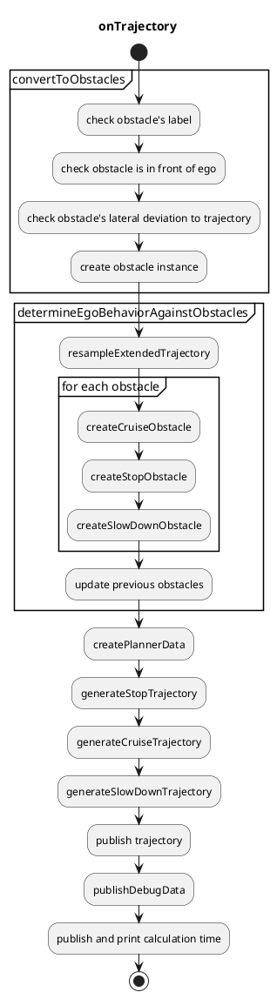

# 障害物クルーズプランナー

## 概要

`autoware_obstacle_cruise_planner`パッケージには、次のモジュールがあります。

- 停止プランニング
  - 静的障害物が軌道の付近にあるとき停止します。
- クルーズプランニング
  - 自車の前にある動的障害物にクルージングします。
- 減速プランニング
  - 静的/動的障害物が軌道の付近にあるとき減速します。

## インターフェース

### 入力トピック

| 名前                | 型                                          | 説明   |
| -------------------- | ------------------------------------------- | -------- |
| `~/input/trajectory` | autoware_planning_msgs::Trajectory            | 入力軌道 |
| `~/input/objects`    | autoware_perception_msgs::PredictedObjects | 動的物体 |
| `~/input/odometry`   | nav_msgs::msg::Odometry                       | 自車オドメトリ |

### 出力トピック

| 名称                              | タイプ                                           | 説明                      |
| ------------------------------------ | ---------------------------------------------- | -------------------------------- |
| `~/output/trajectory`           | autoware_planning_msgs::Trajectory             | 出力軌跡                |
| `~/output/velocity_limit`       | tier4_planning_msgs::VelocityLimit             | クルーズ速度の速度制限      |
| `~/output/clear_velocity_limit` | tier4_planning_msgs::VelocityLimitClearCommand | 速度制限のクリアコマンド |

## 設計

以下の機能の設計を定義します。

- 障害物に対する振る舞い決定
- 停止計画
- クルーズ計画
- 減速計画

クルーズ計画および停止計画用のデータ構造は次のとおりです。このプランナーのデータは最初に作成され、次に計画アルゴリズムに送信されます。


```cpp
struct PlannerData
{
  rclcpp::Time current_time;
  autoware_planning_msgs::msg::Trajectory traj;
  geometry_msgs::msg::Pose current_pose;
  double ego_vel;
  double current_acc;
  std::vector<Obstacle> target_obstacles;
};
```


```cpp
struct Obstacle
{
  rclcpp::Time stamp;  // This is not the current stamp, but when the object was observed.
  geometry_msgs::msg::Pose pose;  // interpolated with the current stamp
  bool orientation_reliable;
  Twist twist;
  bool twist_reliable;
  ObjectClassification classification;
  std::string uuid;
  Shape shape;
  std::vector<PredictedPath> predicted_paths;
};
```

### 障害物に対する挙動の決定

走行、停止、減速のための障害物は、それらの位置と速度に基づいてこの順序で選択されます。
エゴの前方以外の障害物は無視されます。


#### 走行車両の決定

以下の条件を満たす障害物は、走行のための障害物として決定されます。

- オブジェクトとエゴの軌道の側方距離が`behavior_determination.cruise.max_lat_margin`より小さい。

- オブジェクトのタイプが`common.cruise_obstacle_type.*`に従って走行用である。
- オブジェクトがエゴの軌道を横断していない（\ * 1）。
- オブジェクトが軌道の内側にある場合。
  - オブジェクトのタイプが`common.cruise_obstacle_type.inside.*`に従って軌道内走行である。
  - オブジェクトの速度が`behavior_determination.obstacle_velocity_threshold_from_cruise_to_stop`よりも大きい。
- オブジェクトが軌道の外側にある場合。
  - オブジェクトのタイプが`common.cruise_obstacle_type.outside.*`に従って軌道外走行である。
  - オブジェクトの速度が`behavior_determination.cruise.outside_obstacle.obstacle_velocity_threshold`よりも大きい。
  - 最も確信できる予測経路がエゴの軌道と衝突する。
  - その衝突の期間が`behavior_determination.cruise.outside_obstacle.ego_obstacle_overlap_time_threshold`より長い。

| パラメーター                                                                        | タイプ   | 説明                                                                   |
| ------------------------------------------------------------------------------------ | ------ | ---------------------------------------------------------------------- |
| `common.cruise_obstacle_type.inside.unknown`                                         | ブール   | クルージングにおける不明物体の考慮フラグ                        |
| `common.cruise_obstacle_type.inside.car`                                             | ブール   | クルージングにおける乗用車の考慮フラグ                        |
| `common.cruise_obstacle_type.inside.truck`                                           | ブール   | クルージングにおけるトラックの考慮フラグ                        |
| ...                                                                                  | ブール   | ...                                                                   |
| `common.cruise_obstacle_type.outside.unknown`                                        | ブール   | クルージングにおける不明物体の考慮フラグ                        |
| `common.cruise_obstacle_type.outside.car`                                            | ブール   | クルージングにおける乗用車の考慮フラグ                        |
| `common.cruise_obstacle_type.outside.truck`                                          | ブール   | クルージングにおけるトラックの考慮フラグ                        |
| ...                                                                                  | ブール   | ...                                                                   |
| `behavior_determination.cruise.max_lat_margin`                                       | double  | クルージング障害物に対する最大横マージン                        |
| `behavior_determination.obstacle_velocity_threshold_from_cruise_to_stop`             | double  | 軌跡内のクルージング障害物の最大障害物速度                        |
| `behavior_determination.cruise.outside_obstacle.obstacle_velocity_threshold`         | double  | 軌跡外のクルージング障害物の最大障害物速度                        |
| `behavior_determination.cruise.outside_obstacle.ego_obstacle_overlap_time_threshold` | double  | 自車と障害物との衝突最大重複時間                                |

##### 自車線に割り込む可能性がある他の車に対して譲る

隣接車線上の車両が自車の現在の自車位置に割り込む可能性がある場合、その後の車両（クルーズ）に譲ることもできます。

次の条件を満たす障害物は、譲る（クルーズ）障害物と判断されます。

- オブジェクトタイプは `common.cruise_obstacle_type.*` に従ってクルーズしていて、`behavior_determination.cruise.yield.stopped_obstacle_velocity_threshold` より高速で動いている。
- オブジェクトは自車の軌道と交差していない（\*1）。
- 移動障害物の前に `common.cruise_obstacle_type.*` タイプの別のオブジェクトが停止している。
- 障害物同士の横方向距離（自車の軌跡を基準に）が `behavior_determination.cruise.yield.max_lat_dist_between_obstacles` 未満である。
- 移動障害物と停止障害物の両方が、自車の軌道から横方向距離 `behavior_determination.cruise.yield.lat_distance_threshold` および `behavior_determination.cruise.yield.lat_distance_threshold` + `behavior_determination.cruise.yield.max_lat_dist_between_obstacles` 内にある。

上記条件が満たされると、自車は移動障害物の後にクルーズし、停止障害物を避けるために自車線に割り込めるよう譲ります。

#### 停止車両を判定する

クルーズ対象でない障害物の中で、次の条件を満たす障害物は停止障害物と判断されます。

- オブジェクトタイプは `common.stop_obstacle_type.*` に従って停止している。
- オブジェクトから自車の軌道までの横方向距離が `behavior_determination.stop.max_lat_margin` より小さい。
- 自車の軌道方向のオブジェクト速度が `behavior_determination.obstacle_velocity_threshold_from_stop_to_cruise` より小さい。
- オブジェクト
  - 自車の軌道と交差していない（\*1）
  - 速度が `behavior_determination.crossing_obstacle.obstacle_velocity_threshold` 未満である
  - 十分な衝突時間マージンがある（\*2）。

| パラメータ                                                            | 型   | 説明                                                              |
|------------------------------------------------------------------------|------|-----------------------------------------------------------------------|
| `common.stop_obstacle_type.unknown`                                     | bool  | 停止対象に不明物体を考慮するかどうかのフラグ                         |
| `common.stop_obstacle_type.car`                                         | bool  | 停止対象に車を考慮するかどうかのフラグ                             |
| `common.stop_obstacle_type.truck`                                       | bool  | 停止対象にトラックを考慮するかどうかのフラグ                           |
| ...                                                                     | bool  | ...                                                                   |
| `behavior_determination.stop.max_lat_margin`                          | double| 停止障害物に対する最大横方向マージン                               |
| `behavior_determination.crossing_obstacle.obstacle_velocity_threshold`  | double| 無視する最大の横断障害物速度                                        |
| `behavior_determination.obstacle_velocity_threshold_from_stop_to_cruise` | double| 停止に対する障害物の最大速度                                         |

#### 減速車種の判定

巡航および停止対象ではない障害物の中で、以下の条件を満たす障害物は減速対象障害物と判定されます。

- オブジェクトタイプが `common.slow_down_obstacle_type.*` に従って減速用である。
- オブジェクトから自車軌跡までの側方距離が `behavior_determination.slow_down.max_lat_margin` 未満である。

| パラメーター | タイプ | 説明 |
|---|---|---|
| `common.slow_down_obstacle_type.unknown` | ブール | 減速する対象として不明なオブジェクトを考慮するかどうかのフラグ |
| `common.slow_down_obstacle_type.car` | ブール | 減速する対象として車を考慮するかどうかのフラグ |
| `common.slow_down_obstacle_type.truck` | ブール | 減速する対象としてトラックを考慮するかどうかのフラグ |
| ... | ブール | ... |
| `behavior_determination.slow_down.max_lat_margin` | ダブル | 減速障害物の最大横方向マージン |

#### 注意

##### \*1: 障害物の横断

障害物の横断は、走行軌跡に対する障害物のヨー角が「`behavior_determination.crossing_obstacle.obstacle_traj_angle_threshold`」よりも小さいオブジェクトです。

| パラメータ                                                                 | Type   | 説明                                                                                                    |
| ------------------------------------------------------------------------ | ------ | ------------------------------------------------------------------------------------------------------ |
| `behavior_determination.crossing_obstacle.obstacle_traj_angle_threshold` | double | 自車の経路に対して、障害物が経路を横切っていると判定するための最大角度 [rad] |

##### \*2: 十分な衝突時間マージン

定速度運動を行う自車と、予測された経路上の障害物による衝突領域とその時間を予測します.
次に、自車が衝突領域内に到達する時間と、障害物が衝突領域内に到達する時間の差である衝突時間マージンを計算します.
この時間マージンが `behavior_determination.stop.crossing_obstacle.collision_time_margin` より小さい場合、マージンは不十分です.

| パラメーター                                                           | 型 | 説明                                                   |
| --------------------------------------------------------------------- | ---- | ------------------------------------------------------- |
| `behavior_determination.stop.crossing_obstacle.collision_time_margin` | double | 自車と障害物の最大衝突時間マージン |

### 停止Planning

| パラメータ                              | 型   | 説明                                                                              |
| -------------------------------------- | ------ | ----------------------------------------------------------------------------------------- |
| `common.min_strong_accel`              | double | 自車の停止に必要な最小加速度 [m/ss]                                                  |
| `common.safe_distance_margin`          | double | 障害物との停止距離 [m]                                                                  |
| `common.terminal_safe_distance_margin` | double | 障害物との terminal 距離 (安全距離の範囲を超えることはできない) [m] |

停止計画の役割は、静的な車両物体または動的/静的な車両以外の物体を安全な距離に保つことです。

停止計画は、単に障害物との距離を保つために停止点を軌道に挿入するだけです。
安全距離は `common.safe_distance_margin` としてパラメータ化されています。
軌道の最後に停止し、障害物が同じ地点にある場合、安全距離は `terminal_safe_distance_margin` になります。

停止点を挿入するとき、停止点の前で停止するために必要な車両の加速度が計算されます。
加速度が `common.min_strong_accel` よりも小さい場合、このパッケージは緊急時に強く急ブレーキをかけることを想定していないため、停止計画はキャンセルされます。

### クルーズ計画

| パラメータ                       | 型   | 説明                                    |
| ----------------------------- | ------ | ---------------------------------------------- |
| `common.safe_distance_margin` | double | 巡航時に障害物との間の最小距離 [m] |

クルーズプランニングの役割は、スムースな速度遷移で動的車両オブジェクトとの安全な車間距離を維持することです。
これには車両追従だけでなく、割り込みや割り出し車両に対する反応も含まれます。

安全な車間距離は、以下の式によって責任感応型安全 (RSS) に基づいて動的に計算されます。

$$
d_{rss} = v_{ego} t_{idling} + \frac{1}{2} a_{ego} t_{idling}^2 + \frac{v_{ego}^2}{2 a_{ego}} - \frac{v_{obstacle}^2}{2 a_{obstacle}},
$$

ここで、$d_{rss}$ は計算された安全な車間距離、$t_{idling}$ は自車が前の車両の減速を検出するためのアイドリング時間、$v_{ego}$ は自車の現在の速度、$v_{obstacle}$ は前の障害物の現在の速度、$a_{ego}$ は自車の加速度、$a_{obstacle}$ は障害物の加速度であると仮定しています。
これらの値は次のようにパラメータ化されています。自車の最小加速度などの他の共通の値は `common.param.yaml` で定義されています。

| パラメータ                           | タイプ | 説明                                                                                                   |
| ----------------------------------- | ------ | --------------------------------------------------------------------------------------------------------- |
| `common.idling_time`              | double | 前方車両が減速を開始してから自車が認識するまでの猶予時間 [秒]                                               |
| `common.min_ego_accel_for_rss`    | double | RSSにおける自車の加速度 [m/秒^2]                                                                       |
| `common.min_object_accel_for_rss` | double | RSSにおける前方障害物の加速度 [m/秒^2]                                                                  |

詳細な数式は以下の通りです。

$$
\begin{align}
d_{error} & = d - d_{rss} \\
d_{normalized} & = lpf(d_{error} / d_{obstacle}) \\
d_{quad, normalized} & = sign(d_{normalized}) *d_{normalized}*d_{normalized} \\
v_{pid} & = pid(d_{quad, normalized}) \\
v_{add} & = v_{pid} > 0 ? v_{pid}* w_{acc} : v_{pid} \\
v_{target} & = max(v_{ego} + v_{add}, v_{min, cruise})
\end{align}
$$

| 変数          | 説明                             |
| ----------------- | --------------------------------------- |
| `d`               | 障害物までの実際の距離             |
| `d_{rss}`         | RSSに基づく障害物までの理想的な距離 |
| `v_{min, cruise}` | `min_cruise_target_vel`                 |
| `w_{acc}`         | `output_ratio_during_accel`             |
| `lpf(val)`        | `val`にローパスフィルタを適用          |
| `pid(val)`        | `val`にPIDを適用                      |

### 減速プランニング

| パラメーター                                                | 型              | 説明                                                                                                                                                                                                                                                                                                      |
| ---------------------------------------------------------------- | -------------- | ---------------------------------------------------------------------------------------------------------------------------------------------------------------------------------------------------------------------------------------------------------------------------------------------------------------------------------------------------------------------- |
| `slow_down.labels`                                               | ベクトル(文字列) | 障害物ラベルベースの減速挙動をカスタマイズするためのラベルのベクトル。各ラベルは、減速を適用する際に異なる方法で処理される障害物の種類を表します。使用可能なラベルは ("default" (必須)、「unknown」、「car」、「truck」、「bus」、「trailer」、「motorcycle」、「bicycle」 または 「pedestrian」) |
| `slow_down.default.static.min_lat_velocity`                | double          | 減速速度を線形計算するための最小速度 [m]。注: この既定値は、検出された障害物ラベルが `slow_down.labels` のどれとも一致せず、障害物が静的または移動していないと見なされる場合に使用されます。                                                                                                  |
| `slow_down.default.static.max_lat_velocity`                | double          | 減速速度を線形計算するための最大速度 [m]。注: この既定値は、検出された障害物ラベルが `slow_down.labels` のどれとも一致せず、障害物が静的または移動していないと見なされる場合に使用されます。                                                                                                  |
| `slow_down.default.static.min_lat_margin`                  | double          | 減速速度を線形計算するための最小横断マージン [m]。注: この既定値は、検出された障害物ラベルが `slow_down.labels` のどれとも一致せず、障害物が静的または移動していないと見なされる場合に使用されます。                                                                                     |
| `slow_down.default.static.max_lat_margin`                  | double          | 減速速度を線形計算するための最大横断マージン [m]。注: この既定値は、検出された障害物ラベルが `slow_down.labels` のどれとも一致せず、障害物が静的または移動していないと見なされる場合に使用されます。                                                                                     |
| `slow_down.default.moving.min_lat_velocity`                | double          | 減速速度を線形計算するための最小速度 [m]。注: この既定値は、検出された障害物ラベルが `slow_down.labels` のどれとも一致せず、障害物が移動していると見なされる場合に使用されます。                                                                                               |
| `slow_down.default.moving.max_lat_velocity`                | double          | 減速速度を線形計算するための最大速度 [m]。注: この既定値は、検出された障害物ラベルが `slow_down.labels` のどれとも一致せず、障害物が移動していると見なされる場合に使用されます。                                                                                               |
| `slow_down.default.moving.min_lat_margin`                  | double          | 減速速度を線形計算するための最小横断マージン [m]。注: この既定値は、検出された障害物ラベルが `slow_down.labels` のどれとも一致せず、障害物が移動していると見なされる場合に使用されます。                                                                                 |
| `slow_down.default.moving.max_lat_margin`                  | double          | 減速速度を線形計算するための最大横断マージン [m]。注: この既定値は、検出された障害物ラベルが `slow_down.labels` のどれとも一致せず、障害物が移動していると見なされる場合に使用されます。                                                                                 |
| (任意) `slow_down."label" .(static & moving).min_lat_velocity` | double          | 減速速度を線形計算するための最小速度 [m]。注: `slow_down.labels `で指定された障害物にのみ使用します。`static` と `moving` の値が必要です。                                                                                                                                                          |
| (任意) `slow_down."label" .(static & moving).max_lat_velocity` | double          | 減速速度を線形計算するための最大速度 [m]。注: `slow_down.labels `で指定された障害物にのみ使用します。`static` と `moving` の値が必要です。                                                                                                                                                          |
| (任意) `slow_down."label" .(static & moving).min_lat_margin`  | double          | 減速速度を線形計算するための最小横断マージン [m]。注: `slow_down.labels `で指定された障害物にのみ使用します。`static` と `moving` の値が必要です。                                                                                                                                                           |
| (任意) `slow_down."label" .(static & moving).max_lat_margin`  | double          | 減速速度を線形計算するための最大横断マージン [m]。注: `slow_down.labels `で指定された障害物にのみ使用します。`static` と `moving` の値が必要です。                                                                                                                                                           |

スローダウン計画の役割は、障害物に軌跡点が近い軌道に減速速度を挿入することです。パラメータは障害物の種類（`slow_down.labels`を参照）に応じてカスタマイズでき、障害物が歩行者、自転車、自動車などに応じて減速動作を調整できます。各種類の障害物には`static`と`moving`のパラメータ設定があり、それによって障害物の種類と運動状態に応じた自車の減速反応をカスタマイズできます。障害物が運動していると判断された場合、対応する`moving`パラメータを使用して車両の減速を計算します。それ以外の場合は、`static`パラメータを使用します。`static`と`moving`の分離は、たとえば、閉塞を引き起こしたり突然ドアを開けたりする可能性のある停止した車両を追い越すときにさらに著しく減速するなど、自車の減速動作をカスタマイズするために役立ちます。

障害物が`static`に分類されるのは、その全速度が`moving_object_speed_threshold`パラメータ未満の場合です。さらに、チャタリングを避けるために履歴を利用したアプローチが使用され、障害物の過去の状態（`moving`または`static`）と`moving_object_hysteresis_range`パラメータ範囲を使用して、障害物が運動しているかどうかを判断します。つまり、障害物が以前に`static`に分類された場合、その全速度が`moving_object_speed_threshold` + `moving_object_hysteresis_range`を超えない限り、その分類は`moving`に変更されません。同様に、以前に`moving`として分類された障害物は、速度が`moving_object_speed_threshold` - `moving_object_hysteresis_range`未満の場合にのみ`static`に変更されます。

自車の軌跡に最も近い障害物上の点が計算されます。次に、点と軌跡との距離を使用して、減速速度は次のとおり線形補間によって計算されます。


| 変数   | 説明                                         |
| ---------- | -------------------------------------------- |
| `v_{out}`  | 低速化の計算速度                               |
| `v_{min}`  | `slow_down.min_lat_velocity`                       |
| `v_{max}`  | `slow_down.max_lat_velocity`                       |
| `l_{min}`  | `slow_down.min_lat_margin`                         |
| `l_{max}`  | `slow_down.max_lat_margin`                         |
| `l'_{max}` | `behavior_determination.slow_down.max_lat_margin` |

障害物が`behavior_determination.slow_down.max_lat_margin`の範囲内にある場合、計算された速度が経路に挿入されます。



## 実装

### フローチャート

連続する関数は次のように`autoware_obstacle_cruise_planner`で構成されます。

停止および巡行計画用としてさまざまなアルゴリズムが実装され、そのうち 1 つがユースケースに応じて指定されます。

コアアルゴリズムの実装である`generateTrajectory`が、指定されたアルゴリズムに従います。




### クルーズプランナーのアルゴリズム選択

現在、PIDベースのプランナーのみがサポートされています。
各プランナーについては以下で説明します。

| パラメータ                | タイプ   | 説明                                                  |
| ------------------------ | ------ | ------------------------------------------------------------ |
| `common.planning_method` | 文字列 | "pid_base"から選択される、クルーズと停止の計画アルゴリズム |

### PIDベースのプランナー

#### 停車プランニング

`pid_based_planner` 名前空間で、

| パラメータ | タイプ | 説明 |
| ------------------------------------------------- | ------ | ------------------------------------------------------------ |
| `obstacle_velocity_threshold_from_cruise_to_stop` | double | obstacle velocity threshold to be stopped from cruised [m/s] |

停止Planningでは、障害物の1つだけが対象となります。

障害物候補の中で、速度が「`obstacle_velocity_threshold_from_cruise_to_stop`」未満で、軌跡上においてエゴカーに最も近い障害物です。エゴカーと障害物の間に「`common.safe_distance_margin`」の距離を保ちながら停止点が挿入されます。

停止Planningの設計で説明したとおり、強い加速度(「`common.min_strong_accel`」未満)が必要な停止Planningはキャンセルされますのでご注意ください。

#### Cruise Planning

「`pid_based_planner`」のネームスペースで

| パラメータ                   | タイプ   | 説明                                                                                              |
| --------------------------- | ------ | -------------------------------------------------------------------------------------------------------- |
| `kp`                        | double | PID制御のpゲイン [-]                                                                               |
| `ki`                        | double | PID制御のiゲイン [-]                                                                               |
| `kd`                        | double | PID制御のdゲイン [-]                                                                               |
| `output_ratio_during_accel` | double | 前方車両を追従するときの、加速中の出力速度にこの比率を乗算します。 [-] |
| `vel_to_acc_weight`         | double | ターゲット加速度はターゲット速度 \* `vel_to_acc_weight` [-]                                        |
| `min_cruise_target_vel`     | double | クルーズ中の最小ターゲット速度 [m/s]                                                              |

安全距離を維持するために、目標速度と目標加速度が計算され、外部速度制限として速度スムージングパッケージ（デフォルトで `motion_velocity_smoother`）に送信されます。
目標速度と目標加速度はそれぞれ、参照安全距離と実際の距離の差に基づいてPIDコントローラを使用して計算されます。

### 最適化ベースのプランナー

準備中

## マイナー機能

### 行動モジュールの停止点の優先順位

横断歩道を歩いている歩行者のために停止するとき、動作モジュールは横断歩道の手前に軌道にゼロ速度を入力します。
また、`autoware_obstacle_cruise_planner` の停止計画も機能し、`autoware_obstacle_cruise_planner` で定義された安全距離は動作モジュールの安全距離よりも長くなる可能性があるため、エゴが動作モジュールの停止点に到達しない場合があります。
動作モジュールと `autoware_obstacle_cruise_planner` の停止点が不整合になる問題を解決するために、`common.min_behavior_stop_margin` が定義されます。
上記のような横断歩道の場合は、`autoware_obstacle_cruise_planner` が、エゴと障害物の間に少なくとも距離 `common.min_behavior_stop_margin` の停止点を挿入します。

| パラメータ                         | タイプ   | 説明                                                              |
| --------------------------------- | ------ | ---------------------------------------------------------------------- |
| `common.min_behavior_stop_margin` | double | Behaviorモジュールが有効になっているときの停止時の最小停止余裕距離 [m] |

### ターゲット障害物内の最も近い停止障害物を保持する関数

ターゲット障害物内の最も近い停止障害物を保持するため、`checkConsistency` 関数でターゲット障害物から消失したかどうかを確認します。
以前の最も近い停止障害物がリストから削除された場合、`stop_obstacle_hold_time_threshold` 秒間リストに保持します。
新しい停止障害物が出現して以前の最も近い障害物がリストから削除された場合、ターゲット障害物に再び追加しないことに注意してください。

| パラメータ                                              | 型   | 説明                                                |
| -------------------------------------------------------- | ------ | --------------------------------------------------- |
| `behavior_determination.stop_obstacle_hold_time_threshold` | double | 最も近い停止障害物を保持する最大時間 [s] |

## デバッグ方法

デバッグの手順については、[こちら](docs/debug.md)を参照してください。

## 既知の制限事項

- 共通
  - 障害物の姿勢または速度の推定に遅延があると、自車は減速を維持したまま前方の車両に接近する場合があります。
  - 現在の実装では、静的/動的障害物に対して予測されたオブジェクトメッセージのみを使用しており、点群は使用しません。したがって、オブジェクト認識が失われると、自車は消失した障害物に対処できなくなります。
  - 障害物の車線変更に対する現在の予測パスは、`obstacle_cruise_planner`には精度が十分ではありません。そのため、`rough_detection_area`を小さな値に設定しています。
- PIDベースのプランナー
  - アルゴリズムは、自車が指定された目標速度に達するかどうかを決定する速度スムージングパッケージ (`motion_velocity_smoother`がデフォルト)に強く依存します。速度スムージングパッケージを更新する場合は、車両の挙動をできるだけ注意深く確認してください。

