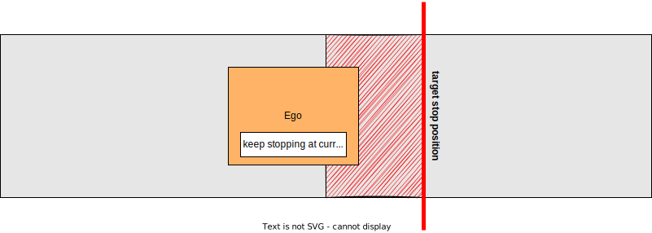

# 障害物停止プランナー

## 概要

`obstacle_stop_planner`には次のモジュールがあります。

- 障害物停止プランナー
  - 走行軌跡上に静的な点群がある場合、軌跡に停止点を入力します。
- 減速プランナー
  - 走行軌跡付近に点群がある場合、軌跡に減速区間を入力します。
- アダプティブ・クルーズ・コントロール（ACC）
  - 走行軌跡上に動的な点群がある場合、軌跡に目標速度を入力します。

### 入力トピック

| 名前 | 種類 | 説明 |
|---|---|---|
| `~/input/pointcloud` | sensor_msgs::PointCloud2 | 障害物の点群 |
| `~/input/trajectory` | autoware_planning_msgs::Trajectory | 軌道 |
| `~/input/vector_map` | autoware_map_msgs::msg::LaneletMapBin | ベクターマップ |
| `~/input/odometry` | nav_msgs::Odometry | 車両速度 |
| `~/input/dynamic_objects` | autoware_perception_msgs::PredictedObjects | 動的物体 |
| `~/input/expand_stop_range` | tier4_planning_msgs::msg::ExpandStopRange | 停止範囲の拡張 |

### 出力トピック

| 名称                     | タイプ                               | 説明                                    |
| -------------------------- | -------------------------------------- | ------------------------------------------- |
| `~output/trajectory`       | `autoware_planning_msgs::Trajectory` | 従うべき軌跡                           |
| `~output/stop_reasons`    | `tier4_planning_msgs::StopReasonArray` | 車両が停止する理由                      |

### 共通パラメータ

{{ json_to_markdown("planning/autoware_obstacle_stop_planner/schema/common.schema.json", "ja") }}

| パラメータ                            | 型     | 説明                                                                                     |
| -------------------------------------- | ------ | -------------------------------------------------------------------------------------------- |
| `enable_slow_down`                     | bool   | slow down Planner [-] を有効にする                                                           |
| `max_velocity`                         | double | 最大速度 [m/s]                                                                                |
| `chattering_threshold`                 | double | 障害物が消えても、停止判定は `chattering_threshold` [s] の間継続する                        |
| `enable_z_axis_obstacle_filtering`     | bool   | Z 軸（高さ）の障害物をフィルタリングする [-]                                                 |
| `z_axis_filtering_buffer`              | double | Z 軸フィルタ用追加バッファ [m]                                                              |
| `use_predicted_objects`                | bool   | 衝突や減速検出に予測オブジェクトを使用するかどうか [-]                                    |
| `predicted_object_filtering_threshold` | double | 予測オブジェクトをフィルタリングするためのしきい値（`publish_obstacle_polygon true` のみ有効） [m] |
| `publish_obstacle_polygon`             | bool   | `use_predicted_objects` が true の場合、ノードは衝突ポリゴンを発行する [-]               |

## 障害物停止プランナー

### 役割

このモジュールは障害物の前にマージンを設けて停車地点を挿入します。通常の場合、マージンは `baselink_to_front` と `max_longitudinal_margin` の合計です。 `baselink_to_front` は、リアアクスルの中心である `baselink` と車の前面との距離を意味します。検出領域は、処理された経路に沿って、次のように生成されます。（このモジュールは、自車位置の後の入力経路を切り取り、計算コストを削減するために経路ポイントをデシメートします。）

<figure markdown>
  {width=1000}
  <figcaption>障害物停止プランナーのパラメータ</figcaption>
</figure>

<figure markdown>
  {width=1000}
  <figcaption>障害物停止プランナーのターゲット</figcaption>
</figure>

他のモジュールが既に `max_longitudinal_margin` 以内に別の停止地点を挿入している場合、マージンは `baselink_to_front` と `min_longitudinal_margin` の合計になります。この機能は、不自然な位置で停止しないようにするために存在します。（例えば、歩行者が横断している横断歩道の停止線から、この機能がないと自車が不自然に遠く離れて停止します。）

<figure markdown>
  {width=1000}
  <figcaption>最小縦断マージン</figcaption>
</figure>

このモジュールは、検出領域内の障害物ポイントクラウドを検索します。ポイントクラウドが見つかった場合、`アダプティブクルーズコントローラー（Adaptive Cruise Controller）`モジュールが動作を開始します。`アダプティブクルーズコントローラー（Adaptive Cruise Controller）`モジュールがターゲット速度を挿入しない場合のみ、停止地点が経路に挿入されます。停止地点とは、速度が 0 のポイントを意味します。

### 再始動防止

車体の制御性能が悪いため、一旦車が動き出すと停止に X メートル（例：0.5 メートル）必要になると、近い停止地点に近づくために動き始めて（例：0.3 メートル先）、厳守すべき停止位置を過ぎてしまいます。

このモジュールには、`hold_stop_margin_distance` パラメータがあり、このような無駄な再始動を防止します。車両がモジュールの停止地点から `hold_stop_margin_distance` メートル以内で停止した場合、モジュールは車両がモジュールの停止地点ですでに停止していると判断し、車両が他の要因で停止した場合でも現在の位置での停止を維持することを計画します。

<figure markdown>
  {width=1000}
  <figcaption>パラメータ</figcaption>
</figure>

<figure markdown>
  {width=1000}
  <figcaption>hold_stop_margin_distance の外側</figcaption>
</figure>

<figure markdown>
  {width=1000}
  <figcaption>hold_stop_margin_distance の内側</figcaption>
</figure>

{{ json_to_markdown("planning/autoware_obstacle_stop_planner/schema/obstacle_stop_planner.schema.json") }}

#### 停止位置

| パラメーター                           | 型   | 説明                                                                                                                                  |
| ------------------------------------- | ------ | -------------------------------------------------------------------------------------------------------------------------------------- |
| `max_longitudinal_margin`             | 倍精度 | 障害物と自車前面のマージン [m]                                                                                                 |
| `max_longitudinal_margin_behind_goal` | 倍精度 | 停止点が目標の後ろにあるときの障害物と自車前面のマージン [m]                                                                |
| `min_longitudinal_margin`             | 倍精度 | `max_longitudinal_margin` 内に障害物が存在する場合、このモジュールはマージンを_停止マージン_の値として `min_longitudinal_margin` [m] に設定 |
| `hold_stop_margin_distance`           | 倍精度 | 再始動防止のパラメーター（上記のセクションを参照） [m]                                                                             |

#### 障害物検出領域

| パラメーター                   | タイプ   | 説明                                                                                       |
| ------------------------------ | ------ | ------------------------------------------------------------------------------------------- |
| `lateral_margin`                | double | 衝突障害物検出領域としての車両のフットプリントからの横方向マージン [m]                       |
| `step_length`                   | double | ポイントクラウド検索範囲のステップ長 [m]                                                    |
| `enable_stop_behind_goal_for_obstacle` | bool   | 障害物検出のための目標車線の後に軌道を延長する有効化                                      |

### フローチャート

## スローダウンプランナー

### 役割

このモジュールは、障害物手前に、前進マージンと後進マージンを設けた減速セクションを挿入します。前進マージンは `baselink_to_front` と `longitudinal_forward_margin` の合計であり、後進マージンは `baselink_to_front` と `longitudinal_backward_margin` の合計です。自車は減速セクションで減速速度を維持します。速度は次の式で計算されます。

$v_{target} = v_{min} + \frac{l_{ld} - l_{vw}/2}{l_{margin}} (v_{max} - v_{min} )$

- $v_{target}$: スローダウン目標速度 [m/s]
- $v_{min}$: `min_slow_down_velocity` [m/s]
- $v_{max}$: `max_slow_down_velocity` [m/s]
- $l_{ld}$: 障害物と自車フットプリント間の横方向偏差 [m]
- $l_{margin}$: `lateral_margin` [m]
- $l_{vw}$: 自車フットプリントの幅 [m]

この式は、点群の横方向偏差が小さいほど減速セクションの速度が低くなることを意味します。

<figure markdown>
  {width=1000}
  <figcaption>スローダウンプランナーのパラメーター</figcaption>
</figure>

<figure markdown>
  {width=1000}
  <figcaption>スローダウンプランナーのターゲット</figcaption>
</figure>

### パラメーター

{{ json_to_markdown("planning/autoware_obstacle_stop_planner/schema/adaptive_cruise_control.schema.json") }}

#### スローダウンセクション

| パラメーター | タイプ | 説明 |
|---|---|---|
| `longitudinal_forward_margin` | double | オブジェクトと自車前面との余裕距離 [m] |
| `longitudinal_backward_margin` | double | オブジェクトと自車背面との余裕距離 [m] |

#### 障害物検出領域

| パラメータ | タイプ | 説明 |
|---|---|---|
| `lateral_margin` | double | 減速障害物検出エリアにおける車体のフットプリントからの横方向のマージン [m] |

#### ターゲット速度の減速

| パラメータ              | 型    | 説明                      |
| ------------------------ | ------ | --------------------------- |
| `max_slow_down_velocity` | double | 最大減速速度 [m/s]          |
| `min_slow_down_velocity` | double | 最小減速速度 [m/s]          |

### フローチャート

## Adaptive Cruise Controller

### 役割

`Adaptive Cruise Controller`モジュールは、経路上に動的な点群がある場合に、経路における最高速度を埋め込みます。最高速度の値は、自車速度、点群速度（＝前方車の速度）、点群までの距離（＝前方車までの距離）によって異なります。

| パラメータ                                                        | 型   | 説明                                                                                                     |
| ---------------------------------------------------------------- | ------ | ---------------------------------------------------------------------------------------------------------- |
| `adaptive_cruise_control.use_object_to_estimate_vel`             | bool   | ダイナミックオブジェクトを使用してオブジェクト速度を見積もるか否か（`osp.use_predicted_objects` が false の場合のみ有効） |
| `adaptive_cruise_control.use_pcl_to_estimate_vel`                | bool   | 生の点群を使用してオブジェクト速度を見積もるか否か（`osp.use_predicted_objects` が `false` の場合のみ有効） |
| `adaptive_cruise_control.consider_obj_velocity`                  | bool   | 適応型クルーズ制御で対象速度を計算する際に、先行車両の速度を考慮するか否か                                  |
| `adaptive_cruise_control.obstacle_velocity_thresh_to_start_acc`  | double | 先行障害物の速度がこの値を超えたときに適応型クルーズ制御を開始 [m/s]                                          |
| `adaptive_cruise_control.obstacle_velocity_thresh_to_stop_acc`   | double | 先行障害物の速度がこの値を下回ったときに acc を停止する [m/s]                                               |
| `adaptive_cruise_control.emergency_stop_acceleration`            | double | 緊急停止での想定最小加速度（減速度）[m/ss]                                                                    |
| `adaptive_cruise_control.emergency_stop_idling_time`             | double | 緊急停止を開始する想定アイドリング時間 [s]                                                                  |
| `adaptive_cruise_control.min_dist_stop`                          | double | 緊急停止の最小距離 [m]                                                                                    |
| `adaptive_cruise_control.obstacle_emergency_stop_acceleration`   | double | 緊急停止での想定最小加速度（減速度）[m/ss]                                                                    |
| `adaptive_cruise_control.max_standard_acceleration`              | double | アクティブクルーズ制御での想定最大加速度 [m/ss]                                                               |
| `adaptive_cruise_control.min_standard_acceleration`              | double | アクティブクルーズ制御での想定最小加速度（減速度）[m/ss]                                                   |
| `adaptive_cruise_control.standard_idling_time`                   | double | アクティブクルーズ制御でオブジェクトに応答する想定アイドリング時間 [s]                                        |
| `adaptive_cruise_control.min_dist_standard`                      | double | アクティブクルーズ制御の最小距離 [m]                                                                        |
| `adaptive_cruise_control.obstacle_min_standard_acceleration`     | double | 先行障害物の想定最小加速度 [m/ss]                                                                           |
| `adaptive_cruise_control.margin_rate_to_change_vel`              | double | ターゲット速度を挿入するマージン距離のレート [-]                                                           |
| `adaptive_cruise_control.use_time_compensation_to_calc_distance` | bool   | 先行車両までの距離を計算するために時間補正を使用する                                                      |
| `adaptive_cruise_control.p_coefficient_positive`                 | double | PID 制御における係数 P (target_dist - `current_dist` が 0 以上の場合に使用) [-]                                   |
| `adaptive_cruise_control.p_coefficient_negative`                 | double | PID 制御における係数 P (target_dist - `current_dist` が 0 未満の場合に使用) [-]                                 |
| `adaptive_cruise_control.d_coefficient_positive`                 | double | PID 制御における係数 D (`delta_dist` が 0 以上の場合に使用) [-]                                                   |
| `adaptive_cruise_control.d_coefficient_negative`                 | double | PID 制御における係数 D (`delta_dist` が 0 未満の場合に使用) [-]                                                 |
| `adaptive_cruise_control.object_polygon_length_margin`           | double | 点群オブジェクトマッチングでオブジェクトの多角形の長さを拡張する距離 [m]                                    |
| `adaptive_cruise_control.object_polygon_width_margin`            | double | 点群オブジェクトマッチングでオブジェクトの多角形の幅を拡張する距離 [m]                                     |
| `adaptive_cruise_control.valid_estimated_vel_diff_time`          | double | 点群を使用して速度を推定するときに、連続データとみなされる最大時間差 [s]                                           |
| `adaptive_cruise_control.valid_vel_que_time`                     | double | 点群を使用して速度を推定するときに、速度推定に使用される情報の時間幅 [s]                                    |
| `adaptive_cruise_control.valid_estimated_vel_max`                | double | 点群を使用して速度を推定した結果の有効な最大値 [m/s]                                                          |
| `adaptive_cruise_control.valid_estimated_vel_min`                | double | 点群を使用して速度を推定した結果の有効な最小値 [m/s]                                                          |
| `adaptive_cruise_control.thresh_vel_to_stop`                     | double | ACC によって計算された最大速度がこの速度よりも遅ければ停止線を埋め込む [m/s]                                 |
| `adaptive_cruise_control.lowpass_gain_of_upper_velocity`         | double | ターゲット速度のローパスゲイン                                                                               |
| `adaptive_cruise_control.use_rough_velocity_estimation:`         | bool   | 速度推定が失敗した場合に大まかな推定速度を使用する（`osp.use_predicted_objects` が false の場合のみ有効） |
| `adaptive_cruise_control.rough_velocity_rate`                    | double | 大まかな速度推定では、先行車両の速度は自己現在の速度 \* この値と推定されます                               |

### フローチャート

**障害物停止プランナーの詳細**

(\*1) 目標車両の点は、軌跡上の自己位置からの最も近い障害物点群として計算されます。

(\*2) 速度推定のソースは、次のROSパラメータによって変更できます。

- `adaptive_cruise_control.use_object_to_estimate_vel`
- `adaptive_cruise_control.use_pcl_to_estimate_vel`

このモジュールは、目標点が障害物停止プランナーモジュールの検出エリア内にある場合にのみ機能します。

このモジュールの最初の処理は、目標車両の点の速度を推定することです。速度推定では、動的物体の速度情報または前のステップからの目標車両の点の移動距離を使用します。動的オブジェクト情報は基本であり、知覚障害が発生した場合に備えて、移動距離推定がバックアップとして使用されます。
目標車両の点が動的オブジェクトのバウンディングボックス内に幾何学的に含まれている場合、動的オブジェクトの速度が目標点の速度として使用されます。
そうでなければ、目標点の速度は、前のステップからの目標点の移動距離から計算されます。つまり、**(現在の位置 - 前の位置)/dt**です。この移動距離ベースの推定は、目標点が最初に検出されたとき（主に割り込み時に発生）に失敗することに注意してください。推定の安定性を向上させるために、いくつかのステップの計算結果の mediana（中央値）が使用されます。

計算された速度がしきい値範囲内にある場合、目標点の速度として使用されます。

推定が成功し、推定された速度が`obstacle_stop_velocity_thresh_*`の値を超えた場合にのみ、自己位置からの点群との距離が計算されます。モード遷移でのチャタリングを防ぐために、**`obstacle_velocity_thresh_to_start_acc`**は適応巡航を開始するためのしきい値に使用され、**`obstacle_velocity_thresh_to_stop_acc`**は適応巡航を停止するためのしきい値に使用されます。計算された距離の値が緊急停止パラメータによって計算された緊急距離$d\_{emergency}$を超えた場合、挿入する目標速度が計算されます。

緊急距離$d\_{emergency}$は次のように計算されます。

$d_{emergency} = d_{margin_{emergency}} + t_{idling_{emergency}} \cdot v_{ego} + (-\frac{v_{ego}^2}{2 \cdot a_{ego_
{emergency}}}) - (-\frac{v_{obj}^2}{2 \cdot a_{obj_{emergency}}})$

- $d_{margin_{emergency}}$は、障害物点群に対する最小余白です。$d_{margin_{emergency}}$の値はパラメータ`min_dist_stop`に依存します。
- $t_{idling_{emergency}}$は、想定されるアイドリング時間です。$t_{idling_{emergency}}$の値はパラメータ`emergency_stop_idling_time`に依存します。
- $v_{ego}$は、自車の現在の速度です。
- $a_{ego_{_{emergency}}}$は、自車の最小加速度（最大減速度）です。$a_{ego_{_
  {emergency}}}$の値はパラメータ`emergency_stop_acceleration`に依存します。
- $v_{obj}$は、障害物点群の現在の速度です。
- $a_{obj_{_{emergency}}}$は、障害物点群の想定される最小加速度です。$a_{obj_{_
  {emergency}}}$の値はパラメータ`obstacle_emergency_stop_acceleration`に依存します。
- \*上記の`X_{_{emergency}}`パラメータは、緊急時のみ使用されます。

目標速度は、障害物点群と自車の距離を次の式で計算される標準距離$d\_{standard}$に維持するように決定されます。したがって、障害物点群との距離が標準距離より大きい場合、目標速度は現在の速度よりも大きくなり、その逆に動作します。距離を維持するために、PIDコントローラーが使用されます。

$d_{standard} = d_{margin_{standard}} + t_{idling_{standard}} \cdot v_{ego} + (-\frac{v_{ego}^2}{2 \cdot a_{ego_
{standard}}}) - (-\frac{v_{obj}^2}{2 \cdot a_{obj_{standard}}})$

- $d_{margin_{standard}}$は、障害物点群に対する最小余白です。$d_{margin_{standard}}$の値はパラメータ`min_dist_stop`に依存します。
- $t_{idling_{standard}}$は、想定されるアイドリング時間です。$t_{idling_{standard}}$の値はパラメータ`standard_stop_idling_time`に依存します。

- $a_{ego_{_{標準}}}$ は自車の最小加速度（最大減速度）です。$a_{ego_{_
  {標準}}}$ の値はパラメータ `min_standard_acceleration` に依存します
- $v_{obj}$ は障害物点群の現在の速度です。
- $a_{obj_{_{標準}}}$ は障害物点群の想定最小加速度です。$a_{obj_{_
  {標準}}}$ の値はパラメータ `obstacle_min_standard_acceleration` に依存します
- \*上記の $X_{_{標準}}$ パラメータは緊急時を除き使用されます。

目標速度が `thresh_vel_to_stop` の値を超えた場合、目標速度は軌道に埋め込まれます。

## 既知の制限

- `Adaptive Cruise Controller` モジュールで埋め込まれた目標速度に従って移動するかどうかは、Velocity Planningモジュールに大きく依存します。Velocity Planningモジュールが更新された場合、可能な限り車両の挙動に注意を払い、常にオーバーライドの準備をしてください。

- `Adaptive Cruise Controller` の速度推定アルゴリズムは、オブジェクトトラッキングモジュールに依存しています。オブジェクトトラッキングに失敗するか、トラッキング結果が正しくない場合、車両が危険な挙動をする可能性があることに注意してください。

- 後退走行には機能しませんが、入力の経路をそのまま公開します。後退時に障害物に対して停止したい場合は [obstacle_cruise_planner](../autoware_obstacle_cruise_planner/README.md) を使用してください。

