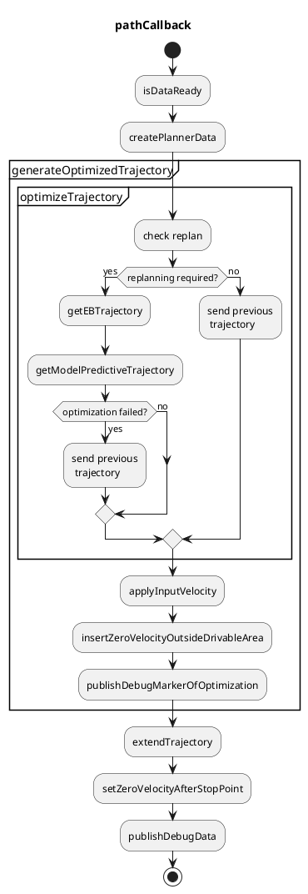

# 経路最適化

## 目的

このパッケージは、入力の経路と走行可能な領域に基づいて、運動学的に走行可能で衝突のない軌道を生成します。
このモジュールでは軌道の位置と姿勢のみが更新され、速度は単に入力のパスから引き継がれます。

## 機能

このパッケージは次のことができます。

- 軌道を可能な限り走行可能な領域内に収める
  - 注：避けるべき静止障害物は走行可能な領域から削除できます。
- 計画されたフットプリントが走行可能な領域の外に出る前に停止点を挿入する

速度は入力パスから引き継がれることに注意してください。

## 入出力

### 入力

| 名称               | タイプ                            | 説明                                         |
| ------------------ | ------------------------------- | ---------------------------------------------- |
| `~/input/path`     | autoware_planning_msgs/msg/Path | 参照パスと対応する走行可能領域             |
| `~/input/odometry` | nav_msgs/msg/Odometry           | 自車の現在の速度                                 |

### 出力

自動運転システムは、プランニング、Perception、制御という3つの主要なコンポーネントで構成されています。プランニングコンポーネントは、センサーから得られたデータを処理し、周囲の環境を理解します。この情報を使用して、安全で効率的な経路を計画します。パーセプションコンポーネントは、カメラ、レーダー、LiDARなどのセンサーからデータを集め、周囲の環境に関する理解を向上させます。制御コンポーネントは、ステアリング、加速、ブレーキなどの車両の運動を制御します。

Autowareは、これらのコンポーネントをシームレスに統合する完全なAutowareスタックです。Autowareは、センサーデータの収集から制御コマンドの生成まで、自動運転システムを開発するための包括的なフレームワークを提供します。

Autowareの主要な機能を次に示します。

* **Perception:** カメラ、レーダー、LiDARなどのセンサーからデータを集めます。
* **Planning:** 安全で効率的な経路を計画します。
* **Control:** ステアリング、加速、ブレーキなどの車両の運動を制御します。
* **Mapping:** 地図情報を生成して、自車位置を正確に特定します。
* **Localization:** 車両の位置と姿勢を推定します。
* **Scenario Planning:** 特定の交通状況に対する安全な反応を計画します。
* **Decision Making:** PerceptionとPlanningのデータを処理して、車両の動作を決定します。
* **Path Planning:** 車両がたどる経路を計画します。
* **Motion Planning:** 車両の運動を計画します。
* **Behavior Planning:** 車両の動作を計画します。
* **Vehicle Dynamics:** 車両の運動を制御します。
* **Safety:** 自動運転システムの安全性を確保します。
* **Simulation:** 自動運転システムの開発とテストのためのシミュレーション環境を提供します。

Autowareは、オープンソースで、BSD 3条ライセンスに基づいて利用できます。 Autowareの詳細については、[Autowareのドキュメント](https://www.autoware.ai/documents)を参照してください。

| 名称                    | タイプ                                  | 説明                                                           |
| --------------------- | ------------------------------------- | -------------------------------------------------------------- |
| `~/output/trajectory` | autoware_planning_msgs/msg/Trajectory | 運転可能で衝突しない最適化された軌跡                            |

## フローチャート

各機能のフローチャートについて説明します。




### createPlannerData

プランニング用の次のデータを作成します。


```cpp
struct PlannerData
{
  // input
  Header header;
  std::vector<TrajectoryPoint> traj_points; // converted from the input path
  std::vector<geometry_msgs::msg::Point> left_bound;
  std::vector<geometry_msgs::msg::Point> right_bound;

  // ego
  geometry_msgs::msg::Pose ego_pose;
  double ego_vel;
};
```

### replan確認

以下の条件のいずれかが満たされた場合、軌道最適化が実行されます。
それ以外の場合は、以前に最適化された軌跡が最新の入力パスからの速度の更新を使用して使用されます。

max_path_shape_around_ego_lat_dist

- エゴが1サイクルで`replan.max_ego_moving_dist`より長く移動します（デフォルト：3.0 [m]）。
  - これはシミュレーションでエゴのポーズが再び設定された場合の処理です。
- ゴールポーズと見なされる軌道の終点が、1サイクルで`replan.max_goal_moving_dist`より大きく移動します（デフォルト：15.0 [ms]）。
  - ゴールポーズが再び設定された場合、プランニングをリセットする必要があります。
- 時間の経過（デフォルト：1.0 [s]）。
  - 最適化が重い場合があるため、最適化はしばらくスキップされます。
- 入力パスが1サイクルで`replan.max_path_shape_around_ego_lat_dist`より大きく横方向に変更される（デフォルト：2.0）。

### getModelPredictiveTrajectory

このモジュールは、軌跡を運動学的に実現可能で衝突なしにします。
フレネ座標系で車両のポーズを定義し、最適化によって追従誤差を最小化します。
この最適化は車両運動学と道路境界と障害物との衝突判定を考慮します。
計算コストを削減するために、最適化は全軌跡よりも短い軌跡（デフォルト：50 [m]）に適用され、残った軌跡は最後に最適化された軌跡に連結されます。

エゴのすぐ前の軌跡は大きく変更されてはならないため、ステアリングホイールが安定します。
そのため、エゴの前の以前に生成された軌跡を使用します。

軌跡上に正確に位置しようとする車両の中心での最適化は、車両の垂直軸に沿って調整できます。
このパラメータ`mpt.kinematics.optimization center offset`は、後輪の中心から最適化の中心までの距離として定義されます。
次の図はいくつかの例を示しており、基準軌跡（緑の軌跡）が同じ場合でも、最適化の中心によって車両形状の軌跡が異なることが示されています。


詳細については[こちら](docs/mpt.md)を参照してください。

### applyInputVelocity

速度は、動作パスの速度から最適化された軌跡に割り当てられます。
最適化された軌跡とパスの形状は異なるため、パスへの各軌跡点の最近点が検索され、速度はゼロ次ホールドで補間されます。

### insertZeroVelocityOutsideDrivableArea

最適化された軌跡は速度計画には短いため、走行可能性を考慮して最適化された軌跡と動作パスを連結して軌跡を延長します。
生成された軌跡は走行可能領域内かどうかがチェックされ、走行可能領域外の場合は、動作パスまたは以前に生成された軌跡を使用して走行可能領域内の軌跡を出力します。

上記のとおり、動作パスは2つのパスに分割されます。1つは最適化用、もう1つは残りの部分です。最初のパスは最適化された軌跡になり、2番目のパスは単に軌跡に変換されます。次に、走行可能領域内の軌跡は次のように計算されます。

- 最適化された軌跡が**走行可能領域内**にあり、残りの軌跡が走行可能領域内/外にある場合、
  - 出力軌跡はそれらの2つの軌跡の連結になります。
  - この場合、残りの軌跡が走行可能領域内か外かは気にしません。通常、走行可能領域外にあるため（特に狭い道路上）。ただし、できる限り長い軌跡を後のモジュールに渡す必要があります。
- 最適化された軌跡が**走行可能領域外**にあり、残りの軌跡が走行可能領域内/外にある場合、
  - 且つ、以前生成された軌跡が**メモリ化されている**場合、
    - 出力軌跡は以前生成された軌跡になり、走行可能領域外に最初に移動するポイントにゼロ速度が挿入されます。
  - 且つ、以前生成された軌跡が**メモリ化されてない**場合、
    - 出力軌跡は動作パスから変換されたばかりの軌跡の一部になり、走行可能領域外に最初に移動するポイントにゼロ速度が挿入されます。

最適化の失敗は、最適化された軌跡が走行可能領域外にある場合と同じように処理されます。
出力軌跡は、次のサイクル用に以前に生成された軌跡としてメモリ化されます。

_論理的根拠_

したがって、最適化後に最適化された軌跡が走行可能領域内にあることを確認する必要があります。

## 制限

- 計算コストが時々高くなる。
- 線形化などの近似のために、狭い道路ではプランナによる走行ができない。
- `behavior_path_planner` と `path_optimizer` のプランニングの役割が明確に定義されていない。どちらも障害物を回避できる。

## 他手法との比較

運動学的な実現可能性と衝突回避を満たす軌跡計画問題は、解くのが困難にする主な特性が 2 つあります。つまり、非凸性と高次元です。
これらの特性に基づいて、代表的な計画手法（最適化ベース、サンプリングベース、ラーニングベース）の長所と短所を調査しました。

### 最適化ベースの手法

- 長所: 勾配降下を利用することで高次元に対して比較的高速
- 短所: 非凸問題では局所最適解に収束しやすい

### サンプリングベースの手法

- 長所: グローバル最適化を実現
- 短所: 特に複雑なケースでは計算コストが高い

### ラーニングベースの手法

- まだ調査中

このような長所/短所に基づき、最初に最適化ベースのプランナを選択しました。
局所最適解に収束するという短所がありますが、問題を元の非凸問題にほぼ等しい凸問題に近似するための前処理により、良好な解を得ることができます。

## パラメータの調整方法

### 狭い道路での走行性

- `mpt.clearance.soft_clearance_from_road` を変更する
  - このパラメータは、軌跡と道路境界の間にどの程度の余裕を持たせるかを表します。
  - 最適化のモデル誤差により、衝突回避などの制約は完全に満たされていません。
    - このパラメータを大きくすることで、狭い道路走行の課題が解決できる場合があります。12180
- `mpt.kinematics.optimization_center_offset` を変更する
  - 車両上のこのパラメータでベースリンクから前方にオフセットされた点は、参照パスを追従しようとします。
- set of circles でフットプリントを近似する方法を変更または調整する。
  - [こちら](https://autowarefoundation.github.io/autoware.universe/main/planning/path_optimizer/docs/mpt/#collision-free) を参照
  - 調整とは、円の半径の比率を変更することを意味します。

### 計算時間

- 準備中

### ロバスト性

- MPT の前後の軌跡がロバストでないかどうかを確認します。
  - MPT の前の軌跡がロバストでない場合
  - MPT の後の軌跡がロバストでない場合
    - `mpt.weight.steer_input_weight` または `mpt.weight.steer_rate_weight` を大きくします。これらは軌跡に沿ったステアリングホイールの安定性を表します。

### その他のオプション

- `option.enable_calculation_time_info` は、各機能の計算時間と端末上の合計計算時間を表示します。
- `option.enable_outside_drivable_area_stop` は、生成された軌跡点が走行可能エリアの外に出る直前で停止します。

## デバッグ方法

デバッグ方法は [ここ](docs/debug.md) で参照できます。

