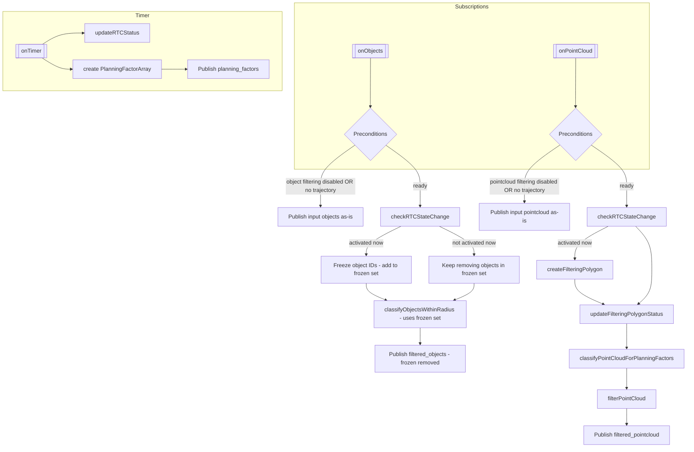

# autoware_perception_filter

## Purpose

This package provides a perception filter node that filters perception data based on RTC (Request To Cooperate) interface approval and planning trajectory proximity. It receives perception outputs (objects and pointcloud) and publishes filtered versions based on RTC activation status and distance from the planning trajectory.

## Inputs / Outputs

### Input

| Name                        | Type                                              | Description                                                                                           |
| --------------------------- | ------------------------------------------------- | ----------------------------------------------------------------------------------------------------- |
| `input/objects`             | `autoware_perception_msgs::msg::PredictedObjects` | Predicted objects from perception module                                                              |
| `input/pointcloud`          | `sensor_msgs::msg::PointCloud2`                   | Obstacle pointcloud from perception module                                                            |
| `input/planning_trajectory` | `autoware_planning_msgs::msg::Trajectory`         | Trajectory from `/planning/scenario_planning/trajectory` for filtering proximity-based object removal |

### Output

| Name                                                      | Type                                                        | Description                                                                     |
| --------------------------------------------------------- | ----------------------------------------------------------- | ------------------------------------------------------------------------------- |
| `output/filtered_objects`                                 | `autoware_perception_msgs::msg::PredictedObjects`           | Filtered predicted objects                                                      |
| `output/filtered_pointcloud`                              | `sensor_msgs::msg::PointCloud2`                             | Filtered obstacle pointcloud                                                    |
| `/planning/planning_factors/supervised_perception_filter` | `autoware_internal_planning_msgs::msg::PlanningFactorArray` | Planning factors for objects/points that would be filtered when RTC is approved |

### Debug Visualization Topics

| Name                      | Type                                   | Description                                      |
| ------------------------- | -------------------------------------- | ------------------------------------------------ |
| `debug/filtering_markers` | `visualization_msgs::msg::MarkerArray` | Debug visualization markers for filtering status |

### RTC Interface Topics/Services

| Name                                                                           | Type                                        | Description                             |
| ------------------------------------------------------------------------------ | ------------------------------------------- | --------------------------------------- |
| `/planning/cooperate_status/supervised_perception_filter/cooperate_status`     | `tier4_rtc_msgs::msg::CooperateStatusArray` | RTC status array (published)            |
| `/planning/auto_mode_status/supervised_perception_filter/auto_mode_status`     | `tier4_rtc_msgs::msg::AutoModeStatus`       | Auto mode status (published)            |
| `/planning/cooperate_commands/supervised_perception_filter/cooperate_commands` | `tier4_rtc_msgs::srv::CooperateCommands`    | Cooperation command reception (service) |
| `/planning/enable_auto_mode/supervised_perception_filter/enable_auto_mode`     | `tier4_rtc_msgs::srv::AutoMode`             | Auto mode enable/disable (service)      |

## Parameters

### Core Parameters

| Name                           | Type     | Default Value | Description                                             |
| ------------------------------ | -------- | ------------- | ------------------------------------------------------- |
| `enable_object_filtering`      | bool     | true          | Enable/disable object filtering                         |
| `enable_pointcloud_filtering`  | bool     | true          | Enable/disable pointcloud filtering                     |
| `max_filter_distance`          | double   | 5.0           | Distance from planning trajectory to filter objects [m] |
| `pointcloud_safety_distance`   | double   | 1.0           | Minimum distance for pointcloud filtering [m]           |
| `filtering_distance`           | double   | 50.0          | Length ahead along path to build filtering polygon [m]  |
| `object_classification_radius` | double   | 50.0          | Radius from ego vehicle for object classification [m]   |
| `stop_velocity_threshold`      | double   | 0.001         | Velocity threshold to consider vehicle as stopped [m/s] |
| `ignore_object_classes`        | string[] | ["UNKNOWN"]   | List of object classes to ignore during filtering       |
| `processing_rate`              | double   | 10.0          | Processing execution rate [Hz]                          |

### Object Classification Parameters

| Name                    | Type     | Default Value | Description                                       |
| ----------------------- | -------- | ------------- | ------------------------------------------------- |
| `ignore_object_classes` | string[] | ["UNKNOWN"]   | List of object classes to ignore during filtering |

**Example Configuration:**

```yaml
# UNKNOWN object can be filtered out
ignore_object_classes: ["UNKNOWN"]

# UNKNOWN and CAR objects can be filtered out
ignore_object_classes: ["UNKNOWN", "CAR"]

# No objects will be filtered out
ignore_object_classes: []
```

## Processing Flow



## RTC status update Logic (TBD)

## Topic Name Switching Strategy

### Overview

The perception filter is integrated into the overall Autoware launch hierarchy. The topic name switching flag `use_perception_filter` is provided by upper-level launch files (e.g., `autoware_launch`). This package's local launch file does not define `use_perception_filter`; instead, it accepts explicit input/output topic remaps via arguments.

### Launch Arguments in this package

| Name                         | Type | Default Value                                           | Description                      |
| ---------------------------- | ---- | ------------------------------------------------------- | -------------------------------- |
| `input/objects`              | str  | `/perception/object_recognition/objects`                | Objects input topic              |
| `input/pointcloud`           | str  | `/perception/obstacle_segmentation/pointcloud`          | Pointcloud input topic           |
| `input/planning_trajectory`  | str  | `/planning/scenario_planning/trajectory`                | Planning trajectory input        |
| `output/filtered_objects`    | str  | `/perception/object_recognition/filtered_objects`       | Filtered objects output topic    |
| `output/filtered_pointcloud` | str  | `/perception/obstacle_segmentation/filtered_pointcloud` | Filtered pointcloud output topic |

### Topic Remapping Strategy (upper-level)

When `use_perception_filter` is enabled in upper-level launch:

- Objects: Planning modules subscribe to `/perception/object_recognition/filtered_objects` (otherwise `/perception/object_recognition/objects`)
- Pointcloud: Planning modules subscribe to `/perception/obstacle_segmentation/filtered_pointcloud` (otherwise `/perception/obstacle_segmentation/pointcloud`)

### Path-based Filtering

When RTC is activated and a planning trajectory is available:

#### Object Filtering

- Objects: Objects that are closer than `max_filter_distance` meters from the planning trajectory are filtered out
- Logic: `distance_to_trajectory < max_filter_distance` → Filter out

#### Pointcloud Filtering

- Points: Points that are between `pointcloud_safety_distance` and `max_filter_distance` meters from the planning trajectory are filtered out
- Logic: `pointcloud_safety_distance < distance_to_trajectory < max_filter_distance` → Filter out
- Points closer than pointcloud_safety_distance: Always kept (safety margin)
- Points farther than max_filter_distance: Always kept

### Important Notes

Important note: This node runs in a single-threaded executor. When both object and pointcloud filtering are enabled, heavy processing in one callback can delay the other and cause input topic drops (QoS-dependent). Consider disabling one filter, tuning processing_rate/QoS, or using a multi-threaded executor.
