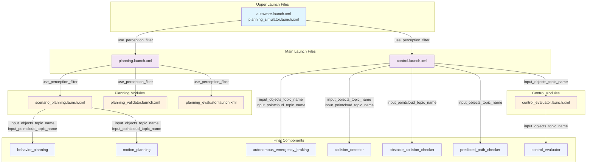

# autoware_perception_filter

## Purpose

This package provides a perception filter node that filters perception data based on RTC (Request To Cooperate) interface approval and planning trajectory proximity. It receives perception outputs (objects and pointcloud) and publishes filtered versions based on RTC activation status and distance from the planning trajectory.

## Inputs / Outputs

### Input

| Name                        | Type                                              | Description                                                                                           |
| --------------------------- | ------------------------------------------------- | ----------------------------------------------------------------------------------------------------- |
| `input/objects`             | `autoware_perception_msgs::msg::PredictedObjects` | Predicted objects from perception module                                                              |
| `input/pointcloud`          | `sensor_msgs::msg::PointCloud2`                   | Obstacle pointcloud from perception module                                                            |
| `input/planning_trajectory` | `autoware_planning_msgs::msg::Trajectory`         | Trajectory from `/planning/scenario_planning/trajectory` for filtering proximity-based object removal |

### Output

| Name                                           | Type                                                        | Description                                                              |
| ---------------------------------------------- | ----------------------------------------------------------- | ------------------------------------------------------------------------ |
| `output/filtered_objects`                      | `autoware_perception_msgs::msg::PredictedObjects`           | Filtered predicted objects                                               |
| `output/filtered_pointcloud`                   | `sensor_msgs::msg::PointCloud2`                             | Filtered obstacle pointcloud                                             |
| `/planning/planning_factors/perception_filter` | `autoware_internal_planning_msgs::msg::PlanningFactorArray` | Planning factors for objects that would be filtered when RTC is approved |

### Debug Visualization Topics

| Name                      | Type                                   | Description                                      |
| ------------------------- | -------------------------------------- | ------------------------------------------------ |
| `debug/filtering_markers` | `visualization_msgs::msg::MarkerArray` | Debug visualization markers for filtering status |

### RTC Interface Topics/Services

| Name                                                                           | Type                                        | Description                             |
| ------------------------------------------------------------------------------ | ------------------------------------------- | --------------------------------------- |
| `/planning/cooperate_status/supervised_perception_filter/cooperate_status`     | `tier4_rtc_msgs::msg::CooperateStatusArray` | RTC status array (published)            |
| `/planning/auto_mode_status/supervised_perception_filter/auto_mode_status`     | `tier4_rtc_msgs::msg::AutoModeStatus`       | Auto mode status (published)            |
| `/planning/cooperate_commands/supervised_perception_filter/cooperate_commands` | `tier4_rtc_msgs::srv::CooperateCommands`    | Cooperation command reception (service) |
| `/planning/enable_auto_mode/supervised_perception_filter/enable_auto_mode`     | `tier4_rtc_msgs::srv::AutoMode`             | Auto mode enable/disable (service)      |

## Parameters

### Core Parameters

| Name                           | Type     | Default Value | Description                                             |
| ------------------------------ | -------- | ------------- | ------------------------------------------------------- |
| `enable_object_filtering`      | bool     | true          | Enable/disable object filtering                         |
| `enable_pointcloud_filtering`  | bool     | true          | Enable/disable pointcloud filtering                     |
| `max_filter_distance`          | double   | 5.0           | Distance from planning trajectory to filter objects [m] |
| `pointcloud_safety_distance`   | double   | 1.0           | Minimum distance for pointcloud filtering [m]           |
| `object_classification_radius` | double   | 50.0          | Radius from ego vehicle for object classification [m]   |
| `stop_velocity_threshold`      | double   | 0.001         | Velocity threshold to consider vehicle as stopped [m/s] |
| `ignore_object_classes`        | string[] | []            | List of object classes to ignore during filtering       |

### Object Classification Parameters

| Name                    | Type     | Default Value | Description                                       |
| ----------------------- | -------- | ------------- | ------------------------------------------------- |
| `ignore_object_classes` | string[] | []            | List of object classes to ignore during filtering |

**Available Object Classes:**

- `UNKNOWN`: Unknown object type
- `CAR`: Passenger car
- `TRUCK`: Truck
- `BUS`: Bus
- `TRAILER`: Trailer
- `MOTORCYCLE`: Motorcycle
- `BICYCLE`: Bicycle
- `PEDESTRIAN`: Pedestrian

**Example Configuration:**

```yaml
# Ignore pedestrians and bicycles (always pass through)
ignore_object_classes: ["PEDESTRIAN", "BICYCLE"]

# Ignore all vehicle types except cars
ignore_object_classes: ["TRUCK", "BUS", "TRAILER", "MOTORCYCLE"]

# No objects are ignored (default behavior)
ignore_object_classes: []
```

## Topic Name Switching Strategy

### Overview

The perception filter integrates with Autoware's launch system through a topic name switching strategy. This allows the system to seamlessly switch between filtered and unfiltered perception data based on the `use_perception_filter` launch argument.

### Launch Arguments

| Name                    | Type | Default Value | Description                                  |
| ----------------------- | ---- | ------------- | -------------------------------------------- |
| `use_perception_filter` | bool | false         | Enable/disable perception filter integration |

### Topic Remapping Strategy

When `use_perception_filter` is enabled, the following topic remapping occurs:

#### Objects Topic

- Filtered mode (`use_perception_filter:=true`): Planning modules subscribe to `/perception/object_recognition/filtered_objects`
- Normal mode (`use_perception_filter:=false`): Planning modules subscribe to `/perception/object_recognition/objects`

#### Pointcloud Topic

- Filtered mode (`use_perception_filter:=true`): Planning modules subscribe to `/perception/obstacle_segmentation/filtered_pointcloud`
- Normal mode (`use_perception_filter:=false`): Planning modules subscribe to `/perception/obstacle_segmentation/pointcloud`

#### Argument Propagation Flow



### Integration Points

The topic switching is implemented at multiple levels in the launch hierarchy:

1. **autoware.launch.xml**: Defines conditional topic variables
2. **tier4_planning_component.launch.xml**: Receives and passes topic arguments
3. **Planning modules**: Use remapped topics for perception input

### Example Usage

```bash
ros2 launch autoware_launch planning_simulator.launch.xml \
  map_path:=/path/to/map \
  vehicle_model:=your_vehicle \
  sensor_model:=your_sensor \
  use_perception_filter:=true
```

### Processing Flow Details

#### Object Classification

The node classifies detected objects into three categories within a specified radius (`object_classification_radius`):

1. **Always Pass Through**: Objects far from the trajectory that are never filtered
2. **Would Filter**: Objects near the trajectory that pass through when RTC is inactive but would be filtered when RTC is active
3. **Currently Filtered**: Objects near the trajectory that are actively being filtered when RTC is active (frozen objects only)

**Note:** Objects with classes specified in `ignore_object_classes` are always classified as "Always Pass Through" regardless of their distance from the trajectory or RTC status.

## Behavior

### Debug Visualization

The perception filter provides debug visualization to help understand the filtering behavior:

#### Debug Markers

The node publishes visualization markers on the `debug/filtering_markers` topic that show:

- Blue markers: Objects that always pass through (including ignored classes)
- Yellow markers: Objects that would be filtered if RTC were approved
- Red markers: Objects that were filtered out (removed from output)
- Status text: Current RTC activation status, object counts, and ignored classes count

#### Visualization Details

- Marker Type: Cube list markers for easy visualization
- Color Coding:
  - Blue: Always pass through objects (including ignored classes)
  - Yellow: Would filter objects (when RTC is not activated but objects are near path)
  - Red: Filtered out objects (when RTC is activated and objects are near path)
- Status Display: Text marker showing RTC status, object counts, and ignored classes configuration
- Frame: All markers are published in the "map" frame

### RTC Interface-based Approval System

The perception filter uses the RTC (Request To Cooperate) interface to receive external approval for filtering operations. This provides a standardized way for external systems (HMI, remote monitoring systems, etc.) to control the filtering behavior.

#### RTC Interface Overview

- Module Name: `supervised_perception_filter`
- UUID: Automatically generated unique identifier for each RTC session
- State Management: Tracks WAITING_FOR_EXECUTION, RUNNING, SUCCEEDED, FAILED states
- Safety Status: Always reports as safe (filtering is a safe operation)

#### Approval-based Filtering with RTC

The filtering behavior is controlled by the RTC interface activation status:

##### When RTC is Activated (Approved)

- Objects: Proceeds to path-based filtering for frozen objects only
- Pointcloud: Proceeds to path-based filtering
- Status: RTC state is set to RUNNING

##### When RTC is Not Activated (Not Approved)

- Objects: All objects are passed through unchanged (no filtering)
- Pointcloud: All points are passed through unchanged (no filtering)
- Status: RTC state remains WAITING_FOR_EXECUTION

#### RTC Status Update

The node continuously updates its RTC status when the vehicle is stopped:

```cpp
void updateRTCStatus()
{
  const bool safe = true;  // Always safe for perception filtering
  const auto state = tier4_rtc_msgs::msg::State::RUNNING;
  const double start_distance = 0.0;
  const double finish_distance = std::numeric_limits<double>::max();

  rtc_interface_->updateCooperateStatus(
    rtc_uuid_, safe, state, start_distance, finish_distance, this->now());
  rtc_interface_->publishCooperateStatus(this->now());
}
```

#### External Control Examples

Activate filtering via RTC:

```bash
# Send activation command
ros2 service call /planning/cooperate_commands/supervised_perception_filter/cooperate_commands \
  tier4_rtc_msgs/srv/CooperateCommands \
  "{commands: [{uuid: [UUID], command: {type: 1}}]}"  # type 1 = ACTIVATE
```

Check RTC status:

```bash
# Monitor RTC status
ros2 topic echo /planning/cooperate_status/supervised_perception_filter/cooperate_status
```

### Path-based Filtering

When RTC is activated and a planning trajectory is available:

#### Object Filtering

- Objects: Objects that are closer than `max_filter_distance` meters from the planning trajectory are filtered out
- Logic: `distance_to_trajectory < max_filter_distance` → Filter out

#### Pointcloud Filtering

- Points: Points that are between `pointcloud_safety_distance` and `max_filter_distance` meters from the planning trajectory are filtered out
- Logic: `pointcloud_safety_distance < distance_to_trajectory < max_filter_distance` → Filter out
- Points closer than pointcloud_safety_distance: Always kept (safety margin)
- Points farther than max_filter_distance: Always kept

### Fallback Behavior

- When no planning trajectory is available: All perception data is passed through unchanged
- When trajectory is empty: All perception data is passed through unchanged
- When RTC interface is not available: All perception data is passed through unchanged (fail-safe behavior)
