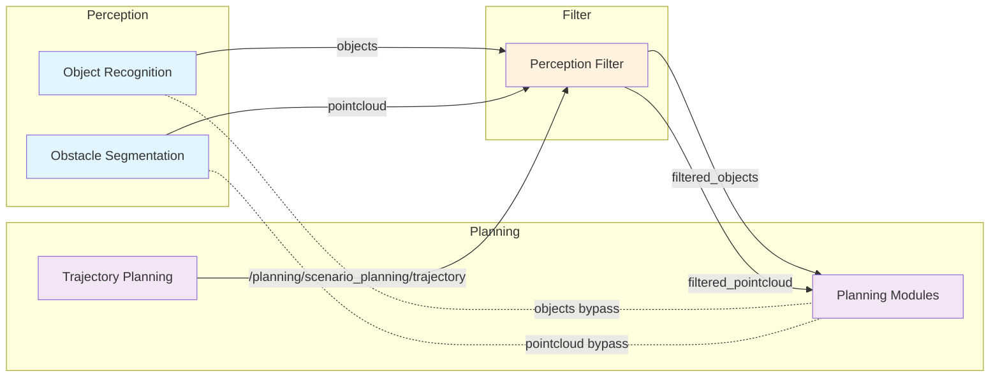
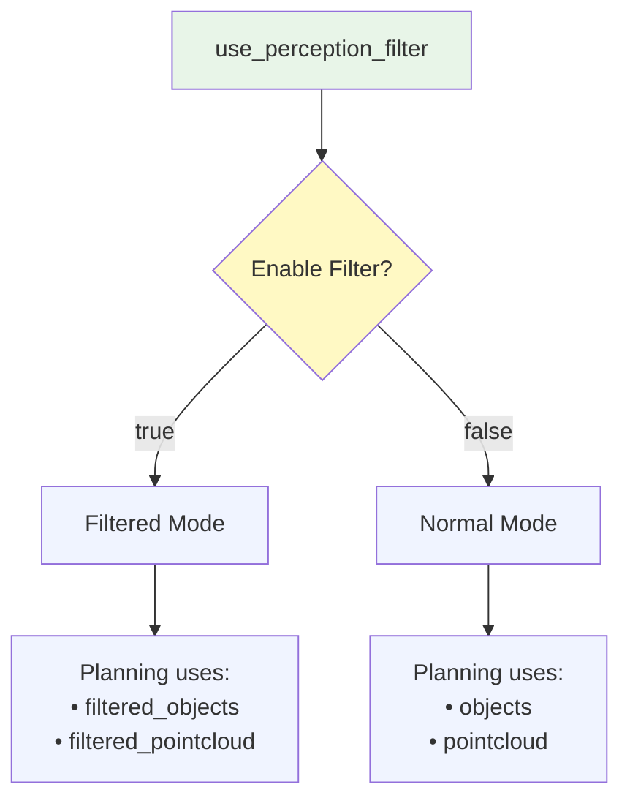

# autoware_perception_filter

## Purpose

This package provides a perception filter node that filters perception data based on RTC (Request To Cooperate) interface approval and planning trajectory proximity. It receives perception outputs (objects and pointcloud) and publishes filtered versions based on RTC activation status and distance from the planning trajectory.

## Inputs / Outputs

### Input

| Name                        | Type                                              | Description                                                                                           |
| --------------------------- | ------------------------------------------------- | ----------------------------------------------------------------------------------------------------- |
| `input/objects`             | `autoware_perception_msgs::msg::PredictedObjects` | Predicted objects from perception module                                                              |
| `input/pointcloud`          | `sensor_msgs::msg::PointCloud2`                   | Obstacle pointcloud from perception module                                                            |
| `input/planning_trajectory` | `autoware_planning_msgs::msg::Trajectory`         | Trajectory from `/planning/scenario_planning/trajectory` for filtering proximity-based object removal |

### Output

| Name                                           | Type                                                        | Description                                                              |
| ---------------------------------------------- | ----------------------------------------------------------- | ------------------------------------------------------------------------ |
| `output/filtered_objects`                      | `autoware_perception_msgs::msg::PredictedObjects`           | Filtered predicted objects                                               |
| `output/filtered_pointcloud`                   | `sensor_msgs::msg::PointCloud2`                             | Filtered obstacle pointcloud                                             |
| `/planning/planning_factors/perception_filter` | `autoware_internal_planning_msgs::msg::PlanningFactorArray` | Planning factors for objects that would be filtered when RTC is approved |

### Debug Visualization Topics

| Name                      | Type                                   | Description                                      |
| ------------------------- | -------------------------------------- | ------------------------------------------------ |
| `debug/filtering_markers` | `visualization_msgs::msg::MarkerArray` | Debug visualization markers for filtering status |

### RTC Interface Topics/Services

| Name                                                                           | Type                                        | Description                             |
| ------------------------------------------------------------------------------ | ------------------------------------------- | --------------------------------------- |
| `/planning/cooperate_status/supervised_perception_filter/cooperate_status`     | `tier4_rtc_msgs::msg::CooperateStatusArray` | RTC status array (published)            |
| `/planning/auto_mode_status/supervised_perception_filter/auto_mode_status`     | `tier4_rtc_msgs::msg::AutoModeStatus`       | Auto mode status (published)            |
| `/planning/cooperate_commands/supervised_perception_filter/cooperate_commands` | `tier4_rtc_msgs::srv::CooperateCommands`    | Cooperation command reception (service) |
| `/planning/enable_auto_mode/supervised_perception_filter/enable_auto_mode`     | `tier4_rtc_msgs::srv::AutoMode`             | Auto mode enable/disable (service)      |

## Parameters

### Core Parameters

| Name                           | Type   | Default Value | Description                                             |
| ------------------------------ | ------ | ------------- | ------------------------------------------------------- |
| `enable_object_filtering`      | bool   | true          | Enable/disable object filtering                         |
| `enable_pointcloud_filtering`  | bool   | true          | Enable/disable pointcloud filtering                     |
| `max_filter_distance`          | double | 5.0           | Distance from planning trajectory to filter objects [m] |
| `pointcloud_safety_distance`   | double | 1.0           | Minimum distance for pointcloud filtering [m]           |
| `object_classification_radius` | double | 50.0          | Radius from ego vehicle for object classification [m]   |
| `stop_velocity_threshold`      | double | 0.001         | Velocity threshold to consider vehicle as stopped [m/s] |

## Topic Name Switching Strategy

### Overview

The perception filter integrates with Autoware's launch system through a topic name switching strategy. This allows the system to seamlessly switch between filtered and unfiltered perception data based on the `use_perception_filter` launch argument.

### Launch Arguments

| Name                    | Type | Default Value | Description                                  |
| ----------------------- | ---- | ------------- | -------------------------------------------- |
| `use_perception_filter` | bool | false         | Enable/disable perception filter integration |

### Topic Remapping Strategy

When `use_perception_filter` is enabled, the following topic remapping occurs:

#### Objects Topic

- **Filtered mode** (`use_perception_filter:=true`): Planning modules subscribe to `/perception/object_recognition/filtered_objects`
- **Normal mode** (`use_perception_filter:=false`): Planning modules subscribe to `/perception/object_recognition/objects`

#### Pointcloud Topic

- **Filtered mode** (`use_perception_filter:=true`): Planning modules subscribe to `/perception/obstacle_segmentation/filtered_pointcloud`
- **Normal mode** (`use_perception_filter:=false`): Planning modules subscribe to `/perception/obstacle_segmentation/pointcloud`

#### Topic Flow Diagram



#### Topic Switching States



#### Argument Propagation Flow


### Integration Points

The topic switching is implemented at multiple levels in the launch hierarchy:

1. **autoware.launch.xml**: Defines conditional topic variables
2. **tier4_planning_component.launch.xml**: Receives and passes topic arguments
3. **Planning modules**: Use remapped topics for perception input

### Example Usage

#### Enable Perception Filter (Real Vehicle)

```bash
ros2 launch autoware_launch autoware.launch.xml \
  map_path:=/path/to/map \
  vehicle_model:=your_vehicle \
  sensor_model:=your_sensor \
  use_perception_filter:=true
```

#### Disable Perception Filter (Default)

```bash
ros2 launch autoware_launch autoware.launch.xml \
  map_path:=/path/to/map \
  vehicle_model:=your_vehicle \
  sensor_model:=your_sensor \
  use_perception_filter:=false
```

#### Planning Simulator with Perception Filter

```bash
ros2 launch autoware_launch planning_simulator.launch.xml \
  map_path:=/path/to/map \
  vehicle_model:=your_vehicle \
  sensor_model:=your_sensor \
  use_perception_filter:=true
```

### Implementation Details

The topic switching is implemented using ROS 2 launch system's conditional logic:

```xml
<!-- Conditional topic remapping based on perception filter usage -->
<let name="objects_topic" value="/perception/object_recognition/filtered_objects" if="$(var use_perception_filter)"/>
<let name="objects_topic" value="/perception/object_recognition/objects" unless="$(var use_perception_filter)"/>
<let name="pointcloud_topic" value="/perception/obstacle_segmentation/filtered_pointcloud" if="$(var use_perception_filter)"/>
<let name="pointcloud_topic" value="/perception/obstacle_segmentation/pointcloud" unless="$(var use_perception_filter)"/>
```

These variables are then passed through the launch hierarchy to ensure all planning modules receive the correct topic names.

## Usage

### Launch

```bash
ros2 launch autoware_perception_filter perception_filter.launch.xml
```

### Default Topic Mapping

- Input objects: `/perception/object_recognition/objects`
- Input pointcloud: `/perception/obstacle_segmentation/pointcloud`
- Input planning trajectory: `/planning/scenario_planning/trajectory`
- Output filtered objects: `/perception/object_recognition/filtered_objects`
- Output filtered pointcloud: `/perception/obstacle_segmentation/filtered_pointcloud`
- Output planning factors: `/planning/planning_factors/perception_filter`

**Note**: External approval is handled through the RTC interface rather than a direct topic subscription. See the RTC Interface Topics/Services section above for details.

### Processing Flow Details

#### Object Classification

The node classifies detected objects into three categories within a specified radius (`object_classification_radius`):

1. **Always Pass Through**: Objects far from the trajectory that are never filtered
2. **Would Filter**: Objects near the trajectory that pass through when RTC is inactive but would be filtered when RTC is active
3. **Currently Filtered**: Objects near the trajectory that are actively being filtered when RTC is active (frozen objects only)

#### Frozen Filtering Mechanism

When RTC transitions from inactive to active:

1. The system captures a "frozen" list of objects that should be filtered at the moment of RTC approval
2. Only these frozen objects will be filtered during the RTC active period
3. New objects that appear after RTC approval and meet filtering criteria will still pass through
4. This prevents unexpected filtering of newly detected objects after approval

#### RTC State-based Behavior

- **RTC Not Activated**: All objects pass through, but classification helps visualize potential filtering
- **RTC Activated**: Only frozen objects (captured at RTC approval time) are filtered based on distance to the planning trajectory

#### Distance-based Filtering

- **Objects**: Filtered if `distance_to_path ≤ max_filter_distance` AND object is in the frozen list
- **PointCloud**: Filtered if `pointcloud_safety_distance < distance_to_path ≤ max_filter_distance`

#### Vehicle Stop-based RTC Recreation

- RTC interface is recreated when vehicle stops (velocity below `stop_velocity_threshold`)
- This allows for fresh approval cycles at traffic lights, intersections, etc.

## Behavior

### Debug Visualization

The perception filter provides debug visualization to help understand the filtering behavior:

#### Debug Markers

The node publishes visualization markers on the `debug/filtering_markers` topic that show:

- **Red markers**: Objects that were filtered out (removed from output)
- **Green markers**: Objects that passed through (included in output)
- **Status text**: Current RTC activation status and object counts

#### Visualization Details

- **Marker Type**: Cube list markers for easy visualization
- **Color Coding**:
  - Red: Filtered out objects (when RTC is activated and objects are near path)
  - Green: Passed through objects (when RTC is not activated or objects are far from path)
- **Status Display**: Text marker showing RTC status and object counts
- **Frame**: All markers are published in the "map" frame

#### Usage

To view the debug visualization:

```bash
# In RViz, add a MarkerArray display
# Set the topic to: /perception_filter_node/debug/filtering_markers

# Or monitor the topic directly
ros2 topic echo /perception_filter_node/debug/filtering_markers
```

#### Debug Information

The node also logs debug information:

```bash
# Enable debug logging
ros2 run autoware_perception_filter autoware_perception_filter_node --ros-args --log-level debug
```

This will show:

- RTC activation status
- Number of filtered vs passed objects
- Filtering decisions for each object

### RTC Interface-based Approval System

The perception filter uses the RTC (Request To Cooperate) interface to receive external approval for filtering operations. This provides a standardized way for external systems (HMI, remote monitoring systems, etc.) to control the filtering behavior.

#### RTC Interface Overview

- **Module Name**: `supervised_perception_filter`
- **UUID**: Automatically generated unique identifier for each RTC session
- **State Management**: Tracks WAITING_FOR_EXECUTION, RUNNING, SUCCEEDED, FAILED states
- **Safety Status**: Always reports as safe (filtering is a safe operation)

#### Approval-based Filtering with RTC

The filtering behavior is controlled by the RTC interface activation status:

##### When RTC is Activated (Approved)

- **Objects**: Proceeds to path-based filtering for frozen objects only
- **Pointcloud**: Proceeds to path-based filtering
- **Status**: RTC state is set to RUNNING

##### When RTC is Not Activated (Not Approved)

- **Objects**: All objects are passed through unchanged (no filtering)
- **Pointcloud**: All points are passed through unchanged (no filtering)
- **Status**: RTC state remains WAITING_FOR_EXECUTION

#### RTC Status Update

The node continuously updates its RTC status when the vehicle is stopped:

```cpp
void updateRTCStatus()
{
  const bool safe = true;  // Always safe for perception filtering
  const auto state = tier4_rtc_msgs::msg::State::RUNNING;
  const double start_distance = 0.0;
  const double finish_distance = std::numeric_limits<double>::max();

  rtc_interface_->updateCooperateStatus(
    rtc_uuid_, safe, state, start_distance, finish_distance, this->now());
  rtc_interface_->publishCooperateStatus(this->now());
}
```

#### External Control Examples

**Activate filtering via RTC:**

```bash
# Send activation command
ros2 service call /planning/cooperate_commands/supervised_perception_filter/cooperate_commands \
  tier4_rtc_msgs/srv/CooperateCommands \
  "{commands: [{uuid: [UUID], command: {type: 1}}]}"  # type 1 = ACTIVATE
```

**Check RTC status:**

```bash
# Monitor RTC status
ros2 topic echo /planning/cooperate_status/supervised_perception_filter/cooperate_status
```

**Enable auto mode (bypass approval):**

```bash
# Enable automatic activation
ros2 service call /planning/enable_auto_mode/supervised_perception_filter/enable_auto_mode \
  tier4_rtc_msgs/srv/AutoMode \
  "{enable: true}"
```

### Path-based Filtering

When RTC is activated and a planning trajectory is available:

#### Object Filtering

- **Objects**: Objects that are closer than `max_filter_distance` meters from the planning trajectory are filtered out
- **Logic**: `distance_to_trajectory < max_filter_distance` → Filter out

#### Pointcloud Filtering

- **Points**: Points that are between `pointcloud_safety_distance` and `max_filter_distance` meters from the planning trajectory are filtered out
- **Logic**: `pointcloud_safety_distance < distance_to_trajectory < max_filter_distance` → Filter out
- **Points closer than pointcloud_safety_distance**: Always kept (safety margin)
- **Points farther than max_filter_distance**: Always kept

### Fallback Behavior

- **When no planning trajectory is available**: All perception data is passed through unchanged
- **When trajectory is empty**: All perception data is passed through unchanged
- **When RTC interface is not available**: All perception data is passed through unchanged (fail-safe behavior)

## Node Graph


_See [perception_filter_node_graph.drawio](docs/perception_filter_node_architecture.drawio) for the editable DrawIO diagram._

## RTC Interface Usage Examples

### Basic Usage

1. **Start the perception filter node**
2. **Check RTC status** to see if the module is registered
3. **Send activation command** to enable filtering
4. **Monitor filtered output** to verify operation

### Complete Workflow Example

```bash
# 1. Start the node
ros2 launch autoware_perception_filter perception_filter.launch.xml

# 2. Check initial RTC status
ros2 topic echo /planning/cooperate_status/supervised_perception_filter/cooperate_status

# 3. Get the UUID from the status (you'll need this for commands)
# Look for the UUID in the status message

# 4. Activate the filter (replace [UUID] with actual UUID)
ros2 service call /planning/cooperate_commands/supervised_perception_filter/cooperate_commands \
  tier4_rtc_msgs/srv/CooperateCommands \
  "{commands: [{uuid: [UUID], command: {type: 1}}]}"

# 5. Verify activation
ros2 topic echo /planning/cooperate_status/supervised_perception_filter/cooperate_status

# 6. Monitor filtered output
ros2 topic echo /perception/object_recognition/filtered_objects
ros2 topic echo /perception/obstacle_segmentation/filtered_pointcloud
ros2 topic echo /planning/planning_factors/perception_filter
```

### Auto Mode Configuration

To enable automatic activation (bypass external approval):

```bash
# Enable auto mode
ros2 service call /planning/enable_auto_mode/supervised_perception_filter/enable_auto_mode \
  tier4_rtc_msgs/srv/AutoMode \
  "{enable: true}"

# Disable auto mode (require external approval)
ros2 service call /planning/enable_auto_mode/supervised_perception_filter/enable_auto_mode \
  tier4_rtc_msgs/srv/AutoMode \
  "{enable: false}"
```

## Troubleshooting

### Common Issues

#### RTC Interface Not Responding

- **Symptom**: No RTC status messages published
- **Solution**: Check if the node is running and RTC interface is properly initialized

#### Filtering Not Working

- **Symptom**: All data is filtered out even when RTC is activated
- **Check**: Verify RTC activation status and predicted path availability
- **Debug**: Monitor RTC status and predicted path topics

#### UUID Issues

- **Symptom**: RTC commands fail with UUID errors
- **Solution**: Get the correct UUID from the RTC status topic before sending commands

### Debug Commands

```bash
# Check if node is running
ros2 node list | grep perception_filter

# Check RTC topics
ros2 topic list | grep supervised_perception_filter

# Monitor all RTC-related topics
ros2 topic echo /planning/cooperate_status/supervised_perception_filter/cooperate_status
ros2 topic echo /planning/auto_mode_status/supervised_perception_filter/auto_mode_status

# Check node parameters
ros2 param list /perception_filter_node

# View node logs
ros2 run autoware_perception_filter autoware_perception_filter_node --ros-args --log-level debug

# Monitor debug visualization
ros2 topic echo /perception_filter_node/debug/filtering_markers

# Monitor planning factors
ros2 topic echo /planning/planning_factors/perception_filter

# Check debug visualization in RViz
# Add MarkerArray display with topic: /perception_filter_node/debug/filtering_markers
```
