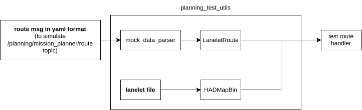
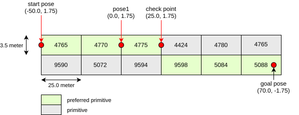

# route handler

`route_handler`はレーンレットマップで運転ルートを計算するためのライブラリです。

## 単体テスト

単体テストは`autoware_test_utils`パッケージに依存しています。
`autoware_test_utils`は単体テストの作成を簡素化するためにいくつかの一般的な関数を提供するライブラリです。

デフォルトでは、テストを作成するためにrouteファイルが必要です。以下は単体テストで使用されるルートを示しています。

### レーンチェンジテストルート

- ルートは`autoware_test_utils\test_map`から取得できるマップに基づいています。

