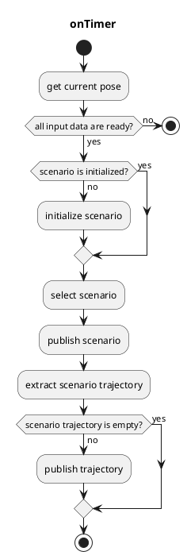
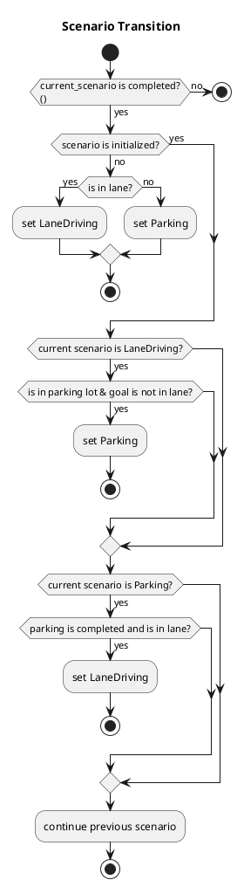

# autoware_scenario_selector

## scenario_selector_node

`scenario_selector_node`は、各シナリオから軌道を切り替えるノードです。

### 入力トピック

| 名前                             | タイプ                             | 説明                                         |
| -------------------------------- | ---------------------------------- | -------------------------------------------- |
| `~input/lane_driving/trajectory` | `autoware_planning_msgs::Trajectory` | LaneDriving シナリオの軌跡                    |
| `~input/parking/trajectory`      | `autoware_planning_msgs::Trajectory` | Parking シナリオの軌跡                      |
| `~input/lanelet_map`             | `autoware_map_msgs::msg::LaneletMapBin` |                                              |
| `~input/route`                   | `autoware_planning_msgs::LaneletRoute` | 経路とゴール (`goal pose`)               |
| `~input/odometry`                | `nav_msgs::Odometry`               | 車両が停車しているかどうかを確認する       |
| `is_parking_completed`           | bool（rosparam として実装）       | Parkingのすべての分割軌跡が公開されているか |

### Outputトピック

| 名称                   | タイプ                               | 説明                                         |
| -------------------- | ------------------------------------ | -------------------------------------------- |
| `~output/scenario`     | tier4_planning_msgs::Scenario      | 現在のシナリオと活性化するシナリオ       |
| `~output/trajectory`   | autoware_planning_msgs::Trajectory | 追従する軌道                                |

### Output TFs

なし

### 起動方法

1. `scenario_selector.launch` にリマッピング情報を書き込むか、`roslaunch` を実行時に引数を追加する
2. `roslaunch autoware_scenario_selector scenario_selector.launch`
   - 1 つのシナリオのみを使用する場合は、`roslaunch autoware_scenario_selector dummy_scenario_selector_{scenario_name}.launch`

### パラメーター

{{ json_to_markdown("planning/autoware_scenario_selector/schema/scenario_selector.schema.json") }}

### フローチャート

