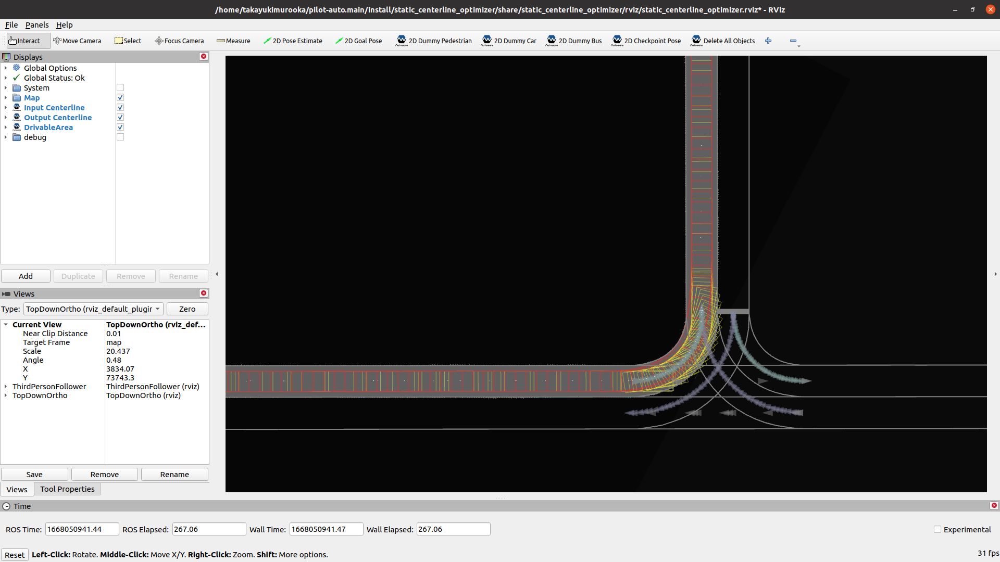
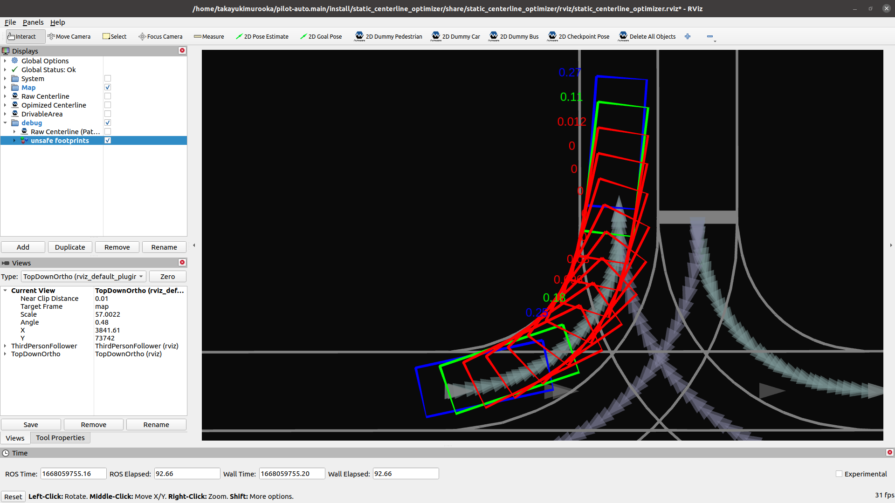

# スタティックセンターラインジェネレーター

## 目的

このパッケージは、運転可能領域内のパスフットプリントを満たすセンターラインを静的に計算します。

狭い道路の運転では、レーンの右側と左側の境界線の間の真ん中の線であるデフォルトのセンターラインは、しばしば運転可能領域の外側のパスフットプリントを引き起こします。運転可能領域内のパスフットプリントを作るために、[オートウェアパスオプティマイザーパッケージ](https://github.com/autowarefoundation/autoware.universe/tree/main/planning/autoware_path_optimizer/)によるオンラインパスシェイプ最適化を使用します。

オンラインパスシェイプ最適化の代わりに、スタティックセンターライン最適化を導入します。このスタティックセンターライン最適化により、次のような利点が得られます。

- 最適化されたセンターラインの形状を事前に見ることができます。
  - デフォルトのオートウェアでは、車両がそこを走行するまでパスの形状は決定されません。
  - これにより、オフラインパスの形状評価が可能になります。
- パスのフットプリントはすでに運転可能領域内にあるため、重くて不安定になる可能性のあるパスの最適化を計算する必要がありません。

## 使用例

センターラインオプティマイザーと通信するためのインターフェースは 2 つあります。

### ベクトルマップビルダーインターフェース

注意: ベクトルマップビルダーのこの機能はまだリリースされていません。しばらくお待ちください。
現時点では、この機能のベクトルマップビルダーの操作に関するドキュメントはありません。

最適化されたセンターラインは、ベクトルマップビルダーの操作から生成できます。

`<vehicle_model>` を指定して次のコマンドで、

- パス計画サーバ
- パス計画サーバとベクトルマップビルダーを接続する HTTP サーバ

を実行できます。


```sh
ros2 launch autoware_static_centerline_generator run_planning_server.launch.xml vehicle_model:=<vehicle-model>
```

FYI、ポート ID はデフォルトで 4010 です。

### コマンド ライン インターフェイス

最適化された中央線は、コマンド ライン インターフェイスから次を指定することで生成できます。

- `<input-osm-path>`
- `<output-osm-path>` (省略可)
- `<start-lanelet-id>`
- `<end-lanelet-id>`
- `<vehicle-model>`


```sh
ros2 launch autoware_static_centerline_generator static_centerline_generator.launch.xml run_backgrond:=false lanelet2_input_file_path:=<input-osm-path> lanelet2_output_file_path:=<output-osm-path> start_lanelet_id:=<start-lane-id> end_lanelet_id:=<end-lane-id> vehicle_model:=<vehicle-model>
```

最適化されたセンターラインの場所を含むデフォルトの出力マップパスは`/tmp/lanelet2_map.osm`です。
出力マップパスを変更したい場合は、`<output-osm-path>`を指定することでパスを再マップできます。

## ビジュアライゼーション

パスプランニングサーバーを起動すると、rvizも同時に次のように起動されます。


- 黄色いフットプリントはosmマップファイルからのオリジナルです。
  - FYI: フットプリントはセンターラインと車両のサイズに基づいて生成されます。
- 赤いフットプリントは最適化されたものです。
- 灰色領域は走行可能な領域です。
- 黄色いフットプリントが外側にあるのに対して、赤いフットプリントは走行可能な領域内にあることがわかります。

### 安全でないフットプリント

場合によっては、最適化されたセンターラインフットプリントが車線の境界線に近づくことがあります。
次の「安全でないフットプリント」マーカーを使用して、その距離を確認できます。

フットプリントの色はその境界線からの距離によって異なり、テキストはその距離を表します。



デフォルトでは、フットプリントの色は次のとおりです。

- 距離が0.1 [m]未満の場合: 赤色
- 距離が0.2 [m]未満の場合: 緑色
- 距離が0.3 [m]未満の場合: 青色

