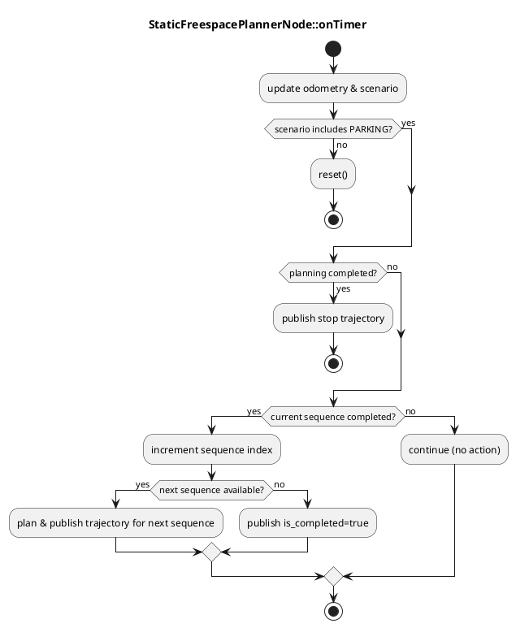

# autoware_static_freespace_planner

The `autoware_static_freespace_planner` is a global path planner node that publishes trajectory in static freespace scenarios (e.g., parking) using predefined routes and CSV waypoints stored under the map directory. Unlike online planners (e.g., Hybrid A\*), this node matches the incoming route to a pre-registered static path and publishes per-sequence trajectories.

## Node

Due to the constraint of trajectory following, the output trajectory will be split to include only the single direction path. In other words, the output trajectory doesn't include both forward and backward trajectories at once.

### Input topics

| Name              | Type                                      | Description                                                 |
| ----------------- | ----------------------------------------- | ----------------------------------------------------------- |
| `~input/route`    | autoware_planning_msgs::msg::LaneletRoute | Provides start_pose and goal_pose for route matching        |
| `~input/odometry` | nav_msgs::msg::Odometry                   | Vehicle pose and velocity; used for arrival and stop checks |
| `~input/scenario` | tier4_planning_msgs::msg::Scenario        | Activating scenarios; node runs only if PARKING is active   |

### Output topics

| Name                   | Type                                    | Description                                                 |
| ---------------------- | --------------------------------------- | ----------------------------------------------------------- |
| `~output/trajectory`   | autoware_planning_msgs::msg::Trajectory | Planned trajectory for the current sequence                 |
| `~output/is_completed` | std_msgs::msg::Bool                     | True when all sequences for the matched route are completed |
| `~/debug/path_marker`  | visualization_msgs::msg::Marker         | Visualization of the current waypoints                      |
| `~/debug/route_name`   | std_msgs::msg::String                   | Name of the matched route                                   |
| `~/output/diagnostics` | diagnostic_msgs::msg::DiagnosticArray   | Diagnostics (e.g., route matching failure)                  |

### Output TFs

- None

### Parameters

| Parameter                    | Type   | Default                                                        | Description                                                   |
| ---------------------------- | ------ | -------------------------------------------------------------- | ------------------------------------------------------------- |
| `static_map_path`            | string | `$(find-pkg-share autoware_static_freespace_planner)/map_path` | Base map directory; must contain `static_path` subdir         |
| `waypoint_search_radius_m`   | double | 2.0                                                            | Search radius for route matching around start/goal poses      |
| `waypoint_yaw_threshold_rad` | double | 0.26                                                           | Yaw threshold for matching waypoints to poses                 |
| `update_rate`                | double | 1.0                                                            | Node timer update rate [Hz]                                   |
| `th_arrived_distance_m`      | double | 1.0                                                            | Distance threshold to consider arrival at end of sequence [m] |
| `th_stopped_time_sec`        | double | 1.0                                                            | Duration window to confirm the vehicle is stopped [s]         |
| `th_stopped_velocity_mps`    | double | 0.1                                                            | Velocity threshold to determine stopped state [m/s]           |

### Flowchart

