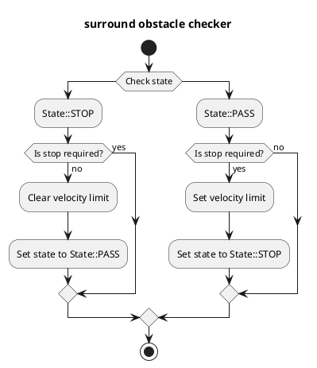
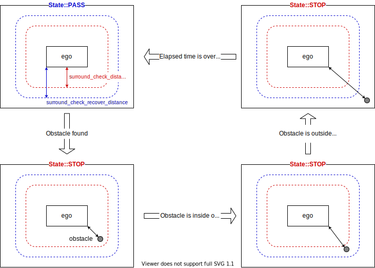

# サラウンドオプスタクルチェッカー

## 目的

このモジュールは、必須データ（自車位置、障害物など）をサブスクライブし、停止条件のいずれかが満たされた場合に停止するようにゼロ速度制限を発行します。

## 内部処理/アルゴリズム

### フローチャート

  

### アルゴリズム

### データの確認

`surround_obstacle_checker` に、地表 pointcloud、動的物体、現在の速度データを受信していないことを確認する。

### 最近の物体との距離の取得

自己車両と最も近い物体の間の距離を計算する。
この関数では、自己車両の多角形と、pointcloud 内のすべての点と、動的物体の多角形との間の最短距離を計算する。

### 停止要件

以下の条件をすべて満たしている場合、停止の計画を行う。

- 自己車両が停止している
- 以下のいずれかの条件を満たす
  1. 最も近い障害物との距離が以下の条件を満たす
     - 状態が `State::PASS` の場合、距離が `surround_check_distance` 未満である
     - 状態が `State::STOP` の場合、距離が `surround_check_recover_distance` 未満である
  2. 1 の条件を満たさない場合、1 の条件を満たしてから経過した時間が `state_clear_time` 未満である

### 状態

チャタリングを防ぐため、`surround_obstacle_checker` は 2 つ状態を管理する。
停止条件のセクションで述べたように、状態に応じて周囲の障害物を見つけるための閾値を変更することでチャタリングを防ぐ。

- `State::PASS` ：停止計画が解除される
- `State::STOP` ：停止計画中

## 入出力

### 入力

| 名前                                         | タイプ                                            | 説明                                                       |
| ------------------------------------------- | ----------------------------------------------- | ---------------------------------------------------------- |
| `/perception/obstacle_segmentation/pointcloud` | `sensor_msgs::msg::PointCloud2`                 | 自車が停止または回避すべき障害物の点群                    |
| `/perception/object_recognition/objects`     | `autoware_perception_msgs::msg::PredictedObjects` | 動的物体                                                  |
| `/localization/kinematic_state`              | `nav_msgs::msg::Odometry`                       | 現在のひねり                                                |
| `/tf`                                        | `tf2_msgs::msg::TFMessage`                        | TF                                                         |
| `/tf_static`                                 | `tf2_msgs::msg::TFMessage`                        | TF（静的）                                              |

### 出力

**自動運転ソフトウェア**

### 概要

このドキュメントでは、Autowareのソフトウェアアーキテクチャについて説明します。Autowareは、自動運転車両用のオープンソースのソフトウェアプラットフォームです。

### システムアーキテクチャ

Autowareのシステムアーキテクチャは、次のコンポーネントで構成されています。

- **Planning (計画)**: 車両の経路と行動を計画するモジュール。
- **Perception (認識)**: 車両の周囲の環境を認識するモジュール。
- **Control (制御)**: 車両の挙動を制御するモジュール。
- **Localization (局所化)**: 車両の自車位置と姿勢を推定するモジュール。

これらのコンポーネントは、ROS（Robot Operating System）と呼ばれる通信インフラストラクチャを介して通信します。

### データフロー

Autowareのデータフローは次のとおりです。

1. **Perceptionモジュール**は、センサデータから車両の周囲の環境を認識します。
2. **Planningモジュール**は、認識された環境情報を基に、車両の経路と行動を計画します。
3. **Controlモジュール**は、Planningモジュールから生成された経路と行動を受け取り、車両の挙動を制御します。
4. **Localizationモジュール**は、車両の自車位置と姿勢を推定し、この情報を他のモジュールに提供します。

### `post resampling`

`post resampling`は、Planningモジュールによって生成された経路が、車両の挙動に適するように調整されるプロセスです。これにより、車両の挙動がより滑らかで、安全になります。

### その他

Autowareのソフトウェアは、C++とPythonで実装されています。このソフトウェアは、Linuxオペレーティングシステムで動作します。

| 名称                                    | 種類                                                    | 説明                                                                            |
| --------------------------------------- | -------------------------------------------------------- | ----------------------------------------------------------------------------------- |
| `~/output/velocity_limit_clear_command` | `tier4_planning_msgs::msg::VelocityLimitClearCommand` | 速度制限クリアコマンド                                                               |
| `~/output/max_velocity`                 | `tier4_planning_msgs::msg::VelocityLimit`             | 速度制限コマンド                                                                   |
| `~/output/no_start_reason`              | `diagnostic_msgs::msg::DiagnosticStatus`              | 開始不可理由                                                                         |
| `~/debug/marker`                        | `visualization_msgs::msg::MarkerArray`                | 可視化用マーカー                                                                     |
| `~/debug/footprint`                     | `geometry_msgs::msg::PolygonStamped`                  | 自車位置のベースフットプリント（可視化用）                                         |
| `~/debug/footprint_offset`              | `geometry_msgs::msg::PolygonStamped`                  | `surround_check_distance` オフセット付きの自車位置フットプリント（可視化用）       |
| `~/debug/footprint_recover_offset`      | `geometry_msgs::msg::PolygonStamped`                  | `surround_check_recover_distance` オフセット付きの自車位置フットプリント（可視化用） |

## パラメータ

{{ json_to_markdown("planning/autoware_surround_obstacle_checker/schema/surround_obstacle_checker.schema.json") }}

| 名前                                     | 型     | 説明                                                                                                                                    | 初期値                                 |
| :-------------------------------------- | :------- | :----------------------------------------------------------------------------------------------------------------------------------------- | :---------------------------------------- |
| `enable_check`                         | `bool`   | チェック対象の障害物に各オブジェクトが考慮されるかどうかを示します。                                                                    | オブジェクトは `true`; 点群は `false` |
| `surround_check_front_distance`      | `bool`   | この前方距離内にオブジェクトまたは点群がある場合、「周囲障害物あり」状態に移行します [m]。                                    | 0.5                                      |
| `surround_check_side_distance`       | `double` | この側方距離内にオブジェクトまたは点群がある場合、「周囲障害物あり」状態に移行します [m]。                                     | 0.5                                      |
| `surround_check_back_distance`       | `double` | この後方距離内にオブジェクトまたは点群がある場合、「周囲障害物あり」状態に移行します [m]。                                     | 0.5                                      |
| `surround_check_hysteresis_distance` | `double` | オブジェクトが `surround_check_xxx_distance` とこの追加距離の合計内に存在しない場合、「周囲障害物なし」状態に移行します [m]。 | 0.3                                      |
| `state_clear_time`                   | `double` | 停止状態を解除する閾値 [s]                                                                                                              | 2.0                                      |
| `stop_state_ego_speed`               | `double` | 自車の停止をチェックする閾値 [m/s]                                                                                                        | 0.1                                      |
| `stop_state_entry_duration_time`     | `double` | 自車の停止をチェックする閾値 [s]                                                                                                          | 0.1                                      |
| `publish_debug_footprints`           | `bool`   | オフセット付き/なしの車両フットプリントをパブリッシュします。                                                                              | `true`                                   |

## 前提条件 / 制限事項

停止計画を実行するには、障害物の点群データを取得する必要があります。
したがって、障害物が死角にある場合は停止計画を行いません。

