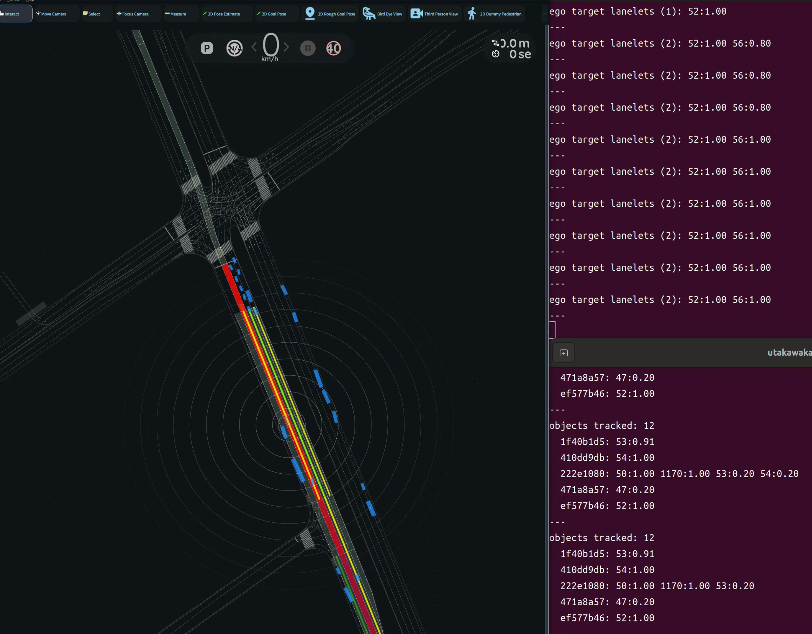

# Target Lanelet Estimator

## Purpose

`Target Lanelet Estimator` estimates which lanelet(s) a vehicle intends to drive on.
It takes the planned route, the vector map and the planner trajectory (e.g. from the Diffusion Planner) and assigns an **independent probability to each route lanelet** that expresses how likely the vehicle is going to drive on it.

The same estimator is run for the **ego** (from its trajectory) and for **surrounding CAR objects** (from their predicted paths), so the node tracks the intended lanelets of nearby vehicles as well.

The estimation follows a recursive Bayesian filter. Because a lane change makes the vehicle straddle two lanelets and the route topic carries no lateral connectivity, the probability is kept per lanelet and the probabilities inside a segment are **not** normalized to sum to one. When the trajectory footprint lies outside every lanelet in the map, the node reports an out-of-lanelet state.

## Inner-workings / Algorithms

The posterior is updated every time a trajectory is received, for the lanelets in the update scope only. The rest of the route keeps its previous probability.

The core `get_target_lanelets` works on a generic pose sequence and a local-frame footprint, so it serves both the ego (trajectory + `vehicle_info` footprint) and other vehicles (predicted path + bounding-box footprint). Each vehicle owns a `LaneletProbabilityTracker` that holds its running `TargetLaneletsResult` and exposes `get_target_lanelets()` / `get_posteriors()`. The node keeps one tracker for the ego and one per surrounding-object UUID, so each object's state persists across frames.

Surrounding objects are filtered to the CAR class, and their most likely predicted path and bounding-box shape drive the estimation. The candidate lanelets for every vehicle are the **ego route** lanelets.

### Update scope

- The segment that contains the ego (the earliest trajectory point on a lanelet) and the next segment.
- The next segment is included only if the trajectory actually reaches it.
- The scope is decided from trajectory **points**, not from the footprint.

### Likelihood

For each trajectory point the vehicle footprint is built and intersected with the lanelet polygon; the likelihood is the maximum overlap-area ratio over all points.

$$L_k(\mathbf{t}_k, l_i) = \max_{\text{points in } \mathbf{t}_k} \frac{\text{intersection area of footprint and lanelet}}{\text{footprint area}}$$

Taking the maximum lets both lanes reach a high likelihood during a lane change.

### Prior

The prior is the previous posterior propagated through a transition model. Within the same segment a small leak probability is used; across segments the transition weight depends on whether the lanelets are connected in the routing graph (`routingRelation`).

### Posterior

$$P_k(l_i \in D \mid \mathbf{t}_k) = \frac{P_k(l_i \in D)\, L_k(\mathbf{t}_k, l_i)}{P_k(l_i \in D)\, L_k(\mathbf{t}_k, l_i) + \left(1 - P_k(l_i \in D)\right)\left(1 - L_k(\mathbf{t}_k, l_i)\right)}$$

## Interfaces

### Parameters

Defined in `config/target_lanelet_estimator.param.yaml`.

| Name                                    | Type   | Default | Description                                                                        |
| --------------------------------------- | ------ | ------- | ---------------------------------------------------------------------------------- |
| `preferred_lanelet_initial_probability` | double | 0.8     | Initial probability of a preferred lanelet                                         |
| `other_lanelet_initial_probability`     | double | 0.2     | Initial probability of a non-preferred lanelet                                     |
| `same_segment_lane_change_probability`  | double | 0.05    | Per-lane leak probability of the transition model within the same segment          |
| `following_transition_weight`           | double | 0.8     | Transition weight to a connected successor lanelet                                 |
| `non_following_transition_weight`       | double | 0.2     | Transition weight to an unconnected lanelet                                        |
| `selection_likelihood_threshold`        | double | 0.001   | A route lanelet is reported as a target when its likelihood exceeds this threshold |
| `out_of_lanelet_search_margin`          | double | 2.0     | [m] Padding of the search box used for the out-of-lanelet check                    |
| `track_objects`                         | bool   | true    | Estimate target lanelets for surrounding CAR objects too                           |
| `target_object_uuid`                    | string | ""      | When set, only this object UUID (hex, no dashes) is tracked, for debugging         |
| `max_tracked_objects`                   | int    | 0       | Cap on the number of tracked objects per cycle (0 = unlimited)                     |

Vehicle dimensions are loaded from `vehicle_info.param.yaml`.

### Subscriptions

| Name                 | Type                                          | Description                  |
| -------------------- | --------------------------------------------- | ---------------------------- |
| `~/input/vector_map` | autoware_map_msgs/msg/LaneletMapBin           | vector map of Lanelet2       |
| `~/input/route`      | autoware_planning_msgs/msg/LaneletRoute       | planned route                |
| `~/input/trajectory` | autoware_planning_msgs/msg/Trajectory         | ego planner trajectory       |
| `~/input/objects`    | autoware_perception_msgs/msg/PredictedObjects | surrounding objects to track |

### Publications

| Name                                    | Type                                                      | Description                                               |
| --------------------------------------- | --------------------------------------------------------- | --------------------------------------------------------- |
| `~/output/target_lanelet_ids`           | autoware_internal_debug_msgs/msg/Int64MultiArrayStamped   | ids of the lanelets overlapped by the trajectory          |
| `~/output/target_lanelet_probabilities` | autoware_internal_debug_msgs/msg/Float64MultiArrayStamped | posterior probability of each target lanelet (same order) |
| `~/output/out_of_lanelet`               | autoware_internal_debug_msgs/msg/BoolStamped              | true when the footprint overlaps no lanelet in the map    |
| `~/debug/route_marker`                  | visualization_msgs/msg/MarkerArray                        | ego per-lanelet probability heatmap                       |
| `~/debug/object_marker`                 | visualization_msgs/msg/MarkerArray                        | per-object per-lanelet probability heatmap                |
| `~/debug/ego_target_text`               | autoware_internal_debug_msgs/msg/StringStamped            | ego target lanelets with probabilities (logging)          |
| `~/debug/object_target_text`            | autoware_internal_debug_msgs/msg/StringStamped            | per-object target lanelets with probabilities (logging)   |

The console logs only brief counts; echo the two `*_target_text` topics (each in its own terminal) for the per-lanelet detail.

## Visualization

Both marker topics color each lanelet by its posterior probability. The ego and objects are drawn in different styles so they stay distinguishable when they share a lanelet:

- **Ego** (`~/debug/route_marker`): the full lanelet width, blue → red. Lanelets the ego trajectory has not reached stay transparent.
- **Objects** (`~/debug/object_marker`): a narrow band down the lanelet center, green → yellow, lifted slightly above the ego fill.

Left: the ego full-width fill (red) with object center bands (green/yellow). Right: the `ego_target_text` and `object_target_text` topics echoed in separate terminals.

## Assumptions / Known limits

- The route topic carries no lateral (left/right) connectivity and does not guarantee that primitives in a segment are adjacent, which is why each lanelet is estimated independently and the probabilities within a segment are not normalized to sum to one.
- The candidate lanelets are the ego route lanelets, for objects too, so a vehicle driving outside the ego route is not tracked.
- The ego probability is updated on every trajectory message, each object on every predicted-objects message.
- This is a temporary package; the deployment target is not yet decided. ROS I/O lives in `node.cpp`, the core estimation (`get_target_lanelets`) in `impl.cpp`, and the per-vehicle state in `tracker.hpp`.
