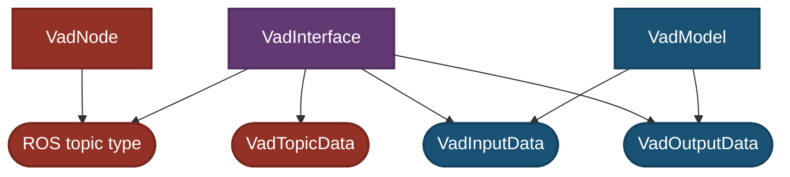
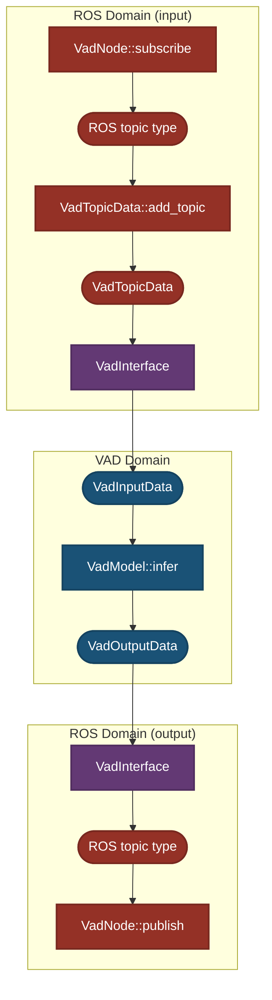

# Design

## ROSの世界とCudaの世界の分離

VADの処理は「ROS/Autowareの世界」と「Cuda/trtによる推論処理の世界」に明確に分離されています。

- **ROS側の責務**:

  - ROS topicのsubscribe/publish
    - 時刻の揃ったcamera画像のsubscribe
  - Autowareとの統合

- Interfaceの責務:

  - input側 - 座標変換 - ROS Topicから`VadInput`への変換処理 - camera画像が揃っていないときの穴埋め処理 - camera id mapping
  - output側 - 座標変換 - `VadOutputData`からROS Topicへの変換処理

- **VAD（Cuda/trt）側の責務**:
  - VADの推論（`infer()`）
  - 前処理済み入力データから推論を行い出力データを生成

インタフェース（`VadInterface`）でAutoweareとVADのTensorRT実装を橋渡ししており、互いの変更の影響を最小限にするように設計されています。

---

## Dependancy Graph

- `VadInterface`: ROS環境とVAD間のインタフェース

- `VadInputData`, `VadOutputData`: 推論処理で使用されるデータ構造

- `VadModel`: CUDA, TensorRTを用いた推論モデル

`VadInterface`はROS側の`VadTopicData`とVAD側のデータである`VadInputData`および`VadOutputData`に依存し、これらのデータ形式間の変換を担います。

`VadModel`はVADドメイン内部の`VadInputData`と`VadOutputData` **のみ** に依存します。

この依存構造により、`VadInterface`がROSの世界とVADの世界の間の緩衝材として機能し、双方の影響と責任範囲を分離して変更の影響を限定します。具体的に言えば，以下のような状態を実現することを期待します．

- ROS・Autoware側に変更が必要な場合(ROS topicの名称・内容変更など)，`VadModel`, `VadInputData`, `VadOutputData` にまったく変更を加えなくても良い
- CUDA, TensorRT側に変更が必要な場合(CUDA, TensorRTのバージョン変更など)，`VadTopicData` にまったく変更を加えなくても良い

---

## 処理フロー図

- トピックの受け取り、座標変換などはI/F(`VadInterface`)で処理。

- 推論部分は完全にVAD内に閉じた形で行われ、結果はROSに再び戻される。

---

## Usecase

### VADに新しいinputを追加する場合

- `VadModel`に新しい入力を追加．onnxを再学習

- `VadInputData`の構造を拡張

- `VadInterface`の入力変換処理を修正

- `VadTopicData`にtopicを追加

- `VadNode`が新しいtopicをsubscribeするように変更

### VADの入力に使う座標変換行列が変更された場合

- Autoware -> VADの座標変換行列は，`VadInterface`のみで使用する
- 座標変換は`VadInterface`で処理しているため、`VadModel`や`Cuda`側に影響はなし

- ROS param fileとして，`vad_interface_param.yaml`を作成する
  - この中に，autoware_to_vad_mappingという項目を作り，以下を格納しておく - camera_id_mapping - transform_lidar
- こうしておくことで，Autoware -> VADの座標変換行列変更，という拡張に対して開いておける

### VADの入力に使うカメラ画像のIDが変更された場合

- VADのcamera画像のid(順番)は，`VadInterface`のみに影響する

- `VadInputData`や`VadModel`には影響しない
- ROS param fileとして，`vad_interface_param.yaml`を作成する
  - この中に，autoware_to_vad_mappingという項目を作り，以下を格納しておく - camera_id_mapping - transform_lidar
- こうしておくことで，camera_id_mapping変更，という拡張に対して開いておける
