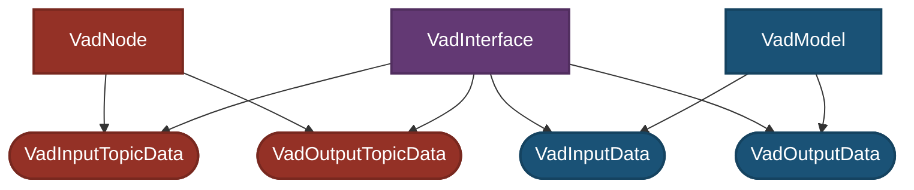

# Design

VAD ROS Node設計時に重要視したconceptについて説明します。

- ROSの領域とCUDAの領域の分離
  - ROS topicの型が変更されても、CUDAを使った実装には影響しない
  - CUDAのversionやinterfaceが変更されても、ROS Nodeには影響しない
- onnxに関係なく変えても良いROS parameterと、onnxに紐付いていてonnxとセットで変更が必要なROS parameterの分離
  - object_class_remapperは、BEVFusionが分離していたので踏襲
- memo
  - `VadInputData`などのデータ型は`data_types.hpp`に記載
  - interfaceの設計: converter
  - networkの設計
    - network_ioと、onnxの入出力tensorの管理に責任を持つ
  - kernelの設計
    - kernelとkernelのwrapper関数(`launch_*_kernel`)はkernel.cuに格納
    - VadModelから呼び出されるためのAPIとリソース管理を`Preprocessor`もしくは`PostProcessor`classが行う
  - 前処理
    - cudaに関係する前処理はVadModel, 関係しない前処理はVadInterface
- coding standard
  - intは使用しない。`int32_t`を使う。
  - 1Byteであることを示すためだけのcharは使用しない。`uint8_t`を使う。
  - `printf`や`cout`は使用せず、`RCLCPP_INFO_THROTTLE`などを使う。

## ROSの世界とCUDAの世界の分離

VADの処理は「ROS/Autowareの世界」と「CUDAによる推論処理の世界」に明確に分離されています。

- **ROS側の責務**:

  - ROS topicのsubscribe/publish
    - topicのdrop, syncの確認
  - Autowareとの結合

- **Interfaceの責務**:

  - input側
    - 座標変換
    - ROS Topicから`VadInputData`への変換処理
    - camera id mapping
  - output側
    - 座標変換
    - `VadOutputData`からROS Topicへの変換処理

- **VAD（CUDA）側の責務**:
  - camera画像の前処理
  - VADの推論
    - `VadInputData`から`VadOutputData`を推論
  - 出力の後処理

インターフェース（`VadInterface`）でAutowareとVADのTensorRT実装を橋渡ししており、互いの変更の影響を最小限にするように設計されています。

---

### Dependancy Graph

- `VadInterface`: ROS環境とVAD間のインターフェース

- `VadInputData`, `VadOutputData`: 推論処理で使用されるデータ構造

- `VadModel`: CUDA, TensorRTを用いた推論モデル

`VadInterface`はROS側の`VadInputTopicData`,`VadOutputTopicData`とVAD側のデータである`VadInputData`および`VadOutputData`に依存し、これらのデータ形式間の変換を担います。

`VadModel`はVADドメイン内部の`VadInputData`と`VadOutputData` **のみ** に依存します。

この依存構造により、`VadInterface`がROSの世界とVADの世界の間の緩衝材として機能し、双方の影響と責任範囲を分離して変更の影響を限定します。具体的に言えば，以下のような状態を実現することを期待します．

- ROS・Autoware側に変更が必要な場合(ROS topicの名称・内容変更など)，`VadModel`, `VadInputData`, `VadOutputData` にまったく変更を加えなくても良い
- CUDA, TensorRT側に変更が必要な場合(CUDA, TensorRTのバージョン変更など)，`VadInputTopicData`,`VadOutputTopicData` にまったく変更を加えなくても良い

---

### 処理フロー図

- トピックの受け取り、座標変換などはインターフェース(`VadInterface`)で処理。

- 推論部分は完全にVAD内に閉じた形で行われ、結果はROSに再び戻される。

---

### 想定Usecase

#### VADに新しいinputを追加する場合

- `VadModel`に新しい入力を追加．onnxを再学習

- `VadInputData`の構造を拡張

- `VadInterface`の入力変換処理を修正

- `VadInputTopicData`にtopicを追加

- `VadNode`が新しいtopicをsubscribeするように変更

#### VADの入力に使うカメラ画像のIDが変更された場合

- camera_id_mapping変更，という拡張に対して開いておく
- VADのcamera画像のid(順番)は，`VadInterface`のみに影響する
  - `VadInputData`や`VadModel`には影響しない
- ROS param file([`ml_package_vad_tiny.param.yaml`](../config/ml_package_vad_tiny.param.yaml))を変更する
