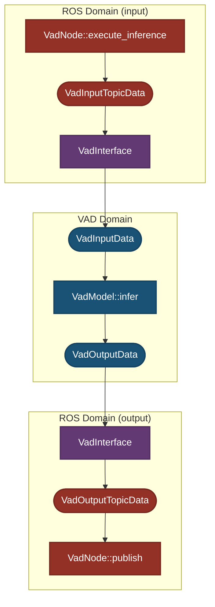

# Design

This document explains the key design concepts of `autoware_tensorrt_vad`.

- [Separation between ROS and CUDA domains](#separation-between-ros-and-cuda-domains)
  - Changes to ROS topic types do not affect CUDA implementations
  - Changes to CUDA versions or interfaces do not affect ROS Nodes
- [Separation between ONNX-dependent and ONNX-independent ROS parameters](#separation-between-onnx-dependent-and-onnx-independent-ros-parameters)
- [Extensible design for Autoware `camera_id` changes](#extensible-design-for-autoware-camera_id-changes)
  - Even if the front camera ID changes from `0` to `1`, it can be handled through parameter changes without major design modifications

## Separation between ROS and CUDA domains

`autoware_tensorrt_vad` is clearly separated into two domains: the "ROS/Autoware domain" (`VadNode`) and the "CUDA domain" (`VadModel`).

- **ROS domain responsibilities**:

  - ROS topic subscription/publication
    - Topic drop and synchronization verification
  - Integration with Autoware

- **Interface responsibilities**:

  - Input processing
    - Coordinate transformation
    - Conversion from ROS Topics (`VadInputTopicData`) to `VadInputData`
      - CUDA-independent preprocessing 
    - Camera ID mapping
  - Output processing
    - Coordinate transformation
    - Conversion from `VadOutputData` to ROS Topics (`VadOutputTopicData`)
      - CUDA-independent postprocessing 

- **CUDA domain responsibilities**:
  - Camera image preprocessing (CUDA-dependent)
  - VAD inference (from `VadInputData` to `VadOutputData`)
  - Output postprocessing (CUDA-dependent)

The interface (`VadInterface`) bridges the ROS domain (`VadNode`) and CUDA domain (`VadModel`), designed to minimize the impact of changes between domains.

---

### Dependency Graph

- `VadInterface`: Interface between ROS and CUDA domains

- `VadInputData`, `VadOutputData`: Data structures used for inference in the CUDA domain (`VadModel`)

- `VadModel`: Inference model using CUDA and TensorRT

`VadInterface` depends on ROS domain data (`VadInputTopicData`, `VadOutputTopicData`) and CUDA domain data (`VadInputData`, `VadOutputData`), handling conversions between these data formats.

`VadModel` depends **only** on `VadInputData` and `VadOutputData` within the CUDA domain.

This dependency structure allows `VadInterface` to function as a buffer between the ROS and CUDA domains, isolating their responsibilities and minimizing the impact of changes. Specifically, this design achieves the following:

- When changes are needed on the ROS/Autoware side (such as ROS topic name/content changes), no changes need to be made to `VadModel`, `VadInputData`, `VadOutputData`
- When changes are needed on the CUDA/TensorRT side (such as CUDA/TensorRT version changes), no changes need to be made to `VadInputTopicData`, `VadOutputTopicData`

---

### Processing Flow Diagram

- Topic conversion and coordinate transformation are handled by the interface (`VadInterface`)

- The inference processing is encapsulated completely within `VadModel`

---

### Expected Use Cases

#### Adding new input to VAD

- Add new input to `VadModel` by retraining ONNX
- Modify `VadNode` to subscribe to new topic
- Add topic to `VadInputTopicData`
- Modify input conversion processing in `VadInterface`
- Add member to `VadInputData`

## Separation between ONNX-dependent and ONNX-independent ROS parameters

- ONNX-dependent parameters are added to [`ml_package_vad_tiny.param.yaml`](../config/ml_package_vad_tiny.param.yaml)
- ONNX-independent ROS parameters are added to [`vad_tiny.param.yaml`](../config/vad_tiny.param.yaml)
  - Object class remapping parameters are added to [`object_class_remapper.param.yaml`](../config/object_class_remapper.param.yaml)
    - Following the precedent of [`autoware_bevfusion`](../../../perception/autoware_bevfusion/README.md)
- Some parameters like `autoware_to_vad_camera_mapping` depend on both ONNX and ROS Node. If a parameter **could affect ONNX**, it is added to [`ml_package_vad_tiny.param.yaml`](../config/ml_package_vad_tiny.param.yaml)

### Expected Use Cases

| Use Case | vad_tiny.param.yaml | ml_package_vad_tiny.param.yaml | object_class_remapper.param.yaml |
|----------|---------------------|------------------------------|--------------------------------|
| ONNX-dependent changes | Modify | Do not modify | Modify only when VAD ONNX output class definitions change |
| ONNX-independent changes | Do not modify | Modify | Modify only when object class definitions in Autoware change |

## Extensible design for Autoware `camera_id` changes

- The design is extensible for changes to `camera_id` used in Autoware
- `camera_id` used in Autoware only affects `VadInterface`
  - It does not affect `VadInputData` or `VadModel`
- Camera ID changes can be handled by modifying only `autoware_to_vad_camera_mapping`

### Expected Use Cases

#### When camera image ID used for VAD input is changed

- Modify `autoware_to_vad_camera_mapping` in the ROS param file ([`ml_package_vad_tiny.param.yaml`](../config/ml_package_vad_tiny.param.yaml))
