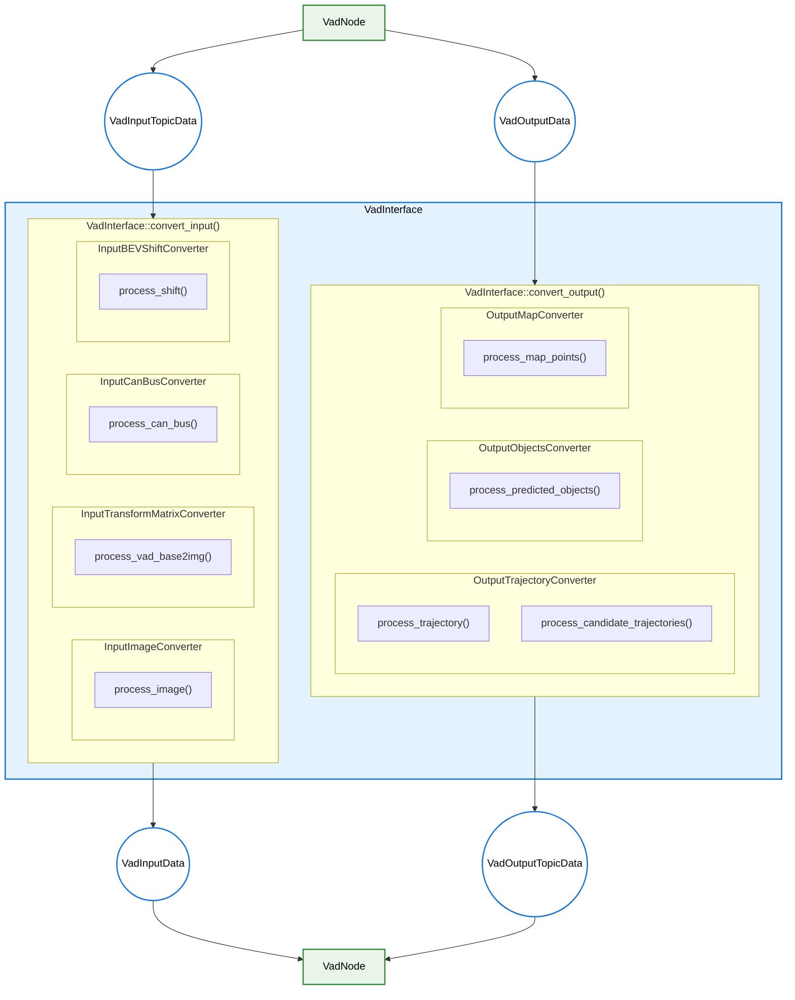

# VadInterface Design

- code: [vad_interface.cpp](../lib/vad_interface.cpp) [vad_interface.hpp](../include/autoware/tensorrt_vad/vad_interface.hpp)

## Responsibilities

- Convert from `VadInputTopicData` to `VadInputData`, and from `VadOutputData` to `VadOutputTopicData`

  - Transform coordinate system by [`CoordinateTransformer`](../include/autoware/tensorrt_vad/coordinate_transformer.hpp)
  - Convert input data
    - Convert input images by [`InputImageConverter`](../include/autoware/tensorrt_vad/input_converter/image_converter.hpp)
    - Convert input transform matrix by [`InputTransformMatrixConverter`](../include/autoware/tensorrt_vad/input_converter/transform_matrix_converter.hpp)
    - Convert input odometry adata by [`InputCanBusConverter`](../include/autoware/tensorrt_vad/input_converter/can_bus_converter.hpp) and [`InputBEVShiftConverter`](../include/autoware/tensorrt_vad/input_converter/bev_shift_converter.hpp)
  - Convert output data
    - Convert output planning trajectory by [`OutputTrajectoryConverter`](../include/autoware/tensorrt_vad/output_converter/trajectory_converter.hpp)
    - Convert output predicted objects by [`OutputObjectsConverter`](../include/autoware/tensorrt_vad/output_converter/objects_converter.hpp)
    - Convert output map markers by [`OutputMapConverter`](../include/autoware/tensorrt_vad/output_converter/map_converter.hpp)

- Responsible for preprocessing and postprocessing that use only CPU (does not use CUDA).

## Processing Flowchart

### Function Roles

### API functions(public)

- `VadNode` calls `convert_input()` before inference and `convert_output()` after inference.

- [`convert_input()`](../include/autoware/tensorrt_vad/vad_interface.hpp): Convert from `VadInputTopicData` to `VadInputData`
  - Image processing is handled by [`InputImageConverter::process_image()`](../include/autoware/tensorrt_vad/input_converter/image_converter.hpp)
  - Transform matrix processing is handled by [`InputTransformMatrixConverter::process_vad_base2img()`](../include/autoware/tensorrt_vad/input_converter/transform_matrix_converter.hpp)
  - Odometry data processing is handled by [`InputCanBusConverter::process_can_bus()`](../include/autoware/tensorrt_vad/input_converter/can_bus_converter.hpp) and [`InputBEVShiftConverter::process_shift()`](../include/autoware/tensorrt_vad/input_converter/bev_shift_converter.hpp)
- [`convert_output()`](../include/autoware/tensorrt_vad/vad_interface.hpp): Convert from `VadOutputData` to `VadOutputTopicData`
  - Trajectory processing is handled by [`OutputTrajectoryConverter::process_trajectory()`](../include/autoware/tensorrt_vad/output_converter/trajectory_converter.hpp) and [`OutputTrajectoryConverter::process_candidate_trajectories()`](../include/autoware/tensorrt_vad/output_converter/trajectory_converter.hpp)
  - Object processing is handled by [`OutputObjectsConverter::process_predicted_objects()`](../include/autoware/tensorrt_vad/output_converter/objects_converter.hpp)
  - Map processing is handled by [`OutputMapConverter::process_map_points()`](../include/autoware/tensorrt_vad/output_converter/map_converter.hpp)

## TODO

- The name "CanBus" is used even though data is not obtained from CAN BUS. This naming convention prioritizes conformity with [the notation used in VAD code](https://github.com/hustvl/VAD/blob/36047b6b5985e01832d8a2ecb0355d7f3c753ee1/projects/mmdet3d_plugin/datasets/nuscenes_vad_dataset.py#L1375-L1382). However, this could cause confusion, so a better name should be considered.
