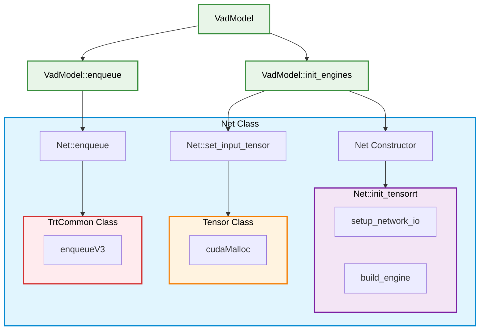
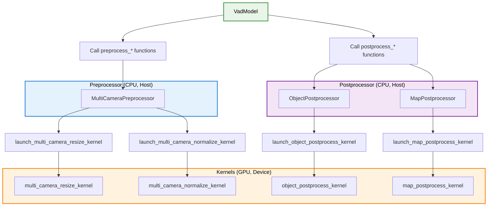

# VadModel Design

- code: [vad_model.hpp](../include/autoware/tensorrt_vad/vad_model.hpp)

## Responsibilities

- Responsible for CUDA-based processing.
- Receives `VadInputData`, executes inference, and returns `VadOutputData`.
- Preprocesses images using CUDA and transfers data from Host (CPU) to Device (GPU).
- Transfers data from Device (GPU) to Host (CPU) and postprocesses using CUDA.

## Processing Flowchart

```mermaid
flowchart TD
    Start([VadNode calls VadModel::infer]) --> VadInputDataBox((VadInputData))
    VadInputDataBox --> LoadInputs

    subgraph InferScope["VadModel::infer()"]
        LoadInputs[load_inputs: Preprocess input data and transfer from CPU to GPU]
        LoadInputs --> Enqueue[enqueue: Execute TensorRT inference]
        Enqueue --> SavePrevBev[save_prev_bev: Transfer prev_bev from GPU to CPU for next frame]
        SavePrevBev --> Postprocess[postprocess: Postprocess output and transfer from GPU to CPU]

        Postprocess --> CheckFirstFrame{Is first frame?}

        CheckFirstFrame -->|Yes| ReleaseNetwork[release_network: Release first-frame-only ONNX]
        ReleaseNetwork --> LoadHead[load_head: Load head ONNX that uses previous frame's BEV features]
        LoadHead --> ReturnText[return]

        CheckFirstFrame -->|No| ReturnText
    end

    ReturnText --> VadOutputDataBox((VadOutputData))



    style InferScope fill:#e1f5fe,stroke:#0288d1,stroke-width:2px,color:#000000
    style CheckFirstFrame fill:#fff3e0,stroke:#f57c00,stroke-width:2px,color:#000000
    style ReleaseNetwork fill:#ffebee,stroke:#d32f2f,stroke-width:2px,color:#000000
    style LoadHead fill:#e8f5e8,stroke:#388e3c,stroke-width:2px,color:#000000

    %% Links to source code files
    click Start "https://github.com/autowarefoundation/autoware_universe/tree/main/planning/autoware_tensorrt_vad/include/autoware/tensorrt_vad/vad_node.hpp" "VadNode header file"
    click VadInputDataBox "https://github.com/autowarefoundation/autoware_universe/tree/main/planning/autoware_tensorrt_vad/include/autoware/tensorrt_vad/data_types.hpp" "VadInputData definition"
    click LoadInputs "https://github.com/autowarefoundation/autoware_universe/tree/main/planning/autoware_tensorrt_vad/include/autoware/tensorrt_vad/vad_model.hpp" "VadModel implementation"
    click Enqueue "https://github.com/autowarefoundation/autoware_universe/tree/main/planning/autoware_tensorrt_vad/include/autoware/tensorrt_vad/vad_model.hpp" "VadModel implementation"
    click SavePrevBev "https://github.com/autowarefoundation/autoware_universe/tree/main/planning/autoware_tensorrt_vad/include/autoware/tensorrt_vad/vad_model.hpp" "VadModel implementation"
    click Postprocess "https://github.com/autowarefoundation/autoware_universe/tree/main/planning/autoware_tensorrt_vad/include/autoware/tensorrt_vad/vad_model.hpp" "VadModel implementation"
    click ReleaseNetwork "https://github.com/autowarefoundation/autoware_universe/tree/main/planning/autoware_tensorrt_vad/include/autoware/tensorrt_vad/vad_model.hpp" "VadModel implementation"
    click LoadHead "https://github.com/autowarefoundation/autoware_universe/tree/main/planning/autoware_tensorrt_vad/include/autoware/tensorrt_vad/vad_model.hpp" "VadModel implementation"
    click VadOutputDataBox "https://github.com/autowarefoundation/autoware_universe/tree/main/planning/autoware_tensorrt_vad/include/autoware/tensorrt_vad/data_types.hpp" "VadOutputData definition"
```

### Function Roles

### API functions(public)

- [`infer()`](../include/autoware/tensorrt_vad/vad_model.hpp): Receives `VadInputData`, preprocesses images using CUDA, transfers data from Host (CPU) to Device (GPU), executes TensorRT engine, transfers data from Device (GPU) to Host (CPU), postprocesses using CUDA, and returns `VadOutputData`. Called from `VadNode`. Returns `std::nullopt` if inference fails.

### Internal functions(private)

- [`load_head()`](../include/autoware/tensorrt_vad/vad_model.hpp): VAD takes previous frame's BEV features (`prev_bev`) as input. However, for the first frame, no previous BEV features exist, so it uses a special ONNX designed only for the first frame execution. After the first frame inference is completed, `load_head()` loads the head ONNX that uses previous frame's BEV features as input.

- [`save_prev_bev()`](../include/autoware/tensorrt_vad/vad_model.hpp): Transfers `prev_bev` from Device (GPU) to Host (CPU) and saves it for the next frame's inference. The return value is stored in the `VadModel` member variable `saved_prev_bev_`.

### Design concepts

#### Logger

- We don't want `VadModel` to depend on ROS.
- However, we want `VadModel`'s logging functionality to be consistent with `VadNode` and `VadInterface`, using `RCLCPP_INFO_THROTTLE`.
- Therefore, we define an abstract base class called [`VadLogger`](../include/autoware/tensorrt_vad/ros_vad_logger.hpp), and `VadModel` receives `LoggerType` as a template parameter.
- [`RosVadLogger`](../include/autoware/tensorrt_vad/ros_vad_logger.hpp) inherits from [`VadLogger`](../include/autoware/tensorrt_vad/ros_vad_logger.hpp) and performs log output using actual ROS 2 logging macros such as `RCLCPP_INFO_THROTTLE`.
- This design allows `VadModel` to utilize logging functionality without directly depending on ROS 2.
- To provide this flexibility, `VadModel` is designed as a template class, which requires all implementation to be written in the header file(.hpp). This is a C++ template constraint where template definitions must be available to all translation units that instantiate the template.

#### Network classes

- Each ONNX file corresponds to one `Net` class. The `Net` class uses [`autoware_tensorrt_common`](../../../perception/autoware_tensorrt_common/README.md) to build and execute TensorRT engines.
- `cudaMalloc` and `cudaMemcpyAsync` operations for Input/output are executed using the [`Tensor`](../include/autoware/tensorrt_vad/networks/tensor.hpp) class.

##### Network classes: API functions

- Constructor
  - [`init_tensorrt`](../include/autoware/tensorrt_vad/networks/net.hpp): Called from `VadModel::init_engines`
    - setup_network_io
      - Implemented in [`Backbone`](../include/autoware/tensorrt_vad/networks/backbone.hpp) and [`Head`](../include/autoware/tensorrt_vad/networks/head.hpp) respectively
      - Sets input and output sizes and names
    - [`build_engine`](../include/autoware/tensorrt_vad/networks/net.hpp)
      - Creates instances of [`TrtCommon`](../../../perception/autoware_tensorrt_common/include/autoware/tensorrt_common/tensorrt_common.hpp) and [`NetworkIO`](../../../perception/autoware_tensorrt_common/include/autoware/tensorrt_common/utils.hpp) classes
- set_input_tensor: Called from `VadModel::init_engines`
  - Executes `cudaMalloc` to allocate memory for input/output tensors on Device (GPU)
    - `cudaMalloc` itself is executed in [`Tensor`](../lib/networks/tensor.cpp) class constructor.
- enqueue: Called from `VadModel::enqueue`
  - Executes TensorRT inference through [`TrtCommon`](../../../perception/autoware_tensorrt_common/include/autoware/tensorrt_common/tensorrt_common.hpp).
    - Currently uses `enqueueV3`, but the enqueue version needs to be changed if TensorRT version is updated.

#### CUDA Preprocessor and Postprocessor classes

- Preprocessor and Postprocessor classes are wrapper classes for CUDA kernels. Preprocessor and Postprocessor classes have `preprocess_*` or `postprocess_*` functions. By calling these functions from `VadModel`, preprocessing and postprocessing are executed.
  - Image preprocessing is handled by [`MultiCameraPreprocessor`](../include/autoware/tensorrt_vad/networks/preprocess/multi_camera_preprocess.hpp)
  - Predicted Object postprocessing is handled by [`ObjectPostprocessor`](../include/autoware/tensorrt_vad/networks/postprocess/object_postprocess.hpp)
  - Map postprocessing is handled by [`MapPostprocessor`](../include/autoware/tensorrt_vad/networks/postprocess/map_postprocess.hpp)
- `preprocess_*` or `postprocess_*` functions call `launch_*_kernel` functions. These functions determine the block size within the grid and the thread size within the block, and launch CUDA kernels.
  - Image preprocessing kernel is launched in [`launch_multi_camera_resize_kernel`](../lib/networks/preprocess/multi_camera_preprocess_kernel.cu) and [`launch_multi_camera_normalize_kernel`](../lib/networks/preprocess/multi_camera_preprocess_kernel.cu)
  - Predicted Object postprocessing kernel is launched in [`launch_object_postprocess_kernel`](../lib/networks/postprocess/object_postprocess_kernel.cu)
  - Map postprocessing kernel is launched in [`launch_map_postprocess_kernel`](../lib/networks/postprocess/map_postprocess_kernel.cu)

## TODO

- Use `prev_bev` without transferring from Device (GPU) to Host (CPU).
- Quantization: float is used for inference now, but using integer would enable faster and more memory-efficient inference.
