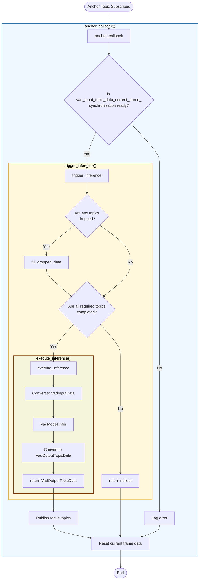

# VadNode Design

- code: [vad_node.cpp](../src/vad_node.cpp), [vad_node.hpp](../include/autoware_tensorrt_vad/vad_node.hpp)

## 責務

- ROS topicをsubscribeしてcallback関数を実行し、`VadInputTopicData`に詰め込む

## 処理のflowchart

- `execute_inference`と`trigger_inference`の違い
  - `trigger_inference`: データの同期チェックと前処理を担当
  - `execute_inference`: 実際のVAD推論処理を実行

## TODO

- subscribeする際にcallbackを使いすぎず、takeを用いる
- ROS parameterからのconfigの作成、publisherとsubscriberの作成、callback関数、inferenceのtriggerとexecute、publishといろいろなことを行っている。読みづらくなってきた場合は、それぞれの責務ごとにclassを分割する必要がある。
