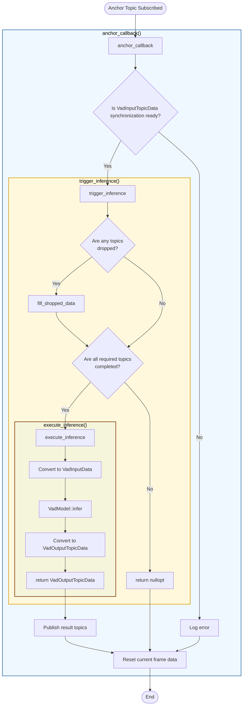

# VadNode Design

- code: [vad_node.cpp](../src/vad_node.cpp), [vad_node.hpp](../include/autoware_tensorrt_vad/vad_node.hpp)

## 責務

- ROS topicをsubscribeしてcallback関数を実行し、`VadInputTopicData`に詰め込む

## 処理のflowchart

### 関数の役割と実装

- [`anchor_callback()`](../src/vad_node.cpp): anchor topic(最後にsubscribeされる画像topic)を受け取った際に起動するcallback
- [`trigger_inference()`](../src/vad_node.cpp): データの同期チェックをし、inference処理をtrigger
- [`execute_inference()`](../src/vad_node.cpp): VADのinference処理を実行。`VadInputTopicData`から`VadOutputTopicData`を推論する。
- [`publish()`](../src/vad_node.cpp): 推論結果をROS topicとしてpublish

## TODO

- subscribeする際にcallbackを使いすぎず、takeを用いる
- ROS parameterからのconfigの作成、publisherとsubscriberの作成、callback関数、inferenceのtriggerとexecute、publishといろいろなことを行っている。読みづらくなってきた場合は、それぞれの責務ごとにclassを分割する必要がある。
