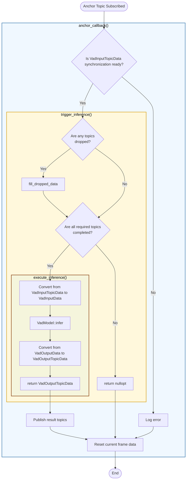

# VadNode Design

- code: [vad_node.cpp](../src/vad_node.cpp), [vad_node.hpp](../include/autoware/tensorrt_vad/vad_node.hpp)

## Responsibilities

- Subscribe to ROS topics, execute callback functions, and pack data into `VadInputTopicData`
- Check if inference can be executed, execute inference, obtain `VadOutputTopicData`, and publish
- Read ROS parameters and create configs for `VadInterface` and `VadModel`

## Processing Flowchart

- Synchronization checking is handled by [`SynchronizationStrategy`](../include/autoware/tensorrt_vad/synchronization_strategy.hpp).
- Convert from `VadInputTopicData` to `VadInputData`, and from `VadOutputData` to `VadOutputTopicData` are handled by [`VadInterface`](../include/autoware/tensorrt_vad/vad_interface.hpp).

### Function Roles

- [`anchor_callback()`](../src/vad_node.cpp): Callback triggered when receiving the anchor topic (the last subscribed image topic)
- [`trigger_inference()`](../src/vad_node.cpp): Checks data synchronization and triggers inference
- [`execute_inference()`](../src/vad_node.cpp): Executes VAD inference. Infers `VadOutputTopicData` from `VadInputTopicData`
- [`publish()`](../src/vad_node.cpp): Publishes inference results as ROS topics

## TODO

- Excessive use of callbacks when subscribing can increase CPU usage. Use callbacks only when it's necessary to react to topic reception, otherwise use `Subscription->take()`.
- This class has many responsibilities: creating config from ROS parameters, creating publishers and subscribers, callback functions, triggering and executing inference, and publishing. If readability becomes poor, it should be split into separate classes by responsibility.
- Add [`SynchronizationStrategy`](../include/autoware/tensorrt_vad/synchronization_strategy.hpp) other than FrontCritical
  - e.g. Consider synchronized when the front 3 images are available
