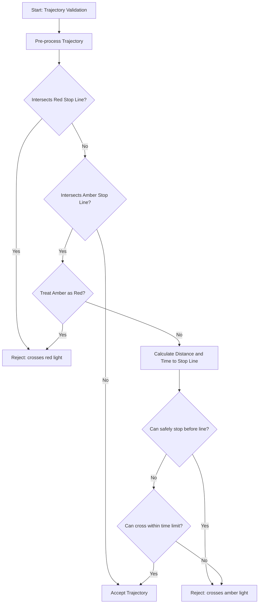

# Traffic Light Filter

## Purpose/Role

This filter rejects trajectories if they are found to run through a red or amber traffic light. It ensures that the planned motion adheres to traffic signals by validating that the vehicle does not cross stop lines when the signal is prohibitive, while accounting for the "dilemma zone" during amber lights.

## Algorithm Overview

The filter decides whether to reject a trajectory based on the following steps:

1. **Trajectory Pre-processing**:
   - Filters out points behind the ego vehicle.
   - Trims the trajectory at the first point where velocity is zero or negative.
   - Extends the trajectory's visual representation by the vehicle's longitudinal offset (front of the vehicle) to ensure the front bumper is checked against stop lines.
2. **Stop Line Identification**:
   - Searches for lanelets intersecting the trajectory's bounding box.
   - Retrieves red and amber stop lines associated with these lanelets based on the current traffic light signals.
   - If `treat_amber_light_as_red_light` is enabled, all amber stop lines are treated as red stop lines.
3. **Red Light Validation**:
   - If any part of the trajectory intersects a red stop line, the trajectory is rejected immediately.
4. **Amber Light Validation**:
   - If the trajectory crosses an amber stop line, the filter calculates the distance to the intersection and the time at which the ego vehicle is expected to cross it.
   - It then applies the [Amber Light Logic](#amber-light-logic) to determine if the crossing is permissible.

### Decision Flow

### Amber Light Logic

The logic for amber lights handles the "dilemma zone" where a vehicle might be too close to stop safely but needs to clear the intersection. The filter uses the `can_pass_amber_light` function:

1. **Stopping Distance ($D_{stop}$)**: Calculated using current velocity, acceleration, and configured limits (`deceleration_limit`, `jerk_limit`, `delay_response_time`).
2. **Stop Check**: If $D_{stop} \le \text{Distance to Stop Line}$, the vehicle is considered able to stop safely. In this case, crossing the amber light is **rejected**.
3. **Passing Check**: If the vehicle cannot stop safely, it checks if it can clear the stop line within a `crossing_time_limit`. If it can, the trajectory is **accepted**.
4. **Final Decision**: A trajectory is only accepted through an amber light if the vehicle **cannot** safely stop AND **can** cross within the time limit.

## Interface

### Context

The filter utilizes the following data from the `FilterContext`:

- **Lanelet Map**: Used to find regulatory elements (traffic lights) and their associated stop lines.
- **Traffic Light Signals**: Provides the current state (color) of traffic light groups.
- **Vehicle Info**: Used to account for the vehicle's dimensions (longitudinal offset) when checking for stop line intersections.

### Parameters

| Parameter name                                 | Type   | Default | Description                                                                                                       |
| ---------------------------------------------- | ------ | ------- | ----------------------------------------------------------------------------------------------------------------- |
| `traffic_light.deceleration_limit`             | double | 2.8     | [m/s²] Deceleration limit used to estimate the minimum stopping distance at an amber light.                       |
| `traffic_light.jerk_limit`                     | double | 5.0     | [m/s³] Jerk limit used to estimate the minimum stopping distance at an amber light.                               |
| `traffic_light.delay_response_time`            | double | 0.5     | [s] Delay response time added to the stopping distance calculation.                                               |
| `traffic_light.crossing_time_limit`            | double | 2.75    | [s] Maximum time allowed for the ego vehicle to cross the stop line after an amber light appears.                 |
| `traffic_light.treat_amber_light_as_red_light` | bool   | true    | When true, amber lights are treated identically to red lights (rejection on intersection regardless of distance). |
