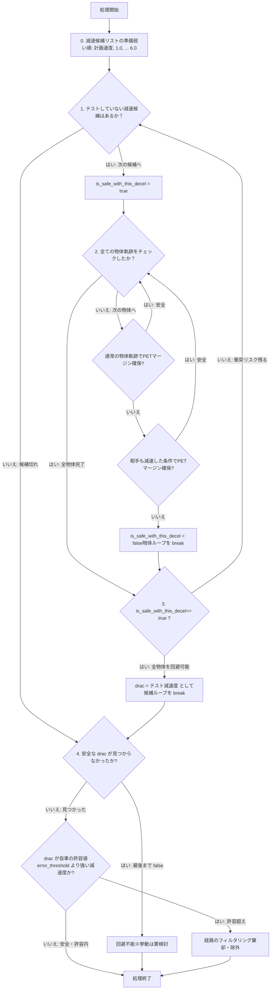
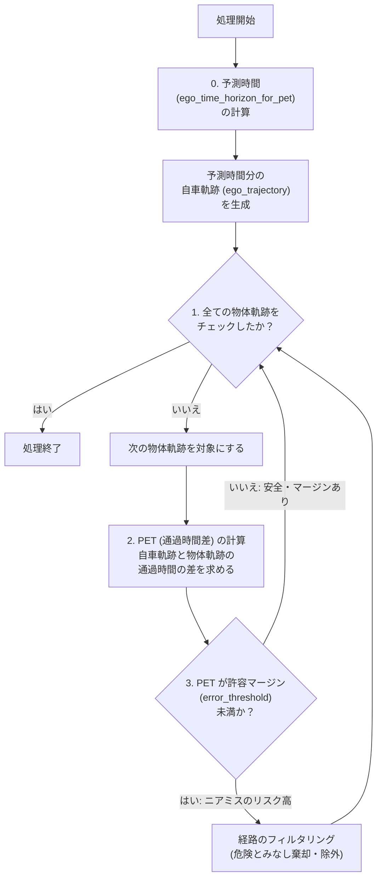
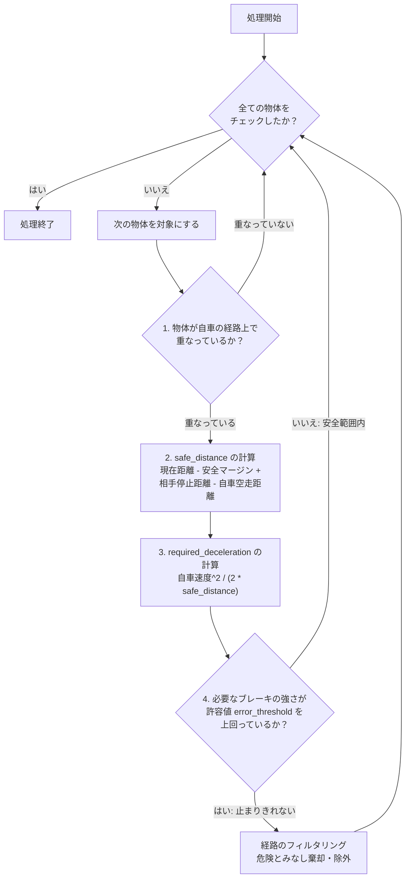

# Collision Check Filter

本ファイルは、開発者同士が疑似コードやフローチャートを共有することを目的としています。


## DRAC+PET
略語としてのDRACは1次元での相対距離と相対速度から、衝突を回避するための減速度を v^2/(2x)を計算するものであるが、
ここでは、異なる方向に進行する物体も含めて、文字通り、”衝突回避に必要な減速度”を計算する方向で設計実装を行っている。


### 処理手順（要約）
「衝突を避けるために、自車がどれだけ減速すべきか」を、PET（通過時間差）を用いて段階的に探索・特定する処理です。

* **0. 準備：** 評価対象となる減速度のリスト（計画速度、1.0～6.0 m/s²など）を、値の小さい（弱いブレーキ）順に用意する。
* **1. 候補の選択：** リストから「テスト減速度」を1つ選び、安全に避けられると仮定して全物体の軌跡チェックを開始する。
* **2. 衝突リスクの確認：** 各物体に対し、「物体が予測通りに動いた場合」または「物体も同等に減速した場合」のいずれかで十分なPETマージンが確保できるか判定する。
    * どちらも危険な場合はテスト失敗とし、次の強い減速度候補へ進む。
* **3. DRACの決定：** 全ての物体に対して安全が確認できた最初の（最小の）テスト減速度を「DRAC」として確定し、探索ループを終了する。
* **4. 最終判定と対処：**
    * **回避不能：** 用意した全ての減速度を試しても安全が確保できない場合。
    * **経路の棄却：** 確定したDRACが、自車の許容する減速度（閾値）を上回っている場合は危険とみなし、その経路を除外する。

### 疑似コード

```text
// DRAC+PET は、「衝突を避けるには自車/他車にどれだけの減速度が必要か」を
// PET ベースの衝突判定を使って段階的に探索する

// 0. 評価に使う準備
// DRAC+PET: 「衝突を避けるための必要減速度（DRAC）」を、PETを用いて段階的に探索する
// （※評価時間は、自車の計画軌跡の終端時刻までとする）

// 0. 評価する減速度の候補を準備
減速候補リスト = [計画通りの速度, 1.0, 2.0, 3.0, 4.0, 5.0, 6.0] // 単位: m/s^2

// 1. 減速度の小さい（弱い）候補から順に評価していく
for (テスト減速度 in 減速候補リスト) {
    
    is_safe_with_this_decel = true // 一旦、「この減速度で安全に避けられる」と仮定する

    // 2. この「テスト減速度」で、全ての物体との衝突リスクが消えるかを確認する
    for (各物体軌跡 in 全ての物体の予測経路) {

        // 物体が「予測どおり動いた場合」または「自車と同じだけ減速してくれた場合」の
        // どちらかで十分なPETマージン（通過時間差）が確保できれば、この物体に対しては安全
        if (通常の物体軌跡で十分なPETマージンが確保できる) { continue }
        if (相手も減速した条件で十分なPETマージンが確保できる) { continue }

        // どちらの条件でも衝突リスクが残るなら、この「テスト減速度」では回避に足りない
        is_safe_with_this_decel = false
        break // この減速度での確認を打ち切り、次の（より強い）減速候補のテストへ進む
    }

    // 3. 全ての物体との衝突候補が消えた場合、それをDRACとして採用
    if (is_safe_with_this_decel == true) {
        drac = テスト減速度
        break // 最小の必要減速度（DRAC）が見つかったので、探索ループを終了する
    }
}

// 4. 危険判定と対処
if (最後まで安全な drac が見つからなかった) {
    回避不能 // ※この場合の挙動は要検討
} 
else if (drac が $error_threshold.ego_acceleration よりも強い減速度) {
    // 必要な減速度が見つかったが、自車の許容値（閾値）を上回っている場合
    経路のフィルタリング // この経路は危険とみなし、棄却・除外する
}
```




## PET+TTC 計画速度で進行した際に、制動距離内でニアミスするリスクがあるかを判定

### 処理手順（要約）
自車が計画通りの速度で進行した際に、制動距離内で他車とニアミスするリスクがないかを判定する処理です。

* **0. 予測軌跡の準備：** 現在の自車速度、想定減速度、ブレーキ遅れ時間を基に「予測時間」を算出し、その時間分の自車の未来軌跡を生成する。
* **1. 評価対象のループ：** 生成済みの各物体の予測経路に対して、順番に衝突リスクの評価を行う。
* **2. PET（通過時間差）の計算：** 自車と物体が交差する地点において、どちらが先に通過する場合でも、それぞれの通過時間の差（PET）を計算する。
* **3. 危険判定と対処：** 算出されたPETが許容マージン（閾値）を下回る場合はニアミスのリスクが高いと判断し、該当する経路を危険とみなし棄却・除外する。

### 疑似コード

```text
// ※現状は一部の判定や経路の棄却処理が is_feasible() 側にあるが、
//   ここでは Planned Speed Collision Timing として担いたい役割の流れを示す

// 0. PET（通過時間差）評価用の自車軌跡を準備する
// （※現在の速度・想定減速度・ブレーキ遅れ時間から、何秒先までの未来を予測するかを決める）
ego_time_horizon_for_pet =
    ( 自車速度 * 0.5 / |pet_collision_params.ego_assumed_acceleration| )
    + pet_collision_params.ego_total_braking_delay

// 上で求めた時間（ego_time_horizon_for_pet）の分だけ、自車が「計画どおりに行動した」場合の未来の軌跡を生成する
ego_trajectory = 生成(ego_time_horizon_for_pet 先までの自車の軌跡)


// 1. 生成済みの各物体軌跡に対して、PETベースの衝突リスクを評価する
for (各物体軌跡 in 全ての物体の評価したい予測経路) {

    // 2. 自車と物体が「ほぼ同じ場所を、どれらいの危険な時間差で通るか」を調べる
    // （※交差地点に対して、自車が先に通る場合と、物体が先に通る場合の両方を計算する）
    pet = 自車軌跡(ego_trajectory)と物体軌跡の通過時間差

    // 3. 危険判定と対処
    // 通過時間差が許容マージン（error閾値）以下なら、ニアミスのリスクが高いと判断する
    if (pet < pet_collision_params.error_threshold) {
        経路のフィルタリング // この経路は危険とみなし、棄却・除外する
    }
}
```


### フローチャート



## RSS 自車の通過領域にいる物体が急停止した際に、衝突前に停止できるかを判定

### 処理手順（要約）

自車の進路上にいる物体が急停止した際、衝突前に安全に停止できるかを判定する処理です。

* **1. 進路のチェック： 周囲の全物体を確認し、自車の将来の経路（通過領域）に重ならない物体は安全としてスキップする。
* **2. 実質的な距離（Safe Distance）の計算： 現在の距離に「相手が停止するまでに進む距離」を足し、そこから「自車の空走距離」と「安全マージン」を引くことで、実質的にブレーキに使える距離を算出する。
* **3. 必要減速度の計算： 現在の自車速度と算出した「実質的な距離」から、安全に止まるために必要なブレーキの強さ（減速度）を算出する。
* **4. 危険判定と対処： 計算された必要な減速度が自車の許容値（閾値）を上回っている場合は、物理的に止まりきれないと判断し、その経路を棄却・除外する。

### 疑似コード

```text
// 周囲の全ての物体に対して、衝突危険性をチェックする
for (各物体 in 全ての物体) {

    // 1. 進路のチェック
    if (物体が自車の経路上で重ならない) {
        continue // 危険がないため、次の物体のチェックへ進む
    }

    // 2. ブレーキに使える距離の計算
    // （※相手の速度や、システムの遅れ時間などを加味して見積もる）
    現在の距離 = 自車から物体までの間隔
    相手の停止距離 = 相手が急ブレーキをかけて止まるまでに進む距離
                    (物体速度^2 / (2 * object_assumed_acceleration))
    自車の空走距離 = 自車のブレーキが効き始めるまでに進んでしまう距離
                    (自車速度 * $ego_total_braking_delay)
    安全マージン = 停止時に最低限あけておくべき余裕距離
                  ($stop_distance_margin)

    // 実際にブレーキをかけるために使える「実質的な距離」
    safe_distance =
        現在の距離
        - 安全マージン
        + 相手の停止距離
        - 自車の空走距離

    // 3. 必要なブレーキの強さ（減速度）の計算
    required_deceleration = (自車速度^2) / (2 * safe_distance)

    // 4. 危険判定と対処
    if (required_deceleration > error_threshold.ego_acceleration) {
        // 必要なブレーキの強さが自車の許容値（閾値）を上回っている場合、安全に止まりきれない
        経路のフィルタリング // この経路は危険とみなし、棄却・除外する
    }
}
```

### フローチャート


