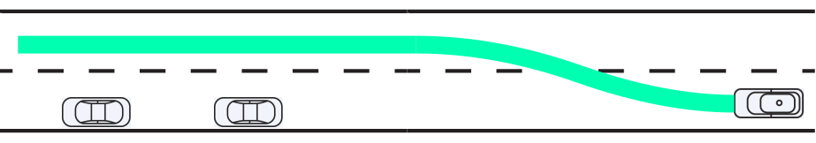
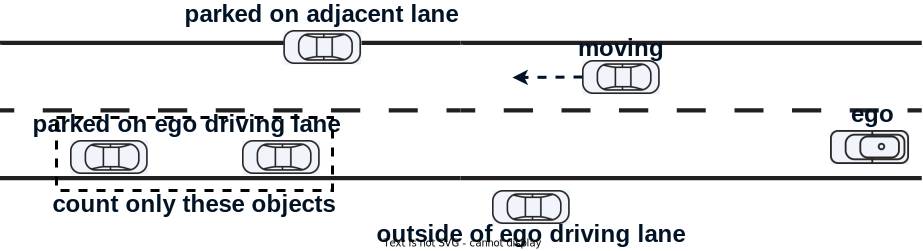
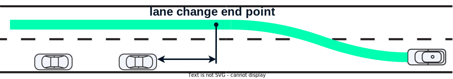

# 車線変更による回避設計

これは車線変更動作によって障害物を回避するためのサブモジュールです。

## 目的/役割

このモジュールは障害物回避機能の1つとして設計されており、次の条件が満たされた場合に車線変更パスを生成します。

- 車線変更可能なレーンの存在
- 自車走行レーンの回避対象物の存在

## 内部動作/アルゴリズム

基本的に、このモジュールは既存の[静的障害物回避モジュール](../autoware_behavior_path_static_obstacle_avoidance_module/README.md)の回避対象フィルタリングロジックと[通常の車線変更モジュール](../autoware_behavior_path_lane_change_module/README.md)のパス生成ロジックを再利用して実装されています。一方、モジュールがアクティブになる条件は通常の回避モジュールの条件とは異なります。

回避対象のフィルタリング処理後に、次の条件が満たされているかを確認してください。

### 回避対象のオブジェクト数

このモジュールは、**自車走行レーン**の回避対象オブジェクトの数が`execute_object_num`を超えたときに起動されます。自車走行レーンに回避対象物が存在しない場合、またはその数がパラメータよりも少ない場合、障害物は通常の回避動作（通常の回避モジュールが登録されている場合）によって回避されます。

### 車線変更エンドポイント条件

シフトラインのエンドポイントを指定する通常の回避モジュールとは異なり、このモジュールは車線変更パスを生成するときにそのエンドポイントを指定しません。一方で、`execute_only_when_lane_change_finish_before_object`を`true`に設定すると、このモジュールは車線変更が回避対象オブジェクトの前に完了する場合にのみアクティブになります。

パラメータを`false`に設定すると車線変更による回避のシーンが増加しますが、車線変更中に車両が障害物の横を通り過ぎるため、十分な側方マージンが確保されない場合があると考えられます。

## パラメータ

| 名称                                                   | 単位 | タイプ   | 説明                                                                                                                                                                                                                                                                                                                                                                                   | デフォルト値 |
| :---------------------------------------------------- | ---- | ------ | ----------------------------------------------------------------------------------------------------------------------------------------------------------------------------------------------------------------------------------------------------------------------------------------------------------------------------------------------------------------------------------------------------------------------------------------------------------------------------------------------------------------------------------------------------------------------------------------------------------- | :----------- |
| execute_object_num                                     | [-]  | int    | 自車の走行車線での回避対象オブジェクトの数がこの値より多い場合、このモジュールが起動されます。                                                                                                                                                                                                                                                                                                                                                                                                                          | 1             |
| execute_object_longitudinal_margin                     | [m]  | double | [おそらく使用されていません] 自車と回避対象オブジェクト間の距離がこの値よりも長い場合にのみ、このモジュールが起動されます。                                                                                                                                                                                                                                                                                                                                                                                                                                                   | 0.0           |
| execute_only_when_lane_change_finish_before_object | [-]  | bool   | このフラグが`true`に設定されている場合、このモジュールは、レーン変更の終了点が回避対象オブジェクトの**後ろ**に**ない**場合にのみ起動されます。 | true          |

