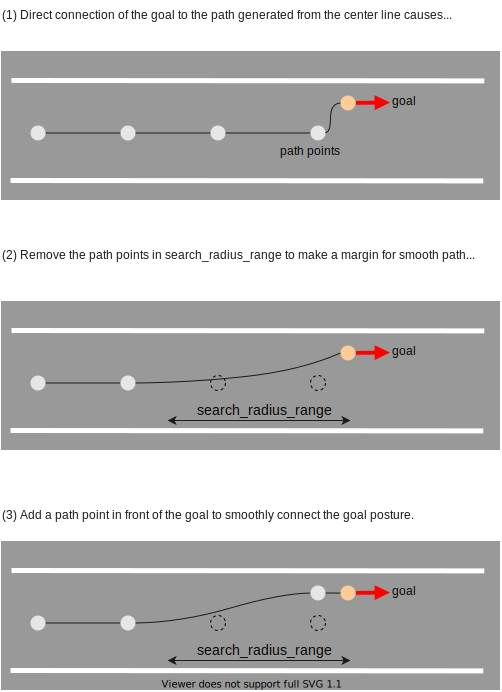
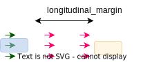

# 目標プランナーの設計

## 目的/役割

目標地点周辺の経路を計画する。

- 指定された目標地点に到着する。
- 障害物を回避または車線を避けるために目標地点を変更する。

## 設計

目標地点の変更が許可されない場合は、指定された固定目標地点に停車する。（下図の`fixed_goal_planner`）
許可されている場合は、指定されたポリシー（例：車線の左側/右側に寄る）に従って駐車する。（下図の`rough_goal_planner`）現在、ラフ目標プランナーは寄る機能のみをサポートしていますが、今後さまざまな駐車ポリシーに対応できるようにすることが望ましいです。


## 開始条件

### fixed_goal_planner

이것은 지정된 목표 지점까지 매끄러운 경로를 계획하는 매우 간단한 함수입니다. 이 함수는 승인이 필요하지 않으며 항상 다른 모듈과 함께 실행됩니다.
_참고: 이 플래너는 "목표 검색", "충돌 확인", "안전 확인" 등 아래에 설명된 여러 기능을 수행하지 않습니다._

두 조건이 모두 충족될 때 실행됩니다.

- 경로가 `allow_goal_modification=false`로 설정됩니다. 이것이 기본값입니다.
- 목표 지점이 정상 차선에 설정됩니다. 즉, `road_shoulder`가 아닙니다.
- 자차가 목표 지점과 동일한 차선 시퀀스에 존재합니다.

대상 경로에 목표 지점이 포함된 경우 경로와 목표 지점이 매끄럽게 연결되도록 경로의 지점을 수정합니다. 이 프로세스는 목표 지점에서 `refine_goal_search_radius_range`의 거리만큼 경로의 모양을 변경합니다. 이 로직은 이후에 실행되는 모듈의 보간 알고리즘에 따라 다르며(현재는 스플라인 보간 사용) 향후에 업데이트되어야 한다는 점에 유의하세요.




### rough_goal_planner

#### 도로 차선에 대기

- 목표 지점과 자차의 거리가 `pull_over_minimum_request_length`보다 짧습니다.
- 경로가 `allow_goal_modification=true`로 설정됩니다.
  - [SetRoute](https://github.com/autowarefoundation/autoware_adapi_msgs/blob/main/autoware_adapi_v1_msgs/routing/srv/SetRoute.srv#L2) API 서비스를 사용하여 이 옵션을 설정할 수 있습니다.
  - RViz에서 키를 바인드한 `2D Rough Goal Pose` `r`을 지원하지만 향후에 RViz에서 다양한 경로 API를 조작하는 도구 패널이 있을 것입니다.
- 현재 경로의 종단이 목표 지점과 동일한 차선 시퀀스에 있습니다. 목표 지점이 도로 어깨에 있는 경우 인접한 도로 차선 시퀀스에 있습니다.


#### 어깨 차선에 대기

- 목표 지점과 자차의 거리가 `pull_over_minimum_request_length`보다 짧습니다.
- 목표 지점이 `road_shoulder`에 설정됩니다.


## 종료 조건

- 차량에서 목표 지점까지의 거리가 임계값(기본값:`1m`)보다 낮습니다.
- 자차가 정지합니다.
  - 속도가 임계값(기본값:`0.01m/s`)보다 낮습니다.

## goal_planner에 대한 일반적 매개변수

| 名称                        | 単位 | タイプ | 説明                                                  | デフォルト値 |
| :------------------------ | :---- | :----- | :----------------------------------------------------- | :------------ |
| th_arrived_distance       | [m]   | double | パス終了の到着距離閾値                              | 1.0           |
| th_stopped_velocity       | [m/s] | double | パス終了の到着速度閾値                              | 0.01          |
| th_stopped_time           | [s]   | double | パス終了の到着時間閾値                              | 2.0           |
| center_line_path_interval | [m]   | double | 参照中心線パス点の間隔                               | 1.0           |

## **ゴール検索**

元のゴールの近くに障害物が存在する場合でも駐車を実現するために、元のゴールの周囲の一定範囲内で衝突のない領域が検索されます。見つかったゴールは `/planning/scenario_planning/modified_goal` として公開されます。

[ゴール検索ビデオ](https://user-images.githubusercontent.com/39142679/188359594-c6724e3e-1cb7-4051-9a18-8d2c67d4dee9.mp4)


1. 元のゴールが設定され、車線中央線に垂直方向に移動し、車線のエッジから `margin_from_boundary` を維持することで、洗練されたゴール姿勢が得られます。
   

2. `refined_goal` をベースゴールとして使用し、精製されたゴールに基づいて、縦方向に `-forward_goal_search_length` から `backward_goal_search_length` の範囲と、横方向に `longitudinal_margin` から `longitudinal_margin+max_lateral_offset` の範囲で候補ゴールを検索します。
   

3. 各候補ゴールには優先順位が付けられ、各ゴールの各Plannerに対して経路が生成されます。候補ゴールの優先順位は、ベースゴールからの距離によって決まります。自動運転車は、可能な限り最も高いゴールのために駐車を試みます。距離は選択されたポリシーによって決定されます。`minimum_longitudinal_distance` の場合、縦方向の距離がより小さいものが横方向の距離がより小さいものより優先されるようにソートします。`minimum_weighted_distance` の場合、加重横方向距離と縦方向距離の合計でソートします。つまり、距離は `longitudinal_distance + lateral_cost*lateral_distance`で計算されます
   
   次の図は `minimum_weighted_distance` の例です。白色の数値はゴール候補の優先順位を示し、数値が小さいほど優先順位が高くなります。0 のゴールはベースゴールを示します。
   
   


4. 各ゴール候補内のフットプリントが、オブジェクトのフットプリントから `object_recognition_collision_check_margin` 以内にある場合、安全でないことが判断されます。これらのゴールは選択されません。`use_occupancy_grid_for_goal_search` が有効になっている場合、`occupancy_grid_collision_check_margin` を使用したグリッド上の衝突検出も実行されます。

画像内の赤色のゴール候補は、安全ではないゴール候補を示します。


ゴール候補から、障害物に対する衝突マージンとは別に、縦方向に `longitudinal_margin` を維持できます。これは、駐車や効率的な出発を可能にするための適切な間隔を確保することを目的としています。



また、`prioritize_goals_before_objects` が有効になっている場合、各ゴールに到着するために、対象範囲内で回避する必要があるオブジェクトの数がカウントされ、最小のオブジェクトを持つゴールに優先順位が与えられます。

図は、前述の距離に関係なく、オブジェクト数が少ないゴールに優先順位が与えられる各範囲で回避する必要のあるオブジェクトの数を表しています。


灰色の数値は、回避するオブジェクトを表し、この場合は前のゴールの方が優先順位が高いことがわかります。


### ゴール検索のパラメータ

| 名称                           | 単位 | タイプ | 説明                                                                                                                                                   | デフォルト値              |
| :------------------------------- | :--- | :----- | :---------------------------------------------------------------------------------------------------------------------------------------------------------------------------------------------------------------------------------------------------------------------------------------------------------------------------------------------------------------------------------------------------------------------------------------------------------------- | :------------------------- |
| `goal_priority`                  | [-]  | 文字列 | `minimum_longitudinal_distance` の場合、経路距離が短いものから並べ替え、横方向距離は無視します。`minimum_weighted_distance` の場合、横方向距離と経路距離の加重合計で並べ替えを行います。                                                                                                                                                                                                                                                                                                                                                                                                                                                                      | `minimum_weighted_distance` |
| `lateral_weight`                 | [-]  | double | `minimum_weighted_distance` の場合に使用する横方向距離の重み                                                                                                                                                                                                                                                                                                                                                                                                                                                                                                                                                                                                                                                                                                | 40.0                       |
| `prioritize_goals_before_objects` | [-]  | ブール | 回避する必要のある物体がある場合、それらの前の目標を優先します。                                                                                                                                                                                                                                                                                                                                                                                                                                                                                                                                                                                                                                                                                                                                                                                                                                                                                                                                                                                                                                                                                                                                                                                                                                                                                                                                                                                                                                                                                                                                                                                                                                                                                                                                                                                                                                                                                                                                                                                                                                                                                                                                                                                                                                                                                                                                                                                                                                                                                                                                                                                                                                                                                                                                                                                                                                                                                                                                                                                                                                                                                                                                                                                                                                                                                                                                                                                                                                                                                                                                                                                                                                                                                                                                                                                                                                                                                                                                                                                                                                                                                                                                                                                                                                                                                                                                                                                                                                                                                                                                                                                                                                                                                                                                                                                                                                                                                                                                                                                                                                                                                                                                                                                                                                                                                                                                                                                                                                                                                                                                                                                                                                                                                                                                                                                                                                                                                                                                                                                                                                                                                                                                                                                                                                                                                                                                                                                                                                                                                                                                                                                                                                                                                                                                                                                                                                                                                                                                                                                                                                                                                                                                                                                                                                                                                                                                                                                                                                                                                                                                                                                                                                                                                                                                                                                                                                                                                                                                                                                                                                                                                                                                                                                                                                                                                                                                                                                                                                                                                                                                                                                                                                                                                                                                                                                                                                                                                                                                                                                                                                                                                                                                                                                                                                                                                                                                                                                                                                                                                                                                                                                                                                                                                                                                                                                                                                                                                                                                                                                                                                                                                                                                                                                                                                                                                                                                                                                                                                                                                                                                                                                                                                                                                                                                                                                                                                                                                                                                                                                                                                                                                                                                                                                                                                                                                                                                                                                                                                                                                                                                                                                                                                                                                                                                                                                                                                                                                                                                                                                                                                                                                                                                                                                                                                                                                                                                                                                                                                                                                                                                                                                                                                                                                                                                                                                                                                                                                                                                                                                                                                                                                                                                                                                                                                                                                                                                                                                                                                                                                                                                                                                                                                                                                                                                                                                                                                                                                                                                                                                                                                                                                                                                                                                                                                                                                                                                                                                                                                                                                                                                                                                                                                                                                                                                                                                                                                                                                                                                                                                                                                                                                                                                                                                                                                                                                                                                                                                                                                                                                                                                                                                                                                                                                                                                                                                                                                                                                                                                                                                                                                                                                                                                                                                                                                                                                                                                                                                                                                                                                                                                                                                                                                                                                                                                                                                                                                                                                                                                                                                                                                                                                                                                                                                                                                                                                                                                                                                                                                                                                                                                                                                                                                                                                                                                                                                                                                                                                                                                                                                                                                                                                                                                                                                                                                                                                                                                                                                                                                                                                                                                                                                                                                                                                                                                                                                                                                                                                                                                                                                                                                                                                                                                                                                                                                                                                                                                                                                                                                                                                                                                                                                                                                                                                                                                                                                                                                                                                                                                                                                                                                                                                                                                                                                                                                                                                                                                                                                                                                                                                                                                                                                                                                                                                                                                                                                                                                                                                                                                                                                                                                                                                                                                                                                                                                                                                                                                                                                                                                                                                                                                                                                                                                                                                                                                                                                                                                                                                                                                                                                                                                                                                                                                                                                                                                                                                                                                                                                                                                                                                                                                                                                                                                                                                                                                                                                                                                                                                                                                                                                                                                                                                                                                                                                                                                                                                                                                                                                                                                                                                                                                                                                                                                                                                                                                                                                                                                                                                                                                                                                                                                                                                                                                                                                                                                                                                                                                                                                                                                                                                                                                                                                                                                                                                                                                                                                                                                                                                                                                                                                                                                                                                                                                                                                                                                                                                                                                                                                                                                                                                                                                                                                                                                                                                                                                                                                                                                                                                                                                                                                                                                                                                                                                                                                                                                                                                                                                                                                                                                                                                                                                                                                                                                                                                                                                                                                                                                                                                                                                                                                                                                                                                                                                                                                                                                                                                                                                                                                                                                                                                                                                                                                                                                                                                                                                                                                                                                                                                                                                                                                                                                                                                                                                                                                                                                                                                                                                                                                                                                                                                                                                                                                                                                                                                                                                                                                                                                                                                                                                                                                                                                                                                                                                                                                                                                                                                                                                                                                                                                                                                                                                                                                                                                                                                                                                                                                                                                                                                                                                                                                                                                                                                                                                                                                                                                                                                                                                                                                                                                                                                                                                                                                                                                                                                                                                                                                                                                                                                                                                                                                                                                                                                                                                                                                                                                                                                                                                                                                                                                                                                                                                                                                                                                                                                                                                                                                                                                                                                                                                                                                                                                                                                                                                                                                                                                                                                                                                                                                                                                                                                                                                                                                                                                                                                                                                                                                                                                                                                                                                                                                                                                                                                                                                                                                                                                                                                                                                                                                                                                                                                                                                                                                                                                                                                                                                                                                                                                                                                                                                                                                                                                                                                                                                                                                                                                                                                                                                                                                                                                                                                                                                                                                                                                                                                                                                                                                                                                                                                                                                                                                                                                                                                                                                                                                                                                                                                                                                                                                                                                                                                                                                                                                                                                                                                                                                                                                                                                                                                                                                                                                                                                                                                                                                                                                                                                                                                                                                                                                                                                                                                                                                                                                                                                                                                                                                                                                                                                                                                                                                                                                                                                                                                                                                                                                                                                                                                                                                                                                                                                                                                                                                                                                                                                                                                                                                                                                                                                                                                                                                                                                                                                                                                                                                                                                                                                                                                                                                                                                                                                                                                                                                                                                                                                                                                                                                                                                                                                                                                                                                                                                                                                                                                                                                                                                                                                                                                                                                                                                                                                                                                                                                                                                                                                                                                                                                                                                                                                                                                                                                                                                                                                                                                                                                                                                                                                                                                                                                                                                                                                                                                                                                                                                                                                                                                                                                                                                                                                                                                                                                                                                                                                                                                                                                                                                                                                                                                                                                                                                                                                                                                                                                                                                                                                                                                                                                                                                                                                                                                                                                                                                                                                                                                                                                                                                                                                                                                                                                                                                                                                                                                                                                                                                                                                                                                                                                                                                                                                                                                                                                                                                                                                                                                                                                                                                                                                                                                                                                                                                                                                                                                                                                                                                                                                                                                                                                                                                                                                                                                                                                                                                                                                                                                                                                                                                                                                                                                                                                                                                                                                                                                                                                                                                                                                                                                                                                                                                                                                                                                                                                                                                                                                                                                                                                                                                                                                                                                                                                                                                                                                                                                                                                                                                                                                                                                                                                                                                                                                                                                                                                                                                                                                                                                                                                                                                                                                                                                                                                                                                                                                                                                                                                                                                                                                                                                                                                                                                                                                                                                                                                                                                                                                                                                                                                                                                                                                                                                                                                                                                                                                                                                                                                                                                                                                                                                                                                                                                                                                                                                                                                                                                                                                                                                                                                                                                                                                                                                                                                                                                                                                                                                                                                                                                                                                                                                                                                                                                                                                                                                                                                                                                                                                                                                                                                                                                                                                                                                                                                                                                                                                                                                                                                                                                                                                                                                                                                                                                                                                                                                                                                                                                                                                                                                                                                                                                                                                                                                                                                                                                                                                                                                                                                                                                                                                                                                                                                                                                                                                                                                                                                                                                                                                                                                                                                                                                                                                                                                                                                                                                                                                                                                                                                                                                                                                                                                                                                                                                                                                                                                                                                                                                                                                                                                                                                                                                                                                                                                                                                                                                                                                                                                                                                                                                                                                                                                                                                                                                                                                                                                                                                                                                                                                                                                                                                                                                                                                                                                                                                                                                                                                                                                                                                                                                                                                                                                                                                                                                                                                                                                                                                                                                                                                                                                                                                                                                                                                                                                                                                                                                                                                                                                                                                                                                                                                                                                                                                                                                                                                                                                                                                                                                                                                                                                                                                                                                                                                                                                                                                                                                                                                                                                                                                                                                                                                                                                                                                                                                                                                                                                                                                                                                                                                                                                                                                                                                                                                                                                                                                                                                                                                                                                                                                                                                                                                                                                                                                                                                                                                                                                                                                                                                                                                                                                                                                                                                                                                                                                                                                                                                                                                                                                                                                                                                                                                       

## **停止**

経路生成手法は3つあります。
経路は路肩車線の境界線から一定のマージン（デフォルト: `0.75 m`）で生成されます。

複数のプランナーを使用して経路を生成するため、このプロセスは時間を要します。したがって、このモジュールでは経路生成はメインスレッドとは異なるスレッドで実行されます。経路生成は、前のモジュールの出力経路の形状が変化したタイミングで実行されます。新しいモジュールが起動する場合、その前にゴールプランナーの前段階に進むことが想定されます。その場合、ゴールプランナーが経路を再生成します。ゴールプランナーは複数モジュールの最後で実行されることが想定され、これはプランナーマネージャーで `keep_last` によって実現されます。

ゴールプランナーのスレッドを以下に示します。


メインスレッドはプランナーマネージャーフローから呼び出されます。

- ゴール候補の生成と経路候補の生成は、別のスレッド（車線経路生成スレッド）で行われます。
- そこで生成された経路候補はメインスレッドによって参照され、現在のプランナーデータ（例：自車と障害物の情報）に有効であると判断されるものが選択されます。有効とは、急減速がない、障害物との衝突がない、などを意味します。選択された経路がこのモジュールの出力になります。
- 選択された経路がない場合や、選択された経路が衝突している場合、および自車がスタックしている場合は、別のスレッド（空き領域経路生成スレッド）が空き領域計画アルゴリズムを使用して経路を生成します。有効な空き領域経路が見つかった場合、それはモジュールの出力になります。物体は移動し、車線に沿って生成された停止経路が衝突なしの場合は、経路は再び出力として使用されます。空き領域経路の生成フローの詳細については、空き領域駐車のセクションも参照してください。

| 名前                                  | 単位   | タイプ   | 説明                                                                                                                                                                      | デフォルト値                             |
| :------------------------------------ | :----- | :----- | :------------------------------------------------------------------------------------------------------------------------------------------------------------------------- | :--------------------------------------- |
| pull_over_minimum_request_length      | [m]    | double | 自車位置が目標にこの距離または安全な停止距離に近づいたときに、プルオーバーがアクティブになります。                                                  | 100.0                                    |
| pull_over_velocity                    | [m/s]  | double | 目標探索エリアまでにこの速度まで減速します。                                                                                                                        | 3.0                                      |
| pull_over_minimum_velocity            | [m/s]  | double | 一度停止した後のプルオーバーの速度です。これにより過度の加速を防止します。                                                                                      | 1.38                                     |
| decide_path_distance                  | [m]    | double | 駐車位置との相対距離がこの距離に近づくとパスを決定します。それ以降は、パスプランニングと目標検索は実行されません。                                     | 10.0                                     |
| maximum_deceleration                  | [m/s2] | double | 最大減速度です。突然駐車経路が見つからなくなったときに急減速を防ぎます。                                                                                   | 1.0                                      |
| path_priority                         | [-]    | string | `efficient_path` の場合は、`efficient_path_order` で設定されている効率的なパスを生成できる目標を使用します。`close_goal` の場合は、元の目標に最も近い目標を使用します。 | efficient_path                           |
| efficient_path_order                  | [-]    | string | フリースペースプルオーバーを除くレーンに沿ったプルオーバープランナーの効率的な順序                                                                                  | ["SHIFT", "ARC_FORWARD", "ARC_BACKWARD"] |
| lane_departure_check_expansion_margin | [m]    | double | レーン逸脱チェック時に自車のフットプリントを拡張するためのマージン                                                                                              | 0.0                                      |

### **シフトパーキング**

停車距離は、速度、横方向偏差、横方向のジャークにより計算されます。
横方向のジャークは、あらかじめ決められた最小値と最大値の間で検索され、上述の準備条件を満たすものが出力されます。

1. 路側帯の中心線に一様なオフセットを適用してマージンを確保する
2. マージ開始点と終了点の間のセクションでは、回避経路の生成に使用される方法（四分割定数ジャーク多項式）で経路をシフトする
3. この経路を道路車線のセンターラインと組み合わせる


[シフトパーキング動画](https://user-images.githubusercontent.com/39142679/178034101-4dc61a33-bc49-41a0-a9a8-755cce53cbc6.mp4)

#### シフトパーキングのパラメータ

| 名称                          | 単位   | 型   | 説明                                                                     | デフォルト値 |
| :---------------------------- | :----- | :----- | :------------------------------------------------------------------------- | :------------ |
| enable_shift_parking          | [-]    | bool   | シフトパーキングを有効にするかどうか                                     | true          |
| shift_sampling_num            | [-]    | int    | lateral_jerk の最小から最大範囲のサンプル数                             | 4             |
| maximum_lateral_jerk          | [m/s3] | double | 最大横加速度                                                              | 2.0           |
| minimum_lateral_jerk          | [m/s3] | double | 最小横加速度                                                              | 0.5           |
| deceleration_interval         | [m]    | double | 減速セクションの距離                                                     | 15.0          |
| after_shift_straight_distance | [m]    | double | 引越し終了点以降の直線距離                                             | 1.0           |

### **幾何学的並列駐車**

不連続曲率を持つ2つの円弧パスを生成します。そのパスの真ん中で2回停止して、その場でステアリングを制御します。2つのパス生成方法があります: 前進と後進。
アルゴリズムの詳細については、[[1]](https://www.sciencedirect.com/science/article/pii/S1474667015347431) を参照してください。また、[シンプルなPython実装](https://github.com/kosuke55/geometric-parallel-parking) もあります。

#### 幾何学的並列駐車のパラメーター

| 名前                    | 単位  | タイプ   | 説明                                                                                                                         | デフォルト値 |
| :---------------------- | :---- | :----- | :---------------------------------------------------------------------------------------------------------------------------------- | :------------ |
| arc_path_interval       | [m]   | double | 円弧パスの点間の距離                                                                                                     | 1.0           |
| pull_over_max_steer_rad | [rad] | double | 停車時のvehicle_infoでの最大ステアリング角までステアリングを制御できない可能性がある、パス生成のための最大ステアリング角 | 0.35          |

#### アーク前進駐車

前方円弧経路を 2 つ生成します。


[アーク前進駐車のビデオ](https://user-images.githubusercontent.com/39142679/178034128-4754c401-8aff-4745-b69a-4a69ca29ce4b.mp4)

#### アーク前進駐車のパラメータ

| 名称                                    | 単位 | 型    | 説明                                                                                                                 | デフォルト値 |
| :-------------------------------------- | :---- | :----- | :----------------------------------------------------------------------------------------------------------------------- | :------------ |
| enable_arc_forward_parking              | [-]   | bool   | アーク進行駐車の有効フラグ                                                                                             | true          |
| after_forward_parking_straight_distance | [m]   | double | 折返し終点からの直線距離                                                                                             | 2.0           |
| forward_parking_velocity                | [m/s] | double | 進行駐車中の速度                                                                                                     | 1.38          |
| forward_parking_lane_departure_margin   | [m/s] | double | 進行駐車時に自車の前左隅から車線逸脱マージン                                                                                 | 0.0           |

#### アーク後方駐車

2つの後方アーク経路を生成します。


[アーク後方駐車ビデオ](https://user-images.githubusercontent.com/39142679/178034280-4b6754fe-3981-4aee-b5e0-970f34563c6d.mp4)

#### アーク後方駐車のパラメーター

| 名前                                   | 単位 | タイプ | 説明                                                                               | デフォルト値 |
| :------------------------------------ | :---- | :----- | :------------------------------------------------------------------------------------- | :----------- |
| `enable_arc_backward_parking`              | [-]   | bool   | アークでの後退駐車を有効にするフラグ                                               | true          |
| `after_backward_parking_straight_distance` | [m]   | double | 駐車終了地点からの直線距離                                                         | 2.0           |
| `backward_parking_velocity`                | [m/s] | double | 後退駐車時の速度                                                                   | -1.38         |
| `backward_parking_lane_departure_margin`   | [m]   | double | 自車の右前角の後退駐車時の車線逸脱マージン                                             | 0.0           |

### Freespace駐車場

車両が`lane_parking`で停止した場合、`freespace_parking`を実行します。
この機能を実行するには、マップに`parking_lot`を設定し、[costmap_generator](../costmap_generator/README.md)の`activate_by_scenario`を`false`に、`enable_freespace_parking`を`true`に設定する必要があります。


フローチャート内の`avoidance_module`と同時実行できるよう現在開発中です。


#### Freespace駐車場のパラメータ

| 名前                     | 単位 | タイプ | 説明                                                                                                            | デフォルト値 |
| :----------------------- | :--- | :--- | :------------------------------------------------------------------------------------------------------------------- | :------------ |
| enable_freespace_parking | [-]  | bool | This flag enables freespace parking, which runs when the vehicle is stuck due to e.g. obstacles in the parking area. | true          |

他のパラメータについては [freespace_planner](../autoware_freespace_planner/README.md) を参照してください。

## **パス生成のための衝突チェック**

安全なパス候補を1つ選択するために、障害物との衝突チェックが行われます。

### **占有グリッドベースの衝突チェック**

自己位置のパスのポイントからフットプリントを生成し、対応するセルの占有グリッドの値から障害物との衝突を判断します。

#### 占有グリッドベースの衝突チェックに関するパラメータ

| 名称                                            | 単位 | タイプ   | 説明                                                                                                     | デフォルト値 |
| :---------------------------------------------- | :--- | :----- | :-------------------------------------------------------------------------------------------------------------- | :------------ |
| use_occupancy_grid_for_goal_search              | [-]  | bool   | occupancy gridを使用してゴール探索衝突検査を行うかどうかを示すフラグ                                          | true          |
| use_occupancy_grid_for_goal_longitudinal_margin | [-]  | bool   | occupancy gridを使用して縦方向の余裕を維持するかどうかを示すフラグ                                     | false         |
| use_occupancy_grid_for_path_collision_check     | [-]  | bool   | occupancy gridを使用して衝突検査を行うかどうかを示すフラグ                                                  | false         |
| occupancy_grid_collision_check_margin           | [m]  | double | フットプリントから自車位置セルを計算するためのマージン                                                   | 0.0           |
| theta_size                                      | [-]  | int    | theta角のサイズ。衝突検査の角度分解能は2$\pi$ / theta_size [rad] | 360           |
| obstacle_threshold                              | [-]  | int    | 障害物と見なされるセルの値のしきい値                                                                    | 60            |

### **認識対象に基づく衝突チェック**

各経路候補に対して衝突の判定が行われ、衝突なしの経路が選択されます。ここでは3つの主要なマージンがあります。

- `object_recognition_collision_check_margin` は自車の全方向のマージンです。
- 前方方向では、現在の走行速度と最大減速度から計算された制動距離によるマージンが追加されます。距離の最大値は `object_recognition_collision_check_max_extra_stopping_margin` で抑えられます。
- 曲線では、横方向のマージンは直線より大きくなります。曲線は制御誤差が発生しやすい上、物体に近づくと恐怖を覚えるためです（ただし、根拠はないものの、最大値は `object_recognition_collision_check_max_extra_stopping_margin` で制限されています）。


続いて、ソフトマージンとハードマージンの概念があります。現在はパラメータ化されていませんが、`object_recognition_collision_check_margin` よりも数倍大きいマージンで衝突なしの経路を生成できる場合、優先順位は高くなります。

#### 認識対象に基づく衝突チェックに関するパラメータ

| 名称                                                           | 単位 | タイプ             | 説明                                                                                                                                                                | デフォルト値                                 |
| :------------------------------------------------------------- | :--- | :----------------- | :-------------------------------------------------------------------------------------------------------------------------------------------------------------- | :------------------------------------------ |
| use_object_recognition                                         | [-]  | bool               | 衝突確認にオブジェクト認識を使用するかどうか                                                                                                                  | true                                      |
| object_recognition_collision_check_soft_margins                  | [m]  | vector[double]     | パス生成時の衝突確認用のソフトマージン。フートプリント間の距離を厳密に指定するわけではなく、自車とオブジェクトの向きが異なる場合の最大距離を指定する | [5.0, 4.5, 4.0, 3.5, 3.0, 2.5, 2.0, 1.5, 1.0] |
| object_recognition_collision_check_hard_margins                  | [m]  | vector[double]     | パス生成時の衝突確認用のハードマージン                                                                                                                         | [0.6]                                     |
| object_recognition_collision_check_max_extra_stopping_margin     | [m]  | double             | 停止距離を考慮した衝突確認の縦方向距離マージンを追加する場合の最大値                                                                                            | 1.0                                       |
| detection_bound_offset                                         | [m]  | double             | パス生成の衝突確認用の検出エリアを作成するために、プローブオーバーレーンをこのオフセットで拡大する | 15.0                                      |

## **セーフティチェック**

移動物体に対してセーフティチェックを実施します。物体が危険と判断された場合、パス決定は行われず、承認は与えられません。

- パス決定は行われず、承認は付与されません。
- 承認後、自車位置は減速およびジャークの制約下で停止します。

このモジュールには、`RSS`と`integral_predicted_polygon`の2つのセーフティチェック方式があります。

`RSS`方式は、他の挙動パスプランナーモジュールで一般的に使用される方法です。[RSSベースのセーフティチェックユーティリティの説明](../autoware_behavior_path_planner_common/docs/behavior_path_planner_safety_check.md)を参照してください。

`integral_predicted_polygon`は、よりセーフティ志向の方法です。この方式は、プルオーバー中の速度が走行中の速度よりも低く、レーン端に沿って走る物体が少ないということを理由に実装されています。（場合によっては過剰に反応し、利用できない可能性があります。）
この方式は、特定の時点での自車位置と物体のフットプリントを統合し、それらの間の衝突をチェックします。


また、セーフティチェックには時間ヒステリシスがあり、パスが一定時間（`keep_unsafe_time`）「セーフ」と判断された場合、最終的に「セーフ」として扱われます。


```txt
                         ==== is_safe
                         ---- current_is_safe
       is_safe
        ^
        |
        |                   time
      1 +--+    +---+       +---=========   +--+
        |  |    |   |       |           |   |  |
        |  |    |   |       |           |   |  |
        |  |    |   |       |           |   |  |
        |  |    |   |       |           |   |  |
      0 =========================-------==========--> t
```

### 安全チェックのパラメータ

| 名称                               | 単位 | タイプ | 説明                                                                                                           | デフォルト値                   |
| :---------------------------------- | :---- | :----- | :-------------------------------------------------------------------------------------------------------------- | :---------------------------- |
| enable_safety_check                 | [-]   | bool   | セーフティチェックを使用するかどうかのフラグ                                                                  | true                          |
| method                              | [-]   | string | セーフティチェックの方法。`RSS`または`integral_predicted_polygon`                                                | `integral_predicted_polygon` |
| keep_unsafe_time                    | [s]   | double | セーフティチェックのヒステリシス時間。経路が「安全」と判断された場合、最終的に「安全」として扱われます。 | 3.0                           |
| check_all_predicted_path            | -     | bool   | すべての予測経路を確認するフラグ                                                                               | true                          |
| publish_debug_marker                | -     | bool   | デバッグマーカーを公開するフラグ                                                                               | false                         |
| `collision_check_yaw_diff_threshold` | [rad] | double | rssベースの衝突チェックを実行するときの自車とオブジェクトの最大ヨー差                                   | 3.1416                        |

#### RSS 安全性確認用のパラメータ

| 名称                                | 単位 | タイプ   | 説明                                               | デフォルト値 |
| :---------------------------------- | :--- | :----- | :-------------------------------------------------- | :------------ |
| `rear_vehicle_reaction_time`          | [秒] | double | 後続車の反応時間                                      | 2.0           |
| `rear_vehicle_safety_time_margin`     | [秒] | double | 後続車の安全余裕時間                                   | 1.0           |
| `lateral_distance_max_threshold`      | [m]  | double | 最大の横方向距離のしきい値                              | 2.0           |
| `longitudinal_distance_min_threshold` | [m]  | double | 最小の縦方向距離のしきい値                              | 3.0           |
| `longitudinal_velocity_delta_time`    | [秒] | double | 縦速度のデルタ時間                                   | 0.8           |

#### integral_predicted_polygon 安全チェック用パラメーター

| 名前          | 単位 | 型   | 説明                                            | デフォルト値 |
| :------------: | :--: | :---: | :----------------------------------------------- | :-----------: |
| forward_margin | [m]  | double | 自車フットプリントの前方余白                   | 1.0           |
| backward_margin | [m]  | double | 自車フットプリントの後方余白                  | 1.0           |
| lat_margin      | [m]  | double | 自車フットプリントの横方向余白               | 1.0           |
| time_horizon    | [s]  | double | 各フットプリントを統合する時間幅              | 10.0          |

## **経路決定**

プルオーバー開始時に`decide_path_distance`が近づくと、その時点で衝突がなく、オブジェクトの予測経路に対して安全であれば、DECIDINGに移行します。一定時間安全であれば、DECIDEDに移行します。


## 未実装部分/制限事項

- シフトプルオーバーのみ、他のモジュールと同時に実行可能
- 駐車スペースの狭さと安全マージンのトレードオフ。状況に応じて低速を使用して余裕を減らすモードが必要だが、速度の動的切り替えメカニズムはない。
- 利用可能な駐車スペースはオブジェクトの可視性に依存し、駐車決定が適切に行えない場合があります。
- 未認識オブジェクト（未知のオブジェクトでもありません）に対するマージンは占用グリッドに依存しています。接近可能なオブジェクト（例：草、葉）が区別できないため、未認識の地表オブジェクトに近づきすぎる場合があります。

フリースペース駐車の未実装部分/制限事項

- 短い経路が生成されると、自車はそれを使用して走行できません。
- 複雑なケースは生成に時間がかかったり、失敗します。
- 走行可能な領域は`parking_lot`に収まるとは限りません。

