# 車線変更設計

車線変更が必要で、安全に実行できる場合、車線変更モジュールがアクティブ化されます。

## 車線変更要件

- 前提条件として、HD マップにおける車線境界の種類が以下のいずれかである必要があります。
  - 破線車線または、実線と破線の混在: 両方向の車線変更が許可されています。
  - 左側が破線、右側が実線: 左から右への車線変更が許可されています。
  - 左側が実線、右側が破線: 右から左への車線変更が許可されています。
  - `allow_lane_change` タグが `true` に設定されています。
- 車線変更要求条件中
  - 自車が `preferred_lane` 上にいません。
  - 自車が信号機に近づいていません。（条件パラメータ化）
  - 自車が横断歩道に近づいていません。（条件パラメータ化）
  - 自車が交差点に近づいていません。（条件パラメータ化）
- 車線変更準備完了条件
  - 車線変更の経路が他の動的オブジェクトと衝突していません（以下の図を参照）。
  - 車線変更候補経路がオペレーターによって承認されています。

## 車線変更候補経路の生成

車線変更候補経路は、準備フェーズと車線変更フェーズの 2 つに分けられます。次の図は、車線変更候補経路の各フェーズを示しています。


次のチャートは、車線変更用の候補経路のサンプリングプロセスを示しています。


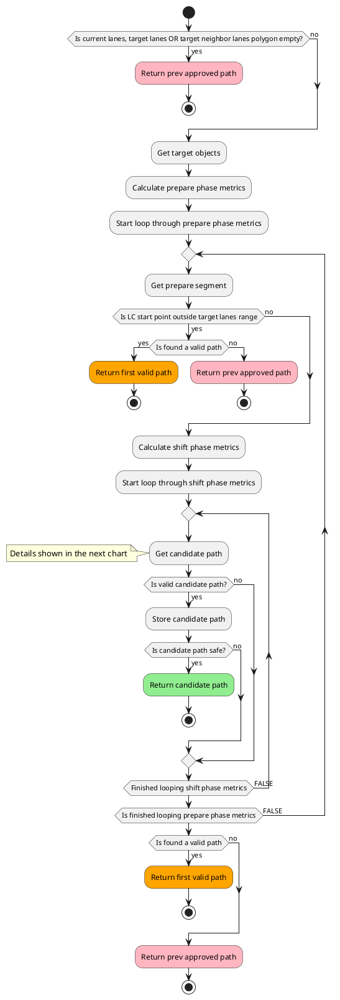

以下のチャートでは、有効な候補経路を作成するプロセスを説明しています。


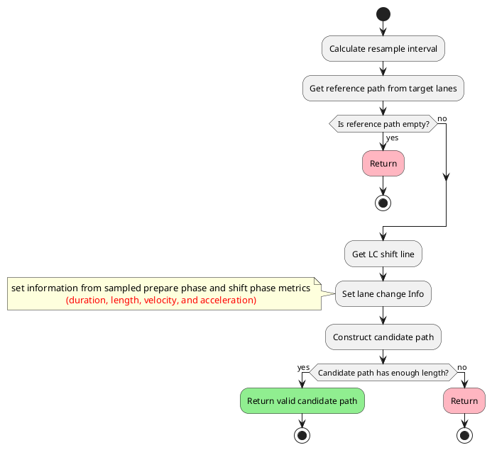

### 準備段階

準備経路は、候補経路の最初の直線部分で、自車位置の現在の車線に沿って生成されます。準備経路の長さは、次のように計算されます。


```C++
lane_change_prepare_distance = current_speed * lane_change_prepare_duration + 0.5 * deceleration * lane_change_prepare_duration^2
```

準備フェーズでは、残りの距離が`lane_change_search_distance`以下になった場合は、ターンシグナルが作動します。

### 車線変更フェーズ

車線変更フェーズは、自車位置を現在の車線からターゲット車線に移動するシftedパスで構成されます。車線変更フェーズの総距離は次のとおりです。車線変更フェーズでは、自車は一定速度で走行することに注意してください。


```C++
lane_change_prepare_velocity = std::max(current_speed + deceleration * lane_change_prepare_duration, minimum_lane_changing_velocity)
lane_changing_distance = lane_change_prepare_velocity * lane_changing_duration
```

`backward_length_buffer_for_end_of_lane` にはブレーキ遅れなどの制御または機械的な遅延の可能性のある時間ウィンドウが追加されます。

#### マルチ候補パスサンプル（縦加速度）

車線変更速度は、自車現在の速度の影響を受けます。高速では、より長い準備と車線変更距離が必要になります。ただし、自車が徐行する場合も車線変更軌跡を計画する必要があります。

自車が減速すると想定した候補パスを計算するには、あらかじめ決定した減速度値を、`prepare_length`、`prepare_velocity`、`lane_changing_length` の方程式に代入します。

あらかじめ決定された縦加速度値は `longitudinal_acceleration = maximum_longitudinal_acceleration` から始まる値のセットで、`longitudinal_acceleration_resolution` だけ減少して `longitudinal_acceleration = -maximum_longitudinal_deceleration` に達します。`maximum_longitudinal_acceleration` と `maximum_longitudinal_deceleration` のどちらも、`common.param` ファイルで `normal.min_acc` として定義された値として計算されます。


```C++
maximum_longitudinal_acceleration = min(common_param.max_acc, lane_change_param.max_acc)
maximum_longitudinal_deceleration = max(common_param.min_acc, lane_change_param.min_acc)
```

`common_param`は車両の共通最大縦加速度と減速度を定義する車両共通パラメータです。一方、`lane_change_param`には車線変更モジュールの最大縦加速度と減速度があります。たとえば、ユーザーが`common_param.max_acc=1.0`と`lane_change_param.max_acc=0.0`を設定すると、`maximum_longitudinal_acceleration`は`0.0`になり、車線変更は車線変更フェーズで加速しません。

`longitudinal_acceleration_resolution`は以下によって決定されます


```C++
longitudinal_acceleration_resolution = (maximum_longitudinal_acceleration - minimum_longitudinal_acceleration) / longitudinal_acceleration_sampling_num
```

「current_velocity」が「minimum_lane_changing_velocity」より低い場合、車両は速度を「minimum_lane_changing_velocity」まで加速する必要があることに留意してください。したがって、縦加速度は正の値（減速ではない）になります。

このチャートは、縦加速度値がサンプリングされる条件を示しています。


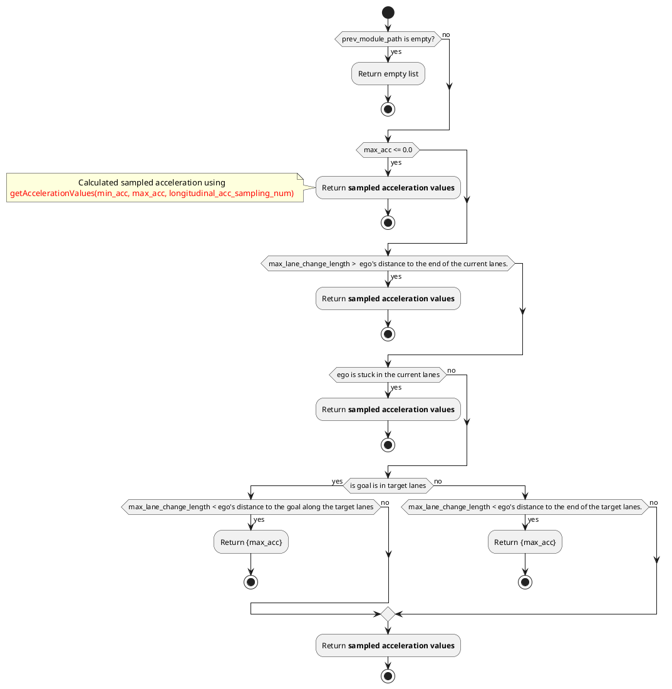

 longitudinal 加速度のサンプリングのプロセスを以下に説明します。


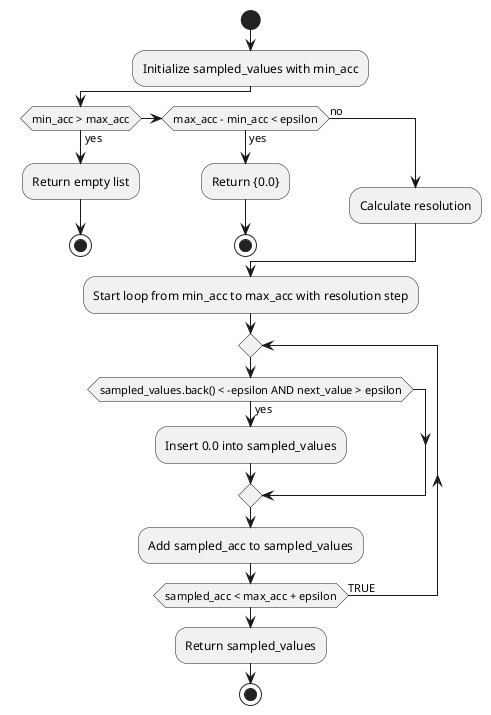

次の図は、`longitudinal_acceleration_sampling_num = 4` の場合を表しています。`maximum_deceleration = 1.0` と仮定すると、`a0 == 0.0 == 減速なし`、`a1 == 0.25`、`a2 == 0.5`、`a3 == 0.75`、`a4 == 1.0 == maximum_deceleration` となります。`a0` は自動運転車が減速しない場合の期待車線変更軌跡であり、`a1` のパスは自動運転車が `0.25 m/s^2` で減速した場合の期待車線変更軌跡です。


どのパスが選択されるかは、有効性と衝突検出によって決まります。

#### 複数の候補パスサンプル（横加速度）

縦加速度をサンプリングすることに加えて、横加速度の値を調整して車線変更パスをサンプリングします。横加速度は車線変更の時間を左右するため、横加速度の値が低いほど車線変更のパスが長くなり、横加速度の値が高いほど車線変更のパスが短くなります。これにより、車線変更モジュールは車線変更のためのスペースに制限がある場合、横加速度を高めることでより短い車線変更パスを生成できます。

最大および最小横加速度は、車線変更パラメータファイルでマップとして定義されています。横加速度の範囲は、マップ内の値を線形補間することによって各速度に対して決定されます。次のマップがあるとします。

| 自車速度 | 最小横加速度 | 最大横加速度 |
| ---------- | -------------------------- | -------------------------- |
| 0.0        | 0.2                        | 0.3                        |
| 2.0        | 0.2                        | 0.4                        |
| 4.0        | 0.3                        | 0.4                        |
| 6.0        | 0.3                        | 0.5                        |

このケースでは、自車速度が3.0の場合、横加速度の最小値と最大値はそれぞれ0.25と0.4になります。これらの値は、横加速度の最小値と最大値を定義するマップの2行目と3行目から線形補間により取得されます。

この範囲内で自車の横加速度をサンプリングします。縦加速度のサンプリングに使用する手法と同様に、横加速度の分解能(`lateral_acceleration_resolution`)は以下によって決定されます。


```C++
lateral_acceleration_resolution = (maximum_lateral_acceleration - minimum_lateral_acceleration) / lateral_acceleration_sampling_num
```

#### 候補パスの有効性チェック

候補パスは、次の基準を満たす場合に有効と見なされます。

1. 自車位置から現車線の終端までの距離が、単一の車線変更を実行するのに十分である。
2. 自車位置から現車線上のゴールまでの距離が、複数回の車線変更を完了するのに十分である。
3. 自車位置から目標車線の終端までの距離が、複数回の車線変更を完了するのに十分である。
4. 自車位置から次の規制要素までの距離が、単一の車線変更を実行するのに十分である。
5. 駐車車両を通過後に車線変更が完了する。
6. 車線変更の実行が「post resampling」で安全と判断される。

次のフローチャートは、有効性チェックを示しています。


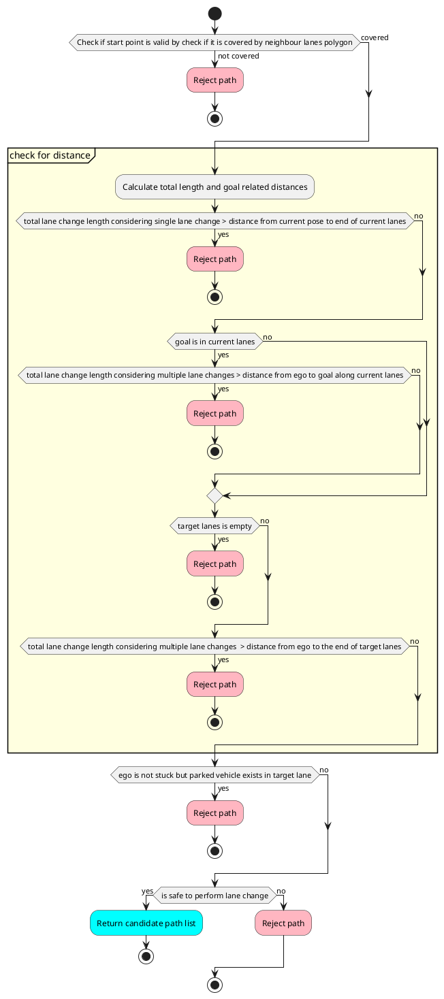

#### レーン変更遅延チェック

特定の状況で、自車の前方目標車線に停止車両がある場合、停止車両の後に車線変更を実行して立ち往生を避けることが望まれます。
そのため、自車の前方の目標車線にある静止オブジェクトをすべて最寄りから最遠に向かって確認し、オブジェクトが次の条件を満たしている場合は車線変更が遅延され、候補パスが拒否されます。

1. オブジェクトから終点までの距離が車線変更を実行するのに十分である
2. オブジェクトまでの距離が車線変更の長さ未満である
3. オブジェクトから次のオブジェクトまでの距離が車線変更を実行するのに十分である

`check_only_parked_vehicle`パラメータが`true`に設定されている場合、チェックでは駐車しているものとして特定されたオブジェクトのみが考慮されます。

次のフローチャートは、レーン変更遅延チェックを示しています。


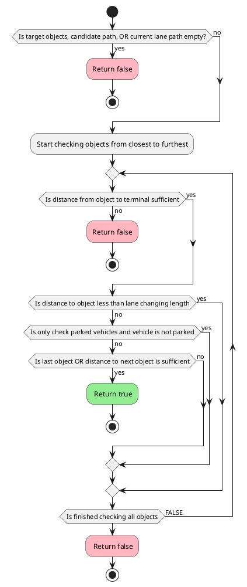

以下に、各種状況における遅延車線変更のトリガーの可否を示します。

1. 前方十分な距離があるので、遅延車線変更がトリガーされます。
   
2. 前方十分な距離がないので、遅延車線変更はトリガーされません。
   
3. 前方十分な距離があるので、先行 NPC による遅延車線変更がトリガーされます。
   
4. 前方十分な距離があるので、後続 NPC による遅延車線変更がトリガーされます。
   
5. 前方十分な距離がないので、遅延車線変更はトリガーされません。
   

#### 候補パスに対する安全確認

[安全確認ツールの説明](../autoware_behavior_path_planner_common/docs/behavior_path_planner_safety_check.md) を参照してください。

#### オブジェクトの選択と分類

まず、ターゲットオブジェクトをターゲット車線の障害物、現在の車線の障害物、その他の車線の障害物に分けます。ターゲット車線は車両が車線変更後に到達する車線を、現在の車線は車両が車線変更する前に走行している車線を指します。それ以外の車線はターゲット車線と現在の車線に含まれない車線です。次の図は各車線上のオブジェクトを示しています。ユーザーは、`check_objects_on_current_lanes` と `check_objects_on_other_lanes` フラグを変更することで、現在の車線またはその他の車線上のオブジェクトを安全確認から除外できます。


さらに、信号で待機している車両の背後で車線変更を行う場合、信号付近の停止車両に対する安全確認をスキップします。駐車車両の検出に関する説明は、[回避モジュールのドキュメント](../autoware_behavior_path_static_obstacle_avoidance_module/README.md) に記載されています。

ターゲット車線の検出領域は、元の境界を越えて拡張して、ターゲット車線の範囲外のオブジェクトの検出を可能にすることができます。

<div align="center">
  <table>
    <tr>
      <td>
        <div style="text-align: center;">
          <div style="color: black; font-size: 20px; margin-bottom: 10px;">車線拡張なし</div>
          
        </div>
      </td>
      <td>
        <div style="text-align: center;">
          <div style="color: black; font-size: 20px; margin-bottom: 10px;">車線拡張あり</div>
          
        </div>
      </td>
    </tr>
  </table>
</div>

##### オブジェクトのフィルタリング


```plantuml
@startuml
skinparam defaultTextAlignment center
skinparam backgroundColor #WHITE

title NormalLaneChange::filterObjects Method Execution Flow

start

group "Filter Objects by Class" {
while (has not finished iterating through predicted object list) is (TRUE)
  if (current object type != param.object_types_to_check?) then (TRUE)
  #LightPink:Remove current object;
else (FALSE)
  :Keep current object;
endif
end while
end group

if (predicted object list is empty?) then (TRUE)
  :Return empty result;
  stop
else (FALSE)
endif

group "Filter Oncoming Objects" #PowderBlue {
while (has not finished iterating through predicted object list?) is (TRUE)
if (object's yaw with reference to ego's yaw difference < 90 degree?) then (TRUE)
  :Keep current object;
else (FALSE)
if (object is stopping?) then (TRUE)
  :Keep current object;
else (FALSE)
  #LightPink:Remove current object;
endif
endif
endwhile
end group

if (predicted object list is empty?) then (TRUE)
  :Return empty result;
  stop
else (FALSE)
endif

group "Filter Objects By Lanelets" #LightGreen {

while (has not finished iterating through predicted object list) is (TRUE)
  :Calculate lateral distance diff;
  if (Object in target lane polygon?) then (TRUE)
    if (lateral distance diff > half of ego's width?) then (TRUE)
      if (Object's physical position is before terminal point?) then (TRUE)
        :Add to target_lane_objects;
      else (FALSE)
      endif
    else (FALSE)
    endif
  else (FALSE)
  endif

  if (Object overlaps with backward target lanes?) then (TRUE)
    :Add to target_lane_objects;
  else (FALSE)
    if (Object in current lane polygon?) then (TRUE)
      :Add to current_lane_objects;
    else (FALSE)
      :Add to other_lane_objects;
    endif
  endif
end while

:Return target lanes object,  current lanes object and other lanes object;
end group

:Generate path from current lanes;

if (path empty?) then (TRUE)
  :Return empty result;
  stop
else (FALSE)
endif

group "Filter Target Lanes' objects" #LightCyan {

while (has not finished iterating through target lanes' object list) is (TRUE)
  if(velocity is within threshold?) then (TRUE)
  :Keep current object;
  else (FALSE)
    if(object is ahead of ego?) then (TRUE)
      :keep current object;
    else (FALSE)
      #LightPink:remove current object;
    endif
   endif
endwhile
end group

group "Filter Current Lanes' objects"  #LightYellow {

while (has not finished iterating through current lanes' object list) is (TRUE)
  if(velocity is within threshold?) then (TRUE)
    if(object is ahead of ego?) then (TRUE)
      :keep current object;
    else (FALSE)
      #LightPink:remove current object;
    endif
    else (FALSE)
      #LightPink:remove current object;
   endif
endwhile
end group

group "Filter Other Lanes' objects"  #Lavender {

while (has not finished iterating through other lanes' object list) is (TRUE)
  if(velocity is within threshold?) then (TRUE)
    if(object is ahead of ego?) then (TRUE)
      :keep current object;
    else (FALSE)
      #LightPink:remove current object;
    endif
    else (FALSE)
      #LightPink:remove current object;
   endif
endwhile
end group

:Transform the objects into extended predicted object and return them as lane_change_target_objects;
stop

@enduml
```

##### 準備段階での衝突チェック

自車は車線変更を試行する前に、ターゲット車両の十分な前方の車間距離を確保する必要がある場合があります。この動作を得るために `enable_collision_check_at_prepare_phase` フラグを有効にすることができます。次の画像は `false` と `true` の場合の違いを示しています。


#### 車線が塞がっていて車線変更が複数ある場合

他の車両が公道を走行している場合、車線変更が実行できないシナリオがあります。候補パスが、例えば隣接車線の対向車のため、安全でないとして評価されたとします。その場合、自車は車線を変えることができませんし、目的地にたどり着くことも不可能です。そのため、自車は一定の距離手前で停止し、隣接車線が安全であると評価されるのを待つ必要があります。最低停止距離は、シフト長と車線変更最小速度から計算できます。


```C++
lane_changing_time = f(shift_length, lat_acceleration, lat_jerk)
minimum_lane_change_distance = minimum_prepare_length + minimum_lane_changing_velocity * lane_changing_time + lane_change_finish_judge_buffer
```

以下の図は、複数車線変更時に車線が塞がっているタイミングを示しています。


### 停止動作

自車の停止動作は、必要な車線変更回数、障害物の有無、障害物の位置と車線変更計画との関連など、さまざまな要因に基づいて決定されます。目的は、さまざまな交通シナリオに適応しながら安全かつ効果的な車線変更を可能にする適切な停止地点を選択することです。

次のフローチャートとサブセクションは、障害物が前方にある場合に停止地点を挿入する場所を決定するための条件を説明しています。


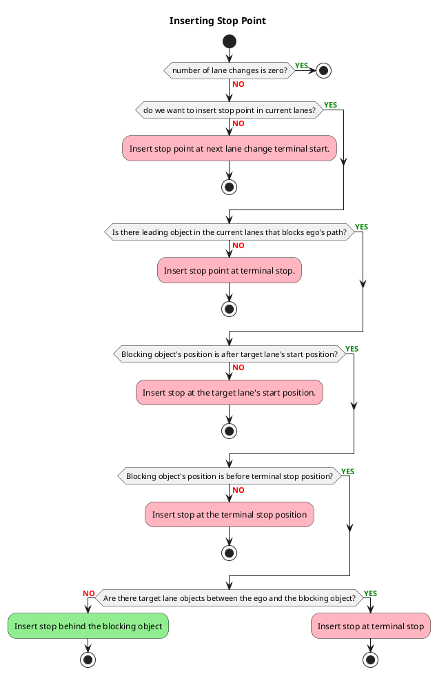

#### 自車前方障害物時の停止位置

自車が前方障害物に遭遇した場合、車線変更に備えて安全距離を確保しつつ停止します。正確な停止位置は、ターゲットレーンが空いているのか、または車線変更を遅らせる必要があるかなどの要因によって異なります。以下に、さまざまな停止シナリオの処理方法を説明します。

##### 車線変更終点付近の場合

ターゲットレーンに障害物があるかどうかに関わらず、自車は前方障害物から安全距離を保ちつつ停止し、車線変更に必要な十分なスペースを確保します。


##### 自車が車線変更終点付近ではない場合

自車は前方障害物から安全距離を保ちつつ停止し、車線変更に必要な十分なスペースを確保します。


#### 車線変更セクションに障害物がある場合の自車の停止位置

ターゲットレーンの車線変更セクション内に障害物がある場合、自車は車線変更に必要な通常の距離を保たずに、前方障害物に近づいて停止します。

##### 車線変更終点付近の場合

ターゲットレーンに障害物があるかどうかに関わらず、自車は前方障害物から安全距離を保ちつつ停止し、車線変更を行います。


##### 車線変更終点付近ではない場合

ターゲットレーンの車線変更セクション内に障害物がない場合、自車は前方障害物から安全距離を保ちつつ停止し、車線変更を行います。


ターゲットレーンの車線変更セクション内に障害物がある場合、自車は車線変更に必要な通常の距離を保たずに、前方障害物に近づいて停止します。


#### ターゲットレーンが遠い場合

車線変更用のターゲットレーンが遠く離れていて、現在のレーンに隣接していない場合、自車は車線変更に必要な通常の距離を保つ必要がないため、前方障害物に近づいて停止します。


### スタック時の車線変更

自車が停止していて、次のいずれかの条件を満たしている場合、スタックしていると見なされます。

- 現在のレーンに前方障害物がある。
- 自車が現在のレーンの終端に位置している。

この場合、車線変更の安全確認は通常時よりも緩和されています。
詳細については、'Collision checks during lane change'の'stuck'セクションを参照してください。
この機能を実現するために、前述のセクションで'post resampling'障害物に対してマージンを保って停止する機能が実行されています。

### 車線変更の規制

横断歩道、交差点、または信号で車線変更を規制する場合、それらの付近では車線変更モジュールが無効になります。

横断歩道、交差点、または信号で車線変更を規制するには、`regulation.crosswalk`、`regulation.intersection`、または `regulation.traffic_light` を `true` に設定します。

自車が立ち往生した場合、立ち往生を避けるために、横断歩道や交差点で車線変更を有効にします。

自車が `stuck_detection.stop_time` 秒以上停止した場合、立ち往生とみなされます。

自車の速度が `stuck_detection.velocity` より小さい場合、停止しているとみなされます。

### 車線変更の中止

中断プロセスは、「キャンセル」、「中止」、「停止/クルーズ」の3つの異なる結果をもたらす可能性があります。

以下は、中断車線変更チェックの流れを示しています。


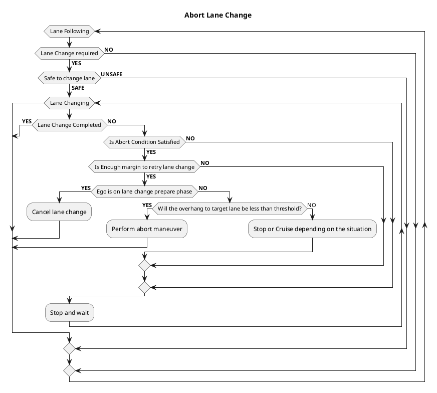

車線変更中に、車輌の減速度を考慮し安全チェックが行われ、`cancel.deceleration_sampling_num` 減速パターンに対して安全チェックが行われます。すべての減速パターンに対して中止条件が満たされる場合、車線変更はキャンセルされます。

安全でない状態と安全な状態が交互に出現するために生じる車線変更経路の振動に対する予防策として、中止またはキャンセル操作を実行する前に、追加のヒステリシス・カウントチェックが実装されています。安全でない場合、`unsafe_hysteresis_count_` がインクリメントされ、`unsafe_hysteresis_threshold` と比較されます。これを超えると中止条件のチェックが促され、最近の安全評価を考慮して決定が行われます。このメカニズムは意思決定を安定させ、一時的な安全でない状態による突然の変化を防止します。


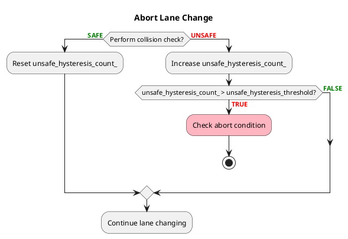

#### キャンセル

もし車線変更軌跡が安全ではないと評価された場合、エゴ車両が現在の車線から逸脱していない場合は、軌跡がリセットされ、エゴ車両は車線維持操作を再開します。

この関数は `enable_on_prepare_phase` を `true` に設定することで有効にできます。

キャンセル処理のイメージを以下に示します。


#### 中断

エゴ車両がすでに現在の車線から逸脱しているとします。その場合、経路をキャンセルすることは危険であり、エゴ車両が突然進行方向を変えることになります。この場合、エゴ車両が進行方向の変更を最小限に抑えながら現在の経路に戻る軌跡を計画する必要があります。この場合、車線変更モジュールは中断経路を生成します。次の画像は中断経路の例を示しています。この関数は、周囲のオブジェクトやそれらの反応を確認していないため、安全な中断処理を保証しないことに注意してください。この関数は `enable_on_prepare_phase` と `enable_on_lane_changing_phase` の両方を `true` に設定することで手動で有効にすることができます。この関数を動作させるには、パラメータ `max_lateral_jerk` に高い値を設定する必要があります。


#### 停止/巡航

最後の動作は、エゴ車両が現在の車線から逸脱した場合にも発生します。中断関数が無効になっているか、中断がもはや不可能な場合、エゴ車両は停止するか障害物巡航モードに移行します。このモジュールは、これらの重大なシナリオ中に発生する予期しない動作のために、安全な操作を保証しないことに注意してください。イメージを次に示します。


## 車線変更完了チェック

エゴ車両が車線変更に成功したかどうかを判断するには、縦方向または横方向の基準のいずれかを満たす必要があります。

縦方向の基準の場合、エゴ車両は車線変更終了姿勢を通り抜け、そこから `finish_judge_buffer` 距離以内にある必要があります。次にモジュールはエゴ車両が目標車線にいるかどうかを確認します。trueの場合、モジュールは成功を返します。このチェックにより、プランニングマネージャーがエゴ車両の現在の姿勢に基づいてルートレーンレットを正しく更新します。このチェックがない場合、エゴ車両が障害物を回避しながら車線変更している場合、および現在の姿勢が元の車線にある場合、プランニングマネージャーはルートレーンレットを元の車線として設定する可能性があります。これはエゴ車両にもう一度車線変更を実行するように強制します。目標車線チェックを使用すると、エゴ車両が目標車線にいることが確認され、プランニングマネージャーはルートレーンレットを正しく更新できます。

縦方向の基準が満たされない場合、モジュールは横方向の基準を評価します。横方向の基準の場合、エゴ車両は目標車線のセンターラインから `finish_judge_lateral_threshold` 距離以内にある必要があり、角度偏差は `finish_judge_lateral_angle_deviation` 度以内である必要があります。角度偏差チェックにより、急な操舵がないことが保証されます。角度偏差を大きく設定すると、エゴ車両の向きがセンターラインから大きくずれる可能性があり、軌跡フォロワーがセンターラインに戻るために積極的な操舵を行います。角度偏差値をできるだけ小さくすることで、この問題を回避できます。

車線変更完了を決定するプロセスを次の図に示します。


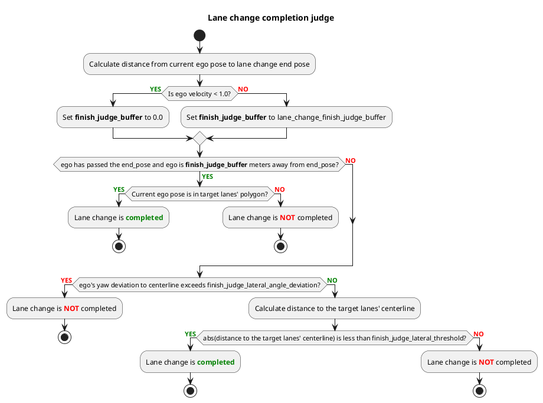

## パラメータ

### 必須の車線変更パラメータ

以下のパラメータは [lane_change.param.yaml](https://github.com/autowarefoundation/autoware_launch/blob/main/autoware_launch/config/planning/scenario_planning/lane_driving/behavior_planning/behavior_path_planner/lane_change/lane_change.param.yaml) で設定できます。

| 名前                                       | 単位 | タイプ | 説明                                                                                                                                                | デフォルト値 |
| :---------------------------------------- | ---- | ------ | ---------------------------------------------------------------------------------------------------------------------------------------------------- | ------------ |
| `backward_lane_length`                    | [m]  | double | レーン変更の対象となるレーンに進行してくる物体を確認するための後方長の距離                                                                                 | 200.0        |
| `backward_length_buffer_for_end_of_lane`  | [m]  | double | エゴカーがレーン変更を開始するために十分な距離を確保するための、車線の終端からのバッファ長                                                             | 3.0          |
| `backward_length_buffer_for_blocking_object` | [m]  | double | 前方に障害物がある場合に、エゴカーがレーン変更を開始するために十分な距離を確保するための、車線の終端からのバッファ長                               | 3.0          |
| `backward_length_from_intersection`       | [m]  | double | 最後の交差点からの距離しきい値。この距離を超えると、レーン変更のパスが無効またはキャンセルされる                                                | 5.0          |
| `trajectory.prepare_duration`            | [m]  | double | エゴカーがレーン変更を実行する準備をするための時間                                                                                              | 4.0          |
| `trajectory.lateral_jerk`                 | [m/s3] | double | レーン変更のパス生成における横方向のジャーク値                                                                                                    | 0.5          |
| `trajectory.minimum_lane_changing_velocity` | [m/s] | double | レーン変更中の最小速度                                                                                                                         | 2.78         |
| `trajectory.lon_acc_sampling_num`         | [-]  | int    | 縦方向加速度の影響を受けるレーン変更可能な軌道の数                                                                                               | 3            |
| `trajectory.lat_acc_sampling_num`         | [-]  | int    | 横方向加速度の影響を受けるレーン変更可能な軌道の数                                                                                               | 3            |
| `trajectory.max_longitudinal_acc`         | [m/s2] | double | レーン変更時の最大縦方向加速度                                                                                                                    | 1.0          |
| `trajectory.min_longitudinal_acc`         | [m/s2] | double | レーン変更時の最大縦方向減速度                                                                                                                    | -1.0         |
| `min_length_for_turn_signal_activation`   | [m]  | double | エゴカーが最小レーン変更長の距離まで近づくと、ウインカーが作動する                                                                                      | 10.0         |
| `lateral_acceleration.velocity`           | [m/s] | double | 横方向加速度を計算するための参照速度（ルックアップテーブル）                                                                                      | [0.0, 4.0, 10.0] |
| `lateral_acceleration.min_values`         | [m/s2] | double | 速度に対応する最小横方向加速度値（ルックアップテーブル）                                                                                              | [0.4, 0.4, 0.4]  |
| `lateral_acceleration.max_values`         | [m/s2] | double | 速度に対応する最大横方向加速度値（ルックアップテーブル）                                                                                              | [0.65, 0.65, 0.65] |

### 車線変更完了判定パラメータ

車線変更の完了を判断するため、以下のパラメータが使用されます。

| 名前                                   | 単位  | 型   | 説明                                                                                                                | デフォルト値 |
| :------------------------------------- | ----- | ------ | ------------------------------------------------------------------------------------------------------------------------ | ------------- |
| `lane_change_finish_judge_buffer`      | [m]   | double | 車線変更終了地点を基準とした縦方向距離                                                                                 | 2.0           |
| `finish_judge_lateral_threshold`       | [m]   | double | 目標車線の路肩線からの横方向距離。`finish_judge_lateral_angle_deviation` と併用されます                         | 0.1           |
| `finish_judge_lateral_angle_deviation` | [度] | double | 自車と目標車線の路肩線の角度偏差。`finish_judge_lateral_threshold` と併用されます                              | 2.0           |

### レーン変更規則

| 名前                       | 単位 | タイプ    | 説明                                                                  | デフォルト値 |
| :------------------------- | ---- | ------- | ------------------------------------------------------------------------ | ------------- |
| `regulation.crosswalk`     | [-]  | ブール | 横断歩道間の車線変更を許可                                          | true          |
| `regulation.intersection`  | [-]  | ブール | 交差点間の車線変更を許可                                             | true          |
| `regulation.traffic_light` | [-]  | ブール | 信号間の車線変更を許可                                                | true          |

### 自車位置固着検知

| 名称                        | 単位  | タイプ   | 説明                                                         | 既定値 |
| :-------------------------- | ----- | ------ | ---------------------------------------------------------- | -------- |
| `stuck_detection.velocity`  | [m/s] | 倍精度 | 自車位置のスタック検出のための速度閾値                      | 0.1       |
| `stuck_detection.stop_time` | [s]   | 倍精度 | 自車位置のスタック検出のための停止時間閾値                  | 3.0       |

### レーンチェンジ遅延

| 名前 | ユニット | タイプ | 説明 | デフォルト値 |
|---|---|---|---|---|
| `delay_lane_change.enable` | [-] | ブール値 | レーンチェンジ遅延機能を有効/無効にするフラグ | true |
| `delay_lane_change.check_only_parked_vehicle` | [-] | ブール値 | 遅延機能を駐車車両のみに限定するフラグ | false |
| `delay_lane_change.min_road_shoulder_width` | [m] | double | 駐車車両をチェックする際に、レーンに路肩がない場合、路肩と見なされる幅 | 0.5 |
| `delay_lane_change.th_parked_vehicle_shift_ratio` | [-] | double | 中心線からこの距離比率を超える停止車両は駐車車両と見なされる | 0.6 |

### 衝突確認

#### 対象物体

| 名前                        | 単位 | タイプ | 説明                                                  | 初期値 |
| :-------------------------- | ---- | ------- | ------------------------------------------------------ | -------- |
| `target_object.car`          | [-]  | ブール | 安全性の確認に自動車オブジェクトを含める              | true      |
| `target_object.truck`        | [-]  | ブール | 安全性の確認にトラックオブジェクトを含める            | true      |
| `target_object.bus`          | [-]  | ブール | 安全性の確認にバスオブジェクトを含める              | true      |
| `target_object.trailer`      | [-]  | ブール | 安全性の確認にトレーラーオブジェクトを含める          | true      |
| `target_object.unknown`      | [-]  | ブール | 安全性の確認に不明なオブジェクトを含める              | true      |
| `target_object.bicycle`      | [-]  | ブール | 安全性の確認に自転車オブジェクトを含める              | true      |
| `target_object.motorcycle`   | [-]  | ブール | 安全性の確認にオートバイオブジェクトを含める          | true      |
| `target_object.pedestrian`   | [-]  | ブール | 安全性の確認に歩行者オブジェクトを含める              | true      |

#### 共通

| 名                                          | 単位 | 型     | 説明                                                                                                                                                         | デフォルト値 |
| ------------------------------------------ | ---- | ------- | -------------------------------------------------------------------------------------------------------------------------------------------------------------- | ------------ |
| `safety_check.lane_expansion.left_offset`  | m    | double | 探索領域の左端を拡張し、以前は左側にあったオブジェクトが検出されて標的として登録されるようにする。                                                | 0.0           |
| `safety_check.lane_expansion.right_offset` | m    | double | 探索領域の右端を拡張し、以前は右側にあったオブジェクトが検出されて標的として登録されるようにする。                                               | 0.0           |

#### 追加パラメーター

| Name | Unit | Type | Description | Default value |
|---|---|---|---|---|
| `collision_check.enable_for_prepare_phase.general_lanes` | [-] | ブール値 | 明示的に他の設定でカバーされていない状況（例：交差点）で、準備フェーズから衝突チェックを実行します。 `false` の場合、衝突チェックは車線変更フェーズでのみ評価されます。 | false |
| `collision_check.enable_for_prepare_phase.intersection` | [-] | ブール値 | 自車が交差点にいる場合、準備フェーズから衝突チェックを実行します。 `false` の場合、衝突チェックは車線変更フェーズでのみ評価されます。 | true |
| `collision_check.enable_for_prepare_phase.turns` | [-] | ブール値 | 自車がターン指示タグが付いたレーンレットにいる場合、準備フェーズから衝突チェックを実行します。 `false` の場合、衝突チェックは車線変更フェーズでのみ評価されます。 | true |
| `collision_check.check_current_lanes` | [-] | ブール値 | true の場合、車線変更モジュールは衝突評価のために常に現在の車線内のオブジェクトをチェックします。 false の場合、自車がスタックしている場合にのみ現在の車線内のオブジェクトをチェックします。 | false |
| `collision_check.check_other_lanes` | [-] | ブール値 | true の場合、車線変更モジュールは衝突評価時に他の車線内のオブジェクトを含めます。 | false |
| `collision_check.use_all_predicted_paths` | [-] | ブール値 | false の場合、最大信頼度の予測されたパスのみを使用します。 | true |
| `collision_check.prediction_time_resolution` | [秒] | double | オブジェクトのパス補間と衝突チェックの時間分解能。 | 0.5 |
| `collision_check.yaw_diff_threshold` | [rad] | double | RSS ベースの衝突チェックを実行する際の自車とオブジェクト間の最大ヨー差 | 3.1416 |

#### 車線変更パスの計算時における安全制約

| 名前                                                     | 単位 | タイプ | 説明 | デフォルト値 |
| :------------------------------------------------------- | ---- | ------ | --------------------------------------------------------------------------------------------------------------------------------------------------------------------------- | ----------------- |
| `safety_check.execution.expected_front_deceleration`     | [m/s^2] | double | 前方車両の急ブレーキ時の最大の減速度 (※1) | -1.0 |
| `safety_check.execution.expected_rear_deceleration`      | [m/s^2] | double | 後方車両の急ブレーキ時の最大の減速度 (※1) | -1.0 |
| `safety_check.execution.rear_vehicle_reaction_time`      | [s] | double | 後方車両のドライバーが、前方車両の急ブレーキに気づいてからブレーキを踏むまでのリアクションタイム | 2.0 |
| `safety_check.execution.rear_vehicle_safety_time_margin` | [s] | double | ドライバーが急ブレーキをかけた際の後方車両が完全に停止するまでの時間バッファ | 1.0 |
| `safety_check.execution.lateral_distance_max_threshold`  | [m] | double | 2つのオブジェクト間の横方向の距離が十分かどうか、レーン変更が安全かどうかを判断するために使用される横方向の距離のしきい値 | 2.0 |
| `safety_check.execution.longitudinal_distance_min_threshold` | [m] | double | 2つのオブジェクト間の縦方向の距離が十分かどうか、レーン変更が安全かどうかを判断するために使用される縦方向の距離のしきい値 | 3.0 |
| `safety_check.execution.longitudinal_velocity_delta_time` | [m] | double | 各予測点における車両間の実際のギャップを計算するために使用される時間乗数 (RSS距離ではない) | 0.8 |

#### 停止または駐車中の車両に対する安全制約

| 名前                                                        | 単位    | 型   | 説明                                                                                                                                                                                         | デフォルト値 |
| :--------------------------------------------------------- | -------- | ----- | -------------------------------------------------------------------------------------------------------------------------------------------------------------------------------------------------------- | ------------ |
| `safety_check.parked.expected_front_deceleration`         | [m/s^2] | double | 前方車両が急ブレーキをかけたときの、前方物体の最大減速度。(*1)                                                                                                                | -1.0          |
| `safety_check.parked.expected_rear_deceleration`          | [m/s^2] | double | 後方車両が急ブレーキをかけたときの、後方物体の最大減速度。(*1)                                                                                                                | -2.0          |
| `safety_check.parked.rear_vehicle_reaction_time`          | [s]     | double | 前方車両の急ブレーキに気づいてから、ブレーキを踏むまでの後方車両のドライバーの反応時間。                                                                                                      | 1.0           |
| `safety_check.parked.rear_vehicle_safety_time_margin`     | [s]     | double | ドライバーが急ブレーキをかけたとき、後方車両が完全に停止するまでの時間バッファ。                                                                                                                 | 0.8           |
| `safety_check.parked.lateral_distance_max_threshold`      | [m]     | double | オブジェクト間の側方距離が十分であり、車線変更が安全であるかどうかを判断するために使用される側方距離のしきい値。                                                                               | 1.0           |
| `safety_check.parked.longitudinal_distance_min_threshold` | [m]     | double | オブジェクト間の縦方向距離が十分であり、車線変更が安全であるかどうかを判断するために使用される縦方向距離のしきい値。                                                                             | 3.0           |
| `safety_check.parked.longitudinal_velocity_delta_time`    | [m]     | double | 車両間の実際のギャップを各予測点で計算するために使用される時間乗数(RSS距離ではない)。                                                                                                           | 0.8           |

##### 車線変更経路の中止に関する安全制約

| 名前 | 単位 | 型 | 説明 | デフォルト値 |
| :-----------|:--------|:---------|:------------|:------------ |
| `safety_check.cancel.expected_front_deceleration` | [m/s^2] | double | 前方車両が急ブレーキをした場合の前方車両の最大減速度。(\*1) | -1.0 |
| `safety_check.cancel.expected_rear_deceleration` | [m/s^2] | double | 後方車両が急ブレーキをした場合の後方車両の最大減速度。(\*1) | -2.0 |
| `safety_check.cancel.rear_vehicle_reaction_time` | [s] | double | 後方車両の運転者が前方車両の急ブレーキに気づいてからブレーキを踏むまでの反応時間。 | 1.5 |
| `safety_check.cancel.rear_vehicle_safety_time_margin` | [s] | double | 後方車両の運転者が急ブレーキをかけた場合に完全に停止するまでの時間バッファ。 | 0.8 |
| `safety_check.cancel.lateral_distance_max_threshold` | [m] | double | 車両間で車線変更が安全かどうかを判断するために使用される横方向距離の閾値。 | 1.0 |
| `safety_check.cancel.longitudinal_distance_min_threshold` | [m] | double | 車両間で車線変更が安全かどうかを判断するために使用される縦方向距離の閾値。 | 2.5 |
| `safety_check.cancel.longitudinal_velocity_delta_time` | [m] | double | 各予測点における車両間の実際のギャップを計算するために使用される時間乗数（RSS距離ではない）。 | 0.6 |

##### 車両が停止しているときに車線変更経路を計算する際に使用されるセーフティ制約

| 名前                                                          | 単位 | 型 | 説明 | デフォルト値 |
| ------------------------------------------------------------ | ----- | --- | ------------------------------------------------------------------------------------------------------------------------- | ----------- |
| `safety_check.stuck.expected_front_deceleration`             | m/s^2 | double | 前方車両が急ブレーキを実行したときの前方車両の最大減速（*1） | -1.0 |
| `safety_check.stuck.expected_rear_deceleration`              | m/s^2 | double | 後方車両が急ブレーキを実行したときの後方車両の最大減速（*1） | -1.0 |
| `safety_check.stuck.rear_vehicle_reaction_time`              | s | double | 前方車両の急ブレーキに気付いた時点からブレーキを踏む時点までの、後方車両のドライバーの反応時間 | 2.0 |
| `safety_check.stuck.rear_vehicle_safety_time_margin`         | s | double | 後方車両のドライバーが急ブレーキを実行した場合に、後方車両が完全に停止するまでの時間バッファ | 1.0 |
| `safety_check.stuck.lateral_distance_max_threshold`          | m | double | 2 つの車両間の横方向距離が十分であり、車線変更が安全かどうかを判断するために使用される横方向距離のしきい値 | 2.0 |
| `safety_check.stuck.longitudinal_distance_min_threshold`     | m | double | 2 つの車両間の縦方向距離が十分であり、車線変更が安全かどうかを判断するために使用される縦方向距離のしきい値 | 3.0 |
| `safety_check.stuck.longitudinal_velocity_delta_time`        | m | double | 各予測ポイント（RSS 距離ではない）における車両間の実際のギャップを計算するために使用される時間乗数 | 0.8 |

(\*1) 値はマイナスの必要があります。

### 車線変更の中断

次のパラメータは `lane_change.param.yaml` で構成できます。

| 名称                                   | 単位    | タイプ    | 説明                                                                                                      | デフォルト値 |
| :------------------------------------- | ------- | ------- | ---------------------------------------------------------------------------------------------------------------- | ------------- |
| `cancel.enable_on_prepare_phase`       | [-]     | boolean | 車線変更をキャンセル可能にする                                                                                | true          |
| `cancel.enable_on_lane_changing_phase` | [-]     | boolean | 車線変更の中断可能にする                                                                                      | false         |
| `cancel.delta_time`                    | [s]     | double  | 中央線に戻るステアリング開始にかかる時間                                                                   | 3.0           |
| `cancel.duration`                      | [s]     | double  | 中央線復帰の完了にかかる時間                                                                                | 3.0           |
| `cancel.max_lateral_jerk`              | [m/sss] | double  | 中断経路の最大横方向ジャーク                                                                                | 1000.0        |
| `cancel.overhang_tolerance`            | [m]     | double  | 車両ヘッドが車線境界よりこの許容距離を超過した場合、車線変更はキャンセルされる                                  | 0.0           |
| `cancel.unsafe_hysteresis_threshold`   | [-]     | int     | 安全性と非安全性の判断の頻繁な切り替えを防ぐのに役立つしきい値                                            | 10            |
| `cancel.deceleration_sampling_num`     | [-]     | int     | 車線変更をキャンセルするための安全を確認するための減速パターンの数                                        | 5             |

### デバッグ

次のパラメータは `lane_change.param.yaml` で設定できます。

| 名前                   | 単位 | タイプ    | 説明                  | デフォルト値 |
| :--------------------- | ---- | ------- | ---------------------------- | ------------- |
| `publish_debug_marker` | [-]  | boolean | デバッグマーカーを公開するフラグ | false         |

## デバッグマーカーおよび可視化

デバッグマーカーを有効にするには、実行（再起動不要）します。


```shell
ros2 param set /planning/scenario_planning/lane_driving/behavior_planning/behavior_path_planner lane_change.publish_debug_marker true

```

または、永続的な効果を得るには `lane_change.param.yaml` で `publish_debug_marker` を `true` に設定するだけです（再起動が必要です）。

次に、マーカーを追加します。


```shell
/planning/scenario_planning/lane_driving/behavior_planning/behavior_path_planner/debug/lane_change_left
```

rviz2で以下が表示されます。

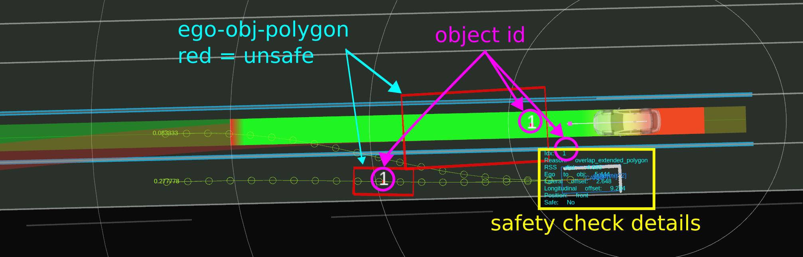


利用可能な情報

1. 自車と物体との関係、および安全確認情報
2. 最新の安全確認位置までの自車位置の補間
3. 物体が安全かどうか、ポリゴンの色で表示 (緑 = 安全、赤 = 危険)
4. 有効な候補パス
5. 車線変更開始位置および終了位置

