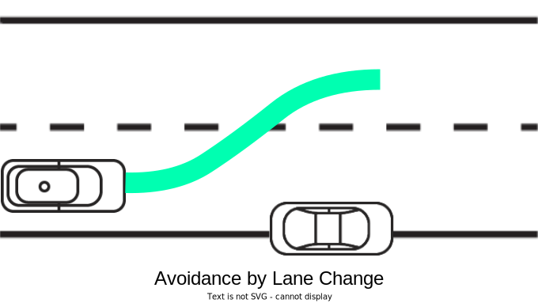
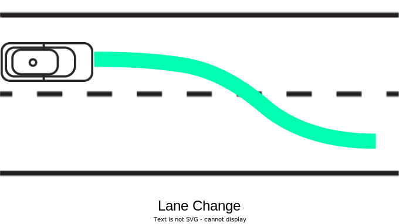

# 行動経路プランナー

行動経路プランナーの主な目的は、事故のリスクを最小限に抑えることで自動運転車両の安全性を大幅に向上させることです。時間短縮による運転効率の向上、ルールベースのアプローチによる信頼性の向上を図っています。さらに、ユーザーは独自のカスタマイズされた行動モジュールを統合したり、自動車、バス、配送ロボットなどのさまざまなタイプの車両や、混雑した都市の道路から高速道路まで、さまざまな環境で使用したりすることができます。

このモジュールは、まずエゴビークルの現在の状況を、その位置、速度、周囲の環境を含めて徹底的に分析します。この分析により、車線変更や停止に関する重要な運転上の判断が下され、その後、安全かつ効率的な経路が生成されます。路面形状、交通ルール、動的な条件を考慮すると同時に、他の車両、歩行者、予期せぬ路面障害物などの静的および動的障害物を回避して、安全なナビゲーションを確保します。

さらに、プランナーは他の交通参加者と積極的に対話し、彼らの行動を予測して車両の経路を調整します。これにより、自動運転車両の安全性が確保されるだけでなく、交通の円滑化にも貢献します。速度制限や交通信号などの交通法規を遵守することで、さらに法的かつ予測可能な運転行動が保証されます。プランナーはまた、急激な操作を最小限に抑えるように設計されており、快適で自然な運転体験を目指しています。

!!! note

    [Planning Component Design](https://autowarefoundation.github.io/autoware-documentation/main/design/autoware-architecture/planning/)ドキュメントでは、行動経路プランナーモジュールの設計と将来の開発を導く基本的な理念を概説しています。現在の構成と継続的な開発の方向性を理解するために、このドキュメントを参照することを強くお勧めします。

## 目的 / ユースケース

基本的に、このモジュールには3つの主要な責任があります。

1. 交通状況に基づく**経路の作成**
2. **走行可能領域**の生成、つまり車両が操縦できる領域
3. 車両インターフェースに中継される**ターンシグナル**コマンドの生成

## 機能

### サポートされているシーンモジュール

行動経路プランナーには、次のシーンモジュールがあります

| 名前                       | 説明                                                                                                                                                                            | 詳細                                                                       |
| :------------------------- | :------------------------------------------------------------------------------------------------------------------------------------------------------------------------- | :---------------------------------------------------------------------------- |
| Lane Following             | このモジュールは、レーンレットの中心線から参照パスを生成します。                                                                                                              | LINK                                                                          |
| Static Obstacle Avoidance  | このモジュールは、回避すべきオブジェクトがある場合に回避パスを生成します。                                                                                           | [LINK](../autoware_behavior_path_static_obstacle_avoidance_module/README.md)  |
| Dynamic Obstacle Avoidance | WIP                                                                                                                                                                        | [LINK](../autoware_behavior_path_dynamic_obstacle_avoidance_module/README.md) |
| Avoidance By Lane Change   | このモジュールは、回避すべきオブジェクトがある場合にレーン変更パスを生成します。                                                                                         | [LINK](../behavior_path_avoidance_by_lane_change_module/README.md)            |
| Lane Change                | このモジュールは、必要に応じて実行され、他の車両との衝突チェックをクリアします。                                                                        | [LINK](../autoware_behavior_path_lane_change_module/README.md)                |
| External Lane Change       | WIP                                                                                                                                                                        | LINK                                                                          |
| Goal Planner               | このモジュールは、自動運転車が道路車線にあり、ゴールが路肩車線にある場合に実行されます。自動運転車はゴールで停止します。                                         | [LINK](../autoware_behavior_path_goal_planner_module/README.md)               |
| Start Planner              | このモジュールは、自動運転車が停止しており、自動運転車のフットプリントが路肩車線に含まれる場合に実行されます。このモジュールは、自動運転車が道路に合流したときに終了します。 | [LINK](../autoware_behavior_path_start_planner_module/README.md)              |
| Side Shift                 | （リモートコントロール用）外部からの指示に従ってパスを左右にシフトします。                                                                                 | [LINK](../autoware_behavior_path_side_shift_module/README.md)                 |

!!! メモ

以下の画像をクリックすると実行時の動画が見られます

<div align="center">
<table>
<tr>
<td></td>
<td><a href="https://www.youtube.com/watch?v=A_V9yvfKZ4E"></a></td>
<td></td>
</tr>
<tr>
<td><a href="https://www.youtube.com/watch?v=0jRDGQ84cD4"></a></td>
<td><a href="https://www.youtube.com/watch?v=xOjnPqoHup4"></a></td>
<td><a href="https://www.youtube.com/watch?v=ornbzkWxRWU"></a></td>
</tr>
</table>
</div>

!!! メモ

ユーザーは追加の動作については、[Planningコンポーネント設計](https://autowarefoundation.github.io/autoware-documentation/main/design/autoware-architecture/planning/#supported-functions)を参照できます。

#### 新しいモジュールを追加または実装する方法

すべてのシーンモジュールは、基本クラス`scene_module_interface.hpp`を継承することにより実装されます。

!!! 注意

このサブセクションの残りの部分は、作業中（WIP）です。

### プランニングマネージャー

プランニングマネージャーの責任には、次のものが含まれます。

1. 自律走行車が直面している特定の状況に応じて、関連するシーンモジュールをアクティブにします。たとえば、駐車車両が自車の走行車線をブロックしている場合、マネージャーは障害物回避モジュールを作動させます。
2. 複数のモジュールが同時に実行されているときの、実行順序を管理します。たとえば、車線変更モジュールと障害物回避モジュールの両方が動作している場合、マネージャーはどちらを優先させるかを決定します。
3. 複数のモジュールが同時にアクティブで、それぞれが独自のパスを生成する場合、それらのパスをマージして、単一の機能パスを作成します。

!!! メモ

シーンモジュールの遷移（登録されたモジュール、承認されたモジュール、候補モジュール）を確認するには、[挙動パスプランニング構成ファイル](https://github.com/autowarefoundation/autoware_launch/blob/0cd5d891a36ac34a32a417205905c109f2bafe7b/autoware_launch/config/planning/scenario_planning/lane_driving/behavior_planning/behavior_path_planner/behavior_path_planner.param.yaml#L3)で`verbose: true`を設定します。


!!! メモ

さらに詳しい情報については、[マネージャー設計](./docs/behavior_path_planner_manager_design.md)ドキュメントを参照してください。

## 入出力/API

### 入力

| 名前                          | 必須 | タイプ                                                    | 説明 |
| :---------------------------- | :-------: | :------------------------------------------------------ | :------------------------------------------------------------------------------------------------------------------------------------------------------------------------------------------------------------------------------- |
| ~/input/odometry              | ○     | `nav_msgs::msg::Odometry`                               | 自車速度 |
| ~/input/accel                 | ○     | `geometry_msgs::msg::AccelWithCovarianceStamped`        | 自車加速度 |
| ~/input/objects               | ○     | `autoware_perception_msgs::msg::PredictedObjects`       | 知覚モジュールからの動的オブジェクト |
| ~/input/occupancy_grid_map    | ○     | `nav_msgs::msg::OccupancyGrid`                          | 知覚モジュールからのオキュパンシーグリッドマップ。Goal Plannerモジュールでのみ使用 |
| ~/input/traffic_signals       | ○     | `autoware_perception_msgs::msg::TrafficLightGroupArray` | 知覚モジュールからの交通信号情報 |
| ~/input/vector_map            | ○     | `autoware_map_msgs::msg::LaneletMapBin`                 | ベクトルマップ情報 |
| ~/input/route                 | ○     | `autoware_planning_msgs::msg::LaneletRoute`             | スタートからゴールまでの現在の経路 |
| ~/input/scenario              | ○     | `tier4_planning_msgs::msg::Scenario`                    | 現在のシナリオが `Scenario:LaneDriving` の場合、動作パスプランナーを起動 |
| ~/input/lateral_offset        | △     | `tier4_planning_msgs::msg::LateralOffset`               | Side Shiftをトリガーする水平方向オフセット |
| ~/system/operation_mode/state | ○     | `autoware_adapi_v1_msgs::msg::OperationModeState`       | Planningモジュールは、車両が自動運転モードか制御可能かを知る<sup>[参照](https://github.com/autowarefoundation/autoware.universe/blob/main/system/autoware_default_adapi/document/operation-mode.md)</sup> |

- ○ 必須: これらの一部が存在しない場合、Planningモジュールは機能しません。
- △ オプション: 一部のモジュールは機能しませんが、Planningモジュールは引き続き動作できます。

### 出力

| 名前                          | タイプ                                               | 説明                                                                                                | QoS耐久性    |
| :---------------------------- | :------------------------------------------------- | :---------------------------------------------------------------------------------------------- | ----------------- |
| ~/output/path                 | `tier4_planning_msgs::msg::PathWithLaneId`          | モジュールによって生成されたパス                                                                     | `volatile`        |
| ~/output/turn_indicators_cmd  | `autoware_vehicle_msgs::msg::TurnIndicatorsCommand` | ウインカーコマンド                                                                               | `volatile`        |
| ~/output/hazard_lights_cmd    | `autoware_vehicle_msgs::msg::HazardLightsCommand`   | ハザードランプコマンド                                                                             | `volatile`        |
| ~/output/modified_goal        | `autoware_planning_msgs::msg::PoseWithUuidStamped`  | 出力する修正済み目標コマンド                                                                   | `transient_local` |
| ~/output/reroute_availability | `tier4_planning_msgs::msg::RerouteAvailability`     | モジュールのこれから進む予定のパス（外部の承認が得られ次第すぐに実行される予定）            | `volatile`        |

### デバッグ


| 名称                                  | 型                                                     | 説明                                                                                    | QoS耐久性     |
| :----------------------------------- | :------------------------------------------------------ | :---------------------------------------------------------------------------------------- | -------------- |
| ~/debug/avoidance_debug_message_array  | `tier4_planning_msgs::msg::AvoidanceDebugMsgArray`  | 回避に対するデバッグメッセージ。回避経路を生成できない理由をユーザーに通知する。 | `volatile`     |
| ~/debug/lane_change_debug_message_array | `tier4_planning_msgs::msg::LaneChangeDebugMsgArray` | レーン変更に対するデバッグメッセージ。レーン変更プロセス中の安全でない理由をユーザーに通知する。 | `volatile`     |
| ~/debug/maximum_drivable_area          | `visualization_msgs::msg::MarkerArray`              | 最大静的走行可能エリアを表示する。                                                       | `volatile`     |
| ~/debug/turn_signal_info               | `visualization_msgs::msg::MarkerArray`              | TBA                                                                                       | `volatile`     |
| ~/debug/bound                          | `visualization_msgs::msg::MarkerArray`              | 静的走行可能エリアのデバッグ                                                            | `volatile`     |
| ~/planning/path_candidate/\*           | `autoware_planning_msgs::msg::Path`                 | 承認前の経路。                                                                            | `volatile`     |
| ~/planning/path_reference/\*           | `autoware_planning_msgs::msg::Path`                 | Planningコンポーネントによって生成された参照経路。                                       | `volatile`     |

!!! note

    詳細なトピックの購読および公開については、[behavior_path_planner.xml](https://github.com/autowarefoundation/autoware.universe/blob/9000f430c937764c14e43109539302f1f878ed70/planning/behavior_path_planner/launch/behavior_path_planner.launch.xml#L36-L49) を参照してください。

## モジュールの有効化または無効化の方法

動作パスプランナーでモジュールを有効化または無効化することは、基本的に2つのキーファイル「`default_preset.yaml`」と「`behavior_path_planner.launch.xml`」で管理されます。

`default_preset.yaml` ファイルは、プランナー内の特定のモジュールを有効または無効にするための設定ファイルとして機能します。プランナーのモジュールまたは機能を表す一連の引数が含まれています。例えば：

- `launch_static_obstacle_avoidance_module`: 回避モジュールを有効にするには `true` に、無効にするには `false` に設定します。

!!! note

    `default_preset.yaml` を表示するには、[こちら](https://github.com/autowarefoundation/autoware_launch/blob/main/autoware_launch/config/planning/preset/default_preset.yaml) をクリックします。

`behavior_path_planner.launch.xml` ファイルは、`default_preset.yaml` で定義された設定を参照して、動作パスプランナーのノードが実行されているときに設定を適用します。たとえば、`behavior_path_planner.launch.xml` のパラメータ `static_obstacle_avoidance.enable_module` は


```xml
<param name="static_obstacle_avoidance.enable_module" value="$(var launch_static_obstacle_avoidance_module)"/>
```

`default_preset.yaml`の`launch_static_obstacle_avoidance_module`に対応します。

したがって、モジュールの有効/無効を設定するには、`default_preset.yaml`内の対応するモジュールを`true`または`false`に設定します。これらの変更は、Autowareの次回起動時に適用されます。

## パス生成

パスを生成するための洗練された手法が使用されており、とりわけ車線変更や回避のような操作に焦点を当てています。この設計の中心には、一定加速度プロフィールによるリファレンスパスの滑らかな横断があります。このアプローチは、加速度の変化率を一定にすることで、スムーズな遷移を促進し、横方向動力の急激な変化を最小限に抑え、乗客の快適さと安全に不可欠です。

設計には、車両の経路の横断を時間をかけて計算するための複雑な数学的定式化が含まれます。これらの計算には、車両の横加速度と速度制限を考慮しながら、横変位、速度、加速度を決定することが含まれます。これにより、車両の動作が安全かつ制御可能であることが保証されます。

`ShiftLine`構造体（[here](https://github.com/autowarefoundation/autoware.universe/blob/9000f430c937764c14e43109539302f1f878ed70/planning/behavior_path_planner/include/behavior_path_planner/utils/path_shifter/path_shifter.hpp#L35-L48)を参照）は、横断が開始および終了するパス上の点を表すために利用されます。絶対座標の開始点と終了点、リファレンスパスに対するこれらの点での相対的なシフト長さ、リファレンスパス上の関連するインデックスなどの詳細が含まれます。この構造体は、パスシフトの管理に不可欠であり、パスプランナーが車両の現在の位置と計画された操作に基づいて軌道​​を動的に調整することを可能にします。

さらに、設計とその実装には、パスシフトに必要なパラメータを計算するためのさまざまな方程式と数学モデルが含まれています。これらには、横方向シフトの全距離、許容される最大横加速度とジャーク、シフトに必要な全時間が含まれます。また、ほとんどの車線変更と回避のケースでは特定の時間間隔がないという単純な仮定など、実践的な考慮事項も考慮されています。

シフトされたパス生成ロジックにより、行動パスプランナーは安全で効率的なパスを動的に生成し、車両の横方向の動きを正確に制御して、車線変更と回避操作のスムーズな実行を確保できます。この慎重な計画と実行は、車両の動的能力と安全上の制約に従うことで、自律走行ナビゲーションの効率と安全性を最大化します。

!!! note

    数学好きの方は、[パス生成設計](../autoware_behavior_path_planner_common/docs/behavior_path_planner_path_generation_design.md)を参照してください。

## 衝突アセスメント/安全チェック

行動パスプランナーの衝突アセスメント機能の目的は、すべてのモジュール間でターゲットオブジェクトとの衝突の可能性を評価することです。これは2つのシナリオで使用されます。

1. 候補パスの生成中、生成された候補パスに衝突がないことを確認します。
2. パスがマネージャーによって承認され、自車が現在のモジュールを実行しているとき。現在の状況が安全でないと判断された場合、各モジュールの要件に応じて、プランナーは実行をキャンセルするか、別のモジュールを実行することを選択します。

安全チェックプロセスにはいくつかのステップが含まれます。最初に、特定の時点でのターゲットオブジェクトのポーズを取得します。通常、予測パスの補間によって取得します。次に、この時点で自車とターゲットオブジェクトとの間に重複がないかを確認します。重複が検出されると、パスは安全ではないとみなされます。また、この関数は、与えられたパスに沿ったアーク長を使用して、どちらの車両が前方にいるかを識別します。この関数は、自車とターゲットオブジェクトの両方の予測パス内の各点のヨー角が、次のパス点に向いていると仮定して動作します。

安全チェックの重要な部分は、RSS（責任感応型安全性）距離に影響を受けたアルゴリズムの計算です。このアルゴリズムは、反応時間、安全時間マージン、両車両の速度と減速度などの要因を考慮します。自車とターゲット車両の両方に拡張オブジェクトポリゴンが作成されます。特に、後方オブジェクトのポリゴンは、縦方向にRSS距離、横方向にマージンで拡張されます。最後に、この拡張された後方オブジェクトポリゴンと前方オブジェクトポリゴンとの重複を確認します。重複があれば、潜在的に危険な状況を示します。

ただし、このモジュールにはターゲットオブジェクトの予測パス内の各点のヨー角に関する制限があり、必ずしも次の点に正確に向いているとは限らないため、エッジケースでは不正確になる可能性があります。

!!! note

    衝突評価方法の詳細については、[安全チェックユーティリティ](../autoware_behavior_path_planner_common/docs/behavior_path_planner_safety_check.md)を参照してください。

## 走行可能領域の生成

### 静的走行可能領域のロジック

走行可能領域は、自車が走行できる領域を決定するために使用されます。静的走行可能領域の拡張の主な目標は、車両の現在の動作に必要なスペースのみを含み、不要な領域を除外する領域を生成することで、安全な走行を確保することです。たとえば、`avoidance`モジュールが実行されている間、走行可能領域には障害物周辺での操作に必要な追加スペースが含まれ、レーンレット領域の外側に回避パスを拡張しないことで動作を制限します。

<div align="center">
    <table>
        <tr>
            <td></td>
        </tr>
        <tr>
            <td></td>
        </tr>
    </table>
</div>

静的走行可能領域の拡張は、レーンの正しい配置と、左右の境界内での車両の前後の両方のカバー範囲に関する仮定に基づいて動作します。走行可能領域生成の主なパラメータには、自車に対する追加のフットプリントオフセット、動的オブジェクトの処理、最大拡張距離、および拡張の特定の方法が含まれます。さらに、各モジュールは独自の走行可能領域を生成するため、それを入力として次の実行モジュールの走行可能領域を生成する前に、または統一された走行可能領域を生成する前に、システムは走行可能領域を使用して車両をソートします。これにより、走行可能領域の生成に使用するレーンの正しい定義が確保されます。

!!! note

### Dynamic Drivable Area Logic

大型車はより多くのスペースを必要とし、そのため現在の車線からはみ出すことがあります。交差点でバスが曲がるときが典型的な例です。このような場合、静的な走行可能エリアに依存するのは不十分です。静的な方法は高精細地図によって提供される車線情報に依存するためです。静的なアプローチの制限を克服するために、ダイナミック走行可能エリア拡張アルゴリズムは自動運転車の走行可能スペースをリアルタイムで調整します。車両の位置に大幅な変化があった場合にのみ更新することによって、以前に計算された経路データを再利用して計算能力を節約します。システムは、車両の旋回半径やその他の動的要因に対応するために必要な最小車線幅を評価します。その後、車両の経路曲率を考慮して安全な操縦に十分なスペースがあることを保証するために、走行可能エリアの境界の最適な拡張を計算します。これらの境界を拡張または縮小できる速度は、車両のナビゲーションの安定性を維持するために調整されます。このアルゴリズムは、固定障害物を回避し、法的な運転制限を守る一方で、走行可能スペースを最大化することを目指しています。最後に、これらの境界調整を適用し、経路曲率の計算を滑らかにすることで、車両の操作全体で安全で法令を遵守した航行パスが維持されるようにします。

!!! note

    この機能は[drivable_area_expansion.param.yaml](https://github.com/autowarefoundation/autoware_launch/blob/0cd5d891a36ac34a32a417205905c109f2bafe7b/autoware_launch/config/planning/scenario_planning/lane_driving/behavior_planning/behavior_path_planner/drivable_area_expansion.param.yaml#L10)で有効にすることができます。

## ターンシグナルの生成

Behavior Path Plannerモジュールは、`autoware_vehicle_msgs::msg::TurnIndicatorsCommand`を使用してターンシグナルコマンドを出力します（[TurnIndicatorsCommand.idl](https://github.com/autowarefoundation/autoware_msgs/blob/main/autoware_vehicle_msgs/msg/TurnIndicatorsCommand.msg)を参照）。システムは運転状況を評価し、旋回、車線変更、障害物回避などの操作プランに基づいてターンシグナルをいつ作動させるかを決定します。

このフレームワークの中で、システムは**必要な**点滅器の作動と**要求される**作動を区別します。**必要な**作動は、車線変更や旋回前の合図など、一般的な運転シナリオにおける交通法で推奨されるものです。**要求される**作動とは、障害物を避けるために急な車線変更を合図するなど、安全上の理由から必須と見なされるものです。

`TurnIndicatorsCommand`メッセージ構造には、`NO_COMMAND`（信号が必要ないことを示す）、`DISABLE`（信号を無効にする）、`ENABLE_LEFT`（左折を合図する）、`ENABLE_RIGHT`（右折を合図する）などの定数の1つを取ることができるコマンドフィールドがあります。Behavior Path Plannerは、点滅器を作動させる**必要な**シナリオと**要求される**シナリオの両方を考慮したルールベースのシステムに基づいて、適切なタイミングでこれらのコマンドを送信します。

!!! note

    詳細については、[Turn Signal Design](../autoware_behavior_path_planner_common/docs/behavior_path_planner_turn_signal_design.md)ドキュメントを参照してください。

## 再ルーティング

!!! warning

    再ルーティングは現在進行中の機能です。詳しい情報は後日掲載します。

## パラメータと設定

[設定ファイル](https://github.com/autowarefoundation/autoware_launch/tree/main/autoware_launch/config/planning/scenario_planning/lane_driving/behavior_planning/behavior_path_planner)は、ナビゲーションし管理しやすいように階層的なディレクトリ構造で構成されています。各サブディレクトリには、モジュールに関連する特定の設定ファイルが含まれています。ルートディレクトリには、プランナーの全体的な動作に適用される一般的な設定ファイルがあります。以下は、それぞれの設定ファイルを使用したディレクトリ構造の概要です。


```text
behavior_path_planner
├── behavior_path_planner.param.yaml
├── drivable_area_expansion.param.yaml
├── scene_module_manager.param.yaml
├── static_obstacle_avoidance
│   └── static_obstacle_avoidance.param.yaml
├── avoidance_by_lc
│   └── avoidance_by_lc.param.yaml
├── dynamic_obstacle_avoidance
│   └── dynamic_obstacle_avoidance.param.yaml
├── goal_planner
│   └── goal_planner.param.yaml
├── lane_change
│   └── lane_change.param.yaml
├── side_shift
│   └── side_shift.param.yaml
└── start_planner
    └── start_planner.param.yaml
```

同様に、[common](https://github.com/autowarefoundation/autoware_launch/tree/main/autoware_launch/config/planning/scenario_planning/common) ディレクトリには、さまざまなモジュールで使用されるコンフィギュレーションファイルが含まれており、挙動パスプランナの機能に必要な共有パラメータと設定が提供されます。


```text
common
├── common.param.yaml
├── costmap_generator.param.yaml
└── nearest_search.param.yaml
```

[preset](https://github.com/autowarefoundation/autoware_launch/tree/main/autoware_launch/config/planning/preset)ディレクトリには、さまざまなモジュールの運用状態を管理するための構成が含まれています。これには、システム内のモジュールを有効または無効にするための、default_preset.yamlファイルが含まれています。


```text
preset
└── default_preset.yaml
```

## 制限事項と今後の課題

1. Goal Plannerモジュールは、他のモジュールと同時に実行できません。
2. このモジュールはプラグインとして設計されていません。カスタムモジュールを統合するのは容易ではなく、ユーザは動作パスプランナメインコードの一部を変更する必要があります。

