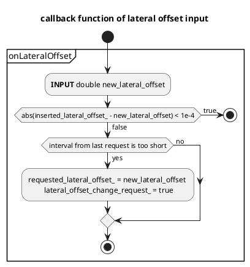
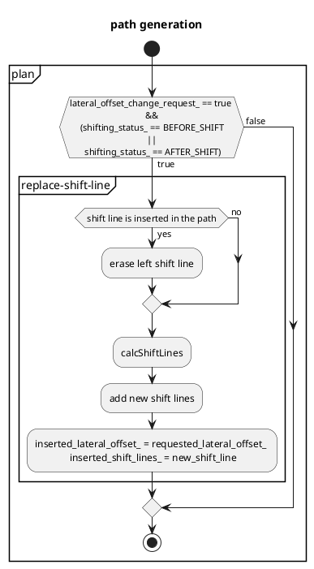
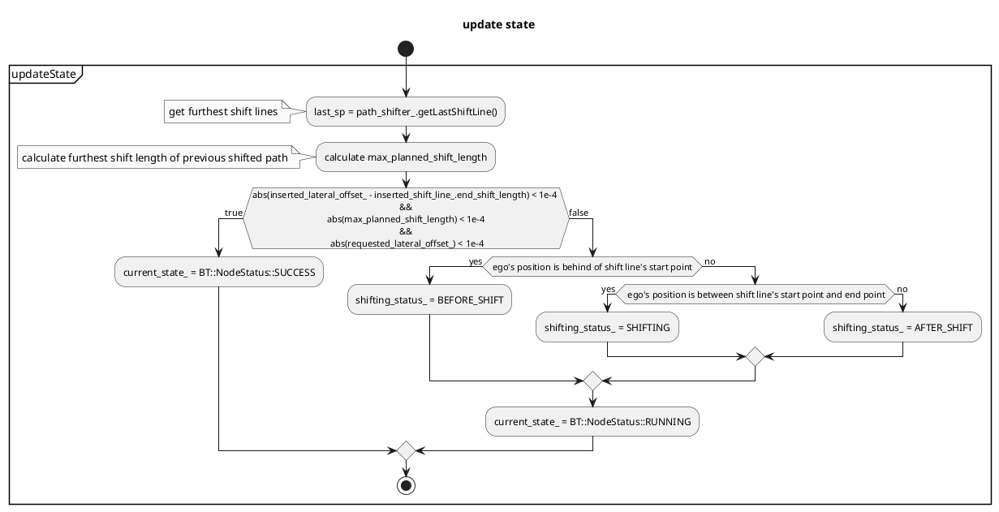

# Side Shift design

(For remote control) Shift the path to left or right according to an external instruction.

## Overview of the Side Shift Module Process

1. Receive the required lateral offset from the topic and/or the `~/set_lateral_offset` service.
2. Update the `requested_lateral_offset_` under the following conditions:
   a. Verify if the last update time has elapsed.
   b. Ensure the required lateral offset value is different from the previous one.
3. Insert the shift points into the path if the side shift module's status is not in the SHIFTING status.

Please be aware that `requested_lateral_offset_` is continuously updated with the latest values and is not queued.

## Lateral offset inputs and outputs

Offsets use the same sign convention as `tier4_planning_msgs/msg/LateralOffset` (**positive = left** of the reference path, **negative = right**).

| Interface    | Message / service                                               | Role                                                                                                                                                                                               |
| ------------ | --------------------------------------------------------------- | -------------------------------------------------------------------------------------------------------------------------------------------------------------------------------------------------- |
| Subscription | `~/input/lateral_offset` (`tier4_planning_msgs/LateralOffset`)  | Stream of requested lateral offset [m].                                                                                                                                                            |
| Service      | `~/set_lateral_offset` (`tier4_planning_msgs/SetLateralOffset`) | Request a new offset with a response: `EXPLICIT_LATERAL_OFFSET_AMOUNT` sets `shift_value` [m] directly; `LATERAL_OFFSET_DIRECTION` uses `LEFT` / `RIGHT` / `RESET` with step size from parameters. |
| Publisher    | `~/output/lateral_offset` (`tier4_planning_msgs/LateralOffset`) | Reports the **current** inserted lateral offset [m] for feedback.                                                                                                                                  |

The same validation (magnitude limits, minimum gap versus the previous offset, and so on) applies whether the request arrives on the topic or through the service.
It is recommended to use services so that the user can understand whether the request is accepted or not.

### `~/set_lateral_offset` response: `response_code` values

`response_code` is the primary outcome field. It uses the lateral-shift constants from `tier4_planning_msgs/srv/SetLateralOffset`, and may also use **`SERVICE_UNREADY`** and **`PARAMETER_ERROR`** from `autoware_common_msgs/msg/ResponseStatus.msg` with the **same numeric values** as `ResponseStatus.code`.

| Value | Constant                    | Typical `success` | Meaning                                                                                                    |
| ----: | --------------------------- | :---------------: | ---------------------------------------------------------------------------------------------------------- |
|     0 | `UNKNOWN`                   |      `false`      | No result assigned (for example default-initialized; this implementation sets `response_code` explicitly). |
|     1 | `SUCCESS`                   |      `true`       | The request was accepted and the lateral offset was updated.                                               |
| 10000 | `ERROR_UNKNOWN`             |      `false`      | An unspecified error occurred.                                                                             |
| 10001 | `ERROR_INVALID_MODE`        |      `false`      | `shift_mode` is not supported.                                                                             |
| 10002 | `ERROR_INVALID_DIRECTION`   |      `false`      | In `LATERAL_OFFSET_DIRECTION` mode, `shift_direction_value` is not `RESET`, `LEFT`, or `RIGHT`.            |
| 10003 | `ERROR_EXCEEDED_LIMIT`      |      `false`      | The offset is already at the configured limit and the request would exceed it.                             |
| 10004 | `ERROR_SHIFT_GAP_TOO_SMALL` |      `false`      | The requested change is smaller than `min_shift_gap`.                                                      |
| 10005 | `ERROR_MODULES_CONFLICTING` |      `false`      | Other active modules in `behavior_path_planner` conflict with this operation.                              |
| 20000 | `WARN_UNKNOWN`              |      `false`      | An unspecified warning occurred.                                                                           |
| 20001 | `WARN_EXCEEDED_LIMIT`       |      `true`       | The request hit the limit; the offset was clamped to the maximum allowed value.                            |

In addition, `status.success` is `true` only when `response_code` is `SUCCESS` (1) or `WARN_EXCEEDED_LIMIT` (20001); only then is the requested offset (possibly clamped) applied. Otherwise the previous requested offset is unchanged.

### `~/set_lateral_offset` response: `status` (`autoware_common_msgs/ResponseStatus`)

`status.message` summarizes the outcome using `response_code`. **`status.code` is never set to SetLateralOffset-specific values** (such as `SUCCESS` or `ERROR_EXCEEDED_LIMIT`); those appear only in `response_code`. When the failure is infrastructure or configuration, `status.code` is `SERVICE_UNREADY` or `PARAMETER_ERROR` (and matches `response_code`). For all other outcomes that use only SetLateralOffset constants, `status.code` is **`UNKNOWN`** (50000) from `ResponseStatus.msg`.

## Statuses of the Side Shift

The side shift has three distinct statuses. Note that during the SHIFTING status, the path cannot be updated:

1. BEFORE_SHIFT: Preparing for shift.
2. SHIFTING: Currently in the process of shifting.
3. AFTER_SHIFT: Shift completed.

<figure markdown>
  {width=1000}
  <figcaption>side shift status</figcaption>
</figure>

## Flowchart

