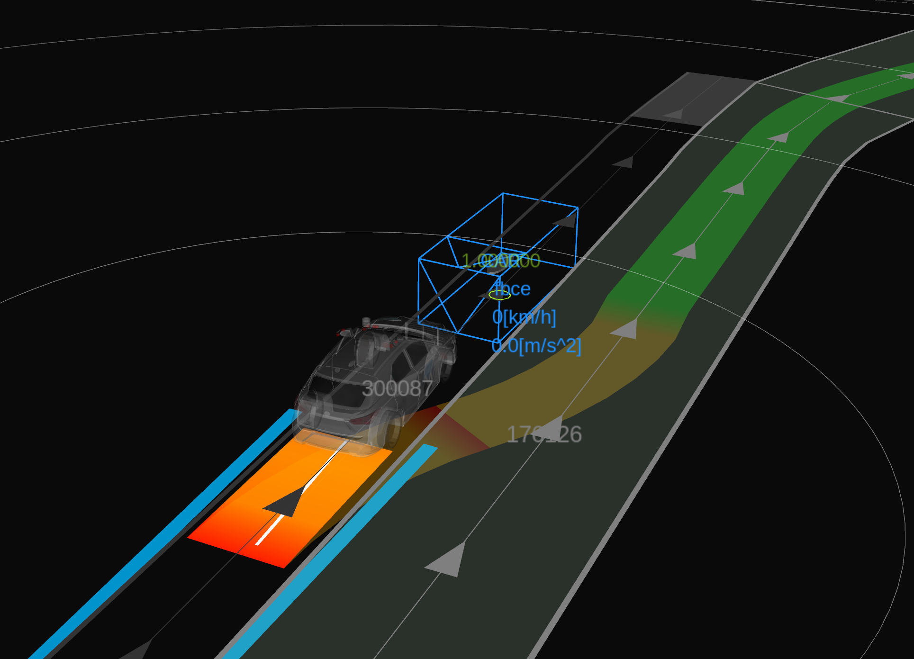
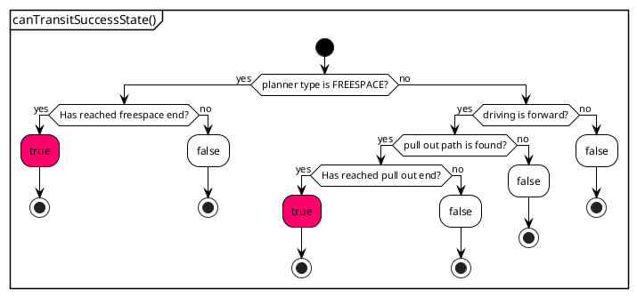
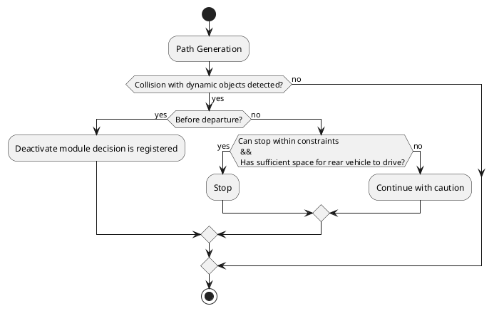
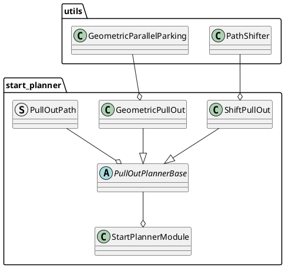

## スタートプランナー設計

## 目的 / 役割

このモジュールは、路肩または道路脇の車線から道路中央の車線に安全に合流するためのパスを生成して計画します。

具体的には、次の機能が含まれます。

- 路肩または道路脇の車線から道路中央の車線へ自動的に開始するためのパスを計画する。
- 路肩に駐車車両がある場合、モジュールは指定されたマージンのギャップを残して開始できるパスを生成する。
- 生成されたパスを走行中に他の交通参加者との衝突が検出された場合、可能な限り停止する。

<figure markdown>
  {width=1100}
</figure>

## ユースケース

パスの生成方法の典型的な例を示します。路肩からパスの生成を開始する例を示していますが、道路脇の車線からも生成できます。

<figure markdown>
  {width=1100}
</figure>

### **ユースケース 1: シフト・プルアウト**

路肩で、前方に駐車車両がなく、路肩が十分に長い場合、前方シフト・プルアウトパス（一貫したジャークを持つクロソイド曲線）が生成されます。

<figure markdown>
  {width=1100}
</figure>

### **ユースケース 2: ジオメトリック・プルアウト**

路肩で、前方に障害物があり、後方の路肩が十分に長くない場合、ジオメトリック・プルアウトパスが生成されます。

<figure markdown>
  {width=1100}
</figure>

### **ユースケース 3: 後退とシフト・プルアウト**

路肩で、前方に駐車車両があり、後方の路肩が十分に長い場合、後退して前進シフト・プルアウトパスを生成するパスが作成されます。

<figure markdown>
  {width=1100}
</figure>

### **ユースケース 4: 後退とジオメトリック・プルアウト**

路肩で、前方に障害物があり、後退するスペースが十分でない場合、後退してからジオメトリック・プルアウトを行うパスが生成されます。

<figure markdown>
  {width=1100}
</figure>

### **ユースケース 5: フリースペース・プルアウト**

シフト・プルアウトパスとジオメトリック・プルアウトパスの両方を生成できない状況で、フリースペースパスが生成できるという情報が地図に付与されている場合、フリースペースアルゴリズムに基づくパスが生成されます。

<figure markdown>
  {width=1100}
</figure>

**上記の例におけるパス生成のパターンは、デフォルトのパラメータに基づいています。ただし、以下のセクションで説明するように、パス生成ポリシーを変更したり、静的オブジェクトの周りのマージンを調整したりすることで、後退する可能性が高いパスや幾何学的なパスを生成する可能性を高めるなどの、側面を制御できます。**

## 制限事項

以下にいくつかの注目すべき制限事項を記載します。

- 路肩の前後または左右に駐車車両があり、それらとの間に一定の距離を維持することができない場合、停止パスが生成され、デッドロックが発生する可能性があります。
- `behavior_path_planner` のデフォルト設定では、回避モジュールが後工程で動作し、オブジェクトを回避しようとします。ただし、`start_planner` モジュールが障害物を回避できるパスを出力するとは限りません。つまり、回避不可能なパスが生成されると、デッドロックが発生する可能性があります。
- セーフティチェックのパフォーマンスは、`map_based_prediction` ノードによって生成される予測パスの精度に依存します。現在、加速度を考慮した予測パスは生成されず、低速オブジェクトのパスは正確に生成されない可能性があるため、注意が必要であることに注意してください。
- ルールベースアルゴリズムの現在の仕様を考慮すると、パスの安全性と人間にとっての自然さとのトレードオフがあります。このトレードオフを管理するためパラメータを調整することは可能ですが、これらの側面をさらに調整するために改善が必要です。

## 開始/終了条件

### **開始条件**

`StartPlannerModule` は、`isExecutionRequested` 関数によって評価される特定の基準に基づいて、実行を開始するように設計されています。次の条件が満たされている場合、モジュールは **実行しません**。

1. **自車位置が道路の中央**: モジュールは、車両の自車位置が道路の中央にあると判定された場合に開始されません。これにより、プランナーは路肩の位置から開始されます。

2. **車両が開始位置から離れている**: 車両が開始位置から離れている場合、モジュールは実行しません。これにより、新しいゴールが与えられたときの冗長な実行が防止されます。

3. **車両がゴールに到着**: 車両がすでにゴール位置に到着している場合、モジュールは開始されません。これにより、目的地に到着したときの不要な実行が防止されます。

4. **車両が走行中**: 車両が依然として走行中の場合、モジュールは開始を延期します。これにより、安全のために安定した静止状態からプランニングが行われるようになります。

5. **同じルートセグメント内でゴールが後方**: モジュールは、ゴール位置が同じルートセグメント内で自車位置の後方にある場合に開始されません。この条件は、車両が現在の経路上で後退する必要があるルートのプランニングにおける複雑さを回避するためにチェックされ、現在はサポートされていません。

### **終了条件**

`StartPlannerModule` は、特定の条件が満たされると終了し、使用されているプランナーの種類によって異なります。 `canTransitSuccessState` 関数は、以下の基準に基づいてモジュールが成功状態に移行する必要があるかどうかを判断します。

#### Freespace Planner がアクティブな場合

- Freespace パスのエンドポイントに到達した場合、モジュールは成功状態に移行します。

#### 他のタイプのプランナーがアクティブな場合

成功状態への移行は、以下の条件によって決定されます。

- リバースパスが生成されるか、プルアウトパスの検索が失敗した場合:
  - モジュールは成功状態に移行しません。
- プルアウトパスのシフトセクションのエンドポイントに到達した場合:
  - モジュールは成功状態に移行します。

以下のフローチャートは、`canTransitSuccessState` 関数における意思決定プロセスを示しています。

## 安全保証のコンセプト

衝突安全性へのアプローチは、静的情報を考慮した経路の生成と、生成された経路の安全性を確保するための動的障害物との衝突検出の 2 つの主要なコンポーネントに分けられます。

### 1. 静的情報を考慮した経路の生成

- **経路逸脱チェック**：経路が指定されたレーンレット内に留まることを保証します。この機能はデフォルトで有効になっていますが、必要に応じて無効にすることができます。

- **経路からの静的障害物のクリアランス**：静的障害物の周囲に十分なマージンが維持されていることを検証します。このプロセスには、車両サイズのフットプリントを現在位置からプルアウトエンドポイントまで作成することが含まれ、パラメータで調整できます。その後、静的障害物ポリゴンとの距離が計算されます。この距離が指定されたしきい値を下回ると、経路は安全でないものとみなされます。しきい値レベル（例：[2.0、1.0、0.5、0.1]）を設定でき、システムは後述する検索優先順位に基づいて可能な限り最高のしきい値を満たす経路を検索し、ポリシーに基づいて安全な経路が選択されます。しきい値を満たす経路がない場合、安全な経路がないことが判断されます。

- **静止物体からのクリアランス**：車両の前方と後方に配置された静止物体から十分な距離を維持することは、安全上不可欠です。経路と静止物体がある程度の余白が確認されていても、シフト開始位置から前面の静止物体までの距離が `collision_check_margin_from_front_object` m 未満の場合、または後方の静止物体までの距離が `back_objects_collision_check_margin` m 未満の場合は、経路は安全でないとみなされます。

  - なぜ前面の物体からの余白が必要ですか？
    「ジオメトリカルプルアウトパス」のシナリオでは、経路から静的障害物までのクリアランスが最小限で、前方に停止している車両がある場合を考えてください。この場合、経路は安全基準を満たし、生成される可能性がありますが、同時に動作する回避モジュールが障害物を回避できないと判断し、車両のデッドロックにつながる可能性があります。回避操作のために十分な距離を確保するため、前面の障害物との距離が評価されます。このパラメータを増やすことで回避モジュール内での固定化を防ぐことができますが、「バックワードパス」または「ジオメトリカルプルアウトパス」が生成されることが多くなり、人間にとって不自然に見える経路になる可能性があります。

  - なぜ後方の物体からの余白が必要ですか？
    前面の物体に対しては、たとえ経路から静的障害物までのクリアランスが最小限であっても回避計画を通じて経路を上書きし、静的障害物から安全な距離を維持できる別の動作モジュールが介入できます。しかし、車両後方の物体については、start_planner 以外の別の動作モジュールが経路を変更してマージンを確保することは不可能であり、「obstacle_cruise_planner」などのアクションモジュールによるデッドロックやその後の固定化につながる可能性があります。したがって、後方の静止物体に対してマージンが設定されています。

`collision_check_margins` が [2.0、1.0、0.5、0.1] に設定されている場合の開始ポーズ検索ステップの表現を次に示します。プロセスは次のとおりです。

1. **開始ポーズ候補の生成**

   - 車両の現在位置を基準点として設定します。
   - `max_back_distance` まで車両後方の考慮エリアを決定します。
   - `backward_search_resolution` で定義された間隔で後方方向に開始ポーズの候補ポイントを生成します。
   - 現在位置を開始ポーズの候補の 1 つとして含めます。

   {width=1100}

2. **最大の余白で検索を開始**

   - 最も大きなしきい値（例：2.0 メートル）で検索を開始します。
   - 各開始ポーズの候補が 2.0 メートル以上の余白を維持しているかどうかを評価します。
   - 同時に、その開始ポーズから生成された経路が他の必要な基準（例：経路逸脱チェック）を満たしていることを確認します。
   - 後述する検索優先順位に従って順番に評価し、条件を満たせば開始ポーズを採用します。

3. **しきい値レベルによる検索の繰り返し**

   - 条件を満たす開始ポーズが見つからない場合は、しきい値を次のレベル（例：1.0 メートル）に下げ、検索を繰り返します。

4. **検索の継続**

   - 条件を満たす開始ポーズが見つかるまで、またはしきい値レベルが最小値（例：0.1 メートル）に達するまで検索を続けます。
   - このプロセスの目的は、可能な限り大きなマージンを確保し、かつ経路に必要な条件を満たす開始ポーズを見つけることです。

5. **停止経路の生成**

   - どのしきい値レベルでも条件を満たす開始ポーズがない場合は、停止経路を生成して安全を確保します。

#### **検索優先順位**

静的障害物を十分にクリアできる安全な経路を前方まで生成できない場合、車両の現在位置から後方検索が行われ、プルアウトパスを生成するための適切な開始点が特定されます。

この後方検索中には、`search_priority` パラメータに基づいてさまざまなポリシーが適用できます。

`efficient_path` を選択すると、車両をどれだけ後方に移動させる必要があるかに関係なく、シフトプルアウトパスを作成することに焦点を当てます。
`short_back_distance` を選択すると、後方移動が最小限の場所を探すようになります。

`PriorityOrder` はペアのベクトルとして定義され、各要素は開始ポーズ候補のインデックスを表す `size_t` インデックスとプランナーの種類で構成されます。`PriorityOrder` ベクトルは先頭から順に処理されるため、ベクトルの上位にあるペアはプルアウトパスの生成において優先的に選択されます。

##### `efficient_path`

`search_priority` が `efficient_path` に設定されており、`shift_pull_out` を優先する場合、`PriorityOrder` 配列はすべての開始ポーズ候補に対して `shift_pull_out` がグループ化され、その後で次のプランナ―の種類に移るように設定されます。この優先順位付けは配列の順序に反映され、`shift_pull_out` は `geometric_pull_out` の前にリストされます。

| インデックス | プランナータイプ |
|---|---|
| 0 | shift_pull_out |
| 1 | shift_pull_out |
| ... | ... |
| N | shift_pull_out |
| 0 | geometric_pull_out |
| 1 | geometric_pull_out |
| ... | ... |
| N | geometric_pull_out |

このアプローチは、`geometric_pull_out` に進む前に `shift_pull_out` で候補をすべて試行することを優先し、`shift_pull_out` が適切である可能性がある状況では効率的である可能性があります。

##### `short_back_distance`

`search_priority` が `short_back_distance` に設定されている場合、アレイは開始ポーズ候補ごとにプランナータイプを切り替えます。これにより、以前の候補が成功した場合に車両が後退する必要がある距離を最小限に抑えることができます。

| インデックス | Plannerタイプ       |
| ----- | ------------------ |
| 0     | shift_pull_out     |
| 0     | geometric_pull_out |
| 1     | shift_pull_out     |
| 1     | geometric_pull_out |
| ...   | ...                |
| N     | shift_pull_out     |
| N     | geometric_pull_out |

この順序付けは、後退距離の最小化が優先され、各プランナーがなるべく近いスタート地点で成功する可能性が均等となる場合に有効です。

### 2. 動的障害物との衝突検出

- **ダイナミック衝突検出での RSS の適用**: 衝突検出は、安全距離が保持されているかどうかを評価するために RSS (責任感のある安全) モデルに基づいています。[安全チェック機能の説明](../autoware_behavior_path_planner_common/docs/behavior_path_planner_safety_check.md) を参照してください。

- **衝突チェック実行範囲**: ダイナミックオブジェクトとの衝突に関する安全チェックは、各機動の始点と終点の間で定義された境界内で行われ、自車位置が自車の後ろから来るダイナミックオブジェクトの進行を妨げたり妨害したりしないようにします。

- **衝突応答ポリシー**: 生成されたパスに沿ってダイナミックオブジェクトとの衝突が検出された場合、衝突検出が出発前に発生した場合、モジュール決定は非アクティブになります。車両がすでに動き始めていた場合は、ブレーキ制約内で実行可能であり、後続車が自車位置と車線境界の間のギャップを通過できる場合に、停止を試みます。

#### **シフトプルアウト時に実行される安全確認範囲の例**

シフトプルアウト時の安全確認範囲の例を示します。安全確認はシフト開始から終了まで実行されます。後続車両が通行するのに十分なスペースがない場合、動的オブジェクトに対する安全確認は無効になります。

<figure markdown>
  {width=1100}
</figure>

**注：後退時は安全確認は実行されません。安全確認は後退動作が停止した地点から開始されます。**

## RTCインターフェイス

システムは、手動モードと自動モードで別々に動作します。特に、出発前と動的障害物との相互作用に関する動作が異なります。各モードにおける具体的な動作を以下に示します：

### 承認が必要な場合

#### 前進運転

- **開始承認が必要**: パスが生成されていても、移動を開始するには承認が必要です。後方から接近する車両など、動的オブジェクトが危険を及ぼす場合、候補パスが表示される可能性がありますが、出発には承認が必要です。

#### 後退運転 + 前進運転

- **複数の承認が必要**: 計画されたパスに後退運転が含まれる場合、後退を開始する前と前進運動を再開する前に複数の承認が必要です。前進運動を開始する前に、システムは動的障害物に対する安全確認を実行します。検出された場合、出発の承認が必要です。

この差別化により、手動モード（`enable_rtc`がtrue）の重要な場面で人間の介入を必要とすることで安全な運転を確保し、両方のモードで自動安全確認を取り入れ、動的障害物がある場合の安全でない動作を防ぎます。

## 設計

## start_planner の汎用パラメータ

| 名称                                                         | 単位 | タイプ | 説明                                                                                                                                                                                                                                                                                                                                                                 | 初期値 |
| :---------------------------------------------------------- | :--- | :----|:-------------------------------------------------------------------------------------------------------------------------------------------------------------------------------------------------------------------------------------------------------------------------------------------------------------------------------------------------------------| :----|
| `th_arrived_distance`                                         | [m]   | double | 終端パスの到着距離の閾値                                                                                                                                                                                                                                                                                                                                                   | 1.0 |
| `th_stopped_velocity`                                         | [m/s] | double | 終端パスの到着速度の閾値                                                                                                                                                                                                                                                                                                                                                | 0.01 |
| `th_stopped_time`                                             | [s]   | double | 終端パスの到着時間の閾値                                                                                                                                                                                                                                                                                                                                              | 1.0 |
| `th_distance_to_middle_of_the_road`                          | [m]   | double | 車両が道路の中央にいるかどうかを判断するための距離閾値                                                                                                                                                                                                                                                                                                  | 0.1 |
| `collision_check_margins`                                     | [m]   | double | 障害物衝突チェックマージンリスト                                                                                                                                                                                                                                                                                                                | [2.0, 1.0, 0.5, 0.1] |
| `shift_collision_check_distance_from_end`                   | [m]   | double | エンドポーズから衝突チェック距離シフトエンドポーズ                                                                                                                                                                                                                                                                                            | -10.0 |
| `geometric_collision_check_distance_from_end`                | [m]   | double | エンドポーズから衝突チェック距離ジオメトリエンドポーズ                                                                                                                                                                                                                                                                                        | 0.0 |
| `collision_check_margin_from_front_object`                   | [m]   | double | 前方オブジェクトからの衝突チェックマージン                                                                                                                                                                                                                                                                                              | 5.0 |
| `skip_rear_vehicle_check`                                     | -     | bool   | リア車両チェックをスキップするフラグ（リア車両チェックは、後続車が進行を妨げているときに自車による出発を安全チェックをスキップして続行するために実行されます）                                                                                                                                                                      | false |
| `extra_width_margin_for_rear_obstacle`                       | [m]   | double | 車両が路肩の車線から車線に合流する際に、後方障害物が自車を追い越せるかどうかを判断する際、認識された後方障害物の幅に追加される余分な幅                                                                                                                                                                             | 0.5 |
| `object_types_to_check_for_path_generation`.`check_car`        | -     | bool   | パス生成のための車の確認フラグ                                                                                                                                                                                                                                                                                                               | true |
| `object_types_to_check_for_path_generation`.`check_truck`      | -     | bool   | パス生成のためのトラックの確認フラグ                                                                                                                                                                                                                                                                                                          | true |
| `object_types_to_check_for_path_generation`.`check_bus`        | -     | bool   | パス生成のためのバスの確認フラグ                                                                                                                                                                                                                                                                                                               | true |
| `object_types_to_check_for_path_generation`.`check_bicycle`    | -     | bool   | パス生成のための自転車の確認フラグ                                                                                                                                                                                                                                                                                                        | true |
| `object_types_to_check_for_path_generation`.`check_motorcycle` | -     | bool   | パス生成のためのオートバイの確認フラグ                                                                                                                                                                                                                                                                                                       | true |
| `object_types_to_check_for_path_generation`.`check_pedestrian` | -     | bool   | パス生成のための歩行者の確認フラグ                                                                                                                                                                                                                                                                                                      | true |
| `object_types_to_check_for_path_generation`.`check_unknown`    | -     | bool   | パス生成のための未知の確認フラグ                                                                                                                                                                                                                                                                                                               | true |
| `center_line_path_interval`                                  | [m]   | double | 基準中心線パスポイントのインターバル                                                                                                                                                                                                                                                                                                              | 1.0 |

### **自車速度計画**

進行中

### **安全な空き領域での安全性チェック**

進行中

## 安全性チェックのパラメータ

### 停止基準パラメータ

`stop_condition` 以下のパラメータは停止条件の基準を定義します。

| 名称                          | 単位    | タイプ   | 説明                             | デフォルト値 |
| :---------------------------- | :------ | :----- | :-------------------------------------- | :------------ |
| maximum_deceleration_for_stop | [m/s^2] | double | 停止時の最大減速度                   | 1.0           |
| maximum_jerk_for_stop         | [m/s^3] | double | 停止時の最大ジャーク                   | 1.0           |

### 自車予測経路パラメータ

`path_safety_check.ego_predicted_path` 以下のパラメータは、自車の予測経路特性を指定します。

| 名前  | 単位 | 型 | 説明                                                                        | デフォルト値 |
| :---------------- | :------ | :----- | :-------------------------------------------------------------------------- | :------------ |
| `min_velocity`  | [m/s] | double | 自車の予測パスにおける最小速度 | 0.0 |
| `acceleration`  | [m/s^2] | double | 自車の予測パスにおける加速度 | 1.0 |
| `max_velocity`  | [m/s] | double | 自車の予測パスにおける最大速度 | 1.0 |
| `time_horizon_for_front_object` | [s] | double | 前方オブジェクトの予測に対する時間的範囲 | 10.0 |
| `time_horizon_for_rear_object`  | [s] | double | 後方オブジェクトの予測に対する時間的範囲 | 10.0 |
| `time_resolution`  | [s] | double | 自車の予測パスの時間分解能 | 0.5 |
| `delay_until_departure`  | [s] | double | 自車が走り出すまでの遅延時刻 | 1.0 |

### 対象物フィルタリングパラメータ

`target_filtering` 配下のパラメータは、セーフティチェック用の対象物のフィルタリングに関連しています。

| 名称                                             | 単位 | タイプ | 説明                                                                          | デフォルト値 |
| :------------------------------------------------ | :---- | :----- | :------------------------------------------------------------------------------- | :------------ |
| safety_check_time_horizon                       | [s]   | double | 自車と動的物体の予測パスの時間幅                                             | 5.0           |
| safety_check_time_resolution                    | [s]   | double | 自車と動的物体の予測パスの時間分解能                                          | 1.0           |
| object_check_forward_distance                   | [m]   | double | 物体検出の前方距離                                                             | 10.0          |
| object_check_backward_distance                  | [m]   | double | 物体検出の後方距離                                                             | 100.0         |
| ignore_object_velocity_threshold                | [m/s] | double | velocityが下の物体は無視                                                     | 1.0           |
| object_types_to_check.check_car                 | -     | bool   | 車をチェックするフラグ                                                         | true          |
| object_types_to_check.check_truck               | -     | bool   | トラックをチェックするフラグ                                                   | true          |
| object_types_to_check.check_bus                 | -     | bool   | バスをチェックするフラグ                                                      | true          |
| object_types_to_check.check_trailer             | -     | bool   | トレーラーをチェックするフラグ                                                  | true          |
| object_types_to_check.check_bicycle             | -     | bool   | 自転車をチェックするフラグ                                                   | true          |
| object_types_to_check.check_motorcycle          | -     | bool   | オートバイをチェックするフラグ                                                | true          |
| object_types_to_check.check_pedestrian          | -     | bool   | 歩行者をチェックするフラグ                                                   | true          |
| object_types_to_check.check_unknown             | -     | bool   | unknownな物体のタイプをチェックするフラグ                                    | false         |
| object_lane_configuration.check_current_lane    | -     | bool   | 現在走行している車線をチェックするフラグ                                      | true          |
| object_lane_configuration.check_right_side_lane | -     | bool   | 右側の車線をチェックするフラグ                                                 | true          |
| object_lane_configuration.check_left_side_lane  | -     | bool   | 左側の車線をチェックするフラグ                                                 | true          |
| object_lane_configuration.check_shoulder_lane   | -     | bool   | 路肩の車線をチェックするフラグ                                                 | true          |
| object_lane_configuration.check_other_lane      | -     | bool   | 他の車線をチェックするフラグ                                                   | false         |
| include_opposite_lane                           | -     | bool   | 反対側の車線を含むフラグ                                                     | false         |
| invert_opposite_lane                            | -     | bool   | 反対側の車線のチェックを反転するフラグ                                        | false         |
| check_all_predicted_path                        | -     | bool   | すべての予測パスをチェックするフラグ                                         | true          |
| use_all_predicted_path                          | -     | bool   | すべての予測パスを使用するフラグ                                               | true          |
| use_predicted_path_outside_lanelet              | -     | bool   | Lanelet の外側の予測パスを使用するフラグ                                     | false         |

### 安全検査パラメータ

`safety_check_params` のパラメータは、安全検査の設定を定義します。

| 名前                                         | 単位 | 種類 | 説明                                                                                                       | デフォルト値 |
| :------------------------------------------ | :--- | :----- | :---------------------------------------------------------------------------------------------------------- | :----------- |
| enable_safety_check                          | -    | bool   | 安全チェックを有効にするフラグ                                                                                 | true          |
| check_all_predicted_path                     | -    | bool   | すべての予測経路をチェックするフラグ                                                                         | true          |
| publish_debug_marker                         | -    | bool   | デバッグマーカーを公開するフラグ                                                                             | false         |
| rss_params.rear_vehicle_reaction_time        | [s]  | double | 後続車の反応時間                                                                                            | 2.0           |
| rss_params.rear_vehicle_safety_time_margin   | [s]  | double | 後続車に対する安全時間マージン                                                                                | 1.0           |
| rss_params.lateral_distance_max_threshold      | [m]  | double | 最大横距離閾値                                                                                            | 2.0           |
| rss_params.longitudinal_distance_min_threshold | [m]  | double | 最小縦距離閾値                                                                                            | 3.0           |
| rss_params.longitudinal_velocity_delta_time    | [s]  | double | 縦速度のデルタ時間                                                                                         | 0.8           |
| hysteresis_factor_expand_rate                  | -    | double | ヒステリシス係数を拡張/縮小するレート                                                                         | 1.0           |
| collision_check_yaw_diff_threshold             | -    | double | RSSベースの衝突チェックの実行時にエゴとオブジェクト間の最大ヨー差                                       | 1.578         |

## **パス生成**

パスを生成する方法は2つあります。

### **シフトプルアウト**

最も基本的なパス計画開始手法です。特に障害物が歩道や路肩が存在する場合は、それらのレーンで使用されます。

プルアウト距離は、速度、横方向の偏差、横方向のジャークによって計算されます。横方向のジャークは、事前に決められた最小値と最大値の間で検索され、安全なパスを生成するものが選択されます。

- 車線のセンターラインを生成し、現在位置に移します。
- 統合開始点と終了点間のセクションで、パスは回避パスを生成するために使用される方法（4つのセグメントの一定ジャーク多項式）によってシフトされます。
- このパスを車線のセンターラインと結合します。

[シフトプルアウト動画](https://user-images.githubusercontent.com/39142679/187872468-6d5057ee-e039-499b-afc7-fe0dc8052a6b.mp4)

#### シフトプルアウトのパラメータ

| 名前                                         | 単位 | タイプ | 説明 | デフォルト値 |
| :------------------------------------------ | :--- | :----- | :------------------------------------------------------------------------------------------------------------------------------------------------------------------------------------------------------------------------------------------------------------------------------------------------------------------------------------------------------------------------------------------------------------------------------------------------------------------------------------------------------------------------------------------------------------------ | :---------- |
| `enable_shift_pull_out`                     | [-]  | bool | シフトプルアウトを有効にするかどうか | true |
| `check_shift_path_lane_departure`           | [-]  | bool | シフトパスのフットプリントがレーン外かどうかを確認するかどうか | true |
| `allow_check_shift_path_lane_departure_override` | [-]  | bool | 自車の開始姿勢がすでにレーン外にある場合、レーン逸脱チェックをオーバーライド/キャンセルするフラグ | false |
| `shift_pull_out_velocity`                   | [m/s] | double | シフトプルアウトの速度 | 2.0 |
| `pull_out_sampling_num`                     | [-]  | int | 側方ジャークの最小範囲から最大範囲までのサンプリング数 | 4 |
| `maximum_lateral_jerk`                      | [m/s3] | double | 最大側方ジャーク | 2.0 |
| `minimum_lateral_jerk`                      | [m/s3] | double | 最小側方ジャーク | 0.1 |
| `minimum_shift_pull_out_distance`           | [m]  | double | 最小シフトプルアウト距離。計算されたプルアウト距離がこの値よりも短い場合、パスの生成はこの値を使用します | 0.0 |
| `maximum_curvature`                         | [1/m] | double | 最大曲率。リファレンスパスは直線と見なされ、2 つの近似円弧でシフトされたと仮定して、この最大曲率から必要なプルアウト距離を計算します。シフトしたパスや曲線の曲率に対して補正は行いません | 0.07 |
| `end_pose_curvature_threshold`              | [1/m] | double | シフトプルアウト距離を計算するために使用される曲率しきい値。シフト終了姿勢が、この値よりも小さい曲率になるようにシフト終了姿勢が前方へシフトされます。これは、終了姿勢が曲線上に存在する場合に、生成されたパスが大きな曲率を持つことを防ぐためです。しきい値以下の曲率を持つ終了姿勢が発見されなかった場合、シフトプルアウト距離は、特定の距離を超えた点の中で最も低い曲率を持つ点への距離として使用されます。 | 0.01 |

### **geometric pull out**

不連続な曲率を持つ2つの円弧パスを生成します。自動運転車はパスの途中で一時停止し、その場で操舵を制御します。
アルゴリズムの詳細については、[[1]](https://www.sciencedirect.com/science/article/pii/S1474667015347431) を参照してください。

[geometric pull out ビデオ](https://user-images.githubusercontent.com/39142679/181024707-3e7ca5ee-62de-4334-b9e9-ded313de1ea1.mp4)

#### geometric pull out のパラメータ

| 名称 | 単位 | 型 | 説明 | デフォルト値 |
| :---- | :---- | :----- | :-------------------------------------------------------------------------------------------------------------------------------------------------- | :------------ |
| enable_geometric_pull_out | [-] | bool | 幾何学的プルアウトを有効にするかのフラグ | true |
| divide_pull_out_path | [-] | bool | アークパスを分割するかのフラグ。カーブが連続的でないためパスは分割されたと仮定されます。ただし、出発中は停止する必要があります。 | false |
| geometric_pull_out_velocity | [m/s] | double | 幾何学的プルアウトの速度 | 1.0 |
| lane_departure_margin | [m] | double | 右車線の逸脱マージン | 0.2 |
| lane_departure_check_expansion_margin | [m] | double | 車線逸脱チェック時に自車フットプリントを拡張するためのマージン | 0.0 |
| pull_out_max_steer_angle | [rad] | double | パス生成のための最大ステアリング角度 | 0.26 |

## **後退引き出し開始点検索**

現在位置から安全な経路を生成できない場合は、一定間隔（デフォルト:``2.0``）で後退引き出し開始点を後方に検索します。

[後退走行後の引き出し動画](https://user-images.githubusercontent.com/39142679/181025149-8fb9fb51-9b8f-45c4-af75-27572f4fba78.mp4)

### **後退引き出し開始点検索のパラメータ**

| 名前                          | 単位 | タイプ   | 説明                                                                                                                                                           | デフォルト値  |
| :---------------------------- | :--- | :----- | :----------------------------------------------------------------------------------------------------------------------------------------------------------------------- | :------------- |
| enable_back                   | [-]  | bool   | start_pointを後方に検索するフラグ                                                                                                                                   | true           |
| search_priority               | [-]  | string | `efficient_path`の場合、戻る距離が長い場合でも効率経路を使用。`short_back_distance`の場合、戻る距離が短い経路を使用                                              | efficient_path |
| max_back_distance             | [m]  | double | 最大戻る距離                                                                                                                                                      | 30.0           |
| backward_search_resolution    | [m]  | double | バック引き出し開始点の探索距離                                                                                                                                        | 2.0            |
| backward_path_update_duration | [s]  | double | バック引き出し開始点の探索時間間隔。これにより、バック走行と引き出し間のチャタリングが防止される                                                              | 3.0            |
| ignore_distance_from_lane_end | [m]  | double | シフト開始位置から路肩の終点までの距離がこの値よりも小さい場合、この開始位置候補は無視される                                                                  | 15.0           |

### **スペースフリー巻き出し**

車両が車線沿いに巻き出しで立ち往生した場合、スペースフリー巻き出しを実行します。
この機能を実行するには、`parking_lot`をマップに設定し、`activate_by_scenario`の[costmap_generator](../autoware_costmap_generator/README.md)を`false`、`enable_freespace_planner`を`true`に設定する必要があります。

#### スペースフリー巻き出しの未実装部分/制限

- 短い経路が生成された場合、エゴ車両はそれを走行できません。
- 複雑なケースでは、生成に時間がかかったり、失敗したりします。
- 走行可能なエリアが必ずしも`parking_lot`に収まるわけではありません。

#### スペースフリー駐車パラメーター

| Name                                      | Unit | Type   | Description                                                                                                                              | Default value |
| :---------------------------------------- | :--- | :----- | :--------------------------------------------------------------------------------------------------------------------------------------- | :------------ |
| enable_freespace_planner                   | [-]  | bool   | 車両が現在レーン上の障害物により走行不能になった時にフリースペースへの離脱を実行するフラグを設定します                          | true          |
| end_pose_search_start_distance            | [m]  | double | フリースペースへの離脱経路における自車位置から終了地点の探索開始地点までの距離を設定します                                     | 20.0          |
| end_pose_search_end_distance              | [m]  | double | フリースペースへの離脱経路における自車位置から終了地点の探索終了地点までの距離を設定します                                     | 30.0          |
| end_pose_search_interval                  | [m]  | bool   | フリースペースへの離脱経路における終了地点の探索の間隔を設定します                                                               | 2.0           |

詳細は [freespace_planner](../autoware_freespace_planner/README.md) を参照してください。

