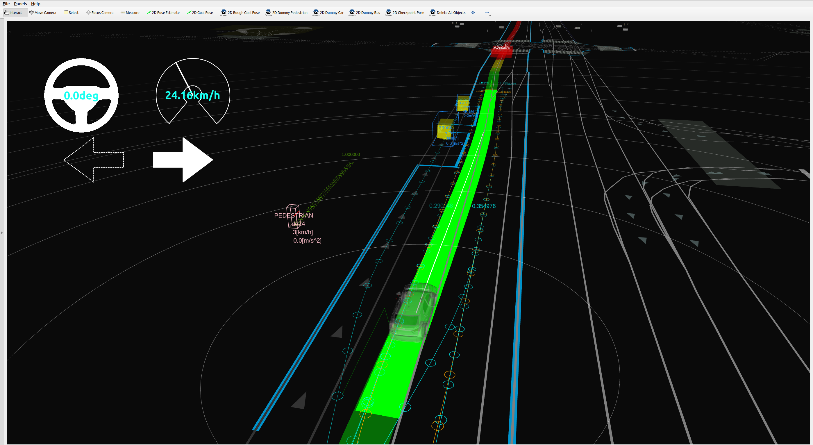

# 静止物体回避モジュール



## 目的/役割

これはルールベースの回避モジュールで、認識出力データ、HDMap、現在の経路とルートに基づいて動作します。このモジュールは、単純な状況において静止（＝停止）しているオブジェクトに対して回避経路を作成するように設計されています。現時点では、このモジュールは動的（＝移動）物体には対応していません。


このモジュールは[RTCインタフェース](../../autoware_rtc_interface/README.md)を持ち、ユーザは車両のセンサの性能に応じて手動/自動から動作モードを選択できます。ユーザが手動モードを選択した場合、このモジュールは回避経路の候補を出力し、オペレータの承認を待ちます。センサ/認識の性能が不十分で誤検出が発生する場合は、不要な回避操作を防ぐために手動モードをお勧めします。

ユーザが自動モードを選択した場合、このモジュールはオペレータの承認なしに現在の追随経路を変更します。センサ/認識の性能が十分な場合は、自動モードを使用してください。

### 制限事項

このモジュールでは、開発者が特定のルールを使用して回避計画における車両の挙動を設計できます。ルールベースの計画の性質のため、アルゴリズムは複雑な場合に障害物との衝突を補償できません。これは、「直感的かつ設計が容易であること」と「調整が難しいが多くのケースを処理できること」とのトレードオフです。このモジュールは前者のポリシーを採用しているため、この出力を後段でより厳密にチェックする必要があります。.iv リファレンス実装では、複雑なケースでの回避を処理するために、最適化を使用するモーション計画モジュールに別の回避モジュールがあります。(モーションプランナは、単純なケースでは挙動の結果が大きく変わらないように調整する必要があり、これは階層的な挙動-運動アーキテクチャの典型的な課題です。)

### なぜ回避は挙動モジュールにあるのか？

このモジュールは車線を越えて回避を実行し、この決定には交通ルールを考慮した車線構造情報が必要です（たとえば、車両が車線を横断するときにインジケータ信号を送信する必要があります）。計画スタック内の運動モジュールと挙動モジュールの違いは、プランナが交通ルールを考慮するかどうかであり、これがこの回避モジュールが挙動モジュールにある理由です。

<br>

詳細ではなく概要を知りたい場合は、次のセクションをスキップして [FAQ](#frequently-asked-questions) を参照してください。

## 内部構造/アルゴリズム

このモジュールは主に、目標フィルタリングとパス生成の 2 つの部分で構成されています。最初に、すべてのオブジェクトは複数の条件によってフィルタリングされます。このステップで、モジュールは回避の可能性と必要性をチェックします。その後、このモジュールは、フィルタリングされたオブジェクトに基づいて Avoidance Path Outline（回避パスアウトライン）、つまり「シフトライン」を生成します。シフトラインは、パス生成用のライブラリである [Path Shifter](../autoware_behavior_path_planner_common/docs/behavior_path_planner_path_generation_design.md) に設定されて、スムーズなシフトパスが作成されます。さらに、このモジュールには、エゴが対象オブジェクトを安全に回避できるように非対象オブジェクトをチェックする機能があります。この機能は、生成された回避パスと周辺オブジェクトを受信し、現在の状況を判断します。最後に、このモジュールは現在のエゴ挙動を更新します。


## ターゲットオブジェクトフィルタリング

### 概要

このモジュールは、回避対象となるターゲットオブジェクトをフィルタリングするために、以下の条件を使用します。

| 条件のチェック                                                                               | ターゲットクラス             | 詳細                                                                                                                                                                              | 条件が満たされない場合              |
|---------------------------------------------------------------------------------------------|-------------------------| ------------------------------------------------------------------------------------------------------------------------------------------------------------------------------------ |-----------------------------------|
| 回避対象クラスのオブジェクトですか?                                                         | すべてのクラス             | 回避対象クラスはconfigファイルから選択できます。                                                                                                                                 | 回避しません。                      |
| 停止中のオブジェクトですか?                                                                 | すべてのクラス             | `th_moving_speed`よりも高い速度を`th_moving_time`よりも長い時間維持しているオブジェクトは、移動中と判断します。                                                                    | 回避しません。                      |
| 検出領域内にありますか?                                                                 | すべてのクラス             | このモジュールは、configファイルの横方向マージンに基づいて、ターゲットオブジェクトを大まかにフィルタリングするために、検出領域を作成します。( [こちら](#width-of-detection-area) を参照) | 回避しません。                      |
| オブジェクトとパスとの間に十分な横方向距離がありませんか?                                  | すべてのクラス             | -                                                                                                                                                                                    | 回避しません。                      |
| 自車線のセンターラインの近くですか?                                                          | すべてのクラス             | -                                                                                                                                                                                    | 他の条件によって異なります。        |
| オブジェクトの近くに横断歩道がありますか?                                                  | 歩行者、自転車            | 自車が道を横断している場合、横断歩道の近くにいる歩行者と自転車は回避されません( [こちら](#For-crosswalk-users) を参照)。                                                | 回避しません。                      |
| パス上のオブジェクトと信号機との距離がしきい値より長いですか?                               | 乗用車、トラック、バス、トレーラー | この条件は、車両が駐車しているかどうかが不明な場合に使用されます。                                                                                                               | 他の条件によって異なります。        |
| パス上のオブジェクトと横断歩道の信号機との距離がしきい値より長いですか?                   | 乗用車、トラック、バス、トレーラー | 上記と同じです。                                                                                                                                                                      | 他の条件によって異なります。        |
| 停止時間はしきい値より長いですか?                                                     | 乗用車、トラック、バス、トレーラー | 上記と同じです。                                                                                                                                                                      | 他の条件によって異なります。        |
| 交差点内にありますか?                                                                   | 乗用車、トラック、バス、トレーラー | このモジュールは、交差点内に駐車車両がないことを前提としています。                                                                                                               | 他の条件によって異なります。        |
| 自車線上にありますか?                                                                   | 乗用車、トラック、バス、トレーラー | -                                                                                                                                                                                    | 他の条件によって異なります。        |
| 駐車車両ですか?                                                                         | 乗用車、トラック、バス、トレーラー | このモジュールは、横方向オフセットに基づいて車両が駐車車両であるかどうかを判断します。( [こちら](#judge-if-its-a-parked-vehicle) を参照)                                      | 他の条件によって異なります。        |
| 別の車線から自車線に合流していますか?                                                 | 乗用車、トラック、バス、トレーラー | このモジュールは、ヨー角とオフセット方向に基づいて車両の動作を判断します。( [こちら](#judge-vehicle-behavior) を参照)                                                        | 他の条件によって異なります。        |
| 自車線から別の車線に合流していますか?                                                 | 乗用車、トラック、バス、トレーラー | 上記と同じです。                                                                                                                                                                      | 他の条件によって異なります。        |

### 一般的な条件

#### 検出領域

モジュールは、次のパラメータに基づいて、ターゲットフィルタリング用の検出領域を生成します。


```yaml
      # avoidance is performed for the object type with true
      target_object:
      ...
          lateral_margin:
            soft_margin: 0.3                            # [m]
            hard_margin: 0.2                            # [m]
            hard_margin_for_parked_vehicle: 0.7         # [m]
      ...
      # For target object filtering
      target_filtering:
      ...
        # detection area generation parameters
        detection_area:
          static: false                                 # [-]
          min_forward_distance: 50.0                    # [m]
          max_forward_distance: 150.0                   # [m]
          backward_distance: 10.0                       # [m]
```

##### 検出範囲の幅

1. すべてのクラス（車両、トラックなど）から最大の横方向のマージンを取得します。マージンは`soft_margin`と`hard_margin_for_parked_vehicle`の合計です。
2. 検出範囲の幅は、自車幅と最大の横方向のマージンを合計したものです。

##### 検出範囲の縦方向距離

パラメータ`detection_area.static`が`true`に設定されている場合、モジュールは縦方向距離が`max_forward_distance`の検出範囲を作成します。

パラメータ`detection_area.static`が`false`に設定されている場合、モジュールは自車が最小の横方向ジャーク値で障害物を回避できるように検出範囲を作成します。したがって、縦方向距離は最大横方向シフト長、横方向ジャーク制約、現在の自車速度に依存します。さらに、準備フェーズに使用される距離も考慮する必要があります。


```c++
...
    const auto max_shift_length = std::max(
      std::abs(parameters_->max_right_shift_length), std::abs(parameters_->max_left_shift_length));
    const auto dynamic_distance =
      PathShifter::calcLongitudinalDistFromJerk(max_shift_length, getLateralMinJerkLimit(), speed);

    return std::clamp(
      1.5 * dynamic_distance + getNominalPrepareDistance(),
      parameters_->object_check_min_forward_distance,
      parameters_->object_check_max_forward_distance);
```


### 非車両タイプのオブジェクトに関する条件

#### 横断歩道使用者

歩行者と自転車が横断歩道に閾値2.0m（現在はハードコード）よりも近づいている場合、モジュールは道路を横断していると判断し、避けることはありません。


### 車両タイプのオブジェクトに関する条件

#### 車両の挙動の判断

モジュールは、ヨー角とオフセットの方向に基づいて、車両を次の3つの挙動に分類します。


```yaml
# params for filtering objects that are in intersection
intersection:
  yaw_deviation: 0.349 # [rad] (default 20.0deg)
```

| Behavior  | 詳細                                                                                                               | 図                                        |
| --------- | ------------------------------------------------------------------------------------------------------------------- | -------------------------------------------- |
| NONE      | オブジェクトの車線に対する相対的なヨー角が閾値 `yaw_deviation` 未満の場合、`NONE` に分類されます。 |        |
| MERGING   | 以下のフローチャートを参照してください。                                                                              |     |
| DEVIATING | 以下のフローチャートを参照してください。                                                                              |   |


#### 駐車車両の判定

車線中央線からの距離だけでなく、 路肩からの距離も計算し、フィルタリング処理に使用します。このロジックでは、次の「実際のシフト幅」と「シフト可能なシフト幅」の比率を計算します。結果が閾値 `th_shiftable_ratio` よりも大きい場合、モジュールは車両が駐車車両であると判断します。

$$
L_{d} = \frac{W_{lane} - W_{obj}}{2}, \\
ratio =  \frac{L_{a}}{L_{d}}
$$

- $L_{d}$ : シフト可能な幅
- $L_{a}$ : 実際のシフト幅
- $W_{lane}$ : 車線幅
- $W_{obj}$ : 物体の幅


### 目標オブジェクトのフィルタリング

| 場面                                                                                                                                      | 詳細                                                                 | 自動運転の挙動                                                                                                  |
| ------------------------------------------------------------------------------------------------------------------------------------------- | ------------------------------------------------------------------- | -------------------------------------------------------------------------------------------------------------- |
| 自車はHDマップで定義された交差点領域内にある。モジュールは自車線に従うか自車線に合流する車両を無視する |                                                                   | 回避しない                                                                                                    |
| 自車は自車線にいる。両側に隣接車線がある                                                                                               |                                                                        | 回避しない                                                                                                    |
| 自車は自車線から他の車線に合流中。ほとんどが自車線にいる                                                                                |                                                                         | 回避しない                                                                                                    |
| 自車は他車線から自車線に合流中。ほとんどが自車線にいる                                                                                |                                                                          | 回避しない                                                                                                    |
| 駐車しているようには見えず、横断歩道または信号の前に停車している                                                                          |                                                                       | 回避しない                                                                                                    |
| 自車が路肩に寄せる途中、自車線で停車した                                                                                                    |                                                                           | 速やかに回避する                                                                                            |
| 自車が隣接車線で停車した                                                                                                                        |                                                                       | 速やかに回避する                                                                                            |
| 自車が路肩に寄せることなく自車線で停車している                                                                                               |                                                                      | パラメータ `avoidance_for_ambiguous_vehicle.enable` を `true` に設定すると、モジュールは不明確な車両を回避する |
| 自車は他車線から自車線に合流している                                                                                                    |                                                                        | パラメータ `avoidance_for_ambiguous_vehicle.enable` を `true` に設定すると、モジュールは不明確な車両を回避する |
| 自車は自車線から他の車線に合流している                                                                                                    |                                                                       | パラメータ `avoidance_for_ambiguous_vehicle.enable` を `true` に設定すると、モジュールは不明確な車両を回避する |

### フローチャート

`isSatisfiedWithCommonCondition()`, `isSatisfiedWithVehicleCondition()`, `isSatisfiedWithNonVehicleCondition()`の3つの主なフィルタリング機能があります。フィルタリングプロセスは次のフローチャートに従って実行されます。さらに、このモジュールはコンフィグファイル内のオブジェクトの姿勢、エゴパス、横方向の余裕に基づいて、`isNoNeedAvoidanceBehavior()`で回避の必要性をチェックします。


#### 共通条件

`isSatisfiedWithCommonCondition()` 関数は、すべてのオブジェクトクラスに使用される条件を最初に含みます。


#### 車両の条件

対象クラス:

- 自動車
- トラック
- バス
- トレーラ

次のステップとして、オブジェクトはそのクラスに特化した条件でフィルタリングされます。


#### 非車両オブジェクトの条件

- 歩行者
- 自転車


## ターゲットオブジェクトがなくなったとき

ユーザーはターゲットオブジェクトがなくなったときの自車挙動を選択できます。


```yaml
cancel:
  enable: true # [-]
```

パラメータが `true` の場合、以下の条件が満たされたときに回避経路が元に戻ります。

- すべての対象物がなくなった。
- 自車はまだ回避操作を開始していない。


パラメータが `false` の場合、このモジュールは対象物がなくなった後も動作を続けます。

## パス生成

### 知覚ノイズによるシフトラインのチャタリングを防ぐ方法

オブジェクト認識の結果には、位置、向き、多角形の形状に関連するノイズが含まれます。モジュールがパス生成に生のオブジェクト認識結果を使用すると、出力パスはノイズの影響を直接受けます。したがって、ノイズの影響を低減するために、このモジュールは各目標オブジェクトの多角形を生成し、そのに基づいて出力パスが生成されます。


エンヴェロープ多角形は、オブジェクトの多角形とバッファパラメータ `envelope_buffer_margin` に依存する長方形のボックスです。さらに、常に参照パスと平行です。モジュールが初めて目標オブジェクトを見つけると、多角形を初期化します。


```yaml
        car:
          ...
          envelope_buffer_margin: 0.5                   # [m] FOR DEVELOPER
```


このモジュールは、最新のオブジェクトの姿勢と各プランニング サイクルの raw ポリゴンを使用して、1 ショット エンベロープ ポリゴンを作成します。一方、モジュールは、最後のプランニング サイクルで作成されたエンベロープ ポリゴン情報を使用して、姿勢共分散を考慮してエンベロープ ポリゴンを更新します。

姿勢共分散がしきい値よりも小さい場合、エンベロープ ポリゴンは次のロジックに従って更新されます。1 ショット エンベロープ ポリゴンが以前のエンベロープ ポリゴン内にない場合、モジュールは新しいエンベロープ ポリゴンを作成します。それ以外の場合は、以前のエンベロープ ポリゴンを保持します。


姿勢共分散がしきい値よりも大きい場合、各オブジェクトの最大姿勢共分散と比較されます。値が小さい場合は、1 ショット エンベロープ ポリゴンがエンベロープ ポリゴンとして直接使用されます。それ以外の場合は、以前のエンベロープ ポリゴンを保持します。

このプロセスを実行することにより、知覚出力がオブジェクトの姿勢や形状にノイズを含んでいても、エンベロープ ポリゴンのサイズと姿勢は収束します。

### エンベロープ ポリゴンと回避パスの関係

回避パスには 2 つのシフト セクションがありますが、その開始点または終了点の位置はエンベロープ ポリゴンによって決まります。回避シフト セクションの終了点とリターン シフト セクションの開始点は、エンベロープ ポリゴンと反対側のエッジに基づいて固定されており、他の側はエゴ速度、シフト長、横方向のジャークの制約などに基づいて動的に変化します。

2 つのポイントの横方向位置は、エゴ ボディーとエンベロープ ポリゴン エッジポイントの最もオーバーハングしたポイントとの間に十分なスペース (=横方向マージン) があるように決定されます。ユーザーは、次のパラメーターを使用して横方向マージンを調整できます。


```yaml
        car:
          ...
          lateral_margin:
            soft_margin: 0.3                            # [m]
            hard_margin: 0.2                            # [m]
            hard_margin_for_parked_vehicle: 0.7         # [m]
```

縦方向の位置は、エンベロープポリゴン、自車仕様、および次のパラメーターに依存します。回避シフトセクションの終了点とエンベロープポリゴン（=フロント縦方向バッファ）間の縦方向距離は、パラメーター `consider_front_overhang` が `true` の場合、`vehicle_info.param.yaml` で定義されている `front_overhang` と `longitudinal_margin` の合計です。`consider_front_overhang` が `false` の場合は、`longitudinal_margin` のみ考慮されます。同様に、戻りシフトセクションの開始点とエンベロープポリゴン（=リア縦方向バッファ）間の距離は、`rear_overhang` と `longitudinal_margin` の合計です。


```yaml

      target_object:
        car:
          ...
          longitudinal_margin: 0.0                      # [m]

      ...
      avoidance:
        ...
        longitudinal:
          ...
          consider_front_overhang: true                 # [-]
          consider_rear_overhang: true                  # [-]
```

### 側方余裕

上で述べたように、ユーザーは以下の 2 種類のパラメータを変更することで側方余裕を調整できます。`soft_margin` は側方余裕のソフト制約パラメータです。`hard_margin` と `hard_margin_for_parked_vehicle` はハード制約パラメータです。


```yaml
        car:
          ...
          lateral_margin:
            soft_margin: 0.3                            # [m]
            hard_margin: 0.2                            # [m]
            hard_margin_for_parked_vehicle: 0.7         # [m]
```

## ソフト・ハードマージンのモジュール

基本的に、このモジュールは、`soft_margin`と`hard_margin`/`hard_margin_for_parked_vehicle`の合計である、回避対象オブジェクトからの横方向距離を維持するために回避経路を生成しようとします。


ただし、`soft_margin`の距離を維持するための十分なスペースがない場合は、このモジュールはソフト制約の横方向マージンを短縮します。`soft_margin`パラメータはソフト制約の最大値であり、実際のソフトマージンは0.0と`soft_margin`の間の値になります。一方、このモジュールは状況に応じて`hard_margin`または`hard_margin_for_parked_vehicle`を必ず維持します。したがって、横方向マージンの最小値は`hard_margin`/`hard_margin_for_parked_vehicle`となり、最大値は`hard_margin`/`hard_margin_for_parked_vehicle`と`soft_margin`の合計です。

次の図は、ユーザーがパラメータ`use_lane_type`を`same_direction_lane`に設定した場合に、このモジュールが横方向のソフト制約を短縮して反対車線に進入しないようにする状況を示しています。


このモジュールは駐車車両だけでなく、何らかの理由で一時的に停止している駐車していない車両（例：信号が赤から青に変わるのを待っている）も回避します。さらに、このモジュールには`hard_margin`と`hard_margin_for_parked_vehicle`の2種類のハードマージンパラメータがあり、駐車車両であるかどうかを各車両に対して判断します。これは、駐車車両のドアが突然開いたり、そこから人が降りてくるというリスクを考慮するためです。

ユーザーは、ドアや車両から突然出てくる人と衝突するのを防ぐために、`hard_margin_for_parked_vehicle`を`hard_margin`よりも大きく設定する必要があります。

このモジュールには、ソフト横方向マージン制約パラメータ`soft_margin`が1つのみあります。


ハードマージンパラメータは、ユーザーが確実に維持したい距離を定義するため、回避動作を実行せずにエゴがターゲットオブジェクトの側面を通過できるかどうかをチェックするロジックにも使用されます。

回避動作を行わずにエゴが現在のレーンを走行することを想定した場合に横方向距離が`hard_margin`/`hard_margin_for_parked_vehicle`よりも小さい場合、このモジュールはエゴがオブジェクトの側面を安全に通過できないと考え、エゴはそれ回避する必要があります。この場合、このモジュールは回避操作の実行が許可されるまで停止点を挿入し、エゴが承認後にオブジェクトを回避できるようにします（たとえば、モジュールがMANUALモードの場合、エゴはそのようなオブジェクトの前に停止し、オペレータが回避操作を承認するまで停止し続けます）。


一方、横方向距離が`hard_margin`/`hard_margin_for_parked_vehicle`よりも大きい場合、このモジュールはオブジェクトの側面を安全に通過できる可能性があると判断するため、承認待ちであっても停止点を挿入しません。


### スペースが不足している場合

このモジュールは、エゴがオブジェクトを回避できる可能性がある場合にのみ停止点を挿入します。そのため、`hard_margin`/`hard_margin_for_parked_vehicle`よりも大きい距離を維持できない場合、このモジュールは何もしません。次の図は、ユーザーがパラメータ`use_lane_type`を`same_direction_lane`に設定した場合に、このモジュールが十分な横方向距離を維持できない状況を示しています。


!!! info

    この状況では、[obstacle_cruise_planner](../../autoware_obstacle_cruise_planner/README.md)のobstacle stop機能がエゴ車両の安全を担当します。


### シフト長の計算

横方向シフト長は、`overhang_distance`、コンフィグファイルで設定された横方向マージン、および`vehicle_info.param.yaml`で定義されたエゴ車両幅の半分からなります。一方、モジュールは、回避動作に使用できるスペースと`soft_drivable_bound_margin`と`hard_drivable_bound_margin`のパラメータに応じてシフト長を制限します。基本的に、シフト長は、エゴが走行可能境界線に`soft_drivable_bound_margin`より近づかないように制限されます。しかし、このモジュールでは、道路が狭い場合に、閾値が`soft_drivable_bound_margin`から`hard_drivable_bound_margin`に緩和されることを許可します。


回避モジュールに使用できる走行可能レーンは、コンフィグファイルを使用して選択できます。


```yaml
      ...
      # drivable lane setting. This module is able to use not only current lane but also right/left lane
      # if the current lane(=lanelet::Lanelet) and the right/left lane share the boundary(=lanelet::Linestring) in HDMap.
      # "current_lane"           : use only current lane. This module doesn't use adjacent lane to avoid object.
      # "same_direction_lane"    : this module uses same direction lane to avoid object if needed.
      # "opposite_direction_lane": this module uses both same direction and opposite direction lanes.
      use_lane_type: "opposite_direction_lane"
```

## 車線種類の設定

`use_lane_type`パラメータを`opposite_direction_lane`に設定すると、対向車線を使用できます。


`use_lane_type`パラメータを`same_direction_lane`に設定すると、モジュールは対向車線と重なるパスを作成しません。


### シフトラインの生成

前述のように、回避シフトパスのエンドポイントと復路シフトパスのスタートポイントは固定されており、エンベロープポリゴンから計算されます。次のステップで、モジュールは、シフトの長さ、現在のエゴ速度、および設定ファイルで定義されている横方向のジャーク制約パラメータに応じて、他の側面の点を調整します。

2つの点は常にエゴ車線のセンターライン上にあるため、モジュールは次の関数に基づいてシフト開始点とエンドポイント間の縦距離のみを計算します。この関数はパスシフタライブラリで定義されています。[こちら](../autoware_behavior_path_planner_common/docs/behavior_path_planner_path_generation_design.md)のページも参照してください。


```c++
double PathShifter::calcLongitudinalDistFromJerk(
  const double lateral, const double jerk, const double velocity)
{
  const double j = std::abs(jerk);
  const double l = std::abs(lateral);
  const double v = std::abs(velocity);
  if (j < 1.0e-8) {
    return 1.0e10;
  }
  return 4.0 * std::pow(0.5 * l / j, 1.0 / 3.0) * v;
}
```

回避経路を生成するスプライン補完において、シフトの開始点と終了点を結ぶ線を「`shift_line`」と呼びます。

回避の開始点は、もう 1 つの縦方向の制約があります。回避動作を開始する前に数秒間ウィンカーを点灯するため、回避の開始点は、自車位置に対する自車速度によって変化する値（この距離を「`prepare_length`」と呼びます）を上回っていなければなりません。


```yaml
longitudinal:
  min_prepare_time: 1.0 # [s]
  max_prepare_time: 2.0 # [s]
  min_prepare_distance: 1.0 # [m]
```

`prepare_length` は、自車速度と `max_prepare_time` の積として計算されます。（自車速度が 0 のときは `min_prepare_distance` が使用されます。）


## 赤信号での Planning

このモジュールは、トラフィックライト情報を考慮して、自車が適切な挙動をするようにします。自車が車線をまたぐことがありますが、このような状況では自車が赤信号の前に停止しないようにします。これは、自車が隣接する車線を塞ぎ、他の車両に迷惑になるからです。


したがって、このモジュールは、上記のような状況を防ぐためにシフトの長さとシフトの開始/終了点を制御します。

### シフトの長さの制御

まず、自車がまだ回避動作を開始していない場合、このモジュールは赤信号中の最大シフトの長さを制限し、現在の車線のみを使用します。これにより、このモジュールが回避動作を実行し自車が赤信号に捕らわれても、他の車両を塞ぐことを防ぎます。


### 回避シフトの開始点を制御

さらに、ターゲットオブジェクトが信号の停止線よりも遠い場合、このモジュールは、回避動作の途中で自車が赤信号で停止しないように、回避シフトの開始点を停止線に設定します。


### リターンシフトの終了点を制御

自車がすでに回避動作を開始している場合、このモジュールはリターンシフトの終了点を停止線に設定しようとします。


## 安全確認

この機能は、次のパラメータを `true` に設定することで有効にすることができます。


```yaml
      safety_check:
        ...
        enable: true                                    # [-]
```

このモジュールでは、回避対象物だけでなく、回避経路の近くにある非対象物にも注意を払い、周辺の物体によって回避経路が安全でない場合は、回避策を元に戻して、対象物にレーンを譲ります。


### 譲渡操作

さらに、このモジュールは、対象物を回避して安全に行えるように十分な距離を確保するために、譲渡操作中に回避対象物の前に停止点を挿入します。シフト側レーンが混雑している場合は、エゴは地点で停止して待ちます。

次のパラメータを「真」に設定すると、この機能を有効化できます。


```yaml
yield:
  enable: true # [-]
```


しかし、横の余白が `hard_margin` (または `hard_margin_for_parked_vehicle`) より大きい場合、このモジュールはストップポイントを挿入しません。エゴは回避操作なしで安全に障害物側面を通り抜けることができるからです。


### 安全確認対象車線

ユーザーは以下のパラメーターを使用して、安全確認エリアを選択できます。基本的に、シフト側の車線のみを確認する、以下の構成を推奨します。厳密に安全性を確認したい場合は、`check_current_lane` または `check_other_side_lane` を `true` に設定してください。


```yaml
      safety_check:
      ...
        check_current_lane: false                       # [-]
        check_shift_side_lane: true                     # [-]
        check_other_side_lane: false                    # [-]
```

回避モジュールでは、`path_safety_checker::isCentroidWithinLanelet` 関数は車線を基準にオブジェクトをフィルタリングするために使用されます。


```c++
bool isCentroidWithinLanelet(const PredictedObject & object, const lanelet::ConstLanelet & lanelet)
{
  const auto & object_pos = object.kinematics.initial_pose_with_covariance.pose.position;
  lanelet::BasicPoint2d object_centroid(object_pos.x, object_pos.y);
  return boost::geometry::within(object_centroid, lanelet.polygon2d().basicPolygon());
}
```

!!! info

    `check_current_lane` と/または `check_other_side_lane` が `true` に設定されている場合、誤検出と不要な譲渡操作の可能性が高くなります。

### 安全チェックアルゴリズム

このモジュールでは、`path_safety_checker` ライブラリで実装された一般的な安全チェックロジックを使用しています。[こちら](../autoware_behavior_path_planner_common/docs/behavior_path_planner_safety_check.md) のページを参照してください。

### 制限事項

#### 制限事項 1

モジュールが安全ではないと判断した場合の現在の動作は、現在の Planning アーキテクチャではアグレッシブな操作（例：後続車両との距離を増やすために速度を上げる）を実現することが困難であるため、非常に慎重になっています。

#### 制限事項 2

譲渡操作は、車両が回避操作を開始していない **場合のみ** 実行されます。（このモジュールは逆車線のオブジェクトを確認しますが、回避操作の前には非常に遠くのオブジェクトを見つけて安全かどうかを判断する必要があります。）回避操作中に自車に接近する車両を検出しても、このモジュールはパスを元に戻したり、停止点を挿入したりしません。現時点では、この状況に対処する機能はこのモジュールにはありません。そのため、移動オブジェクトを避けるようにパスを調整するための新しいモジュールが必要になるか、オペレーターが上書きする必要があります。

!!! info

    このモジュールにはシフト長のしきい値パラメーター `th_avoid_execution` があり、車両の現在のシフトがこの値を超えると、車両が回避を開始していると判断します。

## その他の機能

### 検出ロスによる補正

認識結果のチャタリングを防ぐため、障害物がターゲットにされると、障害物が消えてもしばらく保持されます。これは、認識が不安定な場合に有効です。ただし、過検出（誤検出の数の増加）につながるため、認識の精度に応じてパラメーターを調整する必要があります（`object_last_seen_threshold = 0.0` の場合、認識結果は 100% 信頼されます）。

### 走行可能領域の拡大

このモジュールは、HDMap で定義された以下のポリゴンの追従を可能にする走行可能領域の拡大をサポートしています。

- 交差点領域
- ハッチング道路標識
- 自由空間領域

回避操作でこれらの領域を使用できるようにする場合、ユーザーはフラグを `true` に設定してください。


```yaml
# drivable lane setting. This module is able to use not only current lane but also right/left lane
# if the current lane(=lanelet::Lanelet) and the right/left lane share the boundary(=lanelet::Linestring) in HDMap.
# "current_lane"           : use only current lane. This module doesn't use adjacent lane to avoid object.
# "same_direction_lane"    : this module uses the same direction lane to avoid object if needed.
# "opposite_direction_lane": this module uses both same direction and opposite direction lanes.
use_lane_type: "opposite_direction_lane"
# drivable area setting
use_intersection_areas: true
use_hatched_road_markings: true
use_freespace_areas: true
```

|                                        |                                                            |                                                                                                                                                                                                                                      |
| -------------------------------------- | ---------------------------------------------------------- | ------------------------------------------------------------------------------------------------------------------------------------------------------------------------------------------------------------------------------------ |
| use_lane_type: same_direction_lane     |      |                                                                                                                                                                                                                                      |
| use_lane_type: opposite_direction_lane |  |                                                                                                                                                                                                                                      |
| 交差点エリア |  | 交差点エリアはLanelet mapで定義されています。[こちら](https://github.com/autowarefoundation/autoware_lanelet2_extension/blob/main/autoware_lanelet2_extension/docs/lanelet2_format_extension.md)を参照してください|
| ハッチング路面表示 |  | ハッチング路面表示はLanelet mapで定義されています。[こちら](https://github.com/autowarefoundation/autoware_lanelet2_extension/blob/main/autoware_lanelet2_extension/docs/lanelet2_format_extension.md#hatched-road-markings-area)を参照してください|
| フリースペースエリア |  | フリースペースエリアはLanelet mapで定義されています（不安定） |

## 今後の拡張/未実装部分

- **回避対象の速度の考慮**

  - 現在の実装では、停止車両のみが回避対象になります。自転車などの低速車両の追い越し機能をサポートする必要があります。（実際にはパラメータを変更することで低速オブジェクトを追い越すことは可能ですが、ロジックがサポートされていないため安全は保証できません。）
  - 追い越し（例：時速40kmで走行中の前方に時速20kmで走行する車両を追い越す）は、回避モジュール外で処理する必要がある場合があります。どのモジュールが処理すべきかを議論する必要があります。

- **ターゲットが見えなくなったら回避をキャンセル**

  - 現在の実装では、回避対象が消えても回避経路は残ります。回避する必要がなくなった場合は、取り消す必要があります。

- **回避対象選択のパフォーマンス向上**

  - 本質的に、回避対象は静的オブジェクトであるかどうかによって判断されます。たとえば、信号待ちで停車している車両は、将来的に動き出すことがわかっているため、避けるべきではありません。しかし、この決定は、Autowareの知覚機能の不足により、現在のAutowareではできません。したがって、現在の回避モジュールは回避対象を路肩に駐車されている車両に限定し、車線の外れで停止している車両に対してのみ回避を実行します。しかし、車線の中央で立ち往生し、停車している故障車両は避けることができず、これらは知覚モジュールによって静的オブジェクトとして認識されるべきです。この決定のパフォーマンスには改善の余地があります。

- **経路の再サンプリング**
  - 現在、ラフ解像度の再サンプリングは、後続モジュールの計算コストを削減するために、出力経路に処理されます。この解像度は一様に大きな値（例：`5m`）に設定されていますが、複雑な経路には小さな解像度を適用する必要があります。

## デバッグ

### `RCLCPP_DEBUG` をコンソールに表示

すべてのデバッグメッセージは、以下の名前空間でログに記録されます。

- `planning.scenario_planning.lane_driving.behavior_planning.behavior_path_planner.static_obstacle_avoidance` または、
- `planning.scenario_planning.lane_driving.behavior_planning.behavior_path_planner.static_obstacle_avoidance.utils`

次のコマンドでデバッグ情報を見ることができます。


```bash
ros2 service call /planning/scenario_planning/lane_driving/behavior_planning/behavior_path_planner/config_logger logging_demo/srv/ConfigLogger "{logger_name: 'planning.scenario_planning.lane_driving.behavior_planning.behavior_path_planner.static_obstacle_avoidance', level: DEBUG}"
```

### デバッグマーカーの可視化

ユーザーは次のパラメーターを使用して、デバッグマーカーの公開を有効にできます。


```yaml
debug:
  enable_other_objects_marker: false
  enable_other_objects_info: false
  enable_detection_area_marker: false
  enable_drivable_bound_marker: false
  enable_safety_check_marker: false
  enable_shift_line_marker: false
  enable_lane_marker: false
  enable_misc_marker: false
```


### オブジェクトが無視された理由を検出するためのデバッグメッセージのエコー

何らかの理由でオブジェクトのシフトポイントが生成されない場合、`ros2 topic echo` を使用して障害の理由を確認できます。


デバッグメッセージを出力するには、以下を実行するだけです


```bash
ros2 topic echo /planning/scenario_planning/lane_driving/behavior_planning/behavior_path_planner/debug/avoidance_debug_message_array
```

## よくある質問

### 対象物体

#### 静止物体および動的物体は回避されますか？

このモジュールは、静止（停止）している物体は回避しますが、動的（移動）している物体を回避する機能はありません。動的物体は、[動的障害回避モジュール](../autoware_behavior_path_dynamic_obstacle_avoidance_module/README.md)で処理されます。

#### 回避する物体の種類（分類）は？

デフォルトでは、このモジュールは、自動車、トラック、バス、トレーラー、自転車、オートバイ、歩行者、および不明な物体を回避します。詳細については、[対象物体フィルタリングセクション](#target-object-filtering)を参照してください。
上記の物体は、車両タイプの物体と車両タイプ以外の物体に分けられます。対象物体フィルタリングは、車両タイプと車両タイプ以外の物体で異なります。

- 車両タイプの物体：自動車、トラック、バス、トレーラー、オートバイ
- 車両タイプ以外の物体：歩行者、自転車

#### 対象物体かどうかを判断する方法は？

車両タイプの物体と車両タイプ以外の物体の条件は異なります。ただし、主な考え方は、計画された経路内の路肩にある静止している物体は回避されるべき、というものです。
以下は、車両タイプの物体に対して回避経路が生成される際の例です。

- 路肩に停車して後続車両に道を譲る車両
- 隣接車線に停車している車両

詳細については、[車両タイプの物体](#conditions-for-vehicle-type-objects)と[車両タイプ以外の物体](#conditions-for-non-vehicle-type-objects)を参照してください。

#### 曖昧な対象とは？

曖昧な対象とは、現在の Autoware の限界により回避対象として明確に識別できない物体のことです（例：車線の真ん中に駐車している車両）。
このモジュールは、明確に定義された静止した物体を自動的に回避しますが、曖昧な対象についてはオペレーターによる介入が必要になる場合があります。

#### 対象物体はどのように視覚化できますか？

対象物体は RViz を使用して視覚化できます。RViz では、障害物の検出や回避経路の計画などのモジュールの出力が表示されます。詳細については、[デバッグマーカーセクション](#visualize-debug-markers)を参照してください。

#### 障害物との横方向の距離を確認する方法を教えてください。

現時点では、自車と対象物との相対位置を出力するトピックはありません。
現時点では、RViz での視覚的な確認が唯一の解決策です。

#### 複数のオブジェクトを同時に回避できますか？

はい、このモジュールは、複数の静止したオブジェクトを同時に回避できます。
これは複数のシフトラインを生成し、各オブジェクトを回避する回避経路を計算することによって実現します。
詳細は、[経路形状の決定方法セクション](#multiple-obstacle-case-one-direction)で説明されています。

### 回避時に使用するエリア

#### オブジェクトの回避に使用される車線は？

このモジュールは、現在の車線だけでなく、隣接車線と反対車線も使用できます。[シフト長の計算セクション](#shift-length-calculation)で述べたように、使用可能な車線は設定ファイルで選択できます。左右に車線がある場合、中央車線には駐車車両がないと想定されます。

#### 交差点内のオブジェクトは回避されますか？

このモジュールは、基本的に、交差点内には駐車車両がないと想定しています。車線に従うか、自車線に合流する車両は、対象外です。[走行可能領域拡張セクション](#drivable-area-expansion)で説明しているように、交差点内で右折/左折を待ち構える車両は、設定ファイルで走行可能領域を拡張することで回避できます。

運転可能エリアは、[運転可能エリアの拡張セクション](#drivable-area-expansion)で述べられているように、構成ファイルで拡張できます。

### パス生成

#### 回避経路はどのように生成されますか?

回避経路は、検出された静止物体の周囲を走行するために現在のリファレンスパスを変更して生成されます。
これは、車両が安全な境界内に残り、障害物を回避しながら道路に従うことを保証するルールベースのシフトラインアプローチを使用して行われます。
詳細は [付録](#appendix-shift-line-generation-pipeline) に説明されています。

#### 回避経路はどちら側に（右または左）生成されますか?

回避の挙動は、対象車両の重心に依存します。
対象物が自車線の左側にいる場合、回避は右側に生成されます。
現時点では、左側から左にシフトした障害物を回避することはサポートされていません (右にシフトした物体も同様です)。

#### なぜ対象物にエンベロープポリゴンを使用するのですか?

各対象物に対する知覚/追跡ノイズの影響を軽減するために使用されています。
エンベロープポリゴンは、オブジェクトのポリゴンとバッファパラメータに依存するサイズを持つ長方形であり、常にリファレンスパスと平行です。
エンベロープポリゴンは、最新のワンショットエンベロープポリゴンと前のエンベロープポリゴンを使用して作成されます。
詳細は [知覚ノイズによって引き起こされるシフトラインのチャタリングを防ぐ方法](#how-to-prevent-shift-line-chattering-that-is-caused-by-perception-noise) に説明されています。

#### モジュールが安全な回避経路を見つけられないとどうなりますか?

モジュールが安全な回避経路を見つけられない場合、車両は回避操作を実行せずに停止するか、現在のパスに沿って走行を続ける場合があります。
対象物があり、回避するのに十分なスペースがある場合、自車はその回避経路を生成できる位置で停止します。これを [譲歩操縦](#yield-maneuver) と呼びます。
一方で、十分なスペースがない場合、このモジュールは何もせず、[障害物クルーズプランナー](../../autoware_obstacle_cruise_planner/README.md) がオブジェクトの制御を担います。

#### 回避経路があるように見えるのに、車両が停止します。何が起こっているのですか?

この状況は、モジュールが AUTO モードで動作しているときに対象物が曖昧な場合、または MANUAL モードで動作しているときに発生します。
生成された回避経路は候補として表示され、実行前にオペレータの承認が必要です。
オペレータがパスを承認しない場合、自車は回避経路を生成できる場所で停止します。

### 操作

#### AUTO モードよりも MANUAL モードを使用するメリットは何ですか?

MANUAL モードでは、オペレータが回避経路の承認を直接制御できます。これは、センサーデータが信頼できないか曖昧な状況で特に便利です。
このモードは、実行前に人間の検証が必要なため、不要または不適切な回避操作を防ぐのに役立ちます。誤検出が発生する可能性が高い環境やセンサー/知覚システムの性能が制限されている場合に推奨されます。

#### このモジュールは特定の車両タイプまたは環境に合わせてカスタマイズできますか?

モジュールは、障害物の識別方法と回避方法を定義するルールとパラメーターを調整することでカスタマイズできます。
回避操作は、特定の車両タイプによって変更されることはありません。

## 付録: シフトライン生成パイプライン

### プロセスのフローチャート

<!-- spell-checker:disable -->


### パス形状の決定方法

与えられた横方向のジャークで障害物のためのシフトポイントを生成します。これらのポイントは、回避経路を生成するために統合されます。障害物の設置位置に対応する各ケースの処理フローの詳細を以下に示します。実際の実装はケースごとに分離されていませんが、常に `multiple obstacle case (both directions)` に対応する関数が実行されています。

#### 単一障害物のケース

障害物に対する横方向のシフト距離が計算され、次にシフトポイントは、以下の図のようにエゴビークルの速度と与えられた横方向のジャークから生成されます。次に、シフトポイントに基づいて滑らかな回避経路が計算されます。

さらに、特別の場合には、以下の処理が実行されます。

#### 横方向のジャーク緩和条件

- エゴビークルが回避ターゲットに近い場合、横方向のジャークは最大ジャークまで緩和されます。
- 回避後、中央線に戻る際に、ゴール（パスの終了）まで十分な距離が残っていない場合、ジャーク条件は上記のように緩和されます。

#### 最小速度緩和条件

回避中の実際の速度を予期して知ることができないという問題があります。これは、エゴビークルの速度が 0 の場合に特に重要です。
これを解決するため、このモジュールは、車両の速度が低いときに横方向のジャーク計算に使用される、最小回避速度のパラメータを提供します。

- エゴビークルの速度が「公称値」の最小速度より低い場合、ジャークの計算には最小速度を使用します。
- エゴビークルの速度が「鋭敏」な最小速度より低く、公称横方向のジャークが回避に十分でない（エゴビークルが障害物の近くに停止しているケース）場合、ジャークの計算では「鋭敏」な最小速度を使用します（「公称速度」より低くする必要があります）。


#### 複数の障害物のケース（一方向）

複数の障害物のためのシフトポイントを生成します。それらはすべてマージされて、基準パスに沿った新しいシフトポイントが生成されます。新しいポイントはフィルタリングされ（たとえば、小さな影響のシフトポイントを削除します）、回避経路はフィルタリングされたシフトポイントに対して計算されます。

**生のシフトポイントのマージ処理**: 各パスポイントのシフト長を確認します。シフトポイントが重なっている場合、同じ向きに対して最大シフト値が選択されます。

シフトポイントフィルタリングの詳細については、[シフトポイントのフィルタリング](#シフトポイントのフィルタリング)を参照してください。


#### 複数の障害物のケース（両方向）

複数の障害物のためのシフトポイントを生成します。それらはすべてマージされて、新しいシフトポイントが生成されます。望ましいシフトが異なる方向で衝突する領域がある場合、これらの領域における最大シフト量の合計が最終シフト量として使用されます。処理の残りの部分は、一方向の場合と同じです。


#### シフトポイントのフィルタリング

シフトポイントは、回避経路の期待される形状を得るために、フィルタリングプロセスによって変更されます。次のフィルタが含まれています。

- 量子化: 小さなシフトを無視するために回避幅を量子化します。
- 小さいシフトの削除: 前のシフトポイントに対する変化が小さいシフトは、前のシフト幅で統一されます。
- 類似勾配の削除: 2つのシフトポイントを直線で接続し、それらのシフト量が直線の近くにある場合、間のシフトポイントを削除します。
- 一時的なリターンの削除: 回避幅を削減するシフトポイント（中央線に戻る場合）、縦方向に十分な距離がある場合はそれらを削除します。

## 付録: すべてのパラメータ

回避固有のパラメータ構成ファイルの場所: `src/autoware/launcher/planning_launch/config/scenario_planning/lane_driving/behavior_planning/behavior_path_planner/autoware_behavior_path_static_obstacle_avoidance_module/static_obstacle_avoidance.param.yaml`.

{{ json_to_markdown("planning/behavior_path_planner/autoware_behavior_path_static_obstacle_avoidance_module/schema/static_obstacle_avoidance.schema.json") }}

