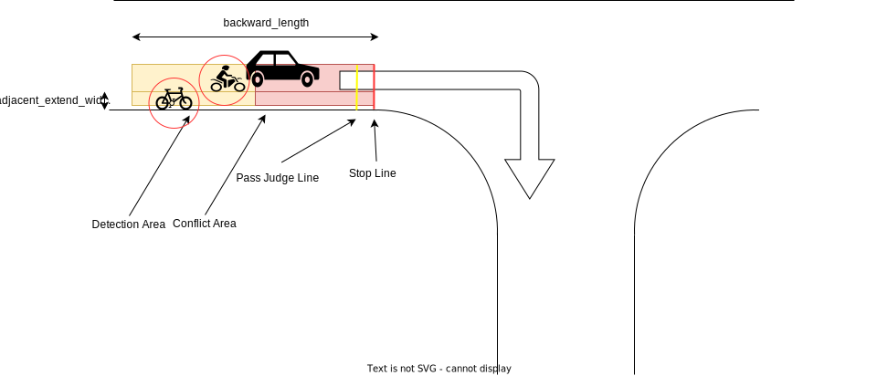
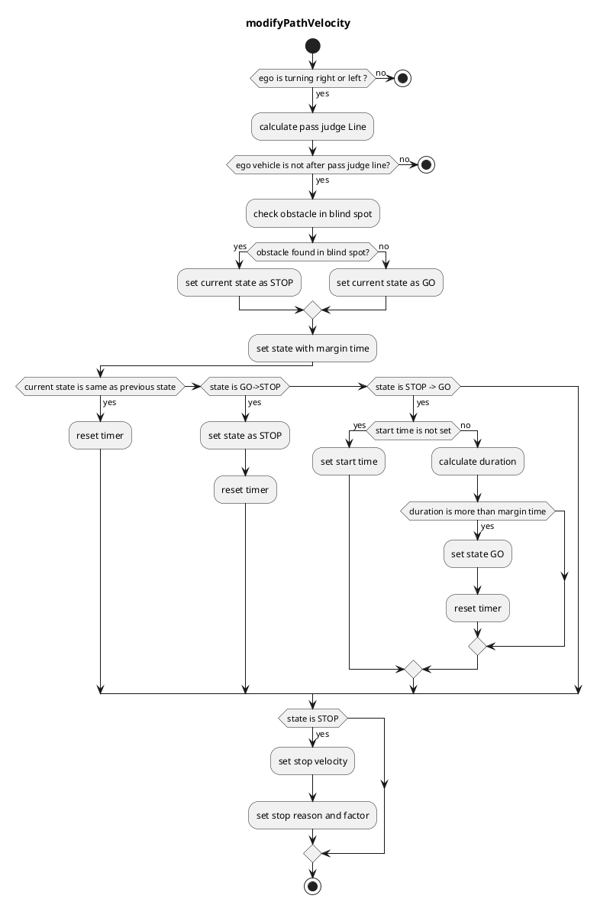

## ブラインドスポット

### 役割

ブラインドスポットモジュールは、交差点で左右に走行する自転車や歩行者との衝突の可能性を、左折/右折前に確認します。

### アクティブ化タイミング

この機能は、ターゲットパスのレーンIDが交差点ラベル（つまり、`turn_direction`属性が`left`または`right`）を持つときにアクティブ化されます。

### 内部処理/アルゴリズム

マップ情報と自車位置に基づいて、停止線、通過判定線、検出エリア、衝突エリアを設定します。

- 停止線: 交差点レーン情報に基づいて自動的に作成されます。

- 通過判定線: 急ブレーキを避けるために停止するかどうかの判断位置。

- 検出エリア: 自車位置の右/左領域。

- 衝突エリア: 自車位置から停止線までの右/左領域。

停止/走行状態: 対象物すべてにどちらかの条件が満たされた場合、このモジュール状態は「停止」状態に移行し、ゼロ速度を挿入して車両を停止させます。

- オブジェクトが検出領域にある
- オブジェクトの予測経路が衝突領域にある

急停止を避けるために、判定ライン通過後は「停止」判定は実行されません。

「停止」が判定されると、状態のチャタリング（例: 2秒）を防ぐために、「走行」判定が一定期間継続するまで「走行」状態に移行しません。

### モジュールパラメーター

| パラメータ | タイプ | 説明 |
|---|---|---|
| `stop_line_margin` | double | 車両が停止線の手前で停止しようとするマージン[m] |
| `backward_length` | double | 最も近いパス地点から始点の端までの距離[m] |
| `ignore_width_from_center_line` | double | 後続車が自車と衝突しているかどうかを判定する無視しきい値[m] |
| `max_future_movement_time` | double | オブジェクトの将来の動きを考慮するための最大時間[s] |
| `adjacent_extend_width` | double | 隣接車線が自転車専用車線などの場合、死角領域がこの長さに拡張される[m] |

### フローチャート

