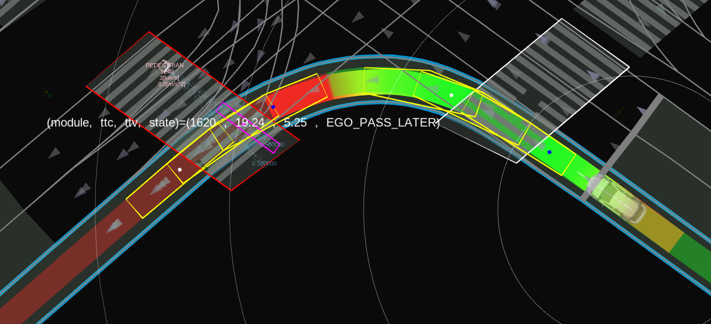

# 横断歩道

## 役割

このモジュールは、自車位置、周囲の交通状況、歩行者や自転車などの横断歩道利用者の行動に基づき、横断歩道の手前で自車が停止する必要があるかどうかを判断することで、安全な通行を確保します。

<figure markdown>
  {width=1100}
</figure>

## フローチャート


## 機能

### 歩行者への譲歩

#### ターゲットオブジェクト

 crosswalkモジュールは、`object_filtering.target_object`名前空間で次のパラメータで定義されたタイプのオブジェクトを処理します。

| パラメーター    | 単位 | タイプ | 説明                                    |
| ------------ | ---- | ---- | ---------------------------------------------- |
| `unknown`    | [-]  | bool | 未知物体に対して監視と停車を行うかどうか    |
| `pedestrian` | [-]  | bool | 歩行者に対して監視と停車を行うかどうか |
| `bicycle`    | [-]  | bool | 自転車に対して監視と停車を行うかどうか    |
| `motorcycle` | [-]  | bool | オートバイに対して監視と停車を行うかどうか |

横断歩道以外の近隣の横断歩道を横断する人を処理するため、横断歩道モジュールは横断歩道の周囲に注目領域を作成し、図の黄色の多角形として示します。物体の予測パスが注目領域と衝突する場合は、その物体は譲歩の対象となります。

<figure markdown>
  {width=600}
</figure>

近隣は `object_filtering.target_object` 名前空間内の次のパラメータによって定義されます。

| パラメーター                  | 単位 | タイプ      | 説明                                                                                              |
| ---------------------------- | ---- | --------    | -------------------------------------------------------------------------------------------------- |
| `crosswalk_attention_range` | [m]  | double | 検出領域は横断歩道の `X` メートル前から横断歩道の `X` メートル後に設定 |

#### 停止位置

第一に、自車と対象物との安全距離を保つため、`stop_distance_from_object [m]` は常に最低でも維持されます。

車線地図内に停止線が存在する場合、停止位置はその線に基づいて計算されます。
車線地図内に停止線が**存在しない**場合、停止位置は自車と横断歩道との間隔を `stop_distance_from_crosswalk [m]` に保つことで計算されます。

<div align="center">
    <table>
        <tr>
            <td></td>
            <td></td>
        </tr>
    </table>
</div>

例外として、スクランブル交差点で見られる**幅広の**横断歩道を歩行者（または自転車）が渡っており、かつ歩行者の位置が停止線から `far_object_threshold` メートル以上離れている場合、実際の停止位置は停止線ではなく、`stop_distance_from_object` と歩行者の位置によって決定されます。

<figure markdown>
  {width=700}
</figure>

`stop_position` ネームスペースでは、以下のパラメータが定義されています。

| パラメータ                  | | 型   | 説明                                                                                                                   |
| ---------------------------- | --- | ----- | ---------------------------------------------------------------------------------------------------------------------------- |
| `stop_position_threshold`    | [m] | double | 自車位置がこの値未満で停止線付近に停止した場合、このモジュールは自車が譲歩したと判断します。                            |
| `stop_distance_from_crosswalk` | [m] | double | Lanelet2マップで明示的な停止線が存在しない場合、停止線を横断歩道の外側に設定します。                                 |
| `far_object_threshold`       | [m] | double | 物体が停止線のXメートル後方に横断した場合、横断歩道の幅が非常に広い場合のために、停止位置は物体位置（オブジェクトの`stop_distance_from_object`メートル前）に従って決定されます。 |
| `stop_distance_from_object`  | [m] | double | 車両がマージンをつけて物体の前で停止できるよう減速します。                                                           |

#### 譲歩の意思決定

このモジュールは、歩行者の信号が **緑** または **不明** の場合にのみ譲歩の意思決定を行います。
この意思決定は、衝突点の計算に加えて、以下の変数に基づいています。

- 衝突時間 (TTC)：自車が仮想衝突点に到達するまでの時間
- 車両到達時間 (TTV)：**障害物** が仮想衝突点に到達するまでの時間

横断歩道における自車の挙動を、TTC と TTV の関係によって 3 つのカテゴリに分類します [1]。

- A. **TTC >> TTV**：障害物には自車よりも前に横断する十分な時間がある。
  - 停止計画はなし。
- B. **TTC ≒ TTV**：衝突の危険性がある。
  - **自車の経路に停止地点が挿入されます**。
- C. **TTC << TTV**：自車には障害物よりも前に横断する十分な時間がある。
  - 停止計画はなし。

<div align="center">
    <table>
        <tr>
            <td></td>
            <td></td>
        </tr>
    </table>
</div>

A と B の境界は、`ego_pass_later_margin_x` と `ego_pass_later_margin_y` から内挿されます。
上の図の場合、`ego_pass_later_margin_x` は `{0, 1, 2}` で、`ego_pass_later_margin_y` は `{1, 4, 6}` です。
同様に、B と C の境界は `ego_pass_first_margin_x` と `ego_pass_first_margin_y` から計算されます。
上の図の場合、`ego_pass_first_margin_x` は `{3, 5}` で、`ego_pass_first_margin_y` は `{0, 1}` です。

対応する横断歩道の信号が赤の場合、自車は歩行者に対して譲歩しません。

<div align="center">
    <table>
        <tr>
            <td></td>
            <td></td>
        </tr>
    </table>
</div>

`pass_judge` 名前空間では、以下のパラメータが定義されています。

| パラメータ                        |       | タイプ   | 説明                                                                                                                                                                     |
| ---------------------------------- | ----- | ------ | ----------------------------------------------------------------------------------------------------------------------------------------------------------------------------------- |
| `ego_pass_first_margin_x`          | [[s]] | 数値 | ego車優先通過の場合のタイムツーコリジョンマージンベクトル（モジュールはTTC + MARGIN < TTV条件の場合、ego車が停止する必要がないと判断） |
| `ego_pass_first_margin_y`          | [[s]] | 数値 | ego車優先通過の場合のタイムトゥビークルマージンベクトル（モジュールはTTC + MARGIN < TTV条件の場合、ego車が停止する必要がないと判断） |
| `ego_pass_first_additional_margin` | [s]   | 数値 | ego車優先通過の場合の追加タイムマージン（チャタリングを抑止） |
| `ego_pass_later_margin_x`          | [[s]] | 数値 | 対向車優先通過の場合のタイムトゥビークルマージンベクトル（モジュールはTTV + MARGIN < TTC条件の場合、ego車が停止する必要がないと判断） |
| `ego_pass_later_margin_y`          | [[s]] | 数値 | 対向車優先通過の場合のタイムツーコリジョンマージンベクトル（モジュールはTTV + MARGIN < TTC条件の場合、ego車が停止する必要がないと判断） |
| `ego_pass_later_additional_margin` | [s]   | 数値 | 対向車優先通過の場合の追加タイムマージン（チャタリングを抑止） |

#### 止まれの判断を円滑に行う

オブジェクトが横断歩道の近くで停止していても歩行の意思がない場合、本車両がそのオブジェクトに依然として優先権を与え続ける状況が発生することがあります。
このようなデッドロックの状況を防ぐため、本車両は状況に応じて優先権を与えないようにします。

横断歩道の付近で停止していて歩行する意思のないオブジェクト (\*1) に対して、本車両がある特定の時間 (\*2) 優先権を譲り続けている場合、本車両は優先権を譲ることを取り消して運転を開始します。

\*1:
この時間は、オブジェクトと横断歩道との距離を補間して `distance_set_for_no_intention_to_walk` と `timeout_set_for_no_intention_to_walk` を掛け合わせて計算されます。

`pass_judge` 名前空間では、次のパラメーターが定義されています。

| パラメータ                                 | 単位 | タイプ    | 説明                                                                       |
| ------------------------------------------ | ---- | -------- | --------------------------------------------------------------------------- |
| `distance_set_for_no_intention_to_walk` | [[m]] | double | 内插した歩行意思なしのタイムアウトを計算するために設定するキー |
| `timeout_set_for_no_intention_to_walk`  | [[s]] | double | 内插した歩行意思なしのタイムアウトを計算するために設定する値   |

**2:**

`pass_judge` 名前空間では、次のパラメーターが定義されています。

| パラメータ | | 型 | 説明 |
|---|---|---|---|
| `timeout_ego_stop_for_yield` | [秒] | double | 自車が一定時間停止し続けた場合、その停止が十分な長さだったと判断して自車は前進します。 |

#### 新規オブジェクトの処理

認識の制限により、木やポールが歩行者として認識されたり、群衆や閉塞による追跡に失敗したりする場合、周囲の環境が変化していなくても、新しい歩行者（＝新しい ID の歩行者）が突然現れることがあります。
このようなことが自車が横断歩道を渡ろうとしているときに発生すると、自車は突然停止します。

この問題に対処するために、オプション `disable_yield_for_new_stopped_object` が用意されています。
これを true に設定すると、信号のある横断歩道周辺の譲渡の判断は新しい停止オブジェクトを無視します。

`pass_judge` ネームスペースでは、次のようなパラメーターが定義されます。

| パラメータ | 既定値 | 型 | 説明 |
|---|---|---|---|
| `disable_yield_for_new_stopped_object` | [-] | ブール | trueに設定すると、信号のある横断歩道付近の新規停止オブジェクトは無視されます。

### 横断歩道での停止防止

この機能は、自車が横断歩道の前で停車しないようにします。
横断歩道の前の低速または停止車両があり、かつ横断歩道と車両間のスペースが十分に確保されていない場合、横断歩道モジュールは歩行者や自転車がいない場合でも横断歩道の前で停止するよう計画します。

`min_acc`、`min_jerk`、および`max_jerk`が満たされている必要があります。これらのパラメータを使用して自車が横断歩道の前で停止できない場合、停止位置は前進することになります。

<figure markdown>
  {width=600}
</figure>

`stuck_vehicle` 名前空間には、次のパラメータが定義されています。

| パラメータ名                          | 単位    | 型   | 説明                                                             
| ---------------------------------- | ------- | ------ | ----------------------------------------------------------------------- |
| `stuck_vehicle_velocity`           | [m/s]   | double | 対象車両の停車状態を判定するための最大速度の閾値 |
| `max_stuck_vehicle_lateral_offset` | [m]     | double | 対象車両の位置における最大横方向オフセット                   |
| `required_clearance`               | [m]     | double | 自車と前方車両との間の確保すべきクリアランス           |
| `min_acc`                          | [m/ss]  | double | 停止するための最小加速度                                            |
| `min_jerk`                         | [m/sss] | double | 停止するための最小ジャーク                                                    |
| `max_jerk`                         | [m/sss] | double | 停止するための最大ジャーク                                                    |

### 安全減速挙動

現在のAutoware実装では、横断歩道周辺にターゲットオブジェクトが検出されない場合、自車位置は横断歩道に向かって減速しません。
ただし、死角があるなどの状況では減速することが望ましい場合があります。
このような状況は、[lanelet2_format_extension.md](https://github.com/autowarefoundation/autoware_lanelet2_extension/blob/main/autoware_lanelet2_extension/docs/lanelet2_format_extension.md)
ドキュメントで指示されているように、関連する横断歩道にいくつかのタグを設定することで処理することができます。

| パラメーター             |         | タイプ   | 説明 |
| --------------------- | ------- | ------ | ---------------------------------------------------------- |
| `slow_velocity`       | [m/s]   | double | FOAから減速コマンドを受け取った時の目標速度 |
| `max_slow_down_jerk`  | [m/sss] | double | 安全なブレーキのための最小減速度 |
| `max_slow_down_accel` | [m/ss]  | double | 安全なブレーキのための最小減速度 |
| `no_relax_velocity`   | [m/s]   | double | 現在の速度がX m/s未満の場合、自車は常に停止位置で停止します（減速制約を緩和しません）。 |

### Occlusion

この機能により、エゴ車両は視界を遮る横断歩道のために減速します。

横断歩道の遮蔽(Occlusion)は、占有グリッドを使用して決定されます。
遮蔽とは、サイズの四角形であり、`min_size`個の遮蔽されたセルがあり (つまり、それらの値は`free_space_max`と`occupied_min`の間にある)、`min_size`のサイズです。
横断歩道の範囲内に遮蔽が見つかった場合、横断歩道の速度制限は`slow_down_velocity`に設定されます (あるいは`max_slow_down_jerk`と`max_slow_down_accel`によって設定された制限を超えないように、より高い値に設定されます)。
範囲は、エゴパスと横断歩道の交差点から計算され、エゴが横断歩道に到達するのにかかる時間に`occluded_object_velocity`を乗算した値になります。
この範囲は、エゴが横断歩道から遠いときは広く、エゴが近いときは狭くなるように設定されています。

チラつきのある決定を避けるために、タイムバッファを使って減速を追加 (または削除) する決定が、`time_buffer`パラメータで定義された連続時間の間、遮蔽が検出 (または検出されない) された後でなければ行われないようにすることができます。

横断歩道に信号機があるときの遮蔽を無視するには、`ignore_with_traffic_light`をtrueに設定する必要があります。

移動オブジェクトによって引き起こされる一時的な遮蔽を無視するには、`ignore_behind_predicted_objects`をtrueに設定する必要があります。
デフォルトでは、`ignore_velocity_thresholds.default`を上回る速度のオブジェクトの後ろにある遮蔽は無視されます。
この速度しきい値は、オブジェクトのクラスラベルと速度しきい値をパラメータリスト`ignore_velocity_thresholds.custom_labels`と`ignore_velocity_thresholds.custom_thresholds`に指定することで、オブジェクトのタイプによって指定できます。
オブジェクトの後ろのマスキングを増やすには、`extra_predicted_objects_size`を使用してそれらのフットプリントを大きくすることができます。

<figure markdown>
  {width=600}
</figure>

| パラメータ                                       | 単位  | タイプ        | 説明                                                                                                                                |
| ---------------------------------------------- | ----- | ----------- | ------------------------------------------------------------------------------------------------------------------------------------------ |
| `enable`                                       | [-]   | bool        | trueの場合、エゴは遮蔽された横断歩道の周辺で減速します                                                                            |
| `occluded_object_velocity`                     | [m/s] | double      | 遮蔽された空間から出てくる可能性がある物体の想定速度                                                                        |
| `slow_down_velocity`                           | [m/s] | double      | 減速速度                                                                                                                         |
| `time_buffer`                                  | [s]   | double      | 閉塞あり/なしの連続時間を使用して減速を追加/削除します                                                                      |
| `min_size`                                     | [m]   | double      | 遮蔽物の最小サイズ（正方形の幅）                                                                                            |
| `free_space_max`                               | [-]   | double      | 占有グリッド内の自由空間セルの最大値                                                                                   |
| `occupied_min`                                 | [-]   | double      | 占有グリッド内の占有セルの最小値                                                                                    |
| `ignore_with_traffic_light`                    | [-]   | bool        | trueの場合、信号機付きの横断歩道での遮蔽は無視されます                                                                          |
| `ignore_behind_predicted_objects`              | [-]   | bool        | trueの場合、予測された物体の背後にある遮蔽は無視されます                                                                                   |
| `ignore_velocity_thresholds.default`           | [m/s] | double      | 遮蔽は、より高い速度または同じ速度の物体のみの背後で無視されます                                                                 |
| `ignore_velocity_thresholds.custom_labels`     | [-]   | 文字列リスト | 非デフォルトの速度しきい値を定義するラベル（すべてのラベルについては、`autoware_perception_msgs::msg::ObjectClassification`を参照） |
| `ignore_velocity_thresholds.custom_thresholds` | [-]   | doubleリスト | カスタムラベルの速度                                                                                                            |
| `extra_predicted_objects_size`                 | [m]   | double      | オブジェクトの追加サイズで、遮蔽をマスクします                                                                                 |

### その他

`common` 名前空間で、以下のようなパラメータが定義されています。

| パラメーター                     | 単位 | タイプ   | 説明                                                                                                                                     |
| ----------------------------- | ---- | ------ | ----------------------------------------------------------------------------------------------------------------------------------------------- |
| `show_processing_time`        | [-]  | bool   | 処理時間を表示するかどうか                                                                                                                |
| `traffic_light_state_timeout` | [s]  | double | 信号機信号のタイムアウト閾値                                                                                                        |
| `enable_rtc`                  | [-]  | bool   | trueの場合、シーンモジュールはrtc機能によって承認される必要がある。falseの場合、モジュールはrtcの承認なしで実行できる。 |

## 問題がわかっている場合

- ケースによって譲歩する判断がアグレッシブまたはコンサバティブになることがあります。
  - 主な理由は、crosswalkモジュールは将来の自己位置を知らないことです。詳細な自己位置はプランニング全体の後で決定されます。
  - 現在、モジュールは自己が一定の速度で移動すると仮定しています。

## デバッグ

### デバッグマーカーのビジュアライゼーション

`/planning/scenario_planning/lane_driving/behavior_planning/behavior_velocity_planner/debug/crosswalk` は、次のマーカーを表示します。

<figure markdown>
  {width=1000}
</figure>

- 黄色い多角形
  - 衝突チェックを計算するための自己フットプリントの多角形。
- ピンクの多角形
  - 衝突チェックを計算するための物体のフットプリントの多角形。
- 横断歩道の色
  - 信号の色を考慮すると、赤はターゲット横断歩道を示し、白は無視する横断歩道を示します。
- テキスト
  - モジュールID、TTC、TTV、およびモジュール状態を表示します。

### 時間最短衝突のビジュアライゼーション


```sh
ros2 run autoware_behavior_velocity_crosswalk_module time_to_collision_plotter.py
```

自己位置と歩行者の衝突時間次図を表示できます。各プロットのラベルは ``<crosswalk module id>-<pedestrian uuid>`` です。

<figure markdown>
  {width=1000}
</figure>

## トラブルシューティング

### 振る舞い

- Q. 横断歩道に横断歩道利用者がいないのに、エゴカーが横断歩道前で停車しました。
  - A. [スタックした車両の検知](https://autowarefoundation.github.io/autoware.universe/pr-5583/planning/autoware_behavior_velocity_crosswalk_module/#stuck-vehicle-detection)を参照してください。
- Q. 横断歩道仮壁が突然現れて、急停車になりました。
  - A. エゴカーが横断歩道近くにいたときに、横断歩道利用者が動き始めた可能性があります。
- Q. 横断歩道信号が赤でも、横断歩道モジュールは停止を決定します。
  - A. レーンレットマップが正しくない可能性があります。横断歩道信号と横断歩道を関連付ける必要があります。
- Q. 計画シミュレーションにおいて、横断歩道モジュールはすべての横断歩道で停止するように譲歩決定を行います。
  - A. これは、横断歩道信号が既知ではないことによります。この場合、横断歩道は安全のために譲歩決定を行います。

### パラメーター調整

- Q. エゴカーの譲歩動作が過度に保守的です。
  - A. [譲歩決定](https://autowarefoundation.github.io/autoware.universe/pr-5583/planning/autoware_behavior_velocity_crosswalk_module/#stuck-vehicle-detection)で説明されている `ego_pass_later_margin` を調整してください。
- Q. エゴカーの譲歩動作が過度に積極的です。
  - A. [譲歩決定](https://autowarefoundation.github.io/autoware.universe/pr-5583/planning/autoware_behavior_velocity_crosswalk_module/#stuck-vehicle-detection)で説明されている `ego_pass_later_margin` を調整してください。

## リファレンス/外部リンク

[1] 佐藤 みなみ, 早坂 祥一, 清水 政行, 村野 隆彦, 横断歩行者に対するドライバのリスク回避行動のモデル化, 自動車技術会論文集, 2013, 44 巻, 3 号, p. 931-936.

