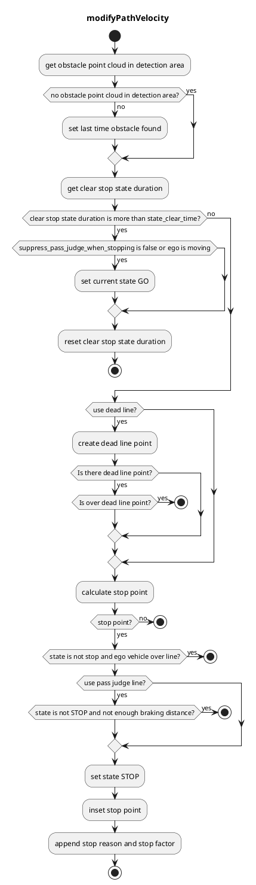

## 検出エリア

### 役割

マップ上に定義された検出エリアで点群が検出された場合、あらかじめ設定された地点で停止計画が実行されます。

### 起動タイミング

このモジュールは、対象車線上に検出エリアがある場合に起動されます。

### モジュールのパラメータ

| パラメータ | タイプ | 説明 |
|---|---|---|
| `use_dead_line` | bool | [-] デッドラインを使用するかどうか |
| `use_pass_judge_line` | bool | [-] パスジャッジラインを使用するかどうか |
| `state_clear_time` | double | [s] 車両が特定の時間に停止し、障害物が存在しない場合、STOPPED 状態に移行 |
| `stop_margin` | double | [m] 車両が停止線手前で停止しようとするマージン |
| `dead_line_margin` | double | [m] 走行車両が自車に衝突するかどうかを無視するしきい値 |
| `hold_stop_margin_distance` | double | [m] 再始動防止のパラメータ（アルゴリズムのセクションを参照） |
| `distance_to_judge_over_stop_line` | double | [m] 停止線を越えたと判断するパラメータ |
| `suppress_pass_judge_when_stopping` | bool | [m] 停止時のパスジャッジを抑制するパラメータ |

### 内部構成 / アルゴリズム

1. 地図情報から検出エリアと停止線を取得し、検出エリアに点群があることを確認する
2. 停止線の前に停止地点 l[m] を挿入する
3. 車両が最大減速度で停止できる地点に通過判断地点を挿入する
4. 自車が通過判断地点の前にある場合、停止線の後ろの速度を 0 に設定する
5. 自車がすでに通過判断地点を通過している場合は、停止せずに通過する。

#### フローチャート

#### 再始動防止

車両の制御性能が低い場合、車両の始動から停止までXメートル（例：0.5メートル）が必要になる場合、車両は停止位置を超過してしまい、停車位置付近（例：0.3メートル離れている）に近づくために厳守する必要があります。

このモジュールには、これらの余分な再始動を防ぐためのパラメータ`hold_stop_margin_distance`があります。車両がモジュールの停止位置から`hold_stop_margin_distance`メートル以内（\_front_to_stop_line < hold_stop_margin_distance）で停止している場合、モジュールは車両がすでにモジュールの停止位置で停止していると判断し、車両が他の要因で停止している場合でも現在の位置で停止し続けます。

<figure markdown>
  {width=1000}
  <figcaption>パラメータ</figcaption>
</figure>

<figure markdown>
  {width=1000}
  <figcaption>hold_stop_margin_distanceの外側</figcaption>
</figure>

<figure markdown>
  {width=1000}
  <figcaption>hold_stop_margin_distanceの内側</figcaption>
</figure>

