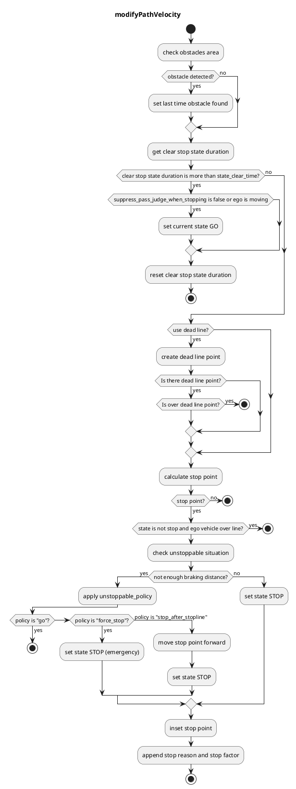

## Detection Area

### Role

If pointcloud or predicted objects are detected in a detection area defined on a map, the stop planning will be executed at the predetermined point.

### Activation Timing

This module is activated when there is a detection area on the target lane.

### Module Parameters

| Parameter                           | Type   | Description                                                                                                                                                                                             |
| ----------------------------------- | ------ | ------------------------------------------------------------------------------------------------------------------------------------------------------------------------------------------------------- |
| `unstoppable_policy`                | string | [-] policy when stopping distance is insufficient: "go" (pass through), "force_stop" (stop at original stop line), or "stop_after_stopline" (move stop point forward to align with deceleration limits) |
| `max_deceleration`                  | double | [m/s²] maximum deceleration for braking distance calculation in unstoppable situation handling                                                                                                          |
| `delay_response_time`               | double | [s] system response delay (brake lag + control delay) for braking distance calculation                                                                                                                  |
| `use_dead_line`                     | bool   | [-] whether to use dead line or not                                                                                                                                                                     |
| `state_clear_time`                  | double | [s] when the vehicle is stopping for certain time without incoming obstacle, move to STOPPED state                                                                                                      |
| `stop_margin`                       | double | [m] a margin that the vehicle tries to stop before stop_line                                                                                                                                            |
| `dead_line_margin`                  | double | [m] ignore threshold that vehicle behind is collide with ego vehicle or not                                                                                                                             |
| `hold_stop_margin_distance`         | double | [m] parameter for restart prevention (See Algorithm section)                                                                                                                                            |
| `distance_to_judge_over_stop_line`  | double | [m] parameter for judging that the stop line has been crossed                                                                                                                                           |
| `suppress_pass_judge_when_stopping` | bool   | [-] parameter for suppressing pass judge when stopping                                                                                                                                                  |
| `enable_detected_obstacle_logging`  | bool   | [-] enable/disable logging of detected obstacle positions, time elapsed since last detection, and ego vehicle position when ego-vehicle is in STOP state                                                |
| `target_filtering.pointcloud`       | bool   | [-] whether to stop for pointcloud detection                                                                                                                                                            |
| `target_filtering.unknown`          | bool   | [-] whether to stop for UNKNOWN objects area                                                                                                                                                            |
| `target_filtering.car`              | bool   | [-] whether to stop for CAR objects area                                                                                                                                                                |
| `target_filtering.truck`            | bool   | [-] whether to stop for TRUCK objects area                                                                                                                                                              |
| `target_filtering.bus`              | bool   | [-] whether to stop for BUS objects area                                                                                                                                                                |
| `target_filtering.trailer`          | bool   | [-] whether to stop for TRAILER objects area                                                                                                                                                            |
| `target_filtering.motorcycle`       | bool   | [-] whether to stop for MOTORCYCLE objects area                                                                                                                                                         |
| `target_filtering.bicycle`          | bool   | [-] whether to stop for BICYCLE objects area                                                                                                                                                            |
| `target_filtering.pedestrian`       | bool   | [-] whether to stop for PEDESTRIAN objects area                                                                                                                                                         |
| `target_filtering.animal`           | bool   | [-] whether to stop for ANIMAL objects area                                                                                                                                                             |
| `target_filtering.hazard`           | bool   | [-] whether to stop for HAZARD objects area                                                                                                                                                             |
| `target_filtering.over_drivable`    | bool   | [-] whether to stop for OVER_DRIVABLE objects area                                                                                                                                                      |
| `target_filtering.under_drivable`   | bool   | [-] whether to stop for UNDER_DRIVABLE objects area                                                                                                                                                     |

### Inner-workings / Algorithm

1. Gets a detection area and stop line from map information and confirms if there are obstacles in the detection area
2. Calculates required braking distance based on current velocity, `max_deceleration`, and `delay_response_time`
3. Compares available distance to stop line with required braking distance
4. If sufficient distance: Inserts stop point with configured margin in front of the stop line
5. If insufficient distance (unstoppable situation): Applies the configured `unstoppable_policy`:
   - `"go"`: Ignores the obstacle and continues through
   - `"force_stop"`: Stops at original stop line (may exceed comfortable deceleration)
   - `"stop_after_stopline"`: Moves stop point forward to maintain comfortable deceleration

#### Detection Logic

The module uses two detection sources:

- **Pointcloud detection**: Detects any obstacles in the detection area using 3D point cloud data (if `target_filtering.pointcloud` is enabled)
- **Predicted objects detection**: Detects classified objects (vehicles, pedestrians, etc.) in the detection area based on perception module outputs

The module stops the vehicle if either detection source finds an obstacle. For performance optimization, if pointcloud detection finds an obstacle, predicted objects detection is skipped (short-circuit evaluation).

#### Flowchart

#### Restart prevention

If it needs X meters (e.g. 0.5 meters) to stop once the vehicle starts moving due to the poor vehicle control performance, the vehicle goes over the stopping position that should be strictly observed when the vehicle starts to moving in order to approach the near stop point (e.g. 0.3 meters away).

This module has parameter `hold_stop_margin_distance` in order to prevent from these redundant restart. If the vehicle is stopped within `hold_stop_margin_distance` meters from stop point of the module (\_front_to_stop_line < hold_stop_margin_distance), the module judges that the vehicle has already stopped for the module's stop point and plans to keep stopping current position even if the vehicle is stopped due to other factors.

<figure markdown>
  {width=1000}
  <figcaption>parameters</figcaption>
</figure>

<figure markdown>
  {width=1000}
  <figcaption>outside the hold_stop_margin_distance</figcaption>
</figure>

<figure markdown>
  {width=1000}
  <figcaption>inside the hold_stop_margin_distance</figcaption>
</figure>

#### Unstoppable Situation Handling

When the required braking distance exceeds the available distance to the stop line, the module applies one of three policies.

##### Algorithm

1. Calculate required braking distance using `planning_utils::calcJudgeLineDistWithAccLimit` function
2. Compare with available distance to stop line
3. Apply `unstoppable_policy` if braking distance is insufficient

##### Policy Options

| Policy                  | Behavior                                                    |
| ----------------------- | ----------------------------------------------------------- |
| `"go"`                  | Ignore obstacle and continue through the detection area     |
| `"force_stop"`          | Stop at original stop line (may exceed `max_deceleration`)  |
| `"stop_after_stopline"` | Move stop point forward to satisfy `max_deceleration` limit |

##### Parameters

| Parameter             | Type   | Description                                                                                 |
| --------------------- | ------ | ------------------------------------------------------------------------------------------- |
| `unstoppable_policy`  | string | Policy when stopping distance is insufficient: "go", "force_stop", or "stop_after_stopline" |
| `max_deceleration`    | double | [m/s²] Maximum deceleration limit for braking distance calculation                          |
| `delay_response_time` | double | [s] System response delay for braking distance calculation                                  |
