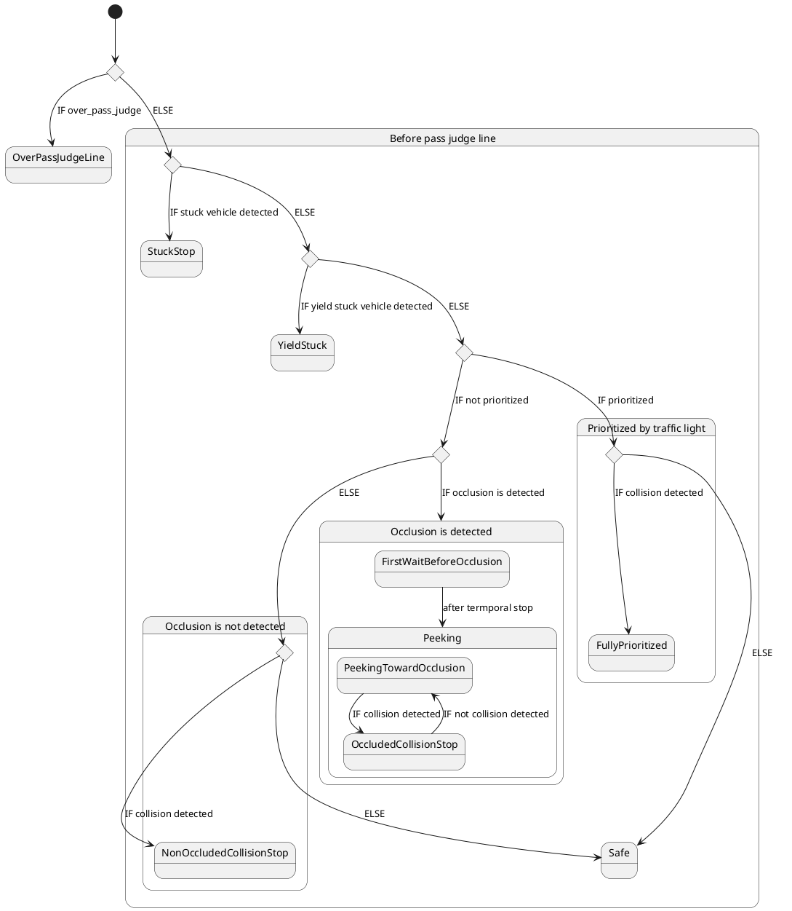
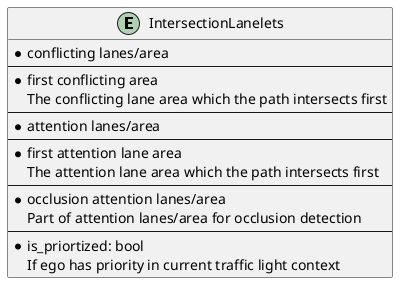
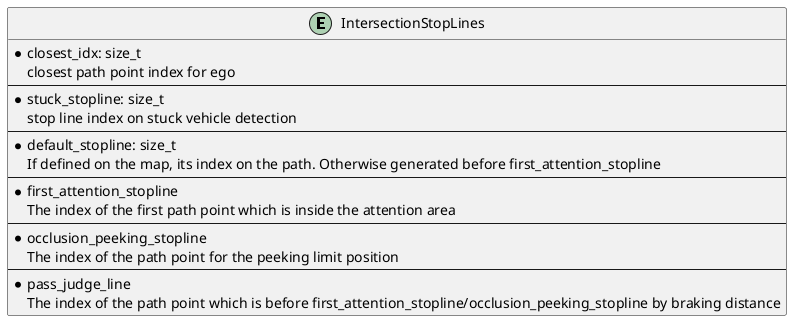
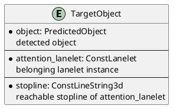
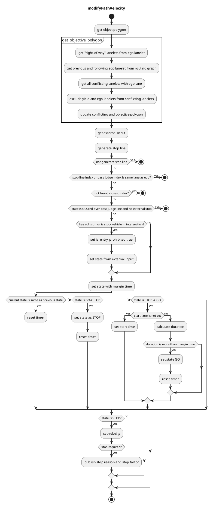

# 交差点

## 役割

交差点モジュールは、以下の方法で都市の交差点を安全に通過する役割を担っています。

1. 前方車両との衝突チェック
2. 交差点で遮蔽されている領域の認識
3. 関連する信号機の各色/形状への対応

このモジュールは、左/右通行ルールに依存せず、十字路、丁字路などに適用できるように設計されています。ラウンドアバウトはこのモジュールでは正式にサポートされていません。


## 起動条件

このモジュールは、パスに turn_direction タグを持つレーンが含まれている場合に起動します。正確には、パスの lane_ids にこれらのレーンの ID が含まれている場合、対応する各レーンの intersection モジュールのインスタンスが起動します。

## 要件/制限事項

- HDMap には、すべての交差点のレーンに関する turn_direction タグ（straight、left、right のいずれか）と、特定のレーンに関する right_of_way タグの情報が必要です（詳細については [RightOfWay](#how-towhy-set-rightofway-tag) セクションを参照）。詳細については [autoware_lanelet2_extension ドキュメント](https://github.com/autowarefoundation/autoware_lanelet2_extension/blob/main/autoware_lanelet2_extension/docs/lanelet2_format_extension.md) を参照してください。
- WIP（認識の要件/制限事項）
- WIP（センサーの可視性の要件/制限事項）

## 注目領域

交差点内の注目領域は、自己位置のパスと衝突するレーンとその先行レーン（最大 'common.attention_area_length' メートルまで）の集合として定義されます。デフォルトでは RightOfWay タグは設定されていないため、注目領域は最初の行のようにすべての衝突するレーンとその先行レーンをカバーします。RightOfWay タグは、信号機との関係と turn_direction の優先順位を与えられた優先レーンを除外するために使用されます。2 行目では、紫のレーンが RightOfWay タグで自己位置のレーンの yield_lane として設定されています。


HDMap 上で定義される intersection_area は、交差点全体を含んだ領域です。

### 同相信号群/逆相信号群

「同相信号群」と「逆相信号群」という用語は、信号機のタイミングによるレーンの区別を導入したものです。以下に示します。


L1 レーンの色と同期している交差点レーンの集合は、L1 の同相信号群と呼ばれ、残りのレーンの集合は逆相信号群と呼ばれます。

### RightOfWay タグの設定方法/理由

理想的には、自己位置がすべての信号機情報について完全な知識を持っている場合は RightOfWay タグは不要です。その理由は以下のとおりです。

- 現在 GREEN であり自己位置との衝突が発生する可能性がある車両を保持しているので、どの衝突レーンをチェックする必要があるかを区別することができます。
- 現在 RED であり、それらのレーン上の車両が交通ルールに違反しない限り衝突の可能性がないため、どの衝突レーンを無視できるかを区別することができます。

これにより、自己位置はリアルタイムの信号機情報を使用して動的に注目領域を生成できます。ただし、この理想的な状態は、信号機情報がインフラストラクチャを通じて提供されない限り、ほとんど満たされません。また、複数のレーンが複雑に重なる非常に複雑/劣悪な交差点マップがある場合があります。

- 完全な信号機信号に完全にアクセスできる場合は、common.use_map_right_of_way を false に設定でき、マップで RightOfWay タグを設定する必要はありません。交差点モジュールは、信号機とその衝突レーンを確認して注目領域を生成します。この機能はまだ実装されていません。
- 信号機情報が完全でない場合は、common.use_map_right_of_way を true に設定します。逆相信号群レーンの車両を検出しない場合は、それらを自己位置のレーンの yield_lane として設定します。
- 信号機がなくても、交差点のレーンが醜い方法で重なっている場合は、RightOfWay タグを設定する必要があります。たとえば、同じ同相グループの隣接する交差点レーンが境界線を共有せず、少し重なっている場合は、そのような無関係なレーン上の車両に対する不要な停止を回避するために、RightOfWay をお互いに設定する必要がある場合があります。

交差点モジュールを限られたレーンのみを処理するようにするには、RightOfWay タグを適切に設定する必要があります。

次の表は、信号機のない交差点の各レーンに yield_lane を設定する方法の**例**を示しています。幾何学的/トポロジカルな方法で交差点レーンの信号機フェーズグループを一意に決定する方法が明確ではないため、yield_lane は手動で設定する必要があります。信号機のある直進レーンは、通常他のすべてのレーンよりも優先されるため、特別にレーンがないように処理され、RightOfWay 設定は不要です。

| 右優先方向                  | 譲歩レーン（信号機あり）                                                               | 譲歩レーン（信号機なし）                                  |
| ------------------------------ | ------------------------------------------------------------------------------------------- | ----------------------------------------------------------- |
| 直進                          | 譲歩レーンを設定する必要なし（このケースは特殊）                                          | 同相グループ内で衝突する左/右の車線                        |
| 左折（左ハンドル交通）        | 対抗相グループのすべての競合車線、および同相グループの右競合車線                            | 同相グループの右競合車線                                  |
| 右折（左ハンドル交通）       | 対抗相グループのすべての競合車線                                                               | 譲歩レーンなし                                            |
| 左折（右ハンドル交通）       | 対抗相グループのすべての競合車線                                                               | 譲歩レーンなし                                            |
| 右折（右ハンドル交通）      | 対抗相グループのすべての競合車線、および同相グループの右競合車線                            | 同相グループの左競合車線                                 |

この設定は次の `attention_area` コンフィギュレーションを作成します。


下記のように複雑で悪い交差点マップでは、追加的な RightOfWay 設定が必要になる場合があります。


悪い点は次のとおりです。

1. 自車線は、同一相グループの隣接車線と重複しています。この場合、この車線を yield_lane に追加的に設定する必要があります。そうでないと、その先行車線にも attention area が生成され、不要な停止を引き起こす可能性があります。
2. 自車線は無関係な車線と重複しています。この場合、車線は右折専用であり、理論的には衝突の可能性はありません。しかし、(1) と同じ理由で、このレーンを yield_lane に追加的に設定する必要があります。

## 可能な停止線

次の図は交差点モジュールで使用される重要な位置を示しています。各実線は自車最前面位置を表し、対応する点は車両フレームの実際の挿入停止点位置、すなわち後輪の中心です。


停止位置を正確に計算するために、パスは `common.path_interpolation_ds` の特定間隔で補間されます。

- closest_idx は自車位置に最も近いパス点インデックスを表します。
- first_attention_stopline は、自車のフットプリントが attention_area と交差する最初のパス点です。
- 停止線がマップ上の交差点レーンに関連付けられている場合は、その線が衝突検出の default_stopline として使用されます。それ以外の場合、first_attention_stopline の `common.default_stopline_margin` メートル後方の点が default_stopline として定義されます。
- occlusion_peeking_stopline は、後で説明するように、first_attention_stopline より少し前です。
- occlusion_wo_tl_pass_judge_line は、自車のフットプリントが最初の attention_area レーンのセンターラインと交差する最初の位置です。

## 標的オブジェクト

[停車車両の検出](#stuck-vehicle-detection)と[衝突の検出](#collision-detection)に対して、このモジュールは**乗用車、バス、トラック、トレーラー、オートバイ、自転車**タイプのオブジェクトをチェックします。

次の条件をすべて満たすオブジェクトは、ターゲットオブジェクト（衝突の可能性のあるオブジェクト）とみなされます。

- オブジェクトの中心が**特定の距離以内**にアテンションレーンからある（閾値 = `common.attention_area_margin`）。
  - （オプションの条件）オブジェクトの中心が**交差点エリア内**にある。
    - インターセクションのレーンの範囲から外れているエリア内のオブジェクトに対処します。
- オブジェクトの姿勢が**アテンションレーンと同じ方向**（閾値 = `common.attention_area_angle_threshold`）。
- 自車の**隣接車線にない**。

## 意思決定プロセスの概要

シーンに応じていくつかの動作があります。

| 行動                        | シーン                                                                                                     | アクション                                                                             |
| ------------------------- | ----------------------------------------------------------------------------------------------------- | ------------------------------------------------------------------------------------- |
| 安全                        | 自車が遮蔽物や衝突を検出していない                                                           | 自車が交差点を通過                                                               |
| 停止                        | 交差点の出口が渋滞によって塞がれている                                                       | 自車が交差点または注意領域の境界線の前で停止                                     |
| 進路妨害による停止         | 別の車両が自車に道を譲るために停止している                                                | 自車が交差点または注意領域の境界線の前で停止                                     |
| 遮蔽物なしの衝突停止       | 自車は遮蔽物はないと検出するが、衝突を検出する                                                  | 自車がデフォルト停止線で停止                                                    |
| オクルージョン前の一時停止   | 自車が交差点進入時に遮蔽物を検出する                                                       | 自車が最初にデフォルト停止線で停止                                               |
| オクルージョンに近づいて覗く | 自車は遮蔽物を検出し、FOV内には衝突を検出していない (OcclusionBeforeOcclusionの後) | 自車が注意領域の境界線にゆっくり接近                                                 |
| オクルージョン下衝突停止     | 自車は遮蔽物と衝突の両方を検出する (OcclusionBeforeOcclusionの後) | 自車が直ちに停止                                                                  |
| 完全優先                    | 自車が信号によって完全に優先されている                                                         | 自車は交差点内を走行している車両のみを考慮。遮蔽物は無視                          |
| 優先通行線上にいる           | 自車がすでに注意領域内あるいは注意領域の境界線の前にある                                        | 自車は衝突/遮蔽物検出せずに交差点を通過                                       |




## Stuck Vehicle Detection

交差点内および交差点出口付近の経路に (`stuck_vehicle.stuck_vehicle_detect_dist` まで) オブジェクトが存在し、その速度がしきい値 (`stuck_vehicle.stuck_vehicle_velocity_threshold`) 未満の場合、オブジェクトはスタック車両とみなされます。スタック車両が存在する場合、このモジュールは他の車線との重複領域より手前 (つまり、`default_stopline_margin` に相当) に停止線を挿入します。スタック車両検出領域は計画された経路に基づいて生成されるため、上流モジュールが回避経路を生成した場合、スタック車両の停止線は挿入されません。


## Yield Stuck Vehicle Detection

自車経路との交差点点から `yield_stuck.distance_threshold` 手前の注目車線に停止したオブジェクトが存在する場合、オブジェクトは自車に歩行車権を与えているとみなされます。この場合、自車は歩行車権を与えるオブジェクトによって優先されますが、このモジュールは交差点への進入を防ぐために停止線を挿入します。このシーンは、オブジェクトが自車に対して歩行車権を与えているか、または交差点出口付近の横断歩道の前でオブジェクトが待機しているときに発生します。


## Collision Detection

次のプロセスは、自車が交差点を安全に通行できるかどうかを判断するために対象オブジェクトに対して実行されます。自車が交差点を十分な余裕を持って通過できないと判断された場合、このモジュールは経路上に停止線を挿入します。

1. 予測された経路のタイムステップから、オブジェクトが最初に自車経路と交差する時刻 `t` を予測します。信頼度が `collision_detection.min_predicted_path_confidence` より大きい予測のみが使用されます。
2. 次のプロセスで予測された経路と自車の予測された経路間の衝突を検出します。
   1. [$t$ - `collision_detection.collision_start_margin_time`, $t$ + `collision_detection.collision_end_margin_time`] の衝突間隔を計算します。
   2. 平滑化された速度プロファイルによって得られた (時刻、距離) の配列から、衝突間隔中の自車の通過領域を計算します。
   3. 自車の通過領域とオブジェクトの予測された経路間隔が衝突するかどうかを確認します。
3. 衝突が検出された場合、モジュールは停止線を挿入します。
4. 自車が [pass_judge_line](#pass-judge-line) を通過している場合、交差点の半ばで突然のブレーキや不必要な停止を避けるために衝突チェックはスキップされます。

パラメーター `collision_detection.collision_start_margin_time` と `collision_detection.collision_end_margin_time` は次のように解釈できます。

- 自車が対象オブジェクトより早く交差点を通過する場合、両者の時間差が `collision_detection.collision_start_margin_time` 未満であれば衝突が検出されます。
- 自車が対象オブジェクトより遅く交差点を通過する場合、両者の時間差が `collision_detection.collision_end_margin_time` 未満であれば衝突が検出されます。

衝突が検出された場合、状態はすぐに「STOP」に移行します。一方、衝突の判断が一定時間 `collision_detection.collision_detection_hold_time` 継続しない限り、「GO」に移行しません。これにより、判断のチャタリングを防ぎます。

現在、交差点モジュールは `motion_velocity_smoother` 機能を使用して、縦方向/横方向の制約下で交差点車線に沿った自車の速度プロファイルを正確に計算しています。フラグ `collision_detection.velocity_profile.use_upstream` が true の場合、元の経路の目標速度プロファイルが使用されます。それ以外の場合は、目標速度は `collision.velocity_profile.default_velocity` に設定されます。軌跡平滑化プロセスでは、自車軌道上の/自車軌道の前の目標速度が自車の現在の速度に設定されます。次に、平滑化された軌道は、現在の自車位置から経路上の各軌道点への到着時間を示す (時刻、距離) の配列に変換されます。`debug.ttc` に車線 ID を追加して実行すると、この配列を視覚化できます。


```bash
ros2 run behavior_velocity_intersection_module ttc.py --lane_id <lane_id>
```

## use_upstream_velocityフラグについて

交差点の出口周辺にある歩道/横断歩道のモジュールによる一時停止を考慮して、交差点に進入する前に自車が衝突を確認する必要があるユースケースがいくつかあります。停止位置が交差点内にある可能性があり、近づいてくる車両を妨げる可能性があるためです。フラグ`collision_detection.velocity_profile.use_upstream`をtrueに設定し、このモジュールより前に歩行者/横断歩道モジュールを実行すると、自車の速度プロファイルは歩行者の速度と停止位置を考慮して計算されます。

下記の図に示すように、アップストリームモジュールがストップラインを挿入した場合、自車の位置プロファイルは無限時間そこに留まり、自車が区間[$t$ - `collision_detection.collision_start_margin_time`, $t$ + `collision_detection.collision_end_margin_time`]の間に出口できないと判断されることになります。この方法では、自車の位置の前方にストップラインが存在する場合、無限時間衝突の可能性を考慮します（実際には予測の範囲は限定されているため、衝突確認の範囲も限定されます）。


## オクルージョン検出

フラグ`occlusion.enable`が有効な場合、このモジュールは最大`occlusion.occlusion_attention_area_length`までの注意領域に十分な視野（FOV）があるかどうかを確認します。FOVが十分でない場合、自車は最初にdefault_stoplineで`occlusion.temporal_stop_time_before_peeking`の間短時間停止し、その後occlusion_peeking_stoplineに向かってゆっくりとクリープします。`occlusion.creep_during_peeking.enable`がtrueの場合、occlusion_peeking_stoplineまでの`occlusion.creep_during_peeking.creep_velocity`が挿入されます。そうでない場合、ストップラインのみが挿入されます。

クリープ中に衝突が検出されると、このモジュールはすぐに自車の前にストップラインを挿入し、FOVが十分にクリアになると交差点のオクルージョン壁は消えます。オクルージョンが解消され、衝突が検出されないと、自車は交差点を通過します。

オクルージョンは、オクルージョン注意領域（部分的には通常の注意領域と同じ）と占有グリッドマップの不明セルの共通領域として検出されます。占有グリッドマップは`occlusion.denoise_kernel`のウィンドウサイズを使用した形態処理を使用してノイズが除去されます。オクルージョン注意領域のレーンはライン文字列に離散化され、各セルが以下に示すようにレーンに沿った自車経路からの距離を表すグリッドを生成するために使用されます。


最も近くのオクルージョンセルの値が閾値`occlusion.occlusion_required_clearance_distance`を下回っている場合、自車のFOVがクリアでないことを意味します。オクルージョンは、車両がオクルージョン覗き見停止線に近づくにつれて解消されることが期待されています。

### 交差点における信号機でのオクルージョンソース推定

信号機のある交差点では、自車と最も近いオクルージョンセルの間に物体があるかどうかを確認することでオクルージョンの所在を推定します。オクルージョンが何らかの物体（動的にオクルージョン）によって引き起こされると推定されている間、交差点の壁は常に表示されます。自車と最も近いオクルージョンセルの間に物体がない場合（静的にオクルージョン）、自車が`occlusion.static_occlusion_with_traffic_light_timeout`の期間 плюс`occlusion.occlusion_detection_hold_time`停止した後、スタックを避けるために意図的にオクルージョンは無視されます。

残りの時間は交差点のオクルージョン仮想壁に視覚化されます。


### 信号機のない交差点でのオクルージョン処理

信号のない交差点では、オクルージョンが検出されると、自車はdefault_stoplineとfirst_attention_stoplineでそれぞれ短時間停止します。first_attention_area_stoplineで停止した後、このモジュールはオクルージョンが解消されない限り、自車とocclusion_wo_tl_pass_judge_lineの間に`occlusion.absence_traffic_light.creep_velocity`の速度を挿入します。衝突が検出されると、自車はすぐに停止します。オクルージョンが解消されたか、自車がocclusion_wo_tl_pass_judge_lineを通過すると、自車のフットプリントはすでに交差点内にあるため、このモジュールは衝突やオクルージョンを検出しません。


自車がクリープしている間、自車の前に黄色の交差点の壁が表示されます。


## 交通信号機特異的挙動

### 衝突検出

TTCパラメータは次のとおり、信号機の色の形状によって異なります。

| 信号色 | ttc(開始) | ttc(終了) |
|---|---|---|
| 緑 | `collision_detection.not_prioritized.collision_start_margin` | `collision_detection.not_prioritized.collision_end_margin` |
| 黄 | `collision_detection.partially_prioritized.collision_start_end_margin` | `collision_detection.partially_prioritized.collision_start_end_margin` |
| 赤 / 矢印 | `collision_detection.fully_prioritized.collision_start_end_margin` | `collision_detection.fully_prioritized.collision_start_end_margin` |

### yield on GREEN

信号がGREENに変わった場合、自車位置のintersection laneの入口が`collision_detection.yield_on_green_traffic_light.distance_to_assigned_lanelet_start`の距離に達していて、かつそのstoplineからの距離が`collision_detection.yield_on_green_traffic_light.object_dist_to_stopline`未満のオブジェクトがある場合、このモジュールはdefault_stoplineで`collision_detection.yield_on_green_traffic_light.duration`分の停止を指示します。

### skip on AMBER

信号がAMBERの場合、オブジェクトが減速率`collision_detection.ignore_on_amber_traffic_light.object_expected_deceleration`未満でstopline手前で停止すると予想される場合、衝突判定はスキップされます。

### skip on RED

信号がREDの場合、または矢印信号が点灯している場合、自車線と交差しない注意レーンは検出に使用されません。また、オブジェクトがstoplineから多少オーバーシュートして停止しても、減速率`collision_detection.ignore_on_amber_traffic_light.object_expected_deceleration`で期待される停止位置が衝突ポイントから`collision_detection.ignore_on_red_traffic_light.object_margin_to_path`以上の距離にある場合、そのオブジェクトは無視されます。

###  ocultarion detection

信号の色/形状がRED/Arrowの場合、occlusion detectionはスキップされます。


## Pass Judge Line

一般的に、優先順位の低い車両が交差点の無保護領域の中央で停止することは認められません。衝突のリスクがある場合には、事前にstop lineで停止する必要があります。これには2つの要件があります。

1. 車両が停止する必要がある場合は、十分な制動距離を確保して、少なくとも無保護領域の境界線手前でブレーキを開始する必要があります。
2. 車両は、十分な制動距離マージンを確保して、進行中の車両を認識し、事前に安全性を判断する必要があります。また、SAFEの判断は完全に確実なものでなければならず、自車が無保護領域内を走行している間、常に安全条件が満たされる必要があります。
3. (TODO): 検出範囲/速度追跡性能が限られているため、事前に完全に安全な判断を下すことはほぼ不可能であるため、交差点モジュールは、安全判断が後から次の理由で「裏切られた」場合に、リスク回避的な加速度速度プロファイルと/または横加速度制限を緩和する必要があります。
   1. 速度追跡が過小評価されたか、またはオブジェクトがTTCマージンを超えて加速したため、状況が後で_危険になった_
   2. オブジェクトが突然何もないところから検出されたため、状況が後で_危険になった_

$$
\dfrac{v_{\mathrm{ego}}^{2}}{2a_{\mathrm{max}}} + v_{\mathrm{ego}} * t_{\mathrm{delay}}
$$

で得られる制動距離によって無保護領域の境界線より手前にある位置をpass_judge_lineと呼び、自車がこの位置を通過する前に安全判断を行う必要があります。なぜなら、自車はそれ以上停止しないからです。

1st_pass_judge_lineは最初の進行車線の前にあり、複数の進行車線がある交差点では、2nd_pass_judge_lineは制動距離を考慮して最初の注意レーンのセンターラインより前に定義されます。1st/2nd_pass_judge_lineは次の図に示されています。


交差点モジュールは、次の場合にGOを指示します。

- 自車位置がdefault_stoplineより前（または`common.enable_pass_judge_before_default_stopline`がtrue）の場合
- 自車位置が1st_pass judge lineより前
- 自車が事前にSAFEと判断した
- （自車位置が2nd_pass_judge_lineより前、または1stと2ndのpass_judge_lineの間だが、最も可能性の高い衝突が1番目の注意レーンで発生すると予想される場合）

次の場合は停止、または停止判断を続行すると予想されるためです。

1. 自車位置がdefault_stoplineより前で`common.enable_pass_judge_before_default_stopline`がfalseの場合
   1. 理由：default_stoplineは地図上で定義されており、遵守する必要があります。
2. 自車位置が1st_pass_judge_lineより前
   1. 理由：十分な制動距離のマージンがあります。
3. 自車が事前にUNSAFEと判断した場合
   1. 理由：自車は現在停止しようとしており、後の計算で衝突が検出された場合は停止の判断を継続する必要があります。
4. （自車位置が1stと2ndのpass_judge_lineの間で、最も可能性の高い衝突は2番目の注意レーンで発生すると予想される）

3番目の条件では、自車は減速中に1st_pass_judge_lineを通過する場合がありますが、衝突検出中、自車は無保護領域に少しオーバーシュートして停止する可能性があります。なぜなら、自車がUNSAFEと判断されている間は停止の判断を継続する必要があるからです。

4 番目の条件では、2 番目の注目レーンがある交差点において、エゴカーが 1 番目の通過判定ラインを超えていても、2 番目の注目レーンで最も衝突の可能性が高いと予想される場合、交差点モジュールは停止を指示します。

また、`occlusion.enable` が true の場合、エゴカーが覗き見中に元の 1 番目の通過判定ラインの位置を通過した場合、1 番目の通過判定ラインの位置は occlusion_peeking_stopline に変更されます。そうしないと、エゴカーは覗き見中に誤って 1 番目の通過判定ラインを通過し、覗き見を中止する可能性があります。

## データ構造

各データ構造は `util_type.hpp` で定義されています。


### `IntersectionLanelets`




### `IntersectionStopLines`

各停止線は、内挿パスから生成され、正確な位置を取得しています。




### `TargetObject`

`TargetObject` には、対象物、それに属する車線、対応する停止線情報が保持されます。




## モジュールパラメータ

### コモン

| パラメータ                                   | 型   | 説明                                                                              |
| ------------------------------------------- | ------ | -------------------------------------------------------------------------------------- |
| `.attention_area_length`                     | double | [m] 物体検出の範囲                                                                 |
| `.attention_area_margin`                     | double | [m] 注意領域の幅を拡大するためのマージン                                           |
| `.attention_area_angle_threshold`            | double | [rad] 検出された物体と車線の角度差のしきい値                                    |
| `.use_intersection_area`                     | bool   | [-] 衝突検出に intersection_area を使用するフラグ                               |
| `.default_stopline_margin`                   | double | [m] stopline の手前のマージン                                                     |
| `.stopline_overshoot_margin`                 | double | [m] stopline からのオーバーシュートのマージン                                    |
| `.max_accel`                                 | double | [m/ss] stop に対する最大加速度                                                   |
| `.max_jerk`                                  | double | [m/sss] stop に対する最大ジャーク                                                 |
| `.delay_response_time`                       | double | [s] stop 前の動作の遅延                                                          |
| `.enable_pass_judge_before_default_stopline` | bool   | [-] 自車が pass_judge_line を超えていても既定の stopline の前に停止しないフラグ |

### stuck_vehicle/yield_stuck

- このコンポーネントは他の車両が停止しているか動けなくなっている場合に、それらの車両と衝突しないようにする安全な経路を生成します。

- 出力トピックは「`/planning/lattice_planner/trajectory_candidate`」です。
- 入力トピックは次のとおりです。
  - 「`/perception/object`」: 自身の周囲にある物体の認識結果。
  - 「`/planning/scenario`」: シナリオ認識結果。
  - 「`/localization/kinematic`」: 自車位置。
  - 「`/planning/lattice`」: 走行格子。
  - 「`/planning/vel_profile`」: 速度プロフィール。

| パラメータ                                        | タイプ | 説明                                                                                  |
| ------------------------------------------------ | ------ | ---------------------------------------------------------------------------------------- |
| `stuck_vehicle.turn_direction`                   | -      | [-] 停止車両検出のturn_direction指定                                                 |
| `stuck_vehicle.stuck_vehicle_detect_dist`        | double | [m] 交差点出口からの距離で、停止車両検出のための長さ                                  |
| `stuck_vehicle.stuck_vehicle_velocity_threshold` | double | [m/s] 停止車両検出の速度しきい値                                                         |
| `yield_stuck.distance_threshold`                 | double | [m/s] 車線に沿ったエゴパスからの停止車両の距離しきい値                              |

### collision_detection

**概要:**
本コンポーネントは、車両周囲の静的および動的障害物を検出し、衝突のリスクを評価します。

**アーキテクチャ:**
collision_detectionコンポーネントは、以下のモジュールで構成されています。

- **ObjectPerceptionModule:** カメラやレーダーなどのセンサーからのデータを使用して障害物を検出します。
- **PlanningModule:** 障害物情報を解釈し、衝突リスクを評価します。
- **LocalizationModule:** 自車位置を推定し、障害物との相対位置を計算します。

| パラメータ                                   | 型   | 説明                                                                        |
| ------------------------------------------ | ------ | ---------------------------------------------------------------------------- |
| `.consider_wrong_direction_vehicle`       | ブール | [-] 逆走車両を検出するフラグ                                                 |
| `.collision_detection_hold_time`            | 倍精度 | [秒] 衝突検出の保持時間                                                       |
| `.min_predicted_path_confidence`            | 倍精度 | [-] 衝突検出に使用する予測パスの最小信頼値                               |
| `.keep_detection_velocity_threshold`      | 倍精度 | [秒] 通過基準を超える前に衝突検出を継続するための自車速度のしきい値        |
| `.velocity_profile.use_upstream`          | ブール | [-] 上位のモジュールによって計画された速度プロファイルをにするフラグ        |
| `.velocity_profile.minimum_upstream_velocity` | 倍精度 | [m/秒] 0除算を避けるための、上位の速度プロファイルの最小速度              |
| `.velocity_profile.default_velocity`      | 倍精度 | [m/秒] use_upstreamがfalseのときの定数速度プロファイル                    |
| `.velocity_profile.minimum_default_velocity` | 倍精度 | [m/秒] 0除算を避けるための、デフォルト速度プロファイルの最小速度        |
| `.yield_on_green_traffic_light`           | -      | [-] [説明](#yield-on-green)                                                 |
| `.ignore_amber_traffic_light`             | -      | [-] [説明](#skip-on-amber)                                                  |
| `.ignore_on_red_traffic_light`            | -      | [-] [説明](#skip-on-red)                                                    |

## オクルージョン

| パラメータ                                     | タイプ | 説明                                                                                                       |
| -------------------------------------------- | -------- | ------------------------------------------------------------------------------------------------------------ |
| `.enable`                                      | bool     | [-] オクルージョン検出を計算するフラグ                                                                             |
| `.occlusion_attention_area_length`             | double   | [m] オクルージョン検出用のアテンションエリアの長さ                                                             |
| `.free_space_max`                              | int      | [-] 占有グリッドセルがオクルージョン状態として扱われる最大値                                                    |
| `.occupied_min`                                | int      | [-] 占有グリッドセルがオクルージョン状態として扱われる最小値                                                    |
| `.denoise_kernel`                              | double   | [m] 生の占有グリッドの前処理のためのモフォロジーウィンドウサイズ                                                  |
| `.attention_lane_crop_curvature_threshold`     | double   | [m] 車線の曲線部分のトリミングのための曲率しきい値                                                             |
| `.attention_lane_crop_curvature_ds`            | double   | [m] 車線曲率計算のためのセンターラインの離散化間隔                                                           |
| `.creep_during_peeking.enable`                 | bool     | [-] 交差点オクルージョンストップラインを覗き込む際に `creep_velocity` を挿入するフラグ                            |
| `.creep_during_peeking.creep_velocity`         | double   | [m/s] 交差点オクルージョンストップラインを覗き込む際の指令速度                                                 |
| `.peeking_offset`                              | double   | [m] オクルージョンを覗き込むためのアテンションエリアへの車両の前方のオフセット                               |
| `.occlusion_required_clearance_distance`       | double   | [m] エゴパスから最も近いオクルージョンセルまでの距離のしきい値                                                 |
| `.possible_object_bbox`                        | [double] | [m] オクルージョンのポリゴンが十分に小さいかどうかを確認するための最小バウンディングボックスサイズ            |
| `.ignore_parked_vehicle_speed_threshold`       | double   | [m/s] 駐車車両の確認のための速度しきい値                                                                      |
| `.occlusion_detection_hold_time`               | double   | [s] オクルージョン検出のホールド時間                                                                               |
| `.temporal_stop_time_before_peeking`           | double   | [s] ピーキングを開始する前のデフォルトストップラインでの一時停止時間                                           |
| `.temporal_stop_before_attention_area`         | bool     | [-] アテンションエリアを覗き込む前に最初の `attention_stopline` で一時停止するフラグ                              |
| `.creep_velocity_without_traffic_light`        | double   | [m/s] オクルージョンなしの通行可能な判定ラインへのクリープ速度                                                    |
| `.static_occlusion_with_traffic_light_timeout` | double   | [s] 信号機付き交差点での静的オクルージョンを無視するためのタイムアウト時間                                  |

## トラブルシューティング

### Intersection モジュールが関係のない車両に対して停止する

この場合、最初に `/planning/scenario_planning/lane_driving/behavior_planning/behavior_velocity_planner/debug/intersection` トピックを視覚化して `attention_area` ポリゴンを確認します。Intersection モジュールはこのポリゴン上で実行されている車両の衝突チェックを実行するため、意図しない車線まで拡張されている場合は、[RightOfWay タグ](#how-towhy-set-rightofway-tag) が必要です。

`common.attention_area_length` を下げることで、どのレーンが交差点レーンと競合しているかを確認できます。次に、競合するレーンの部分を yield_lane として設定します。

### 交差点の停止線が不安定である

パラメーター `collision_detection.collision_detection_hold_time` は、SAFE 決定が最終的に下されるまで UNSAFE 決定をこの期間保持することで不安定さを抑制します。このパラメータの役割は、不安定なオブジェクトの検出 / トラッキングを考慮することです。この値を大きくすることで、不安定さを抑制できます。ただし、停止時間が過度に長くなる可能性があります。

不安定さがターゲット車両の加速 / 減速から生じる場合は、`collision_detection.collision_detection.collision_end_margin_time` または `collision_detection.collision_detection.collision_end_margin_time` を増やします。

### 停止線が早すぎる / 遅すぎる

交差点の壁が早すぎたり、エゴが先行車両に対して保守的に停止する傾向がある場合は、パラメーター `collision_detection.collision_detection.collision_start_margin_time` を下げます。ターゲット車両が通過した後も長すぎる場合は、`collision_detection.collision_detection.collision_start_margin_time` パラメーターを下げます。

### エゴが信号機のある交差点で突然停止する

信号の色が AMBER/RED から UNKNOWN に変わった場合、交差点モジュールは GREEN 色モードで動作します。そのため、衝突や閉塞が再び検出される可能性があります。

### 過剰に閉塞が検出される

`/planning/scenario_planning/lane_driving/behavior_planning/behavior_velocity_planner/debug/intersection/occlusion_polygons` を視覚化することで、どのエリアが閉塞として検出されたかを確認できます。閉塞を検出しない / 無視したい場合、または閉塞検出の計算コストを下げたい場合は、`occlusion.occlusion_attention_area_length` を低い値に設定してください。

エゴの近くにある閉塞をより慎重に処理したい場合は、`occlusion.occlusion_required_clearance_distance` を大きな値に設定します。次に、エゴはより明確な FOV を確保するために、閉塞_peeking_stopline により近づきます。

`occlusion.possible_object_bbox` は、検出された閉塞エリアが小さく、このサイズより大きな車両が内部に存在しないかどうかを確認するために使用されます。このサイズを小さくすると、エゴは小さな閉塞エリアを無視します。

#### 占有グリッドマップの調整

詳細については [autoware_probabilistic_occupancy_grid_map](https://autowarefoundation.github.io/autoware.universe/main/perception/autoware_probabilistic_occupancy_grid_map/) のドキュメントを参照してください。閉塞が明らかに空きスペースで検出される傾向がある場合は、`occlusion.free_space_max` を大きくして無視します。

#### simple_planning_simulator で

レーザー_ベースの_occupancy_grid_map は 2D 方式で不自然な UNKNOWN セルを生成するため、intersection_occlusion 機能は Planning_simulator での使用には **推奨されません**。

- 歩行者の背後にあるすべてのセルは UNKNOWN
- 地面の点群は生成されない

また、多くのユーザーは、交差点閉塞（および実際の交通環境でも）に非常に重要な交通信号機情報を頻繁には設定しません。

これらの理由から、`occlusion.enable` はデフォルトで false です。

#### 実車 / エンドツーエンドシミュレータで

実車や [AWSIM](https://tier4.github.io/AWSIM/) などのエンドツーエンドシミュレータでは、次の pointcloud_based_occupancy_grid_map 設定を強くお勧めします。


```yaml
scan_origin_frame: "velodyne_top"

grid_map_type: "OccupancyGridMapProjectiveBlindSpot"
OccupancyGridMapProjectiveBlindSpot:
  projection_dz_threshold: 0.01 # [m] for avoiding null division
  obstacle_separation_threshold: 1.0 # [m] fill the interval between obstacles with unknown for this length
```

`scan_origin_frame`としてトップLiDARリンクを設定する必要があります。この例では`velodyne_top`です。`OccupancyGridMapProjectiveBlindSpot`メソッドは、`scan_origin`から障害物または地面までの射影レイ・トレーシングを実行してFOVを推定し、物体の「影」上のセルをUNKNOWNとして塗りつぶします。

## フローチャート

WIP




## 私道からの合流

### 役割

自動運転車が私道（例：駐車場）から公道へ進入する場合、公道への進入前に公道に面し、停止する必要があります。

このモジュールは、車両が私道から公道への進入交差点に差し掛かったときに有効になります。停止線は、目標地点が交差点車線にある場合と、経路が交差点車線を越える場合の両方で生成されます。基本的な動作は交差点モジュールと同じですが、自動運転車は停止線で一度停止する必要があります。


### 有効化タイミング

このモジュールは、以下の条件が満たされた場合に有効になります。

- 自車線に「私道」タグがある
- 自車線は他の「非私道」レーンレットと衝突する

| パラメータ                                   | 型   | 説明                     |
| ------------------------------------------- | ------ | ------------------------------- |
| `merge_from_private_road/stop_duration_sec` | double | [`m`]状態を変更するための時間マージン |

### 既知の問題

自車がストップラインからある程度の距離を超えて走行した場合、STOP から遷移しません。

## テストマップ

交差点のlaneletマップには、次のようなさまざまな交差点が含まれています。

- 信号のある4方向交差点
- 信号のない4方向交差点
- 信号のないT字路交差点
- ループのある交差点
- 複雑な交差点


