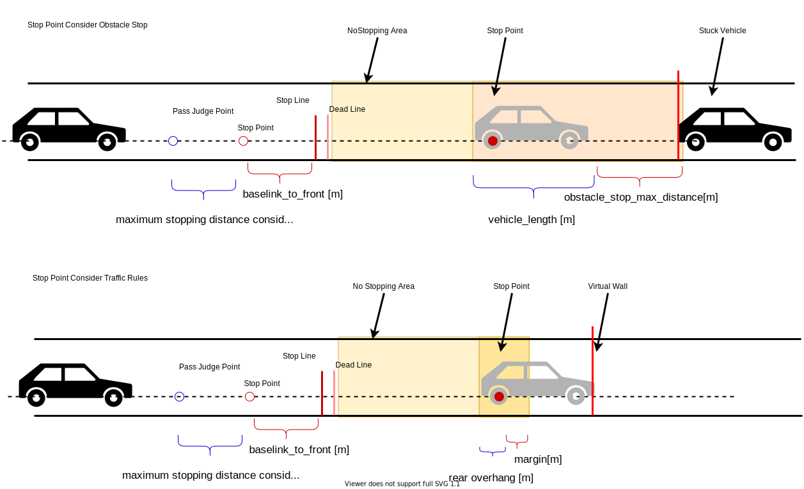

### 禁止駐車エリア

#### 役割

このモジュールは、「禁止駐車エリア」での停止を回避するために計画を立てます。

- 通過ケース
  - 自動運転車が通過判断点を通過した場合、自動運転車は最大のジャークと加速度で停止できないため、このモジュールは停止速度を挿入しません。この場合、オーバーライドまたは外部操作が必要です。
- 停止ケース
  - 「禁止駐車エリア」の周囲に停止車両または停止速度がある場合、車両は「禁止駐車エリア」内で停止するため、このモジュールは「禁止駐車エリア」の手前に停止速度を作成します。
- 走行ケース
  - その他

### 制限

このモジュールにより、開発者は特定のルールを使用して「禁止駐車エリア」モジュールにおける車両速度を設計できます。自動運転車が通過点を通過すると、自動運転車は停止速度を挿入せず、走行するという決定を変更しません。また、このモジュールは不要な停止を避けるために動的物体のみを考慮します。

#### ModelParameter

| パラメータ名                   | 型     | 説明                                                               |
| ---------------------------- | ------ | ------------------------------------------------------------------- |
| `state_clear_time`           | double | [秒] 停止状態を解除する時間                                        |
| `stuck_vehicle_vel_thr`      | double | [m/秒] この速度以下の車両は停止車両とみなされます。               |
| `stop_margin`                | double | [m] 停止線がないエリアでの停止線に対する余裕                     |
| `dead_line_margin`           | double | [m] 自動車がこの位置を通過したらGO                                |
| `stop_line_margin`           | double | [m] 停止線がないエリアでの自動生成された停止線に対する余裕       |
| `detection_area_length`      | double | [m] ポリゴンを検索する長さ                                         |
| `stuck_vehicle_front_margin` | double | [m] 停止車両との最大距離                                           |

#### フローチャート

