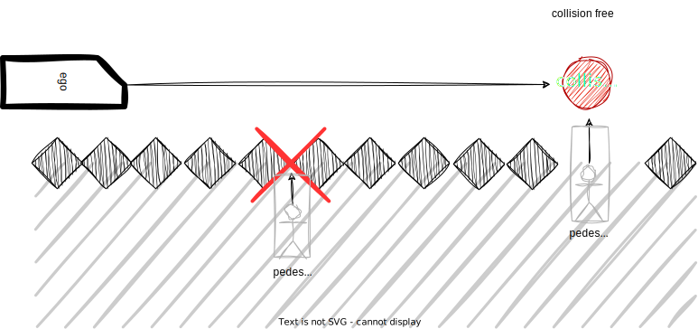
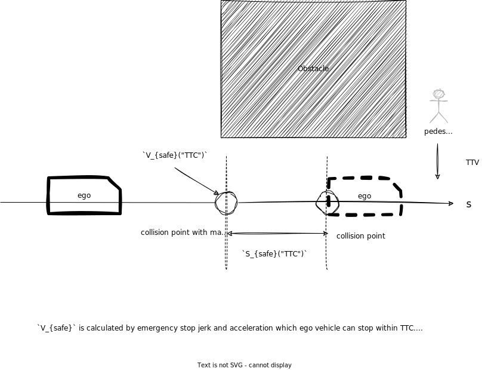

## 遮蔽スポット

### 役割

このモジュールは、障害物により運転者がはっきりと確認できない「遮蔽スポット」から隠れた物が飛び出してきて衝突するポイントに到達する前に速度を落とす安全速度を計画します。

### 起動タイミング

このモジュールは、`launch_occlusion_spot` が True になった場合に起動されます。歩道優先ゾーンのマップタグを作成することは TODO の 1 つです。

### 制限事項と TODO

このモジュールは、遮蔽スポットのケアを行うためのプロトタイプ実装です。知覚の誤検知による過度の減速に対処するために、検出方法のロジックを選択できます。この点はまだ十分に検討されておらず、改善が必要です。

- 計画用の占有グリッドを作成する。
- 遮蔽スポット用のマップタグを作成する。
- 最適な安全な動作について。

TODO は各内部処理/アルゴリズム（以下の説明を参照）に記載されています。

### 内部処理 / アルゴリズム

#### ロジックの処理

遮蔽には、「駐車車両による遮蔽」や「障害物による遮蔽」など、さまざまなタイプがあります。人々が頻繁に飛び出してくる**障害物のある道路**で運転するような状況では、考えられるすべての遮蔽スポットを考慮する必要があります。このモジュールは**占有グリッド**から計算されたすべての遮蔽スポットを考慮しますが、ガードレールの後ろや走行中の車両の後ろから人が飛び出すなど、すべての遮蔽スポットを考慮するのは現実的ではありません。したがって、現在の検出エリアは**予測オブジェクト**情報を活用することに限定されています。

この決定ロジックはまだ開発中であり、改善する必要があることに注意してください。

#### DetectionArea ポリゴン

このモジュールは、歩行者の速度と遮蔽スポットまでの横方向の距離から TTV を考慮します。
TTC は、運動速度スムージングを使用して、エゴ速度と加速度、衝突ポイントまでの縦距離から計算されます。このモジュールを高速に計算するためには、TTV が TTC 未満であり、「最大横方向距離」内のエリアのみを考慮します。

#### 占有グリッドベースの遮蔽スポット

このモジュールでは、占有グリッドから計算されたエゴパス周辺のあらゆる遮蔽スポットを考慮します。
計算コストのため、占有グリッドの解像度は高くなく、これにより占有グリッドがノイズだらけになり、このモジュールは占有グリッドマップに占有率情報を追加します。

TODO: 占有グリッドを生成するための障害物点群の高さを考慮する。

##### 衝突フリーの判断

遮蔽スポットから飛び出す可能性のある障害物は、エゴ車両から交差点まで空きスペースがある必要がある

##### レーンレットのパーティション

「ガードレール」、「フェンス」、「壁」タグのレーンレット情報を使用すると、不要な遮蔽スポットを除去できます。

静的オブジェクト情報を使用すると、占有グリッドをさらに正確にすることができます。

計画用の占有グリッドを作成することは TODO の 1 つです。

##### 障害物衝突の可能性

隠蔽から飛び出すことが可能な障害物が移動中の車両によって遮断される。

#### 安全な動作について

##### 安全な速度と余裕の概念

安全な減速速度は、自己緊急ブレーキシステムのパラメータと衝突までの時間に基づいて計算されます。
以下の計算は含まれますが、プランナーの速度を動的に変更することはお勧めしません。

- ジャーク制限 [m/s^3]
- 減速限界 [m/s2]
- 応答遅延時間 [s]
- 歩行者の衝突までの時間 [s]
これらのパラメータを使用して、理想的な環境での隠蔽スポット前の安全な動作の概要を簡単に定義できます。

このモジュールは、停止距離と衝突経路点の幾何学的形状を考慮した安全なマージンを定義します。
車が安全なマージンから衝突経路点に巡航している間、車速は隠蔽スポットの安全な速度と同じになります。

注意: このロジックは、高精度の車両速度追跡を前提としており、減速点のマージンは最善のソリューションではない可能性があり、歩行者が隠蔽スポットから本当に飛び出した場合は、ドライバーによる手動でのオーバーライドが検討されます。

検討中の最適な選択肢の 1 つ:

1. 隠蔽スポットの直前で停止する
2. 隠蔽スポットの直前に 1km/h の速度を挿入する
3. この方法で減速する
4. など... .

##### 最大減速速度

最大減速速度は、最大減速ジャークと最大減速加速度を考慮して、現在の速度と加速度のパラメータから計算されます。これは、減速しすぎないようにするためです。

- $j_{max}$ 最大減速ジャーク制限 [m/s^3]
- $a_{max}$ 最大減速限界 [m/s2]
- $v_{0}$ 現在の速度 [m/s]
- $a_{0}$ 現在の加速度 [m/s]

#### モジュールの設定

| パラメータ           | タイプ   | 説明                                                                |
| ------------------- | ------ | -------------------------------------------------------------------------- |
| `pedestrian_vel`    | double | [m/s] 最大速度想定歩行者遮断ポイントから現れる. |
| `pedestrian_radius` | double | [m] 遮断スポットに収まる想定歩行者半径.                |

| パラメーター | 型 | 説明 |
|---|---|---|
| `use_object_info` | bool | オブジェクト情報を占有グリッドマップに反映するかどうか |
| `use_partition_lanelet` | bool | パーティションされたレーンレットマップデータを使用するかどうか |

| パラメータ /debug | タイプ | 説明 |
|---|---|---|
| `is_show_occlusion` | bool | [-] オクルージョンポイントマーカーを表示するかどうか |
| `is_show_cv_window` | bool | [-] オープンCVデバッグウィンドウを表示するかどうか |
| `is_show_processing_time` | bool | [-] 処理時間を表示するかどうか |

| パラメータ/しきい値 | タイプ | 説明 |
| ----------------------- | ------ | --------------------------------------------------------- |
| `detection_area_length` | double | [m] 隠れスポットを考慮するパスの長さ |
| `stuck_vehicle_vel`     | double | [m/s] この値以下の速度は停止しているとみなす |
| `lateral_distance`      | double | [m] 隠れた衝突を考慮する最大横方向距離 |

| パラメータ/モーション             | タイプ   | 説明                                                           |
| ------------------------------- | ------ | -------------------------------------------------------------- |
| `safety_ratio`                | double | [-] ジャークと加速度の安全比                                   |
| `max_slow_down_jerk`          | double | [m/s^3] 安全なブレーキ用のジャーク                                |
| `max_slow_down_accel`         | double | [m/s^2] 安全なブレーキ用の減速度                              |
| `non_effective_jerk`          | double | [m/s^3] Velocity Planningにおける弱いジャーク                  |
| `non_effective_acceleration`  | double | [m/s^2] Velocity Planningにおける弱い減速度                  |
| `min_allowed_velocity`        | double | [m/s] 許可される最低速度                                     |
| `safe_margin`                 | double | [m] 緊急ブレーキシステムで停止するための最大許容誤差          |
| `post resampling`             | double | [s] `post resampling` timestamp offset of playback              |
| `current pose`                | XYZPose | Planningの初期トラジェクトリに対する自車位置                 |

| パラメータ /detection_area | タイプ | 説明 |
| ------------------------- | ------ | ------------------------------------- |
| `min_occlusion_spot_size` | double | [m] オクルージョンスポットとみなすパスの長さ |
| `slice_length`            | double | [m] 検出領域を分割する距離 |
| `max_lateral_distance`    | double | [m] detection_area領域を構築するために使用する自車パスの周囲のバッファー |

| Parameter /グリッド  | タイプ   | 説明                                                           |
| ---------------- | ------ | --------------------------------------------------------------------- |
| `free_space_max` | double | [-] 占有グリッドの自由空間セルの最大値          |
| `occupied_min`   | double | [-] detection_areaエリアの構築に使用される自車経路周辺のバッファー |

#### フローチャート

##### 全体的なプロセスの概要

##### 予測対象（未更新）の詳細プロセス

##### オキュパンシーグリッドベースの詳細な処理

**プロセス**

1. **センサデータ処理**
   - センサデータ（点群、レーダーなど）から障害物検出を実行します。

2. **オキュパンシーグリッド作成**
   - 環境のオキュパンシーグリッドを生成します。これにより、各セルが占有されているか未占有かが示されます。

3. **障害物クラスタリング**
   - オキュパンシーグリッドで隣接する占有セルをクラスタリングします。

4. **障害物マージング**
   - 複数のフレームにわたって同じ障害物をマージし、単一の障害物として表現します。

5. **障害物トラッキング**
   - 複数のフレームにわたって障害物をトラッキングし、その軌跡と状態を予測します。

**Planningコンポーネントとのやりとり**

- Planningコンポーネントに障害物マップを提供します。
- Planningコンポーネントから障害物に関するクエリを受信します（例：自車位置から障害物までの距離）。

**詳細**

- **โพストレスサンプリング：**オキュパンシーグリッドから動的障害物（歩行者、車両など）を除去する処理を実行します。
- **グローカリゼーション：**車両の自車位置と向きを正確に推定します。正確なオキュパンシーグリッドを作成するために不可欠です。
- **セマンティックセグメンテーション：**オキュパンシーグリッドをさまざまなカテゴリ（例：車両、歩行者、建物）に分割します。

