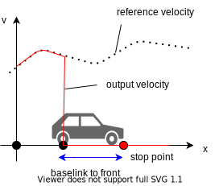

# Behavior Velocity Planner

## 概要

`behavior_velocity_planner` は、交通ルールに基づいて速度を調整するプランナーです。
モジュールをプラグインとして読み込みます。各モジュールの詳細については、以下に示すリンクを参照してください。

- [盲点](../autoware_behavior_velocity_blind_spot_module/README.md)
- [横断歩道](../autoware_behavior_velocity_crosswalk_module/README.md)
- [歩道](../autoware_behavior_velocity_walkway_module/README.md)
- [検知エリア](../autoware_behavior_velocity_detection_area_module/README.md)
- [交差点](../autoware_behavior_velocity_intersection_module/README.md)
- [私道から合流](../autoware_behavior_velocity_intersection_module/README.md#merge-from-private)
- [停止線](../autoware_behavior_velocity_stop_line_module/README.md)
- [仮想信号](../autoware_behavior_velocity_virtual_traffic_light_module/README.md)
- [信号](../autoware_behavior_velocity_traffic_light_module/README.md)
- [遮蔽スポット](../autoware_behavior_velocity_occlusion_spot_module/README.md)
- [停車禁止区域](../autoware_behavior_velocity_no_stopping_area_module/README.md)
- [飛び出し](../autoware_behavior_velocity_run_out_module/README.md)
- [スピードバンプ](../autoware_behavior_velocity_speed_bump_module/README.md)

各モジュールが速度を計画する場合、`base_link`（後輪軸の中心）位置に基づいて考慮します。
したがって、たとえば、車両の前方が停止線にある状態で停止線で停止するには、`base_link` から前部までの距離から `base_link` 位置を計算し、`base_link` 位置からパス速度を変更します。

## 入力トピック

| 名称 | タイプ | 説明 |
|---|---|---|
| `~input/path_with_lane_id` | tier4_planning_msgs::msg::PathWithLaneId | lane_id付き経路 |
| `~input/vector_map` | autoware_map_msgs::msg::LaneletMapBin | ベクターマップ |
| `~input/vehicle_odometry` | nav_msgs::msg::Odometry | 車両速度 |
| `~input/dynamic_objects` | autoware_perception_msgs::msg::PredictedObjects | 動的オブジェクト |
| `~input/no_ground_pointcloud` | sensor_msgs::msg::PointCloud2 | 障害物点群 |
| `~/input/compare_map_filtered_pointcloud` | sensor_msgs::msg::PointCloud2 | 比較マップでフィルタリングされた障害物点群。なお、これはrun outモジュールの検出方式がポイントの場合にのみ使用されます。 |
| `~input/traffic_signals` | autoware_perception_msgs::msg::TrafficLightGroupArray | 信号状態 |

## 出力トピック

| 名                   | 型                                       | 説明                                  |
| ---------------------- | ---------------------------------------- | --------------------------------------- |
| `~output/path`         | autoware_planning_msgs::msg::Path         | 追従する経路                           |
| `~output/stop_reasons` | tier4_planning_msgs::msg::StopReasonArray | 車両が停止する理由                    |

## ノードパラメーター

| パラメータ               | 型                 | 説明                                                                          |
| ---------------------- | -------------------- | ------------------------------------------------------------------------------------ |
| `launch_modules`       | vector&lt;string&gt; | 起動されるモジュールの名前                                                        |
| `forward_path_length`  | double               | 前方パス長                                                                     |
| `backward_path_length` | double               | 後方パス長                                                                     |
| `max_accel`            | double               | (グローバルパラメータ) 車両の最大加速度                                       |
| `system_delay`         | double               | (グローバルパラメータ) 制御コマンドを出力するまでの遅延時間                     |
| `delay_response_time`  | double               | (グローバルパラメータ) 車両が制御コマンドに応答するまでの遅延時間                 |

## シミュレーション/実環境における信号機処理

信号機情報の処理は、使用状況によって異なります。以下の表では、対応する車線に対する信号機トピック要素は `info` とし、`info` が使用できない場合は `null` と記載しています。

| モジュール/ケース                                                                                           | `info`が`null`                     | `info`が`null`ではない                                                                                                                                                                                                                                                              |
| ------------------------------------------------------------------------------------------------------- | --------------------------------- | ---------------------------------------------------------------------------------------------------------------------------------------------------------------------------------------------------------------------------------------------------------------------------------- |
| intersection_occlusion(`is_simulation = *`) <ul> <li>`info`は最新の`null`でない情報</li></ul> | GO（閉塞は無視）               | intersection_occlusionは、現在のキュー内に存在する最新のUNKNOWN以外の情報を最優先で使用する。 <ul><li>`info`が`GREENまたはUNKNOWN`の場合、閉塞は考慮</li><li>`info`が`REDまたはYELLOW`の場合、閉塞は無視（GO）</li> <li>注：現在、タイムアウトは考慮されていません</li> </ul> |
| traffic_light(sim, `is_simulation = true`) <ul> <li>`info`は現在の情報</li></ul>                  | GO                               | traffic_lightは現在感知されている信号情報を使用。 <ul><li>`info`がタイムアウトの場合、色は関係なくSTOP</li> <li>`info`がタイムアウトでない場合、色に応じて行動。`info`が`UNKNOWN`の場合、STOP</li></ul> {: rowspan=2}                    |
| traffic_light(real, `is_simulation = false`) <ul> <li>`info`は現在の情報</li></ul>                | STOP                             |                                                                                                                                                                                                                                                            |
| crosswalk with Traffic Light(`is_simulation = *`) <ul> <li>`info`は現在の情報</li></ul>           | default                          | <ul> <li>`disable_yield_for_new_stopped_object`がtrueの場合、各サブシーンモジュールはモジュールインスタンス化後に新しく検出された歩行者を無視。</li> <li>`ignore_with_traffic_light`がtrueの場合、閉塞検出はスキップ。</li></ul>                                         |
| map_based_prediction(`is_simulation = *`) <ul> <li>`info`は現在の情報</li></ul>                   | default                          | 歩行者信号が<ul> <li>REDの場合、周囲の歩行者は予測されない。</li> <li>GREENの場合、停止している歩行者は予測されない。</li></ul>                                                                                                                        |

