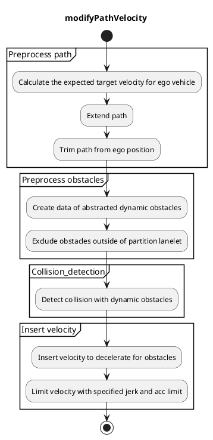
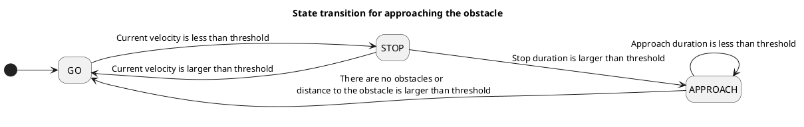

## 車線逸脱

### 役割

`run_out`は、歩行者、自転車、オートバイなどの動的障害物を減速・停止するためのモジュールです。

### アクティベーションタイミング

このモジュールは`launch_run_out`がtrueになった場合にアクティブになります。

### 内部処理/アルゴリズム

#### フローチャート

#### パスの前処理

##### 自車の想定目標速度の算出

障害物との衝突時間をより正確に算出するために、自車のパスに対する想定目標速度を算出します。想定目標速度は、[autoware velocity smoother module](https://github.com/autowarefoundation/autoware.universe/tree/main/planning/autoware_velocity_smoother)を使用して、現在の速度、現在の加速度、マップや外部APIによって指示された速度制限を使用して計算されます。

##### パスの延長

パスは、目標以降の障害物を考慮するために、ベースリンクから前方までの長さまで延長されます。

##### 自車位置からのパスの切り取り

計算時間を短縮するために、パスは自車位置から一定の距離まで切り取られます。切り取り距離は`detection_distance`パラメータで指定されます。

#### 障害物の前処理

##### 抽象化された動的障害物のデータの作成

このモジュールは、抽象化された動的障害物データレイヤーを作成することで、複数の種類の障害物を処理できます。現在、抽象化された障害物データを作成するために3種類の検出方法（Object、ObjectWithoutPath、Points）があります。

###### 抽象化された動的障害物

抽象化された障害物データには次の情報が含まれます。

| 名称             | 型                                                               | 説明                                                                                                                 |
| ---------------- | ------------------------------------------------------------------ | -------------------------------------------------------------------------------------------------------------------------- |
| pose             | `geometry_msgs::msg::Pose`                                         | 障害物の姿勢                                                                                                              |
| 分類             | `std::vector<autoware_perception_msgs::msg::ObjectClassification>` | 確率ごとの分類                                                                                                            |
| 形状             | `autoware_perception_msgs::msg::Shape`                             | 障害物の形状                                                                                                                |
| 予想経路         | `std::vector<DynamicObstacle::PredictedPath>`                      | 信頼度ごとの予想経路（最小速度と最大速度を使用するため、タイムステップはありません）。                                     |
| 最小速度 (m/秒) | `float`                                                            | 障害物の最小速度（パラメータ `dynamic_obstacle.min_vel_kmph` で指定）。                                                       |
| 最大速度 (m/秒) | `float`                                                            | 障害物の最大速度（パラメータ `dynamic_obstacle.max_vel_kmph` で指定）。                                                       |

対象の最大速度と最小速度をパラメータとして入力し、想定される速度に十分な余裕を持たせます。このパラメータは、[衝突検出](.#Collision-detection)のポリゴンを作成するために使用されます。

今後の作業: オブジェクトの推定速度と共分散から最大/最小速度を決定する

###### 3種類の検出方法

さまざまな安全および可用性の要件を満たすために、3種類の検出方法を用意しています。これらの特性を以下の表に示します。
`Object`の手法は、予測パスが車線上に存在するオブジェクトのみを検出するため、可用性が高くなります (誤検出が少ない)。ただし、認識が障害物を検出できなかったり、予測パスが正しく生成できなかったりすると、安全に欠ける場合があります。
一方、`Points`の手法は入力として点群を使用するため、安全性が高くなります (見逃しが少ない)。点は予測パスを持たないため、自己車両のパスの法線方向に移動するパスは、抽象化された動的障害物データの予測パスと見なされます。ただし、点のフィルタを適切に調整しないと多くの点を検出し、可用性が非常に低くなる可能性があります。
`ObjectWithoutPath`の手法は、`Object`と`Points`の中間の特性を備えています。

| 方法            | 説明                                                                                                                                                                           |
| ----------------- | --------------------------------------------------------------------------------------------------------------------------------------------------------------------------------- |
| Object            | 衝突検出に予測パスを持つオブジェクトを使用します。                                                                                                                        |
| ObjectWithoutPath | オブジェクトを使用しますが、予測パスは衝突検出に使用しません。指定された速度でオブジェクトが車線に飛び出すと仮定してパスを置き換えます。                          |
| Points            | 衝突検出にフィルタリングされたポイントを使用します。点は車線に飛び出すと仮定してパスが作成されます。点は円形の小障害物とみなされます。                          |

##### パーティション外の障害物の除外

このモジュールは、ガードレール、フェンス、壁など、パーティションの外側の障害物を除外できます。
この機能を使用するには、パーティションに関する情報を持つ Lanelet マップが必要です。
この機能により、レーンに飛び出してくる可能性が低い障害物による不要な減速を減らすことができます。`use_partition_lanelet` パラメータでこの機能を使用するかどうかを選択できます。

##### ラベルによる障害物の除外

このモジュールは、`target_obstacle_types` パラメータで定義された対象の障害物にのみ作用します。同パラメータで指定されていないタイプの障害物が検出された場合、このモジュールによって無視されます。

##### 自車位置にある障害物の除外

障害物が自車位置にある場合、障害物が自車のパスに「割り込む」ことはできないため（これはこのモジュールが処理しようとしている状況です）、車両のフットプリントパスにすでに存在する障害物を除外することが役立つ場合があります。`exclude_obstacles_already_in_path` パラメータを true に設定すると、このモジュールは `keep_obstacle_on_path_time_threshold` を超えて自車位置のパス上にすでに存在すると見なされる障害物を除外します。このモジュールは、障害物の現在の位置に対する自車の最も近いパスポイントを考慮し、障害物と自車の左右の間の横方向距離を決定します。障害物がそのポーズの車両の左右の極限内に位置する場合、障害物は自車のフットプリントパス内にあると見なされ、除外されます。障害物がパス内にあるかどうかを検出するために使用される車両の仮想幅は、`ego_footprint_extra_margin` パラメータで調整できます。

##### 自車の「カットライン」を超える障害物の除外

このモジュールは、自車の後ろ側を超える予想パスを持つ障害物を除外できます。障害物が自車の「カットライン」を超えて予想パスがある場合、障害物を除外します。「カットライン」は自車に垂直で、自車のベースリンクを通過する仮想線分です。

`use_ego_cut_line` パラメータを `true` または `false` に設定することで、この機能を使用するかどうかを選択できます。線の幅は `ego_cut_line_length` パラメータで調整できます。

#### 衝突検出

##### 動的障害物との衝突検出

自車パスに沿って、各 `detection_span` に対して衝突検出を実行するポイントを決定します。

各ポイントまでの移動時間は、[自車の期待ターゲット速度](.#Calculate-the-expected-target-velocity-for-ego-vehicle) から計算されます。

各ポイントについて、自車のフットプリントポリゴンと障害物の予想位置のポリゴンを使用して衝突検出を実行します。
障害物の予想位置は、最小速度、最大速度、およびポイントまでの自車の移動時間で計算された範囲を持つ長方形またはポリゴンとして記述されます。動的障害物の入力タイプが `Points` の場合、障害物の形状は小さな円柱として定義されます。

衝突検出は 2 つのポリゴン間で計算されるため、複数のポイントが衝突点として検出されます。
そのため、障害物と同じ側にある自車に近いポイントを衝突点として選択します。

#### 速度の挿入

##### 障害物に対して減速するために速度を挿入

衝突が検出された場合、選択された衝突点からベースリンクからフロント + 停止マージンの距離に停止点が挿入されます。ベースリンクからフロントとは、ベースリンク（後輪車軸の中心）と車のフロントの間の距離です。停止マージンは `stop_margin` パラメータによって決定されます。

#### 障害物に接近するための速度の挿入

`Points` または `ObjectWithoutPath` の方法を選択した場合、自車は障害物の前で停止し続ける場合があります。

`approaching.enable` パラメータが true に設定されている場合、自車は `state.stop_time_thresh` 秒間停止した後、障害物に接近します。
接近の最大速度は `approaching.limit_vel_kmph` パラメータで指定できます。
障害物に接近するかどうかは、次の画像に示すような単純な状態遷移によって決定されます。

##### 特定のじゃくれと加速度限度で速度を制限

過度に減速しないために、最大減速速度が計算されます。
詳細については、[オクルージョン・スポットのドキュメント](../autoware_behavior_velocity_occlusion_spot_module/#最大減速速度)を参照してください。
パラメータ`slow_down_limit.enable`によって、この機能を使用するかどうかを選択できます。

### モジュールパラメータ

| パラメータ         | タイプ         | 説明                                                                                                                                                          |
| ------------------ | ------------- | ------------------------------------------------------------------------------------------------------------------------------------------------------------------------------------ |
| `detection_method` | 文字列       | [-] 候補: Object、ObjectWithoutPath、Points                                                                                                                                          |
| `target_obstacle_types` | 文字列の配列 | [-] モジュールで考慮される障害物タイプを指定します。ここで障害物分類タイプが記載されていない場合、無視されます。候補: ["PEDESTRIAN", "BICYCLE", "MOTORCYCLE"] |
| `use_partition_lanelet` | ブール型       | [-] パーティションされたレーンの地図データを使用するかどうか                                                                                                          |
| `specify_decel_jerk` | ブール型       | [-] 自車が減速するときにジャークを指定するかどうか                                                                                                              |
| `stop_margin` | double型       | [m] 自車は、この余裕をもって停止できるように減速します                                                                                                              |
| `passing_margin` | double型       | [m] 障害物 + この余裕の分だけ、予測位置での自車の前方が障害物より先にあった場合、自車が加速し始めます                                                                        |
| `deceleration_jerk` | double型       | [m/s^3] 障害物に対して停止する場合、自車は、このジャークで減速します                                                                                                         |
| `detection_distance` | double型       | [m] 自車から障害物を検出する前方距離                                                                                                                                      |
| `detection_span` | double型       | [m] 計算時間を短縮するために、このスパンで衝突を計算します                                                                                                        |
| `min_vel_ego_kmph` | double型       | [km/h] 衝突までの時間を計算するための最小速度                                                                                                                     |

| パラメータ /detection_area | 型   | 説明                                                                                           |
| ------------------------- | ------ | ------------------------------------------------------------------------------------------------------ |
| `margin_ahead`            | double | 検出領域ポリゴンの前方の余裕 [m]                                                                            |
| `margin_behind`           | double | 検出領域ポリゴンの後方の余裕 [m]                                                                            |

| パラメータ /dynamic_obstacle  | 型     | 説明 |
|---|---|---|
| `use_mandatory_area`                | double | [-] 強制検出エリアを使用するかどうか |
| `assume_fixed_velocity.enable`       | double | [-] 有効な場合、障害物の速度は以下に指定する最小速度値と最大速度値の範囲内と仮定 |
| `assume_fixed_velocity.min_vel_kmph` | double | [km/h] 動的障害物の最小速度 |
| `assume_fixed_velocity.max_vel_kmph` | double | [km/h] 動的障害物の最大速度 |
| `diameter`                           | double | [m] 障害物の直径。点から動的障害物を作成するために使用 |
| `height`                             | double | [m] 障害物の高さ。点から動的障害物を作成するために使用 |
| `max_prediction_time`                | double | [sec] この時間まで予測パスを作成 |
| `time_step`                          | double | [sec] 各パス ステップの時間刻み。パスを持たない点またはオブジェクトから動的障害物を作成するために使用 |
| `points_interval`                    | double | [m] 障害物点をこの間隔でグループに分割し、横方向の最寄りの点のみを検出する。Points 方式でのみ使用 |

| パラメータ /approaching | 型   | 説明                                           |
| ----------------------- | ---- | ----------------------------------------------------- |
| `enable`               | ブール | [-] 停止後に接近を有効にするかどうか             |
| `margin`               | double | [m] 自己車が障害物に近づく距離の程度             |
| `limit_vel_kmph`       | double | [km/h] 停止後に接近するための速度の限界           |

| パラメータ/状態         | タイプ   | 説明                                                                       |
| ------------------------ | ------ | ---------------------------------------------------------------------------- |
| `stop_thresh`            | double | [m/s] エゴが停止していると判断するしきい値                                |
| `stop_time_thresh`       | double | [sec] 停止時間しきい値、この時間を超えると接近状態に移行する               |
| `disable_approach_dist`  | double | [m] 障害物までの距離がこの値よりも大きい場合に接近状態を終了する          |
| `keep_approach_duration` | double | [sec] 状態遷移のチャタリングを避けるため、接近状態をこの期間維持する |

| パラメーター /slow_down_limit | 型   | 説明                                                   |
| -------------------------- | ------ | ------------------------------------------------------------- |
| `enable`                   | bool   | [-] 最大ジャークと加速度で速度を制限するかどうか             |
| `max_jerk`                 | double | [m/s^3] 安全なブレーキのための最小ジャーク減速度            |
| `max_acc`                  | double | [m/s^2] 安全なブレーキのための最小加速度減速度            |

| パラメーター /ignore_momentary_detection | 型 | 説明 |
| ----------------------------------------- | ----- | ----------------------------------------------------------------- |
| `enable` | bool | [-] 一時的な検出を無視するかどうか |
| `time_threshold` | double | [秒] この期間より短く続く検出を無視する |

### 将来の機能拡張 / 未実装部分

- 共分散から障害物の最小速度と最大速度を計算
- ポリゴンオブジェクトとの衝突を検出
- 障害物の予測経路が直線でない場合の処理
  - 現在、衝突のチェックは障害物の予測経路が直線であるという仮定に基づいて計算されています

