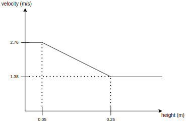

## スピードバンプ

### 役割

このモジュールは、スピードバンプ規制要素が参照するパスの関連部分の速度を計画します。

### 起動タイミング

マネージャーは、基準パスを参照するスピードバンプ規制要素があると、スピードバンプシーンモジュールを起動します。

### モジュールパラメーター

| パラメータ           | 型   | 説明                                               |
| ------------------- | ------ | --------------------------------------------------------- |
| slow_start_margin | double | スロープの手前で減速するために自車が必要とするマージン [m] |
| slow_end_margin   | double | スロープ通過後に加速するために自車が必要とするマージン [m] |
| print_debug_info  | bool   | デバッグ情報を印刷するかどうか                 |

#### 速度計算

- スピードバンプの高さの制限と減速速度を使用して一次方程式を作成する

| パラメータ    | 型   | 説明                                         |
| ------------ | ------ | -------------------------------------------- |
| `min_height` | double | [m] スピードバンプの最小高さの想定         |
| `max_height` | double | [m] スピードバンプの最大高さの想定         |
| `min_speed`  | double | [m/s] 減速速度の最小速度の想定            |
| `max_speed`  | double | [m/s] 減速速度の最大速度の想定            |

### 内部動作 / アルゴリズム

- lanelet2マップから経路上の減速帯規制要素を取得
- 規制要素で指定された`speed_bump_height`に基づいて`slow_down_speed`を計算、または減速帯アノテーションから利用可能な場合は`slow_down_speed`タグを読み取る

**注:** 減速帯アノテーションで`slow_down_speed`タグが使用されている場合は、減速帯の高さに基づいて速度を計算することは無視されます。そのような場合は、**[km/h]**で指定された`slow_down_speed`値が使用されます。

- 経路と減速帯ポリゴンの交点を取得
- 交点を基にして`slow_start_point`と`slow_end_point`を計算し、それらを経路に挿入
- 指定された/計算されたオフセット値を使用して`slow_start_point`または`slow_end_point`を挿入できない場合は、任意の経路点が`slow_start_point`または`slow_end_point`として仮想的に割り当てられるかどうかを確認

- `slow_start_point`または`slow_end_point`間の経路点に`slow_down_speed`を割り当て

### 将来の展望

- 論文[こちら](https://journals.sagepub.com/doi/10.1155/2014/736576)では、凹凸のモデリング方法が提案されています。単純に凹凸を円にフィットさせて、円の半径を計算する方法です。現時点の実装では、速度の計算は凹凸の高さに基づいていますが、将来はより現実的な結果を得られるこの方法を採用する予定です。

