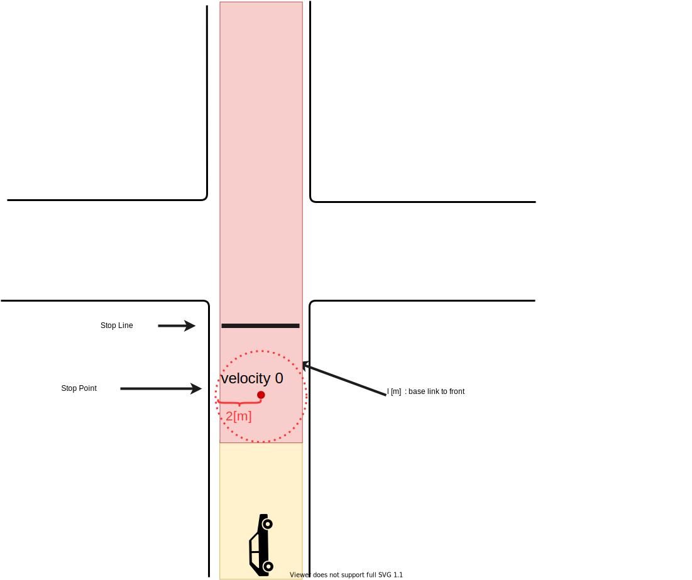
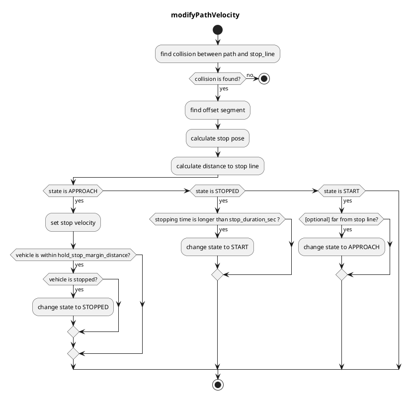

## ストップライン

### 役割

このモジュールは、車両がストップラインの直前で停止し、停止後に走行を再開できるように速度を計画します。

### アクティベーションのタイミング

このモジュールは、ターゲット車線にストップラインがある場合にアクティベートされます。

### モジュールパラメータ

| パラメータ名                  | 型   | 説明                                                                                                                                                                        |
| ------------------------------ | ------ | ---------------------------------------------------------------------------------------------------------------------------------------------------------------------------------- |
| `stop_margin`                   | double | 車両が停止線の前で停止しようとするマージン                                                                                                                        |
| `stop_duration_sec`             | double | [s] 自車が停止線の前で停止するまでの時間パラメータ                                                                                                                 |
| `hold_stop_margin_distance` | double | [m] 再起動防止のパラメータ（アルゴリズムセクションを参照）。また、自車が停止線からこの距離内にいる場合、自車の状態はAPPROACHINGからSTOPPEDに変わる                   |
| `use_initialization_stop_state` | bool   | 車両が停止線から移動した場合に、接近状態に戻るかどうかを決定するフラグ                                                                                             |
| `show_stop_line_collision_check` | bool   | 停止線との衝突チェックのデバッグ情報を表示するかどうかを決定するフラグ                                                                                             |

### 内部構造 / アルゴリズム

- マップ情報から停止線を取得します。
- マップに定義された停止線と自車長から、パスの停止地点を挿入します。
- 停止地点以降のパス速度を 0[m/s] に設定します。
- 車両が停止地点で `stop_duration_sec` 秒間停止したら、挿入された停止速度を解除します。

#### フローチャート

このアルゴリズムは `segment` に基づいています。
`segment` は 2 つのノードポイントで構成されています。`segment(i)` が存在する場合、`node(i)` と `node(i+1)` が存在することが想定されるため、境界条件を削除するために役立ちます。

まず、このアルゴリズムはリファレンスパスと停止線との衝突を検出します。
次に、`collision segment` と `collision point` を取得できます。

次に、`collision point` に基づいて、特定のオフセット長までポイントを後方反復処理することで `offset segment` を検出します。オフセット長は `stop_margin`（パラメータ）+ `base_link to front`（ヘッドの姿勢を停止線に調整するため）です。次に、`offset segment` と `offset from segment start` を取得できます。

その後、`offset segment` と `offset` からオフセットポイントを計算できます。これが `stop_pose` になります。

#### 再始動防止

車両の制御性能が低い場合、車両が動き始めると停止するために何メートル（例: 0.5 メートル）が必要になり、車両は近距離の停止点に接近するために厳守する必要がある停止位置を超過します（例: 0.3 メートル離れている）。

このモジュールには、これらの冗長な再始動を防ぐためのパラメータ `hold_stop_margin_distance` があります。車両がモジュールの停止点から `hold_stop_margin_distance` メートル以内（\_front_to_stop_line < hold_stop_margin_distance）で停止した場合、モジュールは車両がモジュールの停止点に対してすでに停止していると判断し、車両が他の要因によって停止した場合でも現在の位置で停止を維持するように計画します。

<figure markdown>
  {width=1000}
  <figcaption>パラメータ</figcaption>
</figure>

<figure markdown>
  {width=1000}
  <figcaption>hold_stop_margin_distance の外側</figcaption>
</figure>

<figure markdown>
  {width=1000}
  <figcaption>hold_stop_margin_distance の内側</figcaption>
</figure>

