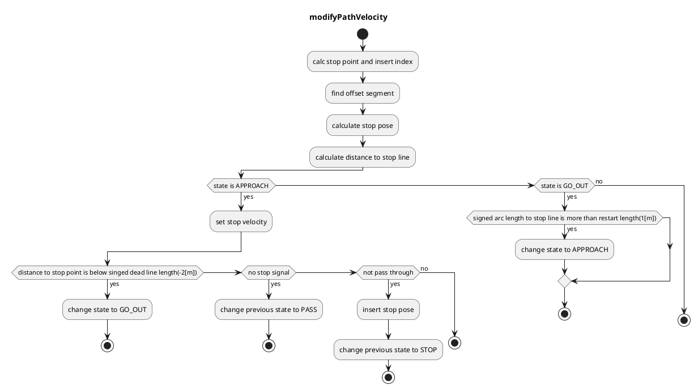

### 信号機

#### 役割
交通信号の状態によって車両が交差点に進入可能かどうかを判断し、必要に応じて停止速度を計画します。このモジュールは、開発者が動作を設計しやすいルールベースの速度判断用に設計されています。信号機シーンに適切な速度を生成します。

### 制限事項
このモジュールにより、開発者は特定のルールを使用して交通信号モジュールでの停止/進行を設計できます。ルールベースの計画の特性により、アルゴリズムは交通信号を考慮したオブジェクト認識と知覚の精度に大きく依存します。また、このモジュールは交通信号シーンでの停止/進行のみを処理するため、交通状況に応じた急ごしらえや迅速な判断は今後の課題です。

#### アクティベーションタイミング
このモジュールは、自車線に交通信号があるときにアクティブになります。

#### アルゴリズム
1. 地図情報から、ルートにマップされた交通信号と、交通信号に対応する停止線を取得します。

   - 対応する交通信号がこれまで見つからない場合、通過する信号として扱われます。

   - 対応する交通信号が見つかったがタイムアウトした場合、停止する信号として扱われます。

2. 交通信号認識結果のうち信頼性の最も高いものを利用し、その色が緑または対応する矢印信号でなかった場合、停止点を生成します。

   - 停止信号を受信する経過時間が`stop_time_hysteresis`未満の場合、通過する信号として扱われます。この機能はチャタリングを防止するためのものです。

3. 車両の現在の速度が

   - 2.0m/sより高速 ⇒ 通過判定（次のスライドの式を使用）

   - 2.0m/sより低速 ⇒ 停止

4. 車両が停止線よりも先に停止できないと判断された場合、Autowareは次のいずれかの動作を選択します。

   - 黄色のランプ中に停止線を「通過できる」⇒ 通過

   - 黄色のランプ中に停止線を「通過できない」⇒ 緊急停止

#### ジレンマゾーン

- 黄色ランプ線

イエローランプ内で車が移動する距離を示す「イエローランプ線」と呼ばれます。

- ジレンマゾーン

次の条件を満たす「ジレンマゾーン」と呼ばれます。

  - 車両は黄色のランプ中に停止線を通過できません。（イエローランプ線の右側）

  - 車両は減速とジャークの制限内で停止できません。（通過判定曲線の左側）

    ⇒緊急停止（交通規則を守るために減速とジャークの制限を緩和する）

「任意停止エリア」と呼ばれ、次の条件を満たすエリアです。

- 車両は黄色信号中に停止線を通過することができます（黄色信号線の左側）。
- 車両は減速およびジャークの限界内で停止できます（パス判定曲線の右側）。
    ⇒停止（Autowareが安全側の選択肢を選択します）

#### モジュールパラメータ

| パラメーター              | 型   | 説明                                                               |
| ---------------------- | ------ | -------------------------------------------------------------------- |
| `stop_margin`          | double | [m] 停止地点手前の余裕                                        |
| `tl_state_timeout`     | double | [s] 検出された信号機の結果のタイムアウト                   |
| `stop_time_hysteresis` | double | [s] チャタリング防止のための停止計画の決定における時間閾値 |
| `yellow_lamp_period`   | double | [s] 黄色点灯時間                                              |
| `enable_pass_judge`    | bool   | [-] 通過判定を使用するかどうか                                 |

#### フローチャート

##### 已知の制約

- 未定。

