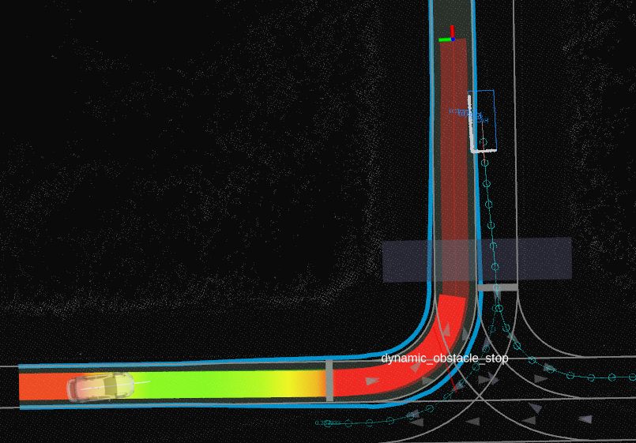

## 動的障害物回避

### 役割

`dynamic_obstacle_stop` モジュールは、自律走行車が動的オブジェクトのすぐ側の経路上に入るのを阻止します。

オブジェクトのすぐ側の経路とは、そのオブジェクトが一定の速度と進行方向で走行した場合、所定の時間内に通過する領域です。

### アクティベーション タイミング

このモジュールは、モーション プランニング起動ファイルで起動パラメーター `launch_dynamic_obstacle_stop_module` が true に設定されている場合にアクティベートされます。

### 仕組み / アルゴリズム

このモジュールは、自動運転車の軌跡とオブジェクトのすぐ側の経路が衝突する地点に停止ポイントを挿入します。
全体的なモジュールのフローは、以下の 4 つのステップでまとめられます。

1. 動的オブジェクトのフィルタリング
2. 動的オブジェクトのすぐ側の経路の長方形の計算
3. 自動運転車がすぐ側の経路の長方形と衝突する最も早い衝突の検出
4. 衝突前に停止ポイントを挿入する

これらの 4 つのステップに加えて、このモジュールの停止ポイントをより安定させるために、2 つのメカニズムが用意されています。ヒステリシスとディシジョン期間バッファーです。

`hysteresis` パラメーターは、前のイテレーションで停止ポイントが挿入されていた場合に使用され、モジュールで使用するのに自動運転車の軌跡に十分近いと見なされる動的オブジェクトの範囲を拡大します。

#### 動的オブジェクトのフィルタリング

モジュールでは、オブジェクトは、以下のすべての条件を満たす場合にのみ考慮されます。

- 車両である（歩行者は無視される）。
- `minimum_object_velocity` パラメーターで定義された速度より高速で走行している。
- 自動運転車の現在の位置に近づきすぎていない。
- 回避不可能ではない（`ignore_unavoidable_collisions` パラメーターが `true` に設定されている場合のみ）。
- 自動運転車の軌跡に近い。

オブジェクトは、自動運転車の軌跡からの横方向距離が、自動運転車の幅とオブジェクトの幅（`extra_object_width` パラメーターを含む）の半分を足したしきい値パラメーター `minimum_object_distance_from_ego_trajectory` より小さい場合に、十分に近いと見なされます。また、前回のイテレーションで停止ポイントが挿入されていた場合、`hysteresis` パラメーターの値が最小距離に追加されます。

#### すぐ側の経路の長方形の計算

考慮される各オブジェクトについて、そのすぐ側の経路を表す長方形が作成されます。
長方形の幅はオブジェクトの幅に `extra_object_width` パラメーターを加えたもので、長さはオブジェクトの現在の速度に `time_horizon` を掛けたものです。

#### 最も早い衝突の検出

次に、これらの自己軌道フットプリントと、以前に計算された即時パス矩形の交差点を計算します。
交差点は、オブジェクトが自己に向かっていない場合は無視されます。つまり、オブジェクトと軌跡点の間の絶対角度が $\frac{3 \pi}{4}$ より大きくなります。

**自己軌跡**に投影されたときにアーク長が最も小さい衝突点は、最終停止点を計算するために使用されます。

#### 停止点を挿入

停止点を挿入する前に、挿入できる軌跡アーク長の範囲を計算します。
最低値は、車両の加速度とジャークの制約を満たすように計算されます。
モジュールの前回の反復で停止点が挿入された場合、そのアーク長が最大値として使用されます。
最後に、
停止点アーク長は、以前に見つけた衝突点のアーク長から `stop_distance_buffer` と自己車両の縦方向オフセットを引いた値であり、最小値と最大値の範囲でクランプされます。

#### 持続時間バッファ

ノイズの多い知覚によるチャタリングを防ぐために、2つの持続時間パラメータが使用されます。

- `add_stop_duration_buffer`は、対応する停止点が追加されるオブジェクトとの連続衝突検出の持続時間を表します。
- `remove_stop_duration_buffer`は、対応する停止点が削除されるオブジェクトとの連続衝突の非検出の持続時間を表します。

タイマーと衝突点は、各動的オブジェクトごとに独立して追跡されます。

### モジュールパラメータ

| パラメータ                                   | タイプ   | 説明                                                                                                              |
| ---------------------------------------------- | ------ | --------------------------------------------------------------------------------------------------------------------- |
| `extra_object_width`                          | double | 検出されたオブジェクトの周りの[m]余分な幅                                                                            |
| `minimum_object_velocity`                     | double | この値より低い速度のオブジェクトは無視されます                                                                         |
| `stop_distance_buffer`                        | double | 停止点と衝突点の間に追加される[m]の余分な距離                                                                      |
| `time_horizon`                                | double | 衝突チェックに使用される[s]の時系列                                                                                 |
| `hysteresis`                                  | double | 衝突が検出されると、衝突検出にこのヒステリシスが使用されます                                                          |
| `add_stop_duration_buffer`                    | double | 停止の決定が追加されるまで、衝突が継続的に検出されなければならない[s]の期間                                       |
| `remove_stop_duration_buffer`                 | double | 衝突が検出されなくなり、停止の決定が削除される[s]の期間                                                              |
| `minimum_object_distance_from_ego_trajectory` | double | 衝突の対象とするために、自己のフットプリントとオブジェクトのフットプリント間の最小距離[m]                           |
| `ignore_unavoidable_collisions`               | bool   | true の場合、停止では回避できない衝突を無視する（障害物が直進を継続すると想定）                                |

