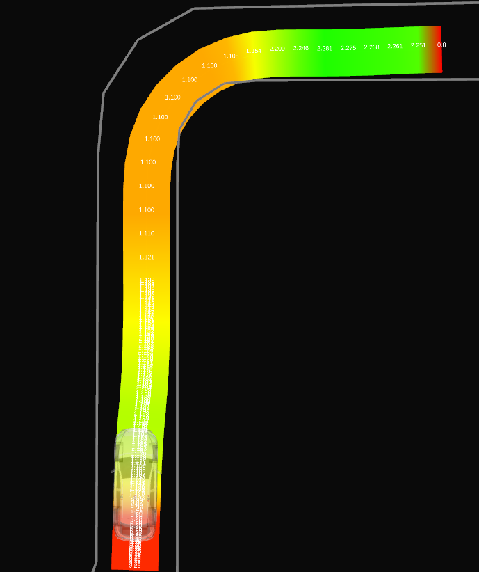

# 障害物速度制御

## 目的

このノードは、障害物に向かって走行しているときの速度を制限します。
たとえば、カーブでガードレールに近づいたときに速度を低下させることができます。

|                                   このノードを使用しない | このノードを使用する                                  |
| -------------------------------------------------|:----------------------------------------------------- |
|  |  |

## 内部構造/アルゴリズム

パラメータ`min_ttc`(最小衝突時間)を使用して、ノードは、新しい制御入力が`min_ttc`の時間の間なくなっても、障害物との衝突が発生しないような速度制限を設定します。

これを実現するために、自車位置の各時点において、軌跡を時系列でシミュレートして、それに対応するフットプリントを作成します。
フットプリントが障害物と衝突する場合、軌跡のポイントでの速度が、新しいシミュレートされたフットプリントが衝突しないように低下されます。パラメータ`simulation.distance_method`により、正確な距離計算と、単純なユークリッド距離を使用した安価な近似との切り替えが可能です。

パラメータ`simulation.model`では、車両のモーションをシミュレートするための2つのモデルを選択できます：単純な粒子モデルと、より複雑な自転車モデルです。

#### 粒子モデル

粒子モデルは、軌跡のポイントでの車両の一定の進行方向と速度を使用して、将来のモーションをシミュレートします。
シミュレートされた前進運動は直線に対応し、フットプリントは長方形に対応します。

##### フットプリント

長方形のフットプリントは、シミュレートされた前進運動に平行な2本の線と、車両幅の半分を考慮した距離から構築されます。

##### 距離

衝突点がフットプリント内にある場合、距離は次の図に示すように計算されます。

#### 自転車モデル

自転車モデルは、軌跡のポイントでの車両の一定の進行方向、速度、およびステアリングを使用して将来のモーションをシミュレートします。
シミュレートされた前進運動は、ステアリングに関連する曲率円の周りの弧に対応します。ステアリングの不確かさは`simulation.steering_offset`パラメータで導入でき、これにより左端から右端のステアリングの動作範囲が生成されます。これにより、同じ軌跡のポイントから始まる3本の曲線が得られます。
パラメータ`simulation.nb_points`を使用して、これらの線の精度を調整します。最小`2`は直線を生成し、値が大きいほど曲線の精度が高くなります。

デフォルトでは、軌跡メッセージに含まれるステアリング値が使用されます。`trajectory_preprocessing.calculate_steering_angles`パラメータを`true`に設定すると、これらの値を再計算できます。

##### フットプリント

自転車モデルのフットプリントは、左と右のシミュレートされたモーションに平行な線と、車両幅の半分を考慮した距離から作成されます。
さらに、中央シミュレートされたモーションの終点の左右の2つの点が使用されて、ポリゴンが完成します。

##### 距離

衝突点までの距離は、軌跡のポイントと衝突点を通過する曲率円を見つけることにより計算されます。

### 障害物検出

車線レットマップは常に障害物を確認していますが、別のソースはパラメータ「obstacles.dynamic_source」を使用して切り替えられます。

フットプリントと交差する障害物を効率的に検出するために、障害物ポイントは [R-tree](https://www.boost.org/doc/libs/1_80_0/libs/geometry/doc/html/geometry/reference/spatial_indexes/boost__geometry__index__rtree.html) に保存されています。
障害物ポイント用の木と障害物のラインストリング用の木（R-treeを単純化するためにセグメントに分解済み）の 2 つが使用されます。

#### 障害物マスク

##### 動的障害物

他の車などの移動障害物は、このモジュールで考慮されるべきではありません。
これらの障害物は認識モジュールによって検出され、多角形として表されます。
これらの多角形内の障害物は無視されます。

パラメータ ``obstacles.dynamic_obstacles_min_vel`` を超える速度を持つ動的障害物のみが削除されます。

遅延と精度エラーに対処するために、多角形はパラメータ ``obstacles.dynamic_obstacles_buffer`` で拡大できます。

##### セーフティーエンベロープ外の障害物

パラメータ ``obstacles.filter_envelope`` が true に設定されている場合、シミュレートされたフォワードフットプリント内の障害物は無視されます。
セーフティーエンベロープの多角形は、すべてのフットプリントから構築され、占有グリッドまたは点群の正のマスクとして使用されます。

このオプションは障害物の総数を減らし、衝突検出のコストを削減できます。
ただし、エンベロープをマスクするコストは通常高すぎて興味深いものではありません。

##### エゴパス上の障害物

パラメータ ``obstacles.ignore_obstacles_on_path`` が ``true`` に設定されている場合、軌跡と車両寸法から多角形マスクが構築されます。
この多角形内の障害物はすべて無視されます。

多角形のサイズは、パラメータ ``obstacles.ignore_extra_distance`` を使用して拡大できます。このパラメータは車両の側方オフセットに追加されます。

このオプションは少しコストがかかり、エゴパスで障害物が誤って検出され、不要な速度制限が引き起こされるノイズの多い動的障害物の場合にのみ使用する必要があります。

#### 車線レットマップ

静的障害物に関する情報は、ラインストリングの ``type`` タグの値を使用して、車線レットマップに格納できます。
任意のラインストリングの ``type`` にパラメータ ``obstacles.static_map_tags`` の値のいずれかが含まれている場合、それは障害物として使用されます。

車線レットマップの障害物は、マスクの影響を受けません。

#### 占有グリッド

マスク処理は、 [`autoware::grid_map_utils::PolygonIterator`](https://github.com/autowarefoundation/autoware.universe/tree/main/common/autoware_grid_map_utils) 関数を使用して各多角形マスク内のセルを反復処理することで実行されます。
次に、パラメータ ``obstacles.occupancy_grid_threshold`` を超える占有率を持つセルのみを保持するように閾値が適用されます。
最後に、画像が画像に変換され、障害物ラインストリングは opencv 関数
[`findContour`](https://docs.opencv.org/3.4/d3/dc0/group__imgproc__shape.html#ga17ed9f5d79ae97bd4c7cf18403e1689a) を使用して抽出されます。

#### 点群

[`pcl::CropHull`](https://pointclouds.org/documentation/classpcl_1_1_crop_hull.html) 関数を使用してマスク処理が実行されます。
次に、点群の点は障害物として直接使用されます。

### 速度調整

衝突が検出された場合、軌跡ポイントの速度は、結果として得られるフットプリントが障害物と衝突しなくなるように調整されます。
$velocity = \frac{dist\_to\_collision}{min\_ttc}$

エゴ車の急減速を防ぐために、パラメータ ``max_deceleration`` は現在のエゴ速度に対する減速を制限します。
将来のある時点で発生する軌跡ポイント（元の速度プロファイルから計算される）の場合、

さらに、パラメータ `min_adjusted_velocity` により、変更された速度の下限が提供されます。

### Trajectoryの前処理

ノードは現在の車両位置から始まる入力trajectoryの一部のみを変更します。パラメータ `trajectory_preprocessing.start_distance` は、車両位置のどの先から速度の変更が開始されるかを調整するために使用されます。パラメータ `trajectory_preprocessing.max_length` と `trajectory_preprocessing.max_duration` は、velocityが調整されるtrajectoryの量を制御するために使用されます。

精度を犠牲にして計算コストを削減するために、パラメータ `trajectory_preprocessing.downsample_factor` を使用して、trajectoryをダウンサンプリングできます。たとえば、値が `1` の場合は、すべての trajectory ポイントが評価されますが、値が `10` の場合は、ポイントの 1/10 のみ評価されます。

## パラメータ

| 名前                                              | タイプ        | 説明                                                                                                                                             |
| ------------------------------------------------ | ----------- | -------------------------------------------------------------------------------------------------------------------------------------------------------- |
| `min_ttc`                                         | float       | 一定のヨーイングと速度を仮定すると、軌道の各点で衝突なく必要な最小時間 [s]。                                                                                  |
| `distance_buffer`                                 | float       | 障害物との必要な距離バッファ [m]。                                                                                                                          |
| `min_adjusted_velocity`                           | float       | このノードが設定できる最小調整速度 [m/s]。                                                                                                                    |
| `max_deceleration`                                | float       | 調整速度が引き起こすことができる最大減速度 [m/s²]。                                                                                                        |
| `trajectory_preprocessing.start_distance`         | float       | 軌道のどこの部分（現在の自車位置に対する相対的な部分）から速度を調整するかを制御する [m]。                                                             |
| `trajectory_preprocessing.max_length`             | float       | 速度を調整する最大長（`start_distance` から開始）を制御する [m]。                                                                                             |
| `trajectory_preprocessing.max_distance`           | float       | 速度を調整する最大期間（`start_distance` から測定）を制御する [s]。                                                                                             |
| `trajectory_preprocessing.downsample_factor`      | int         | 精度とパフォーマンスのトレードオフを可能にする軌道ダウンサンプリング係数。                                                                                       |
| `trajectory_preprocessing.calculate_steering_angle` | bool        | true の場合、軌跡メッセージのステアリング角度は使用されず、再計算されます。                                                                                     |
| `simulation.model`                                | string      | 前方シミュレーションに使用するモデル。「particle」または「bicycle」のいずれか。                                                                                |
| `simulation.distance_method`                      | string      | 衝突までの距離を計算する方法。 「exact」または「approximation」のいずれか。                                                                             |
| `simulation.steering_offset`                      | float       | 自転車モデルで使用されるステアリングのオフセット。                                                                                                      |
| `simulation.nb_points`                            | int         | 自転車モデルの運動をシミュレートするために使用されるポイントの数。                                                                                              |
| `obstacles.dynamic_source`                        | string      | 衝突チェックに使用される動的障害物のソース。 「occupancy_grid」、「point_cloud」、または「static_only」（動的障害物なし）のいずれか。                           |
| `obstacles.occupancy_grid_threshold`              | int         | セルが障害物と見なされる、占有グリッド内の値。                                                                                                                |
| `obstacles.dynamic_obstacles_buffer`              | float       | ノイズを防ぐために障害物をマスクするときに使用される動的障害物のバッファー。                                                                                  |
| `obstacles.dynamic_obstacles_min_vel`             | float       | 動的障害物をマスクする際の速度。                                                                                                                            |
| `obstacles.static_map_tags`                       | string list | このタグを持つレーンレットマップのライン文字列が障害物として使用されます。                                                                                  |
| `obstacles.filter_envelope`                       | bool        | セーフティエンベロープを使用して動的障害物ソースをフィルタリングするかどうか。                                                                              |

## 前提条件 / 既知の制限事項

このノードで生成される速度プロファイルは現実的な速度プロファイルではなく、加速度やジャークを考慮せずに、速度の急激なジャンプを含んでいる場合があります。この速度プロファイルは、実際の車両速度の上限として使用することを目的としています。

## （オプション）エラー検出と処理

このノードの重要なケースは、障害物が軌道から非常に近く、誤って検出されて、対応する速度が急激に低下する場合です。これにより、急ブレーキが発生する可能性があり、これらのエラーを軽減するために2つのメカニズムを使用できます。

パラメータ `min_adjusted_velocity` を使用すると調整速度に最小値を設定し、ノードが車両を過度に減速させることを防ぎます。パラメータ `max_deceleration` を使用すると、調整速度が発生する最大減速度（自車の速度に対する相対値）を設定できます。

## （オプション）パフォーマンス特性化

## （オプション）参照 / 外部リンク

## （オプション）今後の拡張 / 実装されていない部分

