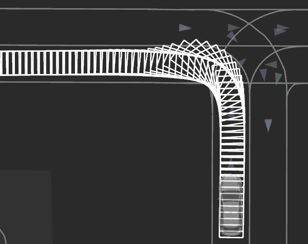
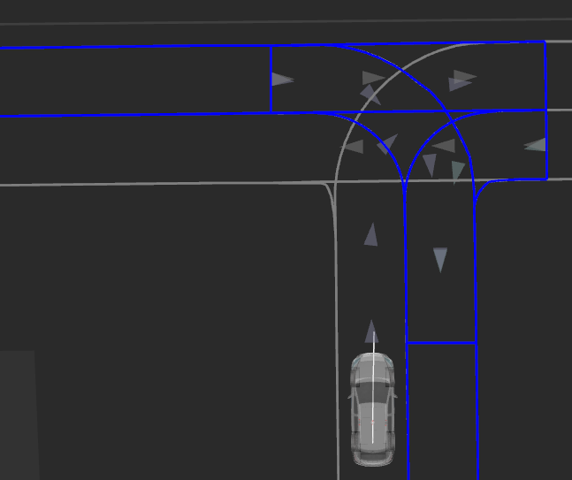
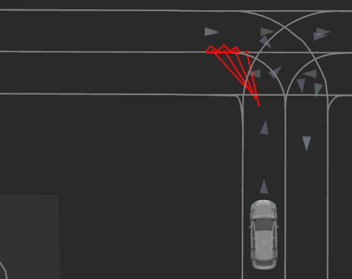
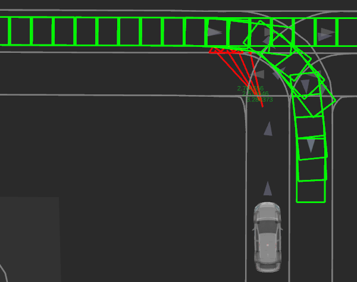
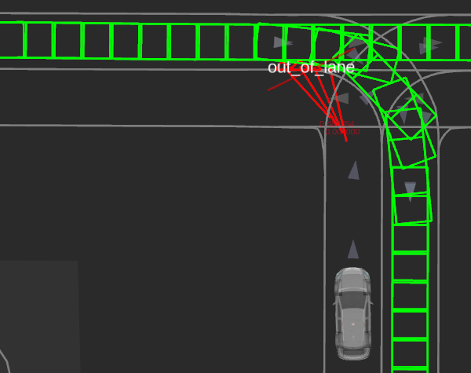

## 車線外

## 役割

次のように、自我車両のフットプリントが走行車線外にはみ出す場合があります。
- 大型車両による狭い曲がり角を走行する場合

`out_of_lane`モジュールは、こうした車線外ケースで衝突が発生しないように、自我経路に減速点と停止点を追加します。

## アクティベーション

このモジュールは、起動パラメーター`launch_out_of_lane_module`がtrueに設定されている場合にアクティブになります。

## 内部動作/アルゴリズム

このモジュールは、車線外衝突が発生するかどうかを計算し、必要に応じて衝突前に停止点を挿入します。

アルゴリズムは、入力自我経路に予測オブジェクトとの衝突時間を正確に計算するために正確な`time_from_start`値が含まれていることを想定しています。

次に、モジュールの内部動作をより詳しく説明します。

### 1. 自我経路フットプリント

この最初のステップでは、自我フットプリントが各経路点に投影され、そのサイズは`ego.extra_..._offset`パラメーターに基づいて変更されます。

フットプリントの生成に使用される経路の長さは、`max_arc_length`パラメーターによって制限されます。

### 2. その他のレーンレット

2番目のステップでは、衝突を回避する必要があるレーンレットを計算します。
自我車両周辺で、経路ラインストリング（経路点のシーケンス）またはその前のレーンレットによって横切られていないすべてのレーンレットを考慮します。

デバッグ表示では、これらの他のレーンレットは青い多角形として表示されます。

### 3. 車線外エリア

次に、各経路点について、他のレーンレット（ステップ2からのもの）と経路点フットプリント（ステップ1からのもの）を交差させて対応する車線外エリアを作成します。
各エリアは、エリアと重なるレーンレットと対応する自我経路点に関連付けられます。

デバッグ表示では、車線外エリアの多角形は対応する経路点に線で接続されます。

### 4. 予測オブジェクトのフィルタリング

以下の条件でオブジェクトとその予測パスをフィルタリングします。

- `minimum_velocity`パラメーターより速度の低いオブジェクトを無視する。
- パラメーター`ignore_behind_ego`がtrueに設定されている場合は、自我車両の後ろから来るオブジェクトを無視する。
- 信頼度値が`predicted_path_min_confidence`パラメーターより下の予測パスを無視する。
- パラメーター`cut_predicted_paths_beyond_red_lights`が`true`に設定されている場合は、赤信号の停止線を超える予測パスのポイントを切り取る。

| `cut_predicted_paths_beyond_red_lights = false` | `cut_predicted_paths_beyond_red_lights = true` |
| :-------------------------------------------------: | :------------------------------------------------: |
|               |                |

## デバッグ可視化

デバッグ可視化では、フィルタリング済み予測経路は緑色で表示され、赤信号の停止線は赤色で表示されます。

### 5. 衝突時間

アウトオブレーンエリアごとに、動的オブジェクトがフィルタリング済み予測経路に基づいてエリアとかぶる時間を計算します。

パラメータ `mode` が `threshold` に設定され、計算された時間が `threshold.time_threshold` パラメータより短い場合、アウトオブレーンエリアの回避を決定します。

パラメータ `mode` が `ttc` に設定されている場合、
オブジェクトの予測時間と軌道点に含まれる `time_from_start` フィールドを比較して衝突時間を計算します。
衝突時間が `ttc.threshold` パラメータ値より短い場合、アウトオブレーンエリアの回避を決定します。

デバッグ可視化では、ttc（秒単位）が対応する軌道点の上に表示されます。
衝突を回避すべき場合はテキストの色が赤色になり、そうでない場合は緑色になります。

### 6. 停止または減速ポイントの計算

まず、エゴ車両の最小停止距離は速度スムースパラメータによって設定されたジャークと減速制約に基づいて計算されます。

次に、軌道上のエゴフットプリントがエゴレーン内にとどまる最遠のポーズを検索し（ステップ 2 で計算）、検索を最小停止距離と回避すべき衝突の最初の軌道点（前のステップで決定）の間に制約します。
検索は、`action.precision` パラメータによって設定された距離ステップを使用して軌道を後方へ移動することで行われます。

最初に、`ego.extra_..._offset`、`action.longitudinal_distance_buffer`、`action.lateral_distance_buffer` パラメータによって拡張されたフットプリントでこの検索を実行します。
有効なポーズが見つからない場合は、追加オフセットのみを考慮し、距離バッファは考慮せずに再度検索します。
それでも有効なポーズが見つからない場合は、オフセットなしの基本エゴフットプリントを使用します。
ポーズが見つからない場合は、レーンから外れているかどうかを考慮せずに、検出された衝突前のポーズを使用します。

減速するか停止するかは、エゴ車両と回避する軌道点間の距離によって決定されます。
この距離が `actions.slowdown.threshold` よりも小さい場合、`actions.slowdown.velocity` の速度が使用されます。
この距離が `actions.stop.threshold` よりも小さい場合、速度 `0` m/s が使用されます。

### 停止/減速ポーズの安定性について

入力軌道は反復ごとに大幅に変化する可能性があるため、このモジュールの決定も変化することが予想されます。
決定をより安定させるために、停止または減速ポーズは `action.min_duration` パラメータによって設定された最小時間使用されます。
その間にエゴ車両により近い新しいポーズが生成された場合、そのポーズが以前のポーズに取って代わります。
それ以外の場合は、設定された時間の間アウトオブレーン衝突が検出されなければ停止または減速ポーズは破棄されます。

## モジュールパラメータ

| パラメータ                    | 型     | 説明                                                                      |
| ----------------------------- | ------ | --------------------------------------------------------------------------- |
| `mode`                        | 文字列 | [-] 動的オブジェクトを考慮するために使用されるモード。候補: `threshold`、`intervals`、`ttc` |
| `skip_if_already_overlapping` | ブール | [-] 自車がすでに他のレーンと重なっている場合、このモジュールを実行しない |
| `max_arc_length`              | double | [m] レーン外との衝突をチェックする最大軌跡アーク長                       |

| パラメーター/しきい値 | 型   | 説明                                                         |
| -------------------- | ------ | ------------------------------------------------------------ |
| `time_threshold`     | double | [s] この時間以内にオーバーラップする物体のみを考慮する |

| パラメータ /ttc | 種別   | 説明                                                                                                    |
| -------------- | ------ | ---------------------------------------------------------------------------------------------------------- |
| `threshold`    | double | [s] 対象車両の自車位置に重なり時、この値以下の推定衝突時間を持つオブジェクトを検討する |

| パラメータ / オブジェクト              | 型   | 説明                                                                                   |
| ------------------------------------- | ------ | ---------------------------------------------------------------------------------------- |
| `minimum_velocity`                     | double | [m/s] この値より速度が低いオブジェクトを無視する                                               |
| `predicted_path_min_confidence`         | double | [-] 予測パスを考慮するのに必要な最小の信頼度                                               |
| `cut_predicted_paths_beyond_red_lights` | bool   | [-] true の場合、予測パスは赤信号の停止線の先で切断される                              |
| `ignore_behind_ego`                     | bool   | [-] true の場合、自車位置の背後のオブジェクトは無視される                                |

| パラメータ/アクション               | タイプ | 説明                                                                     |
| ---------------------------------- | ----- | ------------------------------------------------------------------------- |
| `precision`                         | double | 軌道に停止位置を挿入したときの[m]精度                                |
| `longitudinal_distance_buffer`     | double | 自車の前方にある[m]安全距離バッファ                                  |
| `lateral_distance_buffer`          | double | 自車の横に配置する [m] 安全距離バッファ                                |
| `min_duration`                      | double | 決定がキャンセルされるまでに必要な最小時間 [s]                         |
| `slowdown.distance_threshold`      | double | 重複とこの距離よりも近い場合に減速を挿入する                             |
| `slowdown.velocity`                | double | 減速速度                                                               |
| `stop.distance_threshold`          | double | 重複とこの距離よりも近い場合に停止を挿入する                              |

| パラメーター / 車両 | 型 | 説明 |
| -------------------- | ------ | ------------------------------------ |
| `extra_front_offset` | 倍精度浮動小数点数 | 【m】車両のフットプリントに追加するフロント側距離の追加 |
| `extra_rear_offset` | 倍精度浮動小数点数 | 【m】車両のフットプリントに追加するリア側距離の追加 |
| `extra_left_offset` | 倍精度浮動小数点数 | 【m】車両のフットプリントに追加する左側の距離の追加 |
| `extra_right_offset` | 倍精度浮動小数点数 | 【m】車両のフットプリントに追加する右側の距離の追加 |

