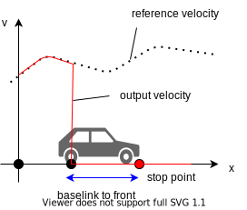

# モーション速度プランナー

## 概要

`motion_velocity_planner` は、車両周辺の障害物に基づいて軌道の速度を調整するプランナーです。
プラグインとしてモジュールを読み込みます。各モジュールの詳細については、以下に記載されているリンクを参照してください。

- [レーン外](../autoware_motion_velocity_out_of_lane_module/README.md)

各モジュールは、自車軌跡に挿入される停止点と減速点を計算します。
これらの点は、軌跡に従っているときに自車の前輪の位置に対応していると想定されています。
つまり、壁の前に停止する場合、軌跡に停止点が挿入され、壁の前方の距離は車両のフロントオフセット（ホイールベース + フロントオーバーハング、[車両寸法](https://autowarefoundation.github.io/autoware-documentation/main/design/autoware-interfaces/components/vehicle-dimensions/)を参照）と同じになります。

## 入力トピック

| 名称                                   | 型                                                  | 説明                   |
| -------------------------------------- | ----------------------------------------------------- | ----------------------------- |
| `~/input/trajectory`                   | autoware_planning_msgs::msg::Trajectory               | 入力軌跡              |
| `~/input/vector_map`                   | autoware_map_msgs::msg::LaneletMapBin                 | ベクトルマップ                    |
| `~/input/vehicle_odometry`             | nav_msgs::msg::Odometry                               | 自車位置および速度 |
| `~/input/accel`                        | geometry_msgs::msg::AccelWithCovarianceStamped        | 車両加速度          |
| `~/input/dynamic_objects`              | autoware_perception_msgs::msg::PredictedObjects       | 動的オブジェクト               |
| `~/input/no_ground_pointcloud`         | sensor_msgs::msg::PointCloud2                         | 障害物点群           |
| `~/input/traffic_signals`              | autoware_perception_msgs::msg::TrafficLightGroupArray | 交通信号機状態          |
| `~/input/virtual_traffic_light_states` | tier4_v2x_msgs::msg::VirtualTrafficLightStateArray    | 仮想交通信号機State  |
| `~/input/occupancy_grid`               | nav_msgs::msg::OccupancyGrid                          | 占有グリッド                |

## 出力トピック

| 名前                        | 種類                                                      | 説明                                                  |
| --------------------------- | ---------------------------------------------------------- | ------------------------------------------------------ |
| `~/output/trajectory`       | autoware_planning_msgs::msg::Trajectory                   | 更新された速度プロファイルを持つ自己車両の経路       |
| `~/output/velocity_factors` | autoware_adapi_v1_msgs::msg::VelocityFactorsArray         | 自己車両の速度プロファイルの変更を引き起こす要素 |

## サービス

## Autoware Motion Velocity Planner

### サービス

| サービス名 | タイプ | 説明 |
|---|---|---|
| `~/service/load_plugin` | autoware_motion_velocity_planner_node::srv::LoadPlugin | プラグインのロードを要求する |
| `~/service/unload_plugin` | autoware_motion_velocity_planner_node::srv::UnloadPlugin | プラグインのアンロードを要求する |

## ノードのパラメータ

| パラメータ       | タイプ           | 説明           |
| ---------------- | ---------------- | ------------------- |
| `launch_modules` | vector\<string\> | 起動するモジュール名 |

さらに、以下のようなパラメーターをノードに設定する必要があります。

- [ニアレストサーチパラメーター](https://github.com/autowarefoundation/autoware_launch/blob/main/autoware_launch/config/planning/scenario_planning/common/nearest_search.param.yaml);
- [車両情報パラメーター](https://github.com/autowarefoundation/sample_vehicle_launch/blob/main/sample_vehicle_description/config/vehicle_info.param.yaml);
- [一般計画パラメーター](https://github.com/autowarefoundation/autoware_launch/blob/main/autoware_launch/config/planning/scenario_planning/common/common.param.yaml);
- [スムージングパラメーター](https://autowarefoundation.github.io/autoware.universe/main/planning/autoware_velocity_smoother/#parameters)
- ロードされる各Planningモジュールのプラグインパラメーター

