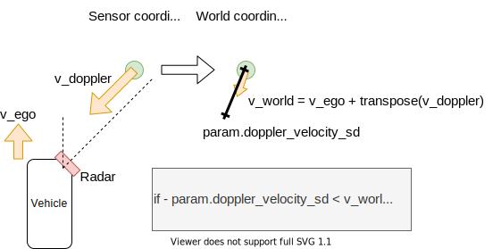

# radar_static_pointcloud_filter

## radar_static_pointcloud_filter_node

ドップラー速度と自車運動を使用して、静的/動的レーダー点群を抽出します。
計算コストはO(n)です。`n`はレーダー点群の数です。

### 入力トピック

| 名前         | タイプ                       | 説明                |
| ------------ | -------------------------- | -------------------------- |
| input/radar    | radar_msgs::msg::RadarScan | RadarScan                  |
| input/odometry | nav_msgs::msg::Odometry    | 自車位置トピック |

### 出力トピック

| 名前                      | タイプ                       | 説明              |
| ------------------------- | -------------------------- | ------------------------ |
| output/static_radar_scan  | radar_msgs::msg::RadarScan | 静的レーダー点群  |
| output/dynamic_radar_scan | radar_msgs::msg::RadarScan | 動的レーダー点群 |

### パラメータ

| 名称                | 型   | 説明                                        |
| ------------------- | ------ | ------------------------------------------ |
| doppler_velocity_sd | double | レーダー ドップラー速度の標準偏差 [m/s] |

### 起動方法


```sh
ros2 launch autoware_radar_static_pointcloud_filter radar_static_pointcloud_filter.launch.xml
```

### アルゴリズム



